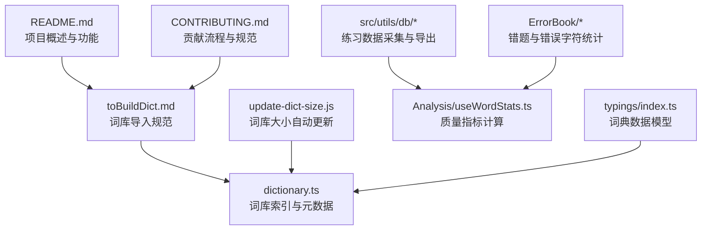
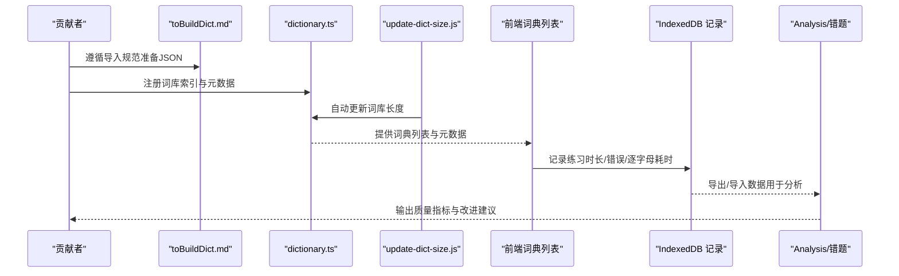
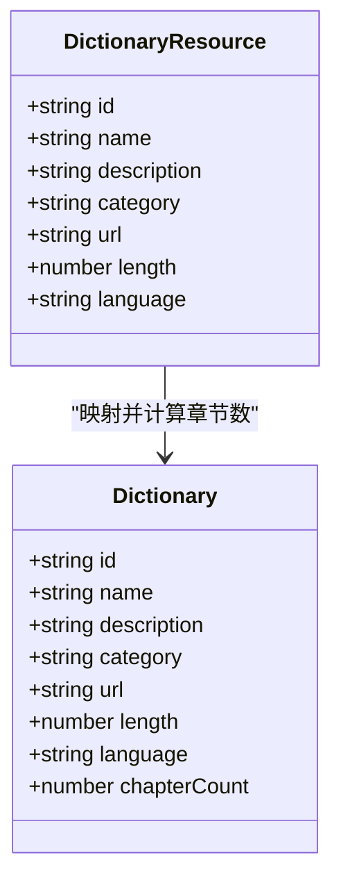
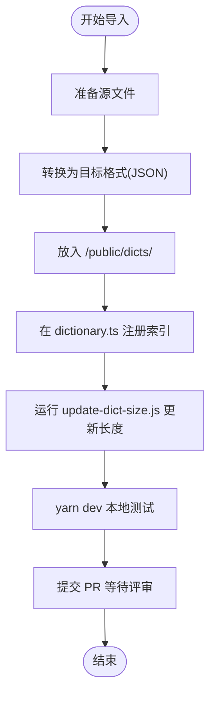
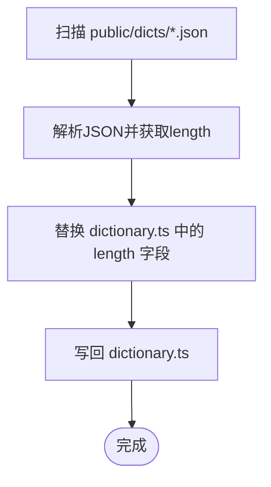
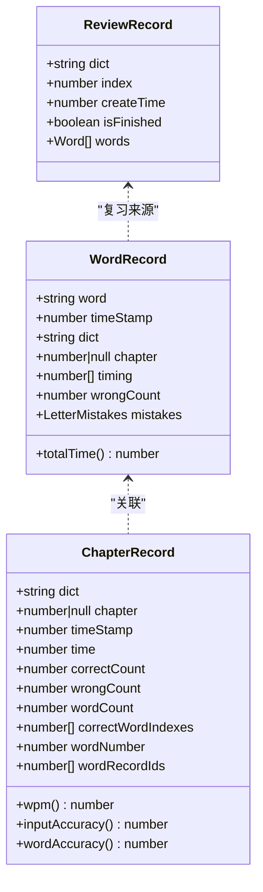
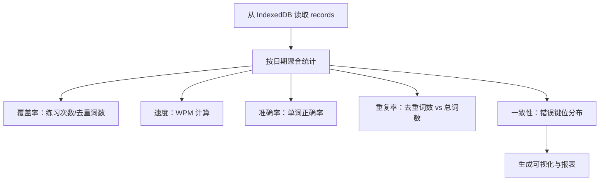
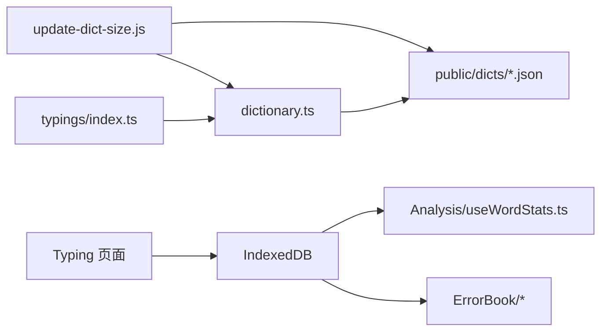

# 词库质量控制

<cite>
**本文引用的文件**
- [README.md](file://README.md)
- [CONTRIBUTING.md](file://docs/CONTRIBUTING.md)
- [toBuildDict.md](file://docs/toBuildDict.md)
- [dictionary.ts](file://src/resources/dictionary.ts)
- [update-dict-size.js](file://scripts/update-dict-size.js)
- [index.ts](file://src/utils/db/index.ts)
- [record.ts](file://src/utils/db/record.ts)
- [data-export.ts](file://src/utils/db/data-export.ts)
- [useWordStats.ts（分析页）](file://src/pages/Analysis/hooks/useWordStats.ts)
- [useWordStats.ts（捐赠卡片）](file://src/components/DonateCard/hooks/useWordStats.ts)
- [index.tsx（错题表格）](file://src/pages/ErrorBook/index.tsx)
- [columns.tsx（错题列定义）](file://src/pages/ErrorBook/RowDetail/ErrorTable/columns.tsx)
- [index.tsx（复习记录）](file://src/utils/db/review-record.ts)
- [index.tsx（词典卡片）](file://src/pages/Gallery-N/Dictionary.tsx)
- [index.ts](file://src/typings/index.ts)
</cite>

## 目录

1. [简介](#简介)
2. [项目结构](#项目结构)
3. [核心组件](#核心组件)
4. [架构总览](#架构总览)
5. [详细组件分析](#详细组件分析)
6. [依赖关系分析](#依赖关系分析)
7. [性能考量](#性能考量)
8. [故障排查指南](#故障排查指南)
9. [结论](#结论)
10. [附录](#附录)

## 简介

本文件面向词库质量控制，结合仓库现有的词库索引、导入流程、数据采集与导出能力，系统化制定词库质量评估标准、审核流程、维护策略、质量监控指标与改进实践。目标是帮助贡献者与维护者以一致的方法论保障词库的准确性、完整性、时效性与实用性。

## 项目结构

围绕词库质量控制的关键路径与文件：

- 词库索引与元数据：src/resources/dictionary.ts
- 词库导入与格式规范：docs/toBuildDict.md
- 词库大小自动化更新：scripts/update-dict-size.js
- 词库贡献流程与行为准则：docs/CONTRIBUTING.md
- 用户练习与质量观测：src/utils/db/\*、src/pages/Analysis、src/pages/ErrorBook
- 词典模型与字段约束：src/typings/index.ts

图表来源

- [README.md](file://README.md#L1-L200)
- [toBuildDict.md](file://docs/toBuildDict.md#L1-L124)
- [dictionary.ts](file://src/resources/dictionary.ts#L1-L120)
- [update-dict-size.js](file://scripts/update-dict-size.js#L1-L23)
- [CONTRIBUTING.md](file://docs/CONTRIBUTING.md#L1-L48)
- [useWordStats.ts（分析页）](file://src/pages/Analysis/hooks/useWordStats.ts#L1-L132)
- [index.ts](file://src/utils/db/index.ts#L1-L136)
- [index.tsx（错题表格）](file://src/pages/ErrorBook/index.tsx#L1-L30)
- [index.tsx（词典卡片）](file://src/pages/Gallery-N/Dictionary.tsx#L1-L31)
- [index.ts](file://src/typings/index.ts#L1-L51)

章节来源

- [README.md](file://README.md#L1-L200)
- [toBuildDict.md](file://docs/toBuildDict.md#L1-L124)
- [dictionary.ts](file://src/resources/dictionary.ts#L1-L120)
- [update-dict-size.js](file://scripts/update-dict-size.js#L1-L23)
- [CONTRIBUTING.md](file://docs/CONTRIBUTING.md#L1-L48)
- [index.ts](file://src/utils/db/index.ts#L1-L136)
- [record.ts](file://src/utils/db/record.ts#L1-L186)
- [useWordStats.ts（分析页）](file://src/pages/Analysis/hooks/useWordStats.ts#L1-L132)
- [useWordStats.ts（捐赠卡片）](file://src/components/DonateCard/hooks/useWordStats.ts#L1-L72)
- [index.tsx（错题表格）](file://src/pages/ErrorBook/index.tsx#L1-L30)
- [columns.tsx（错题列定义）](file://src/pages/ErrorBook/RowDetail/ErrorTable/columns.tsx#L1-L94)
- [index.tsx（复习记录）](file://src/utils/db/review-record.ts#L38-L68)
- [index.tsx（词典卡片）](file://src/pages/Gallery-N/Dictionary.tsx#L1-L31)
- [index.ts](file://src/typings/index.ts#L1-L51)

## 核心组件

- 词库索引与元数据：在 dictionary.ts 中集中声明词库 id、名称、描述、分类、URL、长度、语言等，作为词库质量控制的权威入口。
- 词库导入与格式：toBuildDict.md 明确 JSON 结构、目标文件位置与索引注册方式，保证贡献者遵循统一格式。
- 自动化大小更新：update-dict-size.js 读取 public/dicts 下的 JSON 文件长度并回写 dictionary.ts，避免人工维护误差。
- 练习数据采集与导出：db 层记录每章练习时长、正确/错误次数、逐字母耗时与错误键位，支持导出与导入，便于离线分析与迁移。
- 质量指标计算：Analysis/useWordStats.ts 基于 IndexedDB 数据计算每日练习次数、去重词数、WPM、正确率与错误键位分布。
- 错题与错误字符：ErrorBook 提供错题表，columns.tsx 展示错误次数与易错字母，辅助定位高频错误与重复问题。

章节来源

- [dictionary.ts](file://src/resources/dictionary.ts#L1-L120)
- [toBuildDict.md](file://docs/toBuildDict.md#L1-L124)
- [update-dict-size.js](file://scripts/update-dict-size.js#L1-L23)
- [index.ts](file://src/utils/db/index.ts#L1-L136)
- [record.ts](file://src/utils/db/record.ts#L1-L186)
- [useWordStats.ts（分析页）](file://src/pages/Analysis/hooks/useWordStats.ts#L1-L132)
- [columns.tsx（错题列定义）](file://src/pages/ErrorBook/RowDetail/ErrorTable/columns.tsx#L1-L94)

## 架构总览

词库质量控制的端到端流程由“贡献—导入—索引—练习—观测—改进”构成，数据流从贡献者到前端词典列表，再到用户练习与后台数据采集，最终形成质量指标与可视化报表。

图表来源

- [toBuildDict.md](file://docs/toBuildDict.md#L1-L124)
- [dictionary.ts](file://src/resources/dictionary.ts#L1-L120)
- [update-dict-size.js](file://scripts/update-dict-size.js#L1-L23)
- [index.ts](file://src/utils/db/index.ts#L1-L136)
- [useWordStats.ts（分析页）](file://src/pages/Analysis/hooks/useWordStats.ts#L1-L132)
- [data-export.ts](file://src/utils/db/data-export.ts#L1-L68)

## 详细组件分析

### 词库索引与元数据（dictionary.ts）

- 职责：集中登记词库 id、名称、描述、分类、URL、长度、语言等，作为词库质量控制的权威入口。
- 关键点：
  - 字段完整性：id 唯一、name 展示友好、description 清晰、category 合理、url 指向实际 JSON、length 与实际一致、language 正确。
  - 版本与生命周期：可通过新增条目表达版本演进；历史条目保留以支持回溯。
- 质量控制要点：
  - 长度校验：配合 update-dict-size.js 自动更新，避免人为遗漏。
  - 分类一致性：统一分类体系，避免重复或歧义。
  - URL 可达性：确保 /public/dicts 下文件存在且可访问。

图表来源

- [dictionary.ts](file://src/resources/dictionary.ts#L1-L120)
- [dictionary.ts](file://src/resources/dictionary.ts#L4192-L4200)

章节来源

- [dictionary.ts](file://src/resources/dictionary.ts#L1-L120)
- [dictionary.ts](file://src/resources/dictionary.ts#L4192-L4200)

### 词库导入与格式规范（toBuildDict.md）

- 职责：明确目标 JSON 结构、存放位置、索引注册与测试流程。
- 关键点：
  - JSON 结构：数组元素包含 name 与 trans 字段，保证释义数组存在。
  - 存放位置：/public/dicts/ 目录，命名规范清晰。
  - 索引注册：在 dictionary.ts 中添加条目，包含 id/name/description/category/url/length/language 等。
  - 自动长度：使用 update-dict-size.js 自动计算长度，减少手工维护。
- 质量控制要点：
  - 格式验证：确保 JSON 结构与字段齐全，避免空释义或缺失字段。
  - 一致性检查：id 唯一、category 与现有分类对齐、language 与词性标注一致。
  - 可视化验证：启动本地服务后在词典列表中核对展示效果。

图表来源

- [toBuildDict.md](file://docs/toBuildDict.md#L1-L124)
- [update-dict-size.js](file://scripts/update-dict-size.js#L1-L23)
- [dictionary.ts](file://src/resources/dictionary.ts#L1-L120)

章节来源

- [toBuildDict.md](file://docs/toBuildDict.md#L1-L124)
- [update-dict-size.js](file://scripts/update-dict-size.js#L1-L23)
- [dictionary.ts](file://src/resources/dictionary.ts#L1-L120)

### 自动化长度更新（update-dict-size.js）

- 职责：扫描 public/dicts 下的 JSON 文件，读取数组长度并替换 dictionary.ts 中的 length 字段。
- 质量控制要点：
  - 严格匹配文件名：正则按文件名匹配，避免误改。
  - 编码与解析：UTF-8 解析，确保中文等字符正常。
  - 日志提示：输出当前处理的文件名，便于审计。

图表来源

- [update-dict-size.js](file://scripts/update-dict-size.js#L1-L23)
- [dictionary.ts](file://src/resources/dictionary.ts#L1-L120)

章节来源

- [update-dict-size.js](file://scripts/update-dict-size.js#L1-L23)
- [dictionary.ts](file://src/resources/dictionary.ts#L1-L120)

### 练习数据采集与导出（db 层）

- 职责：记录每章练习的时长、正确/错误次数、逐字母耗时与错误键位；支持导出与导入，便于离线分析与迁移。
- 关键点：
  - WordRecord：包含 word、dict、chapter、timing、wrongCount、mistakes 等，可计算总耗时、逐字母耗时差。
  - ChapterRecord：包含 dict、chapter、time、correctCount、wrongCount、wordCount、correctWordIndexes、wordNumber、wordRecordIds 等，可计算 WPM 与单词正确率。
  - ReviewRecord：用于复习任务的记录与排序。
- 质量控制要点：
  - 数据完整性：确保 timing、wrongCount、mistakes 字段非空或合理默认。
  - 时间戳一致性：统一使用 UTC 时间戳，便于跨设备对比。
  - 导入兼容性：data-export.ts 支持版本差异与表缺失的兼容策略。

图表来源

- [record.ts](file://src/utils/db/record.ts#L1-L186)
- [index.ts](file://src/utils/db/index.ts#L1-L136)
- [index.tsx（复习记录）](file://src/utils/db/review-record.ts#L38-L68)

章节来源

- [index.ts](file://src/utils/db/index.ts#L1-L136)
- [record.ts](file://src/utils/db/record.ts#L1-L186)
- [data-export.ts](file://src/utils/db/data-export.ts#L1-L68)
- [index.tsx（复习记录）](file://src/utils/db/review-record.ts#L38-L68)

### 质量指标与可视化（Analysis/useWordStats.ts 与错题）

- 质量指标：
  - 覆盖率统计：每日练习次数、去重词数（基于 wordRecords）。
  - 速度与准确率：WPM（基于 wordRecords.timing 与 wordCount）、单词正确率（基于 ChapterRecord.correctWordIndexes 与 wordNumber）。
  - 重复率检测：通过去重词数与总词数的差异观察重复练习情况。
  - 一致性检查：错误键位分布（来自 WordRecord.mistakes），识别易错字母与重复错误。
- 工具链：
  - useWordStats（分析页）：聚合每日数据，计算上述指标。
  - 错题表格：展示错误次数与易错字母，支持排序与删除。

图表来源

- [useWordStats.ts（分析页）](file://src/pages/Analysis/hooks/useWordStats.ts#L1-L132)
- [record.ts](file://src/utils/db/record.ts#L1-L186)
- [index.ts](file://src/utils/db/index.ts#L1-L136)
- [columns.tsx（错题列定义）](file://src/pages/ErrorBook/RowDetail/ErrorTable/columns.tsx#L1-L94)

章节来源

- [useWordStats.ts（分析页）](file://src/pages/Analysis/hooks/useWordStats.ts#L1-L132)
- [useWordStats.ts（捐赠卡片）](file://src/components/DonateCard/hooks/useWordStats.ts#L1-L72)
- [columns.tsx（错题列定义）](file://src/pages/ErrorBook/RowDetail/ErrorTable/columns.tsx#L1-L94)
- [record.ts](file://src/utils/db/record.ts#L1-L186)

### 词库贡献者规范与审核标准（CONTRIBUTING.md 与 toBuildDict.md）

- 规范要求：
  - PR 前沟通：在 Issue 或开发者社群讨论，确认需求与影响。
  - Draft PR：尽早提交草稿，便于协作与建议。
  - 行为准则：尊重、开放、遵守质量标准与开发规范。
- 审核标准：
  - 格式合规：JSON 结构、字段齐全、释义可用。
  - 元数据完整：id 唯一、name/description 清晰、category 一致、language 正确。
  - 可测试性：本地 dev 环境可正常加载与展示。
  - 可维护性：命名规范、分类合理、长度自动更新。

章节来源

- [CONTRIBUTING.md](file://docs/CONTRIBUTING.md#L1-L48)
- [toBuildDict.md](file://docs/toBuildDict.md#L1-L124)

## 依赖关系分析

- 词库来源依赖：
  - dictionary.ts 依赖 public/dicts 下的 JSON 文件与语言类型定义。
  - update-dict-size.js 依赖 public/dicts 下的 JSON 文件与 dictionary.ts。
- 数据采集依赖：
  - 前端 Typing 页面将练习数据写入 IndexedDB，Analysis 与 ErrorBook 读取并可视化。
- 类型约束依赖：
  - typings/index.ts 定义 Word、PronunciationType、PhoneticType、LanguageType 等，确保词典与音标的类型安全。

图表来源

- [dictionary.ts](file://src/resources/dictionary.ts#L1-L120)
- [update-dict-size.js](file://scripts/update-dict-size.js#L1-L23)
- [index.ts](file://src/utils/db/index.ts#L1-L136)
- [useWordStats.ts（分析页）](file://src/pages/Analysis/hooks/useWordStats.ts#L1-L132)
- [index.ts](file://src/typings/index.ts#L1-L51)

章节来源

- [dictionary.ts](file://src/resources/dictionary.ts#L1-L120)
- [update-dict-size.js](file://scripts/update-dict-size.js#L1-L23)
- [index.ts](file://src/utils/db/index.ts#L1-L136)
- [useWordStats.ts（分析页）](file://src/pages/Analysis/hooks/useWordStats.ts#L1-L132)
- [index.ts](file://src/typings/index.ts#L1-L51)

## 性能考量

- 索引与查询：
  - dictionary.ts 中的索引条目按数组顺序组织，有利于跨浏览器一致性；查询时建议按 id 索引快速定位。
- 数据库写入：
  - IndexedDB 写入频繁，建议批处理或节流保存，避免 UI 卡顿。
- 可视化计算：
  - useWordStats.ts 对大量记录进行聚合，建议分页或按周/月窗口计算，降低前端压力。
- 导入导出：
  - data-export.ts 使用压缩与分步回调，建议在后台任务中执行，避免阻塞主线程。

## 故障排查指南

- 词库未显示或长度异常
  - 检查 toBuildDict.md 的导入步骤是否完成，确认 JSON 结构与字段齐全。
  - 确认 dictionary.ts 中的 url 与 length 是否正确，必要时重新运行 update-dict-size.js。
  - 在本地 dev 环境中核对词典列表展示。
- 练习数据缺失或不准确
  - 检查 db 层保存逻辑，确认 WordRecord/ChapterRecord 字段是否完整写入。
  - 使用 data-export.ts 导出数据进行离线核对，确认时间戳与耗时计算。
- 错题统计异常
  - 检查 mistakes 字段是否正确合并与统计，必要时使用 utils/db/utils.ts 的合并函数。
  - 在 ErrorBook 中核对错误次数与易错字母，定位重复错误的词与字母。

章节来源

- [toBuildDict.md](file://docs/toBuildDict.md#L1-L124)
- [dictionary.ts](file://src/resources/dictionary.ts#L1-L120)
- [update-dict-size.js](file://scripts/update-dict-size.js#L1-L23)
- [index.ts](file://src/utils/db/index.ts#L1-L136)
- [record.ts](file://src/utils/db/record.ts#L1-L186)
- [data-export.ts](file://src/utils/db/data-export.ts#L1-L68)
- [columns.tsx（错题列定义）](file://src/pages/ErrorBook/RowDetail/ErrorTable/columns.tsx#L1-L94)

## 结论

通过统一的词库导入规范、权威的索引元数据、自动化的长度更新与完善的练习数据采集，本项目具备了词库质量控制的基础能力。结合覆盖率、速度、准确率与错误键位分布等指标，可形成闭环的质量观测与改进流程。建议持续完善自动化校验与可视化看板，推动词库质量的持续提升。

## 附录

### 词库质量评估标准（建议）

- 词汇准确性
  - 释义与词性标注一致，无明显语法或语义错误。
  - 例句与释义互补，避免重复或冗余。
- 完整性
  - 字段齐全：name、trans、音标（如适用）。
  - 无空释义、无重复单词、无缺失音标。
- 时效性
  - 优先收录近 3 年内更新的权威词典来源。
  - 对过时术语标注“过时”或提供替代词。
- 实用性
  - 适合目标学习人群（如四六级、雅思、GRE 等）。
  - 与课程或考试大纲契合，便于章节划分与复习。

### 词库审核流程（建议）

- 内容审查：核对 JSON 结构、字段与释义质量。
- 格式验证：确保文件编码、缩进与命名规范。
- 数据清洗：去重、标准化音标与词性标注、统一语言。
- 质量评分：依据准确性、完整性、时效性、实用性打分。
- 发布与回滚：通过 PR 审核后发布，保留历史版本以便回滚。

### 词库维护策略（建议）

- 定期更新：按季度或按来源更新周期同步更新词库。
- 错误修正：通过错题统计与用户反馈持续修正错误释义与音标。
- 版本管理：以年份或考试年份命名版本，保留历史版本。
- 生命周期管理：对过时词库标记“已停用”，引导迁移至新版本。

### 质量监控指标与方法（建议）

- 覆盖率统计：每日练习次数、去重词数、章节完成度。
- 重复率检测：去重词数与总词数的比率，识别重复练习。
- 一致性检查：错误键位分布、易错字母排行榜、错误次数排序。
- 导出与回归：定期导出数据进行离线回归分析，确保指标稳定。

### 常见质量问题与修复方案（建议）

- 重复单词：清洗阶段移除重复条目，保留权威释义。
- 释义缺失：补充释义或标注“待补充”，并设置跟踪任务。
- 音标不一致：统一音标来源与标注风格，避免混用。
- 错误键位集中：针对高频错误字母优化教学策略或提供专项练习。

### 质量改进最佳实践（建议）

- 引入自动化校验：在 CI 中增加 JSON 格式与字段校验。
- 建立词库健康看板：展示覆盖率、错误率、更新频率等关键指标。
- 用户反馈闭环：收集错题与建议，定期发布改进报告。
- 跨语言一致性：统一多语言词典的字段与标注风格，确保一致性。
