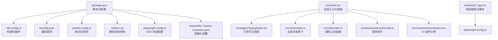
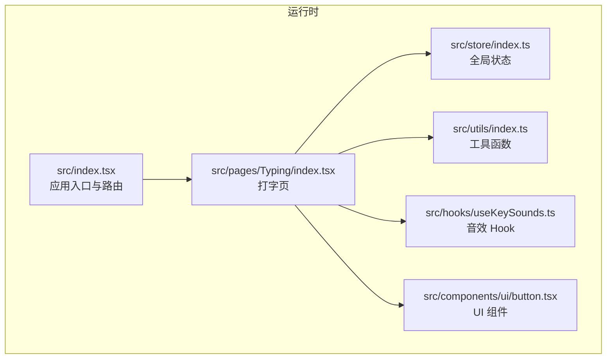
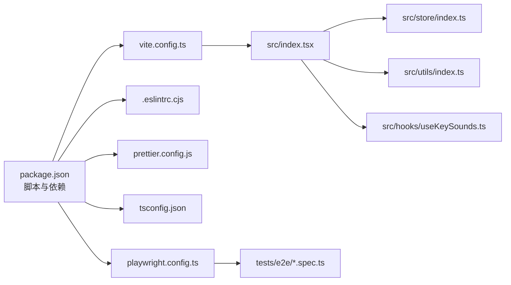
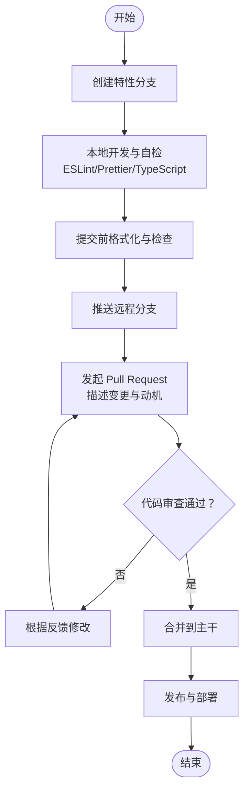

# 代码贡献指南

<cite>
**本文引用的文件**
- [package.json](file://package.json)
- [.eslintrc.cjs](file://.eslintrc.cjs)
- [prettier.config.js](file://prettier.config.js)
- [tsconfig.json](file://tsconfig.json)
- [vite.config.ts](file://vite.config.ts)
- [playwright.config.ts](file://playwright.config.ts)
- [Dockerfile](file://Dockerfile)
- [docker-compose.yaml](file://docker-compose.yaml)
- [docs/CONTRIBUTING.md](file://docs/CONTRIBUTING.md)
- [.gitignore](file://.gitignore)
- [src/index.tsx](file://src/index.tsx)
- [src/utils/index.ts](file://src/utils/index.ts)
- [src/store/index.ts](file://src/store/index.ts)
- [src/hooks/useKeySounds.ts](file://src/hooks/useKeySounds.ts)
- [src/pages/Typing/index.tsx](file://src/pages/Typing/index.tsx)
- [src/components/ui/button.tsx](file://src/components/ui/button.tsx)
- [tests/e2e/main.spec.ts](file://tests/e2e/main.spec.ts)
- [tests/e2e/practice.spec.ts](file://tests/e2e/practice.spec.ts)
- [tests/e2e/practice-list.spec.ts](file://tests/e2e/practice-list.spec.ts)
- [tests/e2e/dictionary.spec.ts](file://tests/e2e/dictionary.spec.ts)
- [tests/e2e/theme.spec.ts](file://tests/e2e/theme.spec.ts)
</cite>

## 目录

1. [简介](#简介)
2. [项目结构](#项目结构)
3. [核心组件](#核心组件)
4. [架构总览](#架构总览)
5. [详细组件分析](#详细组件分析)
6. [依赖关系分析](#依赖关系分析)
7. [性能考量](#性能考量)
8. [故障排查指南](#故障排查指南)
9. [结论](#结论)
10. [附录](#附录)

## 简介

本指南面向贡献者，系统阐述 Qwerty Learner 项目的代码风格规范（ESLint、Prettier、TypeScript 类型检查）、命名约定与编码最佳实践；明确 Git 工作流（分支策略、提交信息规范、rebase 技巧）、代码审查标准与质量要求；提供单元测试与端到端测试编写规范、覆盖率目标与持续集成流程；并给出重构指导原则、性能优化建议与安全编码规范。目标是帮助新老贡献者快速达成一致的工程实践，提升代码质量与协作效率。

## 项目结构

项目采用 Vite + React + TypeScript 前端栈，配合 Jotai 状态管理、TailwindCSS 样式体系与 Radix UI 组件库。根目录包含构建与运行脚本、测试配置、容器化部署文件以及多语言文档。核心源码位于 src/，测试位于 tests/e2e/，公共资源位于 public/，字典资源位于 public/dicts/。

图示来源

- [package.json](file://package.json#L60-L69)
- [vite.config.ts](file://vite.config.ts#L1-L55)
- [tsconfig.json](file://tsconfig.json#L1-L41)
- [prettier.config.js](file://prettier.config.js#L1-L17)
- [.eslintrc.cjs](file://.eslintrc.cjs#L1-L58)
- [playwright.config.ts](file://playwright.config.ts#L1-L79)
- [Dockerfile](file://Dockerfile#L1-L15)
- [docker-compose.yaml](file://docker-compose.yaml#L1-L10)
- [src/index.tsx](file://src/index.tsx#L1-L79)
- [src/pages/Typing/index.tsx](file://src/pages/Typing/index.tsx#L1-L174)
- [src/store/index.ts](file://src/store/index.ts#L1-L118)
- [src/utils/index.ts](file://src/utils/index.ts#L1-L130)
- [src/hooks/useKeySounds.ts](file://src/hooks/useKeySounds.ts#L1-L51)
- [src/components/ui/button.tsx](file://src/components/ui/button.tsx#L1-L44)
- [tests/e2e/main.spec.ts](file://tests/e2e/main.spec.ts)

章节来源

- [package.json](file://package.json#L60-L69)
- [vite.config.ts](file://vite.config.ts#L1-L55)
- [tsconfig.json](file://tsconfig.json#L1-L41)
- [prettier.config.js](file://prettier.config.js#L1-L17)
- [.eslintrc.cjs](file://.eslintrc.cjs#L1-L58)
- [playwright.config.ts](file://playwright.config.ts#L1-L79)
- [Dockerfile](file://Dockerfile#L1-L15)
- [docker-compose.yaml](file://docker-compose.yaml#L1-L10)
- [src/index.tsx](file://src/index.tsx#L1-L79)

## 核心组件

- 构建与运行
  - 使用 Vite 作为开发服务器与打包工具，启用 React 插件、图标插件与可视化分析插件。
  - 定义环境变量注入与路径别名，开启严格模式与 CSS Modules。
- 代码质量
  - ESLint：基于 Prettier 配置，按文件类型分层扩展，启用 TypeScript、React、Hooks 规则集，强调导入排序与类型导入一致性。
  - Prettier：统一单引号、尾逗号、缩进宽度、插件化导入排序与 Tailwind 排序。
  - TypeScript：严格模式、模块解析、路径映射、类型声明与 CSS Modules 插件。
- 测试与部署
  - Playwright：多浏览器并行测试，CI 下重试与限制并发，生成 HTML 报告。
  - Docker：Node 基础镜像构建产物，Nginx 提供静态服务，暴露端口映射。
- 质量门禁
  - Husky + lint-staged：提交前自动格式化与静态检查，减少 CI 失败率。

章节来源

- [vite.config.ts](file://vite.config.ts#L1-L55)
- [.eslintrc.cjs](file://.eslintrc.cjs#L1-L58)
- [prettier.config.js](file://prettier.config.js#L1-L17)
- [tsconfig.json](file://tsconfig.json#L1-L41)
- [playwright.config.ts](file://playwright.config.ts#L1-L79)
- [Dockerfile](file://Dockerfile#L1-L15)
- [package.json](file://package.json#L60-L74)

## 架构总览

应用入口负责路由与主题切换，页面组件通过 Jotai 原子管理状态，工具函数提供通用能力，Hook 封装音效播放，UI 组件遵循设计系统规范。

图示来源

- [src/index.tsx](file://src/index.tsx#L1-L79)
- [src/pages/Typing/index.tsx](file://src/pages/Typing/index.tsx#L1-L174)
- [src/store/index.ts](file://src/store/index.ts#L1-L118)
- [src/utils/index.ts](file://src/utils/index.ts#L1-L130)
- [src/hooks/useKeySounds.ts](file://src/hooks/useKeySounds.ts#L1-L51)
- [src/components/ui/button.tsx](file://src/components/ui/button.tsx#L1-L44)

## 详细组件分析

### ESLint 配置与规则

- 扩展链
  - 默认继承 Prettier，避免格式化冲突。
  - Node 脚本与配置文件使用 Node 环境与基础推荐规则。
  - Vite 配置使用 TypeScript 解析器与推荐规则集。
  - 源码与测试使用 React、Hooks、JSX Runtime 与 TypeScript 推荐规则集。
- 关键规则
  - 导入排序：强制声明排序，忽略声明顺序以减少噪音。
  - 类型导入一致性：强制使用类型导入而非值导入。
  - React 属性类型：关闭 prop-types，由 TS 保障类型安全。
- 建议
  - 新增规则需经团队评审，避免过度约束影响开发效率。
  - 对第三方库的类型缺失场景，优先补充社区定义或使用类型断言。

章节来源

- [.eslintrc.cjs](file://.eslintrc.cjs#L1-L58)

### Prettier 格式化规范

- 格式偏好
  - 单引号、尾逗号、缩进宽度、半角冒号、插件排序导入、Tailwind 排序。
- 插件生态
  - 导入排序插件与 Tailwind 插件协同工作，保证一致性。
- 建议
  - 在 IDE 中启用保存即格式化，结合 husky/lint-staged 实现提交前自动格式化。

章节来源

- [prettier.config.js](file://prettier.config.js#L1-L17)

### TypeScript 类型检查与编译

- 编译选项
  - 严格模式、模块解析、路径别名、CSS Modules 插件、React JSX。
- 建议
  - 明确类型边界，避免 any；为异步数据与外部资源补充类型声明。
  - 使用类型工具（如 Partial、Pick、Record）提升可维护性。

章节来源

- [tsconfig.json](file://tsconfig.json#L1-L41)

### Git 工作流与分支策略

- 分支模型
  - 主分支仅用于发布与热修复；特性开发在 feature/_ 分支；修复在 hotfix/_ 分支。
- 提交信息规范
  - 类型: 简要描述；正文: 动机与影响；引用 Issue。
  - 示例：feat(typing): 支持随机章节；fix(store): 修正状态初始化；docs(contributing): 更新规范。
- Rebase 技巧
  - 合并前 rebase 到主干，保持线性历史；复杂变更拆分为小提交。
- 提交前检查
  - 本地运行格式化与静态检查；确保无未处理的警告；最小化变更范围。

章节来源

- [docs/CONTRIBUTING.md](file://docs/CONTRIBUTING.md#L1-L48)
- [package.json](file://package.json#L60-L74)

### 代码审查标准与质量要求

- 代码质量
  - 通过 ESLint 与 Prettier；新增/修改逻辑必须有单元或端到端测试。
  - 函数单一职责、组件可组合、状态原子化、避免魔法数字与字符串。
- 文档与注释
  - 公共 API 与复杂逻辑补充注释；README 与变更说明清晰。
- 回归测试
  - 重要功能在多浏览器验证；关注性能回归与内存泄漏。

章节来源

- [docs/CONTRIBUTING.md](file://docs/CONTRIBUTING.md#L1-L48)
- [.eslintrc.cjs](file://.eslintrc.cjs#L52-L57)
- [prettier.config.js](file://prettier.config.js#L1-L17)

### 单元测试与端到端测试

- 端到端测试
  - Playwright 配置：并行执行、CI 重试、HTML 报告、多浏览器矩阵。
  - 测试覆盖：首页导航、练习流程、词典浏览、主题切换等关键路径。
- 单元测试
  - 建议：对纯函数、工具方法、Hook 与小型组件进行单元测试。
  - 覆盖率：核心业务逻辑达到中高覆盖率，界面交互通过 E2E 补齐。
- 建议
  - 为每个改动至少新增一条相关测试；避免过度 mock，保持测试稳定。

章节来源

- [playwright.config.ts](file://playwright.config.ts#L1-L79)
- [tests/e2e/main.spec.ts](file://tests/e2e/main.spec.ts)
- [tests/e2e/practice.spec.ts](file://tests/e2e/practice.spec.ts)
- [tests/e2e/practice-list.spec.ts](file://tests/e2e/practice-list.spec.ts)
- [tests/e2e/dictionary.spec.ts](file://tests/e2e/dictionary.spec.ts)
- [tests/e2e/theme.spec.ts](file://tests/e2e/theme.spec.ts)

### 持续集成流程

- 构建与部署
  - Dockerfile：Node 构建产物，Nginx 提供静态服务，默认站点配置。
  - docker-compose：本地快速启动与端口映射。
- 质量门禁
  - husky + lint-staged：提交前格式化与检查，降低 CI 失败概率。
- 建议
  - CI 中增加构建时间与包体积可视化；对关键分支启用保护规则。

章节来源

- [Dockerfile](file://Dockerfile#L1-L15)
- [docker-compose.yaml](file://docker-compose.yaml#L1-L10)
- [package.json](file://package.json#L60-L74)

### 重构指导原则

- 原子化状态
  - 使用 Jotai 原子拆分细粒度状态，避免跨域耦合。
- 组件解耦
  - UI 组件与业务逻辑分离；通过 props 与 Context 传递数据。
- 工具函数复用
  - 将通用逻辑抽取为独立模块，提供清晰接口与类型定义。
- 渐进式迁移
  - 优先处理高频错误与性能瓶颈；逐步替换旧实现。

章节来源

- [src/store/index.ts](file://src/store/index.ts#L1-L118)
- [src/utils/index.ts](file://src/utils/index.ts#L1-L130)
- [src/hooks/useKeySounds.ts](file://src/hooks/useKeySounds.ts#L1-L51)
- [src/components/ui/button.tsx](file://src/components/ui/button.tsx#L1-L44)

### 性能优化建议

- 构建优化
  - 启用压缩与 console/debugger 移除；使用可视化分析定位体积热点。
- 运行时优化
  - 惰性加载与路由懒加载；减少不必要的重渲染；合理使用 useMemo/useCallback。
- 资源优化
  - 图标与媒体资源按需加载；音频资源预加载与释放；字典数据分片加载。
- 监控与回放
  - 结合 Mixpanel 事件埋点与浏览器性能 API，建立性能基线。

章节来源

- [vite.config.ts](file://vite.config.ts#L1-L55)
- [src/index.tsx](file://src/index.tsx#L1-L79)
- [src/pages/Typing/index.tsx](file://src/pages/Typing/index.tsx#L1-L174)

### 安全编码规范

- 输入校验
  - 键盘事件过滤非法按键；对用户输入与外部数据进行白名单校验。
- 资源访问
  - 仅允许受控域名与 HTTPS；避免内联脚本与不受信任的动态内容。
- 隐私与追踪
  - 明示数据收集与用途；提供关闭追踪的选项；遵守最小化原则。
- 依赖安全
  - 定期更新依赖；关注安全通告；避免引入高风险依赖。

章节来源

- [src/utils/index.ts](file://src/utils/index.ts#L1-L130)
- [src/index.tsx](file://src/index.tsx#L1-L79)

## 依赖关系分析

- 构建链路
  - package.json 脚本驱动 Vite、ESLint、Prettier、Playwright；Vite 配置启用插件与别名。
- 运行链路
  - 应用入口加载路由与状态；页面组件消费状态与工具函数；Hook 封装外部能力。
- 测试链路
  - Playwright 读取配置，按项目矩阵执行测试，生成报告。

图示来源

- [package.json](file://package.json#L60-L74)
- [vite.config.ts](file://vite.config.ts#L1-L55)
- [.eslintrc.cjs](file://.eslintrc.cjs#L1-L58)
- [prettier.config.js](file://prettier.config.js#L1-L17)
- [tsconfig.json](file://tsconfig.json#L1-L41)
- [playwright.config.ts](file://playwright.config.ts#L1-L79)
- [src/index.tsx](file://src/index.tsx#L1-L79)
- [src/store/index.ts](file://src/store/index.ts#L1-L118)
- [src/utils/index.ts](file://src/utils/index.ts#L1-L130)
- [src/hooks/useKeySounds.ts](file://src/hooks/useKeySounds.ts#L1-L51)
- [tests/e2e/main.spec.ts](file://tests/e2e/main.spec.ts)

章节来源

- [package.json](file://package.json#L60-L74)
- [vite.config.ts](file://vite.config.ts#L1-L55)
- [playwright.config.ts](file://playwright.config.ts#L1-L79)

## 性能考量

- 构建阶段
  - 启用最小化与调试信息移除；利用可视化分析识别大体积依赖。
- 运行阶段
  - 控制组件渲染频率；延迟加载非首屏资源；缓存计算结果。
- 监控与回归
  - 建立性能指标基线；在 CI 中加入体积与启动时间阈值。

章节来源

- [vite.config.ts](file://vite.config.ts#L31-L42)

## 故障排查指南

- 本地运行异常
  - 清理缓存与依赖后重装；检查 Node 版本与网络镜像配置。
- ESLint/Prettier 冲突
  - 确保编辑器插件与配置一致；提交前先格式化。
- 测试失败
  - 查看 HTML 报告与 Trace；缩小问题范围至最小可复现步骤。
- 构建失败
  - 关注 Dockerfile 步骤与 Nginx 配置；确认构建产物路径。

章节来源

- [.gitignore](file://.gitignore#L1-L36)
- [Dockerfile](file://Dockerfile#L1-L15)
- [playwright.config.ts](file://playwright.config.ts#L1-L79)

## 结论

本指南从风格、流程、测试、性能与安全五个维度给出了 Qwerty Learner 的工程实践建议。建议贡献者在每次提交前自检，确保代码风格一致、测试完备、性能可控、安全合规。团队将持续完善规范与工具链，欢迎提出改进建议。

## 附录

### 代码风格清单

- ESLint
  - 继承 Prettier；启用 React/React Hooks/JSX Runtime；导入排序；类型导入一致性；关闭 prop-types。
- Prettier
  - 单引号、尾逗号、缩进宽度、插件导入排序、Tailwind 排序。
- TypeScript
  - 严格模式、模块解析、路径别名、CSS Modules 插件、React JSX。

章节来源

- [.eslintrc.cjs](file://.eslintrc.cjs#L1-L58)
- [prettier.config.js](file://prettier.config.js#L1-L17)
- [tsconfig.json](file://tsconfig.json#L1-L41)

### 提交流程图

章节来源

- [docs/CONTRIBUTING.md](file://docs/CONTRIBUTING.md#L1-L48)
- [package.json](file://package.json#L60-L74)
