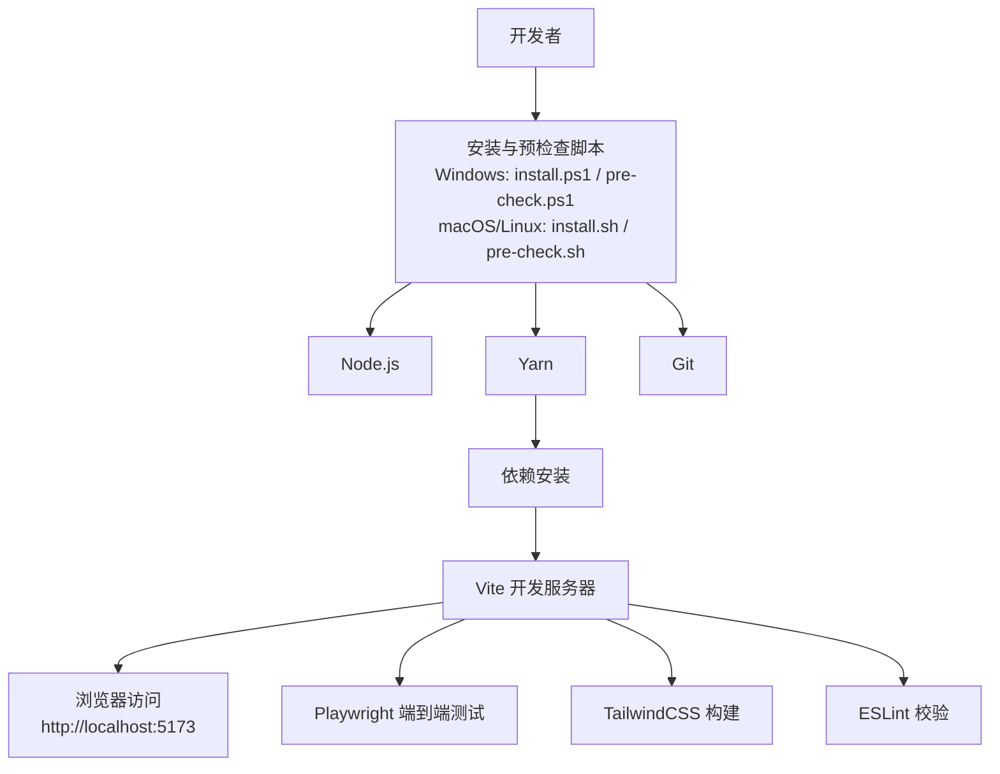
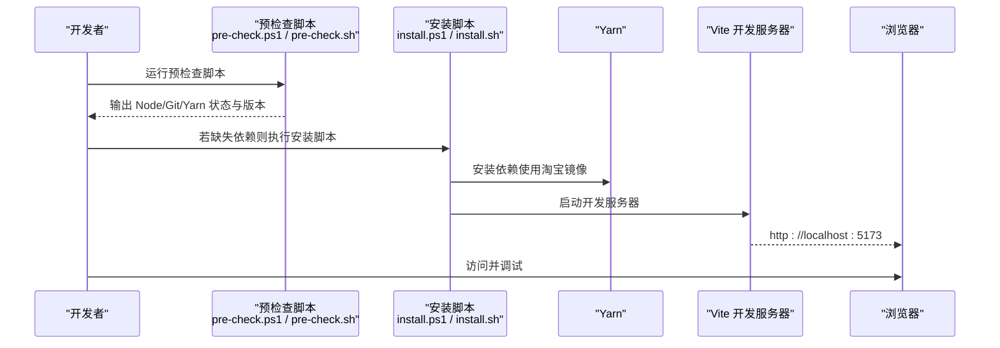
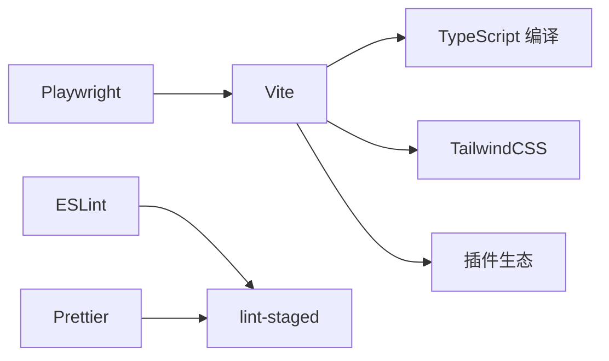

# 开发环境搭建

<cite>
**本文引用的文件**
- [package.json](file://package.json)
- [README.md](file://README.md)
- [vite.config.ts](file://vite.config.ts)
- [tsconfig.json](file://tsconfig.json)
- [scripts/install.ps1](file://scripts/install.ps1)
- [scripts/install.sh](file://scripts/install.sh)
- [scripts/pre-check.ps1](file://scripts/pre-check.ps1)
- [scripts/pre-check.sh](file://scripts/pre-check.sh)
- [Dockerfile](file://Dockerfile)
- [docker-compose.yaml](file://docker-compose.yaml)
- [playwright.config.ts](file://playwright.config.ts)
- [.yarnrc](file://.yarnrc)
- [tailwind.config.js](file://tailwind.config.js)
- [postcss.config.js](file://postcss.config.js)
- [components.json](file://components.json)
- [.eslintrc.cjs](file://.eslintrc.cjs)
</cite>

## 目录

1. [简介](#简介)
2. [项目结构](#项目结构)
3. [核心组件](#核心组件)
4. [架构总览](#架构总览)
5. [详细组件分析](#详细组件分析)
6. [依赖分析](#依赖分析)
7. [性能考虑](#性能考虑)
8. [故障排查指南](#故障排查指南)
9. [结论](#结论)
10. [附录](#附录)

## 简介

本指南面向首次参与 Qwerty Learner 项目的开发者，目标是帮助你在 Windows、Linux 和 macOS 平台上快速完成开发环境准备、依赖安装与开发服务器启动，并提供 IDE 配置建议、调试工具设置与开发工作流最佳实践。同时覆盖跨平台脚本使用、预检查工具、容器化部署与常见问题排查。

## 项目结构

该项目采用前端单页应用（React + Vite）与可选 Tauri 桌面端的混合架构，核心开发工具链包括：

- 构建与开发：Vite
- 包管理：Yarn（优先推荐）
- 代码质量：ESLint、Prettier、lint-staged
- 样式：TailwindCSS、PostCSS
- 测试：Playwright（端到端测试）

图示来源

- [scripts/install.ps1](file://scripts/install.ps1#L1-L39)
- [scripts/install.sh](file://scripts/install.sh#L1-L28)
- [scripts/pre-check.ps1](file://scripts/pre-check.ps1#L1-L63)
- [scripts/pre-check.sh](file://scripts/pre-check.sh#L1-L47)
- [package.json](file://package.json#L60-L69)
- [vite.config.ts](file://vite.config.ts#L1-L55)
- [playwright.config.ts](file://playwright.config.ts#L1-L79)
- [tailwind.config.js](file://tailwind.config.js#L1-L78)

章节来源

- [README.md](file://README.md#L133-L190)
- [package.json](file://package.json#L60-L69)
- [vite.config.ts](file://vite.config.ts#L1-L55)

## 核心组件

- 包管理与脚本
  - 依赖管理：推荐使用 Yarn；仓库内配置了淘宝镜像源，便于国内网络加速。
  - 启动脚本：提供开发与构建脚本，分别用于本地开发与产物打包。
- 构建与开发服务器
  - Vite 作为开发服务器与打包工具，支持热更新与按需加载。
- 代码质量与样式
  - ESLint、Prettier、lint-staged 保障代码风格与质量。
  - TailwindCSS 与 PostCSS 提供现代化样式体系。
- 端到端测试
  - Playwright 配置了多浏览器项目与报告器，支持本地开发服务器集成。
- 容器化部署
  - Dockerfile 与 docker-compose 提供容器化构建与端口映射。

章节来源

- [.yarnrc](file://.yarnrc#L1-L2)
- [package.json](file://package.json#L60-L69)
- [vite.config.ts](file://vite.config.ts#L1-L55)
- [.eslintrc.cjs](file://.eslintrc.cjs#L1-L58)
- [tailwind.config.js](file://tailwind.config.js#L1-L78)
- [postcss.config.js](file://postcss.config.js#L1-L7)
- [playwright.config.ts](file://playwright.config.ts#L1-L79)
- [Dockerfile](file://Dockerfile#L1-L15)
- [docker-compose.yaml](file://docker-compose.yaml#L1-L10)

## 架构总览

下图展示了从环境准备到开发服务器启动的关键流程，以及与测试、样式与容器化的关联。

图示来源

- [scripts/pre-check.ps1](file://scripts/pre-check.ps1#L1-L63)
- [scripts/pre-check.sh](file://scripts/pre-check.sh#L1-L47)
- [scripts/install.ps1](file://scripts/install.ps1#L1-L39)
- [scripts/install.sh](file://scripts/install.sh#L1-L28)
- [vite.config.ts](file://vite.config.ts#L1-L55)

## 详细组件分析

### 系统环境要求与预检查

- 必备工具
  - Node.js：用于运行与构建项目。
  - Git：用于克隆与版本控制。
  - Yarn：用于依赖管理与脚本执行。
- 预检查脚本
  - Windows：使用 PowerShell 脚本检测并尝试安装 Node、Git、Yarn（依赖 winget）。
  - macOS/Linux：使用 Shell 脚本检测并尝试安装 Node、Git、Yarn（依赖 homebrew）。
- 验证方式
  - 手动在命令行执行版本查询命令，确认工具可用性。
  - 使用仓库提供的预检查脚本自动检测与安装。

章节来源

- [README.md](file://README.md#L133-L190)
- [scripts/pre-check.ps1](file://scripts/pre-check.ps1#L1-L63)
- [scripts/pre-check.sh](file://scripts/pre-check.sh#L1-L47)

### 依赖安装与包管理器选择

- 包管理器选择
  - 推荐使用 Yarn；脚本与配置均围绕 Yarn 设计。
  - 仓库配置了淘宝镜像源，提升依赖下载速度。
- 安装步骤
  - Windows：执行安装脚本，脚本会自动安装依赖并启动开发服务器。
  - macOS/Linux：执行安装脚本，脚本会自动安装依赖并在浏览器中打开开发地址。
  - 手动安装：克隆仓库后在项目根目录执行依赖安装命令。

章节来源

- [.yarnrc](file://.yarnrc#L1-L2)
- [scripts/install.ps1](file://scripts/install.ps1#L1-L39)
- [scripts/install.sh](file://scripts/install.sh#L1-L28)
- [README.md](file://README.md#L165-L171)

### 开发服务器启动流程

- 默认端口
  - 本地开发服务器默认监听 5173 端口。
- 启动方式
  - 使用 Yarn 脚本启动开发服务器。
  - 安装脚本会在依赖安装完成后自动启动开发服务器并打开浏览器。
- 构建产物
  - 生产构建输出目录为 build，Vite 配置中已设置。

章节来源

- [vite.config.ts](file://vite.config.ts#L1-L55)
- [scripts/install.ps1](file://scripts/install.ps1#L1-L39)
- [scripts/install.sh](file://scripts/install.sh#L1-L28)
- [package.json](file://package.json#L60-L69)

### 跨平台环境配置脚本

- Windows PowerShell 脚本
  - 自动检测 Node、Git、Yarn，若缺失则尝试 winget 安装。
  - 安装完成后执行依赖安装与启动开发服务器。
- macOS/Linux Shell 脚本
  - 自动检测 Node、Git、Yarn，若缺失则尝试 homebrew 安装。
  - 安装完成后执行依赖安装并在浏览器中打开开发地址。

章节来源

- [scripts/install.ps1](file://scripts/install.ps1#L1-L39)
- [scripts/install.sh](file://scripts/install.sh#L1-L28)
- [scripts/pre-check.ps1](file://scripts/pre-check.ps1#L1-L63)
- [scripts/pre-check.sh](file://scripts/pre-check.sh#L1-L47)

### IDE 配置建议与调试工具

- TypeScript 与路径别名
  - 已启用严格模式与路径别名解析，建议在 IDE 中配置 TypeScript 以匹配路径映射。
- ESLint 与 Prettier
  - ESLint 配置已覆盖源码与配置文件；建议在 IDE 中启用保存时格式化与 ESLint 修复。
- Vite 调试
  - 开发服务器支持热更新与断点调试；可在浏览器开发者工具中进行断点调试。
- 代码片段与类型提示
  - 已配置类型声明与插件，IDE 可获得良好类型提示体验。

章节来源

- [tsconfig.json](file://tsconfig.json#L1-L41)
- [.eslintrc.cjs](file://.eslintrc.cjs#L1-L58)
- [vite.config.ts](file://vite.config.ts#L1-L55)

### 开发工作流最佳实践

- 提交前检查
  - 使用 lint-staged 在暂存前自动格式化与校验，减少 CI 失败概率。
- 代码风格
  - 统一使用 Prettier 与 ESLint 规则，避免风格分歧。
- 依赖管理
  - 优先使用 Yarn；如需切换 npm，请同步调整镜像源与脚本。
- 构建与部署
  - 生产构建输出至 build 目录；如需容器化部署，可参考 Dockerfile 与 docker-compose。

章节来源

- [package.json](file://package.json#L70-L74)
- [.eslintrc.cjs](file://.eslintrc.cjs#L1-L58)
- [Dockerfile](file://Dockerfile#L1-L15)
- [docker-compose.yaml](file://docker-compose.yaml#L1-L10)

### 端到端测试与 Playwright 集成

- 测试配置
  - Playwright 支持多浏览器项目与 HTML 报告器；可配置本地开发服务器自动启动。
- 使用建议
  - 在本地开发时可先启动 Vite，再运行 Playwright 测试；CI 环境下可启用自动启动本地服务器。

章节来源

- [playwright.config.ts](file://playwright.config.ts#L1-L79)
- [vite.config.ts](file://vite.config.ts#L1-L55)

### 容器化与部署（可选）

- Dockerfile
  - 使用 Node 20 构建应用，设置镜像源为国内镜像，构建产物复制至 Nginx。
- docker-compose
  - 将容器端口 5173 映射到主机 8990，便于本地预览。
- 使用场景
  - 适合在无法直接运行 Node 或需要一致环境时使用。

章节来源

- [Dockerfile](file://Dockerfile#L1-L15)
- [docker-compose.yaml](file://docker-compose.yaml#L1-L10)

## 依赖分析

- 运行时依赖
  - React、路由、状态管理、图表、音频播放、国际化等生态库。
- 开发时依赖
  - Vite、TypeScript、TailwindCSS、ESLint、Prettier、Playwright 等。
- 关键关系
  - Vite 作为核心构建与开发服务器，依赖 TypeScript 编译与 TailwindCSS 样式管线。
  - ESLint 与 Prettier 通过 lint-staged 在提交前统一风格。
  - Playwright 与 Vite 协作进行端到端测试。

图示来源

- [vite.config.ts](file://vite.config.ts#L1-L55)
- [.eslintrc.cjs](file://.eslintrc.cjs#L1-L58)
- [playwright.config.ts](file://playwright.config.ts#L1-L79)

章节来源

- [package.json](file://package.json#L1-L128)
- [vite.config.ts](file://vite.config.ts#L1-L55)
- [.eslintrc.cjs](file://.eslintrc.cjs#L1-L58)
- [playwright.config.ts](file://playwright.config.ts#L1-L79)

## 性能考虑

- 构建优化
  - 生产构建启用最小化与源码映射关闭策略，有助于减小体积与提升加载速度。
  - Vite 默认按需加载模块，结合 Tree Shaking 降低首屏负担。
- 样式与资源
  - TailwindCSS 与 PostCSS 配合，建议在开发阶段保持按需引入，避免一次性引入过多样式。
- 依赖体积
  - 优先使用轻量替代方案与按需引入，避免引入不必要的重型依赖。

章节来源

- [vite.config.ts](file://vite.config.ts#L1-L55)
- [tailwind.config.js](file://tailwind.config.js#L1-L78)
- [postcss.config.js](file://postcss.config.js#L1-L7)

## 故障排查指南

- Node/Git/Yarn 缺失或版本异常
  - 使用预检查脚本自动检测与安装；Windows 需要 winget，macOS 需要 homebrew。
- 依赖安装失败
  - 确认网络与镜像源配置；必要时手动切换 npm/yarn 源。
- 开发服务器无法启动
  - 检查端口占用情况；默认端口为 5173；如冲突请修改配置。
- 浏览器无法访问
  - 确认开发服务器已成功启动并监听本地地址；检查防火墙与代理设置。
- 端到端测试失败
  - 检查 Playwright 配置与本地开发服务器状态；必要时启用本地服务器自动启动。
- 容器化部署问题
  - 确认 Docker 与 docker-compose 版本；检查端口映射与 Nginx 配置。

章节来源

- [scripts/pre-check.ps1](file://scripts/pre-check.ps1#L1-L63)
- [scripts/pre-check.sh](file://scripts/pre-check.sh#L1-L47)
- [scripts/install.ps1](file://scripts/install.ps1#L1-L39)
- [scripts/install.sh](file://scripts/install.sh#L1-L28)
- [playwright.config.ts](file://playwright.config.ts#L1-L79)
- [Dockerfile](file://Dockerfile#L1-L15)
- [docker-compose.yaml](file://docker-compose.yaml#L1-L10)

## 结论

通过本指南，你可以快速在 Windows、Linux 与 macOS 上完成 Qwerty Learner 的开发环境搭建。建议优先使用 Yarn 与预检查/安装脚本，配合 Vite 的热更新与 Playwright 的端到端测试，形成高效的本地开发工作流。如需更稳定的构建与分发，可参考 Dockerfile 与 docker-compose 进行容器化部署。

## 附录

- 常用命令与位置
  - 预检查脚本：Windows PowerShell 脚本位于 scripts/pre-check.ps1；macOS/Linux Shell 脚本位于 scripts/pre-check.sh。
  - 安装脚本：Windows PowerShell 脚本位于 scripts/install.ps1；macOS/Linux Shell 脚本位于 scripts/install.sh。
  - 开发服务器：使用 Vite，默认端口 5173。
  - 生产构建：输出目录 build。
- 代码质量与样式
  - ESLint 配置位于 .eslintrc.cjs；Prettier 通过 lint-staged 统一格式化。
  - TailwindCSS 配置位于 tailwind.config.js；PostCSS 配置位于 postcss.config.js。
- 组件库与别名
  - 组件库配置位于 components.json；TypeScript 路径别名已在 tsconfig.json 中配置。

章节来源

- [scripts/pre-check.ps1](file://scripts/pre-check.ps1#L1-L63)
- [scripts/pre-check.sh](file://scripts/pre-check.sh#L1-L47)
- [scripts/install.ps1](file://scripts/install.ps1#L1-L39)
- [scripts/install.sh](file://scripts/install.sh#L1-L28)
- [vite.config.ts](file://vite.config.ts#L1-L55)
- [.eslintrc.cjs](file://.eslintrc.cjs#L1-L58)
- [tailwind.config.js](file://tailwind.config.js#L1-L78)
- [postcss.config.js](file://postcss.config.js#L1-L7)
- [components.json](file://components.json#L1-L17)
- [tsconfig.json](file://tsconfig.json#L1-L41)
