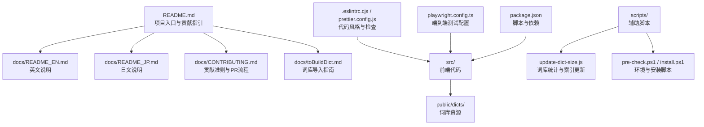
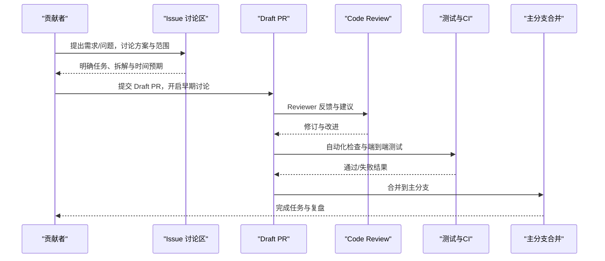
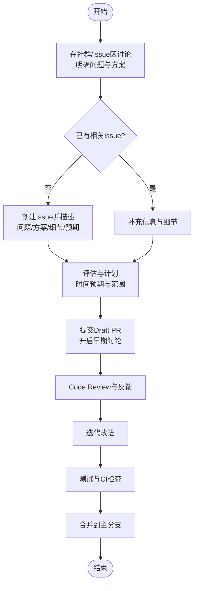
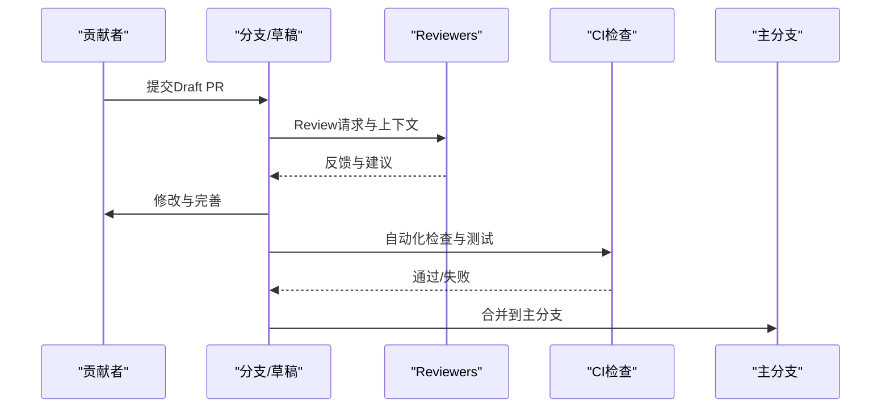
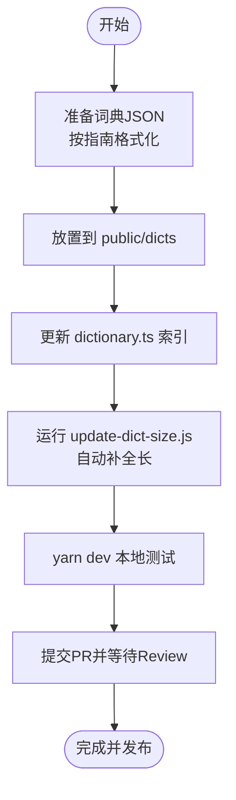
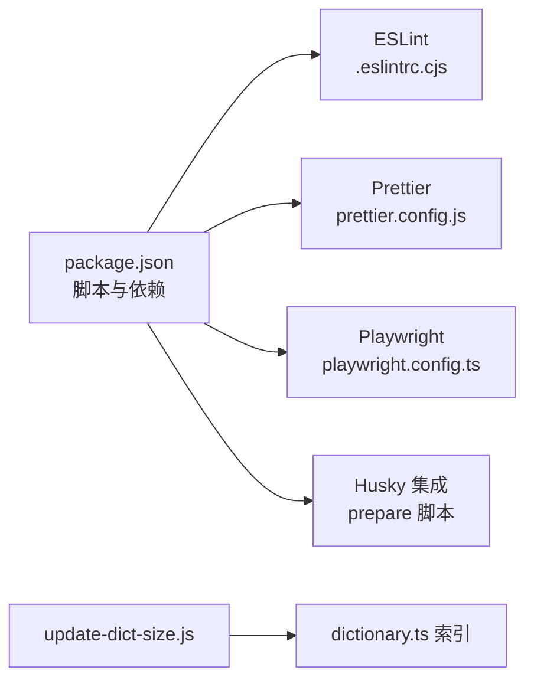

# 社区协作规范

<cite>
**本文引用的文件**
- [README.md](file://README.md)
- [docs/CONTRIBUTING.md](file://docs/CONTRIBUTING.md)
- [docs/README_EN.md](file://docs/README_EN.md)
- [docs/README_JP.md](file://docs/README_JP.md)
- [docs/toBuildDict.md](file://docs/toBuildDict.md)
- [scripts/pre-check.ps1](file://scripts/pre-check.ps1)
- [scripts/install.ps1](file://scripts/install.ps1)
- [scripts/update-dict-size.js](file://scripts/update-dict-size.js)
- [.eslintrc.cjs](file://.eslintrc.cjs)
- [prettier.config.js](file://prettier.config.js)
- [playwright.config.ts](file://playwright.config.ts)
- [package.json](file://package.json)
</cite>

## 目录

1. [简介](#简介)
2. [项目结构](#项目结构)
3. [核心组件](#核心组件)
4. [架构总览](#架构总览)
5. [详细组件分析](#详细组件分析)
6. [依赖分析](#依赖分析)
7. [性能考量](#性能考量)
8. [故障排查指南](#故障排查指南)
9. [结论](#结论)
10. [附录](#附录)

## 简介

本规范面向 Qwerty Learner 的维护者与贡献者，旨在建立清晰、包容、高效的社区协作流程。内容涵盖社区行为准则、沟通礼仪、协作原则、Issue 管理流程、Pull Request 协作与 Code Review 流程、多语言社区支持与跨文化沟通指导，以及社区活动组织、知识分享与技能传承的最佳实践。

## 项目结构

Qwerty Learner 采用前端单页应用与词库资源分离的组织方式：核心代码位于 src，词库资源位于 public/dicts，文档与多语言说明位于 docs，辅助脚本位于 scripts。README 提供入口与贡献指引，多语言 README 支撑国际化协作。

图示来源

- [README.md](file://README.md#L1-L120)
- [docs/README_EN.md](file://docs/README_EN.md#L1-L120)
- [docs/README_JP.md](file://docs/README_JP.md#L1-L120)
- [docs/CONTRIBUTING.md](file://docs/CONTRIBUTING.md#L1-L48)
- [docs/toBuildDict.md](file://docs/toBuildDict.md#L1-L124)
- [scripts/update-dict-size.js](file://scripts/update-dict-size.js#L1-L23)
- [scripts/pre-check.ps1](file://scripts/pre-check.ps1#L1-L63)
- [scripts/install.ps1](file://scripts/install.ps1#L1-L39)
- [.eslintrc.cjs](file://.eslintrc.cjs#L1-L58)
- [prettier.config.js](file://prettier.config.js#L1-L17)
- [playwright.config.ts](file://playwright.config.ts#L1-L79)
- [package.json](file://package.json#L1-L128)

章节来源

- [README.md](file://README.md#L1-L120)
- [docs/README_EN.md](file://docs/README_EN.md#L1-L120)
- [docs/README_JP.md](file://docs/README_JP.md#L1-L120)

## 核心组件

- 行为准则与沟通礼仪
  - 尊重多样性：不论技术水平、经验、性别、性取向、种族、宗教信仰或国籍，均应相互尊重。
  - 开放心态：欢迎批评与建议，以改进为目标。
  - 价值贡献：提交符合项目需求且满足质量标准的贡献。
  - 语言规范：避免不礼貌、侮辱性或垃圾内容；遵守法律法规与平台规定。
- Issue 管理流程
  - 讨论前置：在开发者社群或 Issue 区进行讨论，明确需求与影响。
  - 明确描述：在 GitHub 创建 Issue，描述问题、方案、细节与预期工作量。
  - 进度约束：确认开始后尽量在一周内完成（复杂任务除外），避免长期无人跟进。
  - Draft PR：开始编码后尽早提交 Draft PR，便于讨论与收集建议。
- Pull Request 协作与 Code Review
  - 友好协作：积极回应 Review 意见，接受改进，保持代码可读性与可维护性。
  - 多方 Review：鼓励他人参与 Review，共同发现潜在问题。
  - 质量保障：遵循开发规范、测试与文档支持，确保合并质量。
- 多语言社区支持
  - 中/英/日 README：提供多语言入口，降低沟通门槛。
  - 国际化协作：鼓励跨文化贡献，尊重不同背景的表达习惯。
- 词库贡献流程
  - 自助导入：按 toBuildDict 指南准备目标格式、放置资源、更新索引、测试与提交 PR。
  - 社区协助：无编程基础者可通过社群或 Issue 请求帮助。

章节来源

- [docs/CONTRIBUTING.md](file://docs/CONTRIBUTING.md#L1-L48)
- [docs/toBuildDict.md](file://docs/toBuildDict.md#L1-L124)
- [README.md](file://README.md#L120-L200)
- [docs/README_EN.md](file://docs/README_EN.md#L120-L200)
- [docs/README_JP.md](file://docs/README_JP.md#L120-L200)

## 架构总览

社区协作流程围绕 Issue 与 PR 双主线展开，结合多语言文档与自动化脚本，形成从需求到交付的闭环。

图示来源

- [docs/CONTRIBUTING.md](file://docs/CONTRIBUTING.md#L1-L48)
- [playwright.config.ts](file://playwright.config.ts#L1-L79)
- [.eslintrc.cjs](file://.eslintrc.cjs#L1-L58)
- [prettier.config.js](file://prettier.config.js#L1-L17)

## 详细组件分析

### Issue 管理流程（问题报告、需求讨论、优先级排序）

- 问题报告
  - 在开发者社群或 Issue 区进行初步讨论，确保问题可追踪、可验证。
  - 若已有相关 Issue，无需重复创建，可在现有 Issue 下补充信息。
- 需求讨论
  - 明确需求背景、目标、验收标准与影响面。
  - 评估与现有计划/标签（如 Help Wanted）的契合度。
- 优先级排序
  - 结合社区反馈、资源投入与业务价值进行排序。
  - 复杂任务拆分为阶段性目标，降低阻塞风险。

图示来源

- [docs/CONTRIBUTING.md](file://docs/CONTRIBUTING.md#L1-L48)

章节来源

- [docs/CONTRIBUTING.md](file://docs/CONTRIBUTING.md#L1-L48)

### Pull Request 协作模式与 Code Review 流程

- Draft PR 早提交
  - 编码前先讨论，编码后尽早提交 Draft PR，促进早期反馈与协作。
- 友好协作
  - 积极响应 Review 意见，保持开放心态，聚焦改进而非个人。
- 质量与规范
  - 遵循代码风格与注释规范，确保可读性与可维护性。
  - 通过 ESLint、Prettier 等工具保障一致性。
- 多方 Review
  - 鼓励社区成员参与 Review，共同提升代码质量。

图示来源

- [docs/CONTRIBUTING.md](file://docs/CONTRIBUTING.md#L1-L48)
- [.eslintrc.cjs](file://.eslintrc.cjs#L1-L58)
- [prettier.config.js](file://prettier.config.js#L1-L17)
- [playwright.config.ts](file://playwright.config.ts#L1-L79)

章节来源

- [docs/CONTRIBUTING.md](file://docs/CONTRIBUTING.md#L1-L48)
- [.eslintrc.cjs](file://.eslintrc.cjs#L1-L58)
- [prettier.config.js](file://prettier.config.js#L1-L17)
- [playwright.config.ts](file://playwright.config.ts#L1-L79)

### 词库贡献流程（多语言词库与索引维护）

- 准备与格式
  - 按 toBuildDict 指南准备目标 JSON 格式词典文件。
- 导入与索引
  - 将词典放置至 public/dicts，更新 src/resources/dictionary.ts 索引条目。
- 自动化与测试
  - 使用 scripts/update-dict-size.js 自动计算长度并更新索引。
  - 本地运行 yarn dev 验证词典可见与可用。
- 提交 PR
  - 提交 PR 并等待 Review，通过后合并发布。

图示来源

- [docs/toBuildDict.md](file://docs/toBuildDict.md#L1-L124)
- [scripts/update-dict-size.js](file://scripts/update-dict-size.js#L1-L23)

章节来源

- [docs/toBuildDict.md](file://docs/toBuildDict.md#L1-L124)
- [scripts/update-dict-size.js](file://scripts/update-dict-size.js#L1-L23)

### 多语言社区支持与跨文化沟通

- 多语言文档
  - README 提供中/英/日三种语言入口，降低语言与地域差异带来的沟通成本。
- 跨文化沟通
  - 尊重不同文化背景下的表达习惯，提倡清晰、简洁、友善的沟通方式。
  - 对于非母语贡献者，给予耐心与支持，鼓励提问与分享。

章节来源

- [README.md](file://README.md#L1-L40)
- [docs/README_EN.md](file://docs/README_EN.md#L1-L40)
- [docs/README_JP.md](file://docs/README_JP.md#L1-L40)

### 社区活动组织、知识分享与技能传承

- 活动组织
  - 以 Issue 为载体发起主题讨论，定期汇总进展与成果。
  - 鼓励贡献者在 Draft PR 中分享思路与挑战，促进互相学习。
- 知识分享
  - 通过文档与示例脚本（如环境检查与安装脚本）降低上手难度。
- 技能传承
  - 新贡献者可从 Help Wanted 标签任务入手，逐步熟悉项目结构与流程。

章节来源

- [docs/CONTRIBUTING.md](file://docs/CONTRIBUTING.md#L1-L48)
- [scripts/pre-check.ps1](file://scripts/pre-check.ps1#L1-L63)
- [scripts/install.ps1](file://scripts/install.ps1#L1-L39)

## 依赖分析

- 贡献与协作工具链
  - ESLint 与 Prettier：统一代码风格与质量检查，减少 Review 摩擦。
  - Playwright：端到端测试配置，保障合并质量。
  - Husky（通过 package.json 脚本集成）：本地钩子，推动规范化流程。
- 词库导入与索引维护
  - update-dict-size.js：扫描 public/dicts，自动更新 dictionary.ts 中的长度字段，减少手工维护成本。

图示来源

- [package.json](file://package.json#L1-L128)
- [.eslintrc.cjs](file://.eslintrc.cjs#L1-L58)
- [prettier.config.js](file://prettier.config.js#L1-L17)
- [playwright.config.ts](file://playwright.config.ts#L1-L79)
- [scripts/update-dict-size.js](file://scripts/update-dict-size.js#L1-L23)

章节来源

- [package.json](file://package.json#L1-L128)
- [.eslintrc.cjs](file://.eslintrc.cjs#L1-L58)
- [prettier.config.js](file://prettier.config.js#L1-L17)
- [playwright.config.ts](file://playwright.config.ts#L1-L79)
- [scripts/update-dict-size.js](file://scripts/update-dict-size.js#L1-L23)

## 性能考量

- 代码质量与审查效率
  - 通过 ESLint 与 Prettier 统一风格，减少 Review 时间与争议。
- 测试与回归保障
  - Playwright 端到端测试在 CI 中运行，降低回归风险，提升合并信心。
- 词库导入效率
  - 自动化脚本批量更新词库长度，减少人工维护成本，缩短发布周期。

## 故障排查指南

- 环境与依赖问题
  - 使用 pre-check.ps1 检查 Node/Git/Yarn 是否安装；若缺失，脚本尝试通过 winget/npm 安装。
  - Windows 用户可使用 install.ps1 一键安装依赖并启动项目。
- 词库导入失败
  - 确认词典 JSON 格式符合 toBuildDict 指南。
  - 确认 dictionary.ts 索引条目完整，长度字段通过 update-dict-size.js 更新。
  - 本地运行 yarn dev 验证词典是否出现在词典列表。
- 代码风格与检查
  - 若 ESLint/Prettier 报错，按提示修正或运行脚本自动格式化。
- 端到端测试
  - Playwright 配置指向线上地址，本地调试时可按需调整 baseURL 或启用本地服务。

章节来源

- [scripts/pre-check.ps1](file://scripts/pre-check.ps1#L1-L63)
- [scripts/install.ps1](file://scripts/install.ps1#L1-L39)
- [docs/toBuildDict.md](file://docs/toBuildDict.md#L1-L124)
- [scripts/update-dict-size.js](file://scripts/update-dict-size.js#L1-L23)
- [.eslintrc.cjs](file://.eslintrc.cjs#L1-L58)
- [prettier.config.js](file://prettier.config.js#L1-L17)
- [playwright.config.ts](file://playwright.config.ts#L1-L79)

## 结论

本规范以行为准则为基础，以 Issue 与 PR 流程为核心，辅以多语言文档与自动化工具，构建包容、高效、可持续的社区协作体系。建议维护者持续优化流程与工具，贡献者严格遵循规范，共同推动项目高质量发展。

## 附录

- 快速链接
  - 贡献指南与行为准则：[docs/CONTRIBUTING.md](file://docs/CONTRIBUTING.md#L1-L48)
  - 词库导入指南：[docs/toBuildDict.md](file://docs/toBuildDict.md#L1-L124)
  - 多语言 README：[README.md](file://README.md#L1-L40)、[docs/README_EN.md](file://docs/README_EN.md#L1-L40)、[docs/README_JP.md](file://docs/README_JP.md#L1-L40)
  - 环境与安装脚本：[scripts/pre-check.ps1](file://scripts/pre-check.ps1#L1-L63)、[scripts/install.ps1](file://scripts/install.ps1#L1-L39)
  - 词库统计与索引更新：[scripts/update-dict-size.js](file://scripts/update-dict-size.js#L1-L23)
  - 代码风格与检查：[package.json](file://package.json#L1-L128)、[.eslintrc.cjs](file://.eslintrc.cjs#L1-L58)、[prettier.config.js](file://prettier.config.js#L1-L17)
  - 端到端测试：[playwright.config.ts](file://playwright.config.ts#L1-L79)
