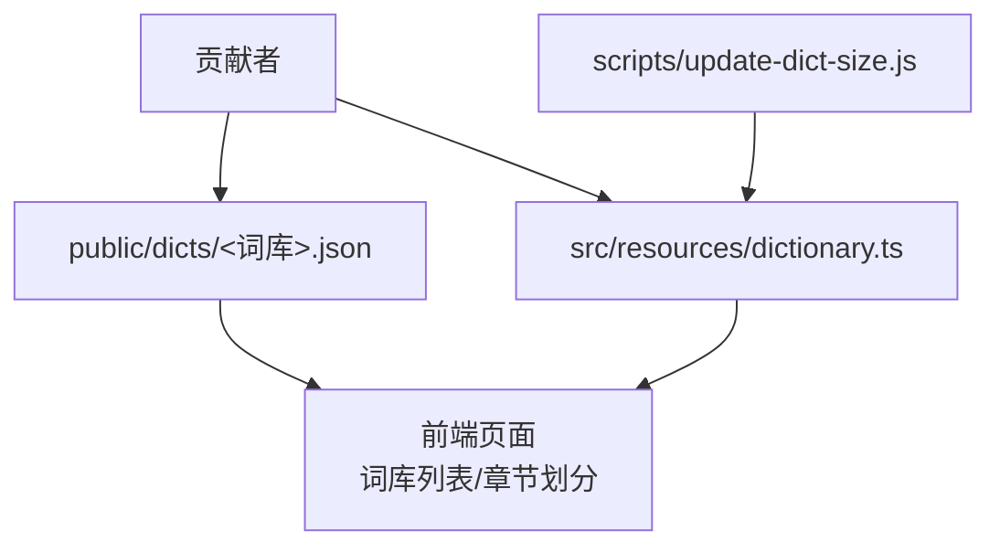
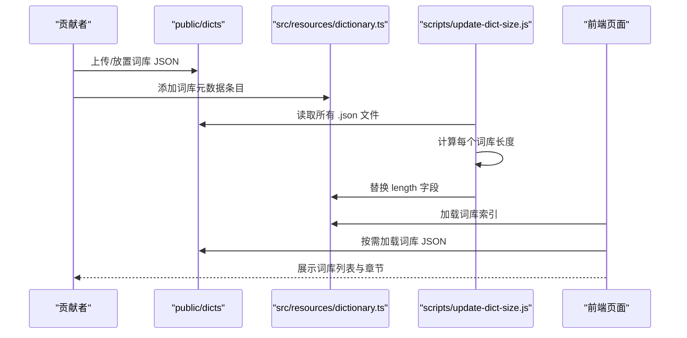
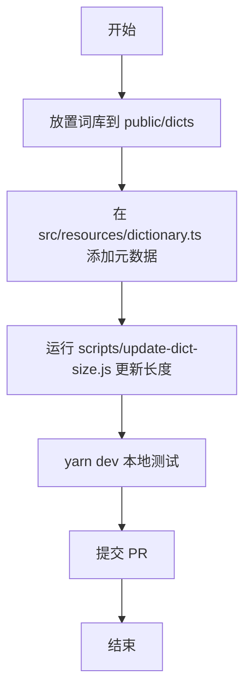
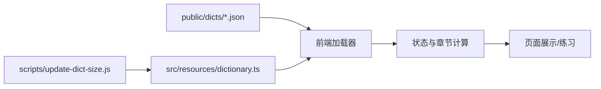

# 词库贡献指南

<cite>
**本文引用的文件**
- [README.md](file://README.md)
- [CONTRIBUTING.md](file://docs/CONTRIBUTING.md)
- [toBuildDict.md](file://docs/toBuildDict.md)
- [dictionary.ts](file://src/resources/dictionary.ts)
- [index.ts](file://src/typings/index.ts)
- [resource.ts](file://src/typings/resource.ts)
- [index.ts](file://src/constants/index.ts)
- [update-dict-size.js](file://scripts/update-dict-size.js)
- [2024HongBao_T1.json](file://public/dicts/2024HongBao_T1.json)
- [CET4_T.json](file://public/dicts/CET4_T.json)
- [AudioKey_Category.json](file://public/dicts/AudioKey_Category.json)
- [AudioKey_SubCategory.json](file://public/dicts/AudioKey_SubCategory.json)
- [nce-new-4.json](file://public/dicts/nce-new-4.json)
- [IELTSVocabularyBible.json](file://public/dicts/IELTSVocabularyBible.json)
- [gre-ciyileiji.json](file://public/dicts/gre-ciyileiji.json)
- [ZaiYaoNiMing_GRE3000.json](file://public/dicts/ZaiYaoNiMing_GRE3000.json)
</cite>

## 目录

1. [简介](#简介)
2. [项目结构](#项目结构)
3. [核心组件](#核心组件)
4. [架构总览](#架构总览)
5. [详细组件分析](#详细组件分析)
6. [依赖关系分析](#依赖关系分析)
7. [性能考量](#性能考量)
8. [故障排查指南](#故障排查指南)
9. [结论](#结论)
10. [附录](#附录)

## 简介

本指南面向希望为 Qwerty Learner 贡献词库的贡献者，目标是提供从词库格式规范、质量标准、导入流程、审核与发布，到分类与标签管理、元数据规范、构建工具与自动化更新的全流程操作说明。通过遵循本指南，您可以高效、高质量地交付词库，使其顺利集成到系统并服务于用户。

## 项目结构

词库相关的关键位置与职责如下：

- public/dicts：存放词库 JSON 文件，按主题/考试/语言分类命名，便于浏览与维护
- src/resources/dictionary.ts：词库索引清单，声明词库 id、名称、描述、分类、标签、URL、长度、语言等元数据
- scripts/update-dict-size.js：自动统计词库长度并回写至索引文件，减少手工维护成本
- src/typings/\*：类型定义，约束词库条目结构与语言/音标/发音配置
- src/constants/index.ts：章节长度等常量，用于计算章节数

图表来源

- [dictionary.ts](file://src/resources/dictionary.ts#L1-L120)
- [update-dict-size.js](file://scripts/update-dict-size.js#L1-L23)

章节来源

- [README.md](file://README.md#L200-L223)
- [toBuildDict.md](file://docs/toBuildDict.md#L62-L123)

## 核心组件

- 词库条目结构：name、trans（翻译数组）、usphone、ukphone（音标字段）、可选 notation（附加标记）
- 词库资源元数据：id、name、description、category、tags、url、length、language、languageCategory、chapterCount、defaultPronIndex
- 语言与音标映射：支持美式/英式/罗马音/中文/日语/德语/哈拼/哈萨克语/印尼语等语言类型与音标类型映射
- 章节划分：依据常量章节长度计算章节总数，用于练习进度与复习节奏

章节来源

- [index.ts](file://src/typings/index.ts#L1-L51)
- [resource.ts](file://src/typings/resource.ts#L1-L51)
- [index.ts](file://src/constants/index.ts#L1-L19)

## 架构总览

词库从“文件入库 → 元数据登记 → 自动统计 → 页面渲染”的端到端流程如下：

图表来源

- [toBuildDict.md](file://docs/toBuildDict.md#L62-L123)
- [dictionary.ts](file://src/resources/dictionary.ts#L1-L120)
- [update-dict-size.js](file://scripts/update-dict-size.js#L1-L23)

## 详细组件分析

### 词库格式规范

- 文件命名与位置
  - 目标文件：public/dicts/<词库名>.json
  - 示例：CET4_T.json、2024HongBao_T1.json、AudioKey_Category.json 等
- JSON 结构
  - 数组元素为对象，包含 name、trans（字符串数组）、usphone、ukphone 等字段
  - 可选字段：notation（如需额外标注）
- 字段定义与含义
  - name：单词原文
  - trans：中文释义数组，可含多个释义
  - usphone/ukphone：美式/英式音标文本
  - notation：可选，用于特殊标注
- 示例参考
  - 英语词典样例：CET4_T.json、2024HongBao_T1.json
  - 音效/场景类词典样例：AudioKey_Category.json、AudioKey_SubCategory.json
  - 其他专项词典样例：nce-new-4.json、IELTSVocabularyBible.json、gre-ciyileiji.json、ZaiYaoNiMing_GRE3000.json

章节来源

- [toBuildDict.md](file://docs/toBuildDict.md#L19-L61)
- [CET4_T.json](file://public/dicts/CET4_T.json#L1-L120)
- [2024HongBao_T1.json](file://public/dicts/2024HongBao_T1.json#L1-L120)
- [AudioKey_Category.json](file://public/dicts/AudioKey_Category.json#L1-L120)
- [AudioKey_SubCategory.json](file://public/dicts/AudioKey_SubCategory.json#L1-L120)
- [nce-new-4.json](file://public/dicts/nce-new-4.json#L4579-L4632)
- [IELTSVocabularyBible.json](file://public/dicts/IELTSVocabularyBible.json#L8609-L8663)
- [gre-ciyileiji.json](file://public/dicts/gre-ciyileiji.json#L24894-L25035)
- [ZaiYaoNiMing_GRE3000.json](file://public/dicts/ZaiYaoNiMing_GRE3000.json#L16033-L16120)

### 数据验证规则

- 结构完整性
  - name 必填且为字符串
  - trans 必填且为字符串数组
  - usphone/ukphone 为字符串（可为空字符串，表示暂缺）
  - notation 可选
- 一致性与唯一性
  - id 在 dictionary.ts 中必须全局唯一
  - url 指向 public/dicts 下的文件路径
  - language/languageCategory 需与词库实际语言一致
- 长度与章节
  - length 由脚本自动统计，无需手工填写
  - chapterCount 由前端计算（length/章节长度）

章节来源

- [resource.ts](file://src/typings/resource.ts#L1-L51)
- [index.ts](file://src/typings/index.ts#L22-L33)
- [index.ts](file://src/constants/index.ts#L1-L19)
- [update-dict-size.js](file://scripts/update-dict-size.js#L1-L23)

### 词库质量标准

- 词汇准确性
  - 释义应准确、权威，避免歧义；必要时注明词性
- 例句质量（如适用）
  - 若包含例句，应简洁、典型、可读性强，避免过长或生僻
- 发音标注
  - usphone/ukphone 应与权威词典一致，避免错标
  - 若仅有美式或英式之一，另一字段可为空字符串
- 格式与大小写
  - 优先采用小写形式，避免大小写混杂导致匹配困难
  - 专有名词按词典惯例处理
- 重复与冗余
  - 避免重复条目；同一词条的不同释义应合并为数组元素
- 语言与分类
  - language 与 languageCategory 应与词库内容一致
  - category 与 tags 应与现有分类体系一致，便于检索与筛选

章节来源

- [toBuildDict.md](file://docs/toBuildDict.md#L104-L118)
- [dictionary.ts](file://src/resources/dictionary.ts#L1-L120)

### 词库导入流程

- 文件上传与放置
  - 将目标 JSON 放置于 public/dicts/
- 元数据登记
  - 在 src/resources/dictionary.ts 中添加条目，填写 id/name/description/category/tags/url/language/languageCategory 等
- 自动统计长度
  - 运行 scripts/update-dict-size.js，自动替换 length 字段
- 本地测试
  - 安装依赖并启动开发服务器，访问本地页面，确认词库出现在词典列表
- 提交 PR
  - 提交包含新增词库与索引更新的 PR，等待审核与合并

图表来源

- [toBuildDict.md](file://docs/toBuildDict.md#L62-L123)
- [update-dict-size.js](file://scripts/update-dict-size.js#L1-L23)

章节来源

- [toBuildDict.md](file://docs/toBuildDict.md#L62-L123)

### 审核标准与发布流程

- 审核要点
  - 格式与结构：是否符合 JSON 规范与字段定义
  - 质量：准确性、一致性、可读性
  - 元数据：id 唯一性、url 正确性、分类与标签合理
  - 自动化：length 是否正确更新
- 发布流程
  - PR 通过后合并至主分支
  - 在后续版本中随站点更新上线

章节来源

- [CONTRIBUTING.md](file://docs/CONTRIBUTING.md#L1-L48)
- [toBuildDict.md](file://docs/toBuildDict.md#L119-L123)

### 词库分类体系、标签与元数据规范

- 分类（category）
  - 示例：中国考试、国际考试、专业词汇、英语词典、语言学习等
- 标签（tags）
  - 示例：大学英语、考研、PET、IELTS、GRE、专业英语、其他、课外词汇等
- 元数据字段
  - id、name、description、category、tags、url、length、language、languageCategory、chapterCount、defaultPronIndex
- 语言与音标映射
  - 支持 en、romaji、zh、ja、code、de、kk、hapin、id 等语言类型
  - 发音类型与音标类型映射关系由全局映射表维护

章节来源

- [dictionary.ts](file://src/resources/dictionary.ts#L1-L120)
- [index.ts](file://src/typings/index.ts#L1-L51)
- [resource.ts](file://src/typings/resource.ts#L1-L51)

### 构建工具与自动化更新

- 自动统计脚本
  - 作用：扫描 public/dicts 下所有 .json，计算长度并回写 dictionary.ts 中的 length 字段
  - 使用：在本地执行脚本后，提交更新后的索引文件
- 本地开发与测试
  - 安装依赖后启动开发服务器，访问本地页面验证词库加载与展示

章节来源

- [update-dict-size.js](file://scripts/update-dict-size.js#L1-L23)
- [toBuildDict.md](file://docs/toBuildDict.md#L113-L118)

## 依赖关系分析

词库系统的关键依赖关系如下：

图表来源

- [dictionary.ts](file://src/resources/dictionary.ts#L1-L120)
- [update-dict-size.js](file://scripts/update-dict-size.js#L1-L23)

章节来源

- [dictionary.ts](file://src/resources/dictionary.ts#L1-L120)
- [index.ts](file://src/constants/index.ts#L1-L19)

## 性能考量

- 词库体积与加载
  - 建议按主题/考试拆分词库，避免单文件过大
  - 合理设置章节长度，平衡学习强度与记忆曲线
- 自动统计与增量更新
  - 使用脚本批量更新长度，减少人工维护成本
- 前端渲染优化
  - 词库列表与章节划分由前端计算，确保在移动端与桌面端均流畅

## 故障排查指南

- 词库未显示
  - 检查 dictionary.ts 中的 url 是否正确指向 public/dicts 下的文件
  - 确认 id 唯一且未与其他条目冲突
- 长度不正确
  - 重新运行 scripts/update-dict-size.js 并提交更新
- 本地测试失败
  - 确认已安装依赖并启动开发服务器
  - 检查网络代理与跨域设置（如使用本地代理）
- 语言/音标显示异常
  - 检查 language 与 languageCategory 是否与词库内容一致
  - 确认 usphone/ukphone 字段格式正确

章节来源

- [toBuildDict.md](file://docs/toBuildDict.md#L113-L118)
- [update-dict-size.js](file://scripts/update-dict-size.js#L1-L23)

## 结论

通过遵循本指南，贡献者可以标准化地交付高质量词库，确保格式、质量、元数据与自动化流程的一致性。建议在贡献前先对照现有词库样例与索引条目，保证新词库与既有体系无缝衔接。

## 附录

- 常用参考样例
  - 英语词典：CET4_T.json、2024HongBao_T1.json
  - 音效/场景类：AudioKey_Category.json、AudioKey_SubCategory.json
  - 专项词典：nce-new-4.json、IELTSVocabularyBible.json、gre-ciyileiji.json、ZaiYaoNiMing_GRE3000.json

章节来源

- [CET4_T.json](file://public/dicts/CET4_T.json#L1-L120)
- [2024HongBao_T1.json](file://public/dicts/2024HongBao_T1.json#L1-L120)
- [AudioKey_Category.json](file://public/dicts/AudioKey_Category.json#L1-L120)
- [AudioKey_SubCategory.json](file://public/dicts/AudioKey_SubCategory.json#L1-L120)
- [nce-new-4.json](file://public/dicts/nce-new-4.json#L4579-L4632)
- [IELTSVocabularyBible.json](file://public/dicts/IELTSVocabularyBible.json#L8609-L8663)
- [gre-ciyileiji.json](file://public/dicts/gre-ciyileiji.json#L24894-L25035)
- [ZaiYaoNiMing_GRE3000.json](file://public/dicts/ZaiYaoNiMing_GRE3000.json#L16033-L16120)
