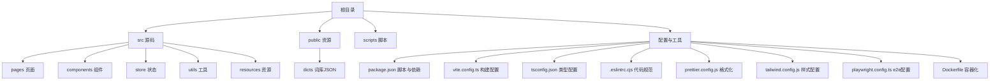
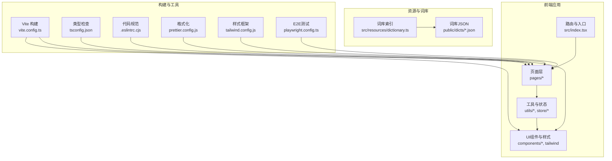
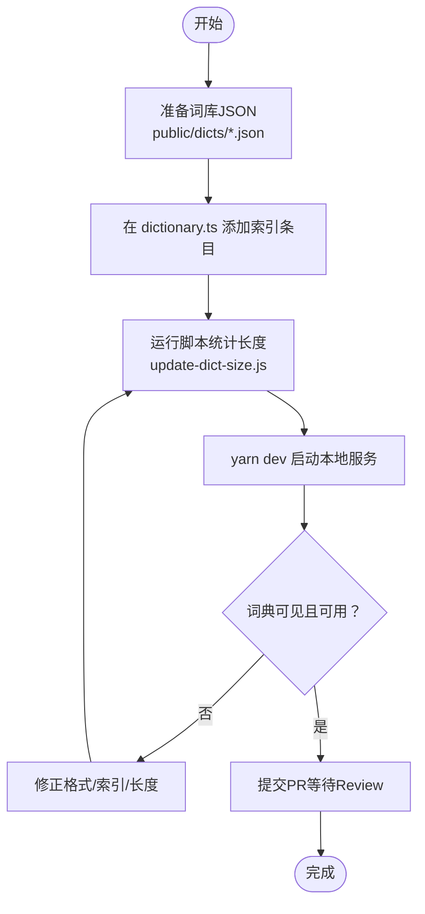
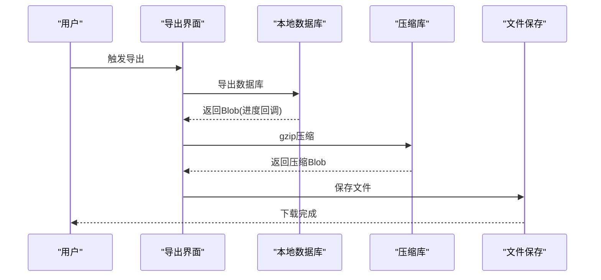
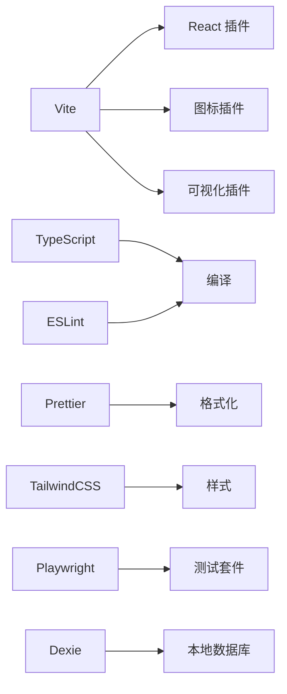

# 贡献与开发指南

<cite>
**本文引用的文件**
- [README.md](file://README.md)
- [CONTRIBUTING.md](file://docs/CONTRIBUTING.md)
- [toBuildDict.md](file://docs/toBuildDict.md)
- [package.json](file://package.json)
- [vite.config.ts](file://vite.config.ts)
- [tsconfig.json](file://tsconfig.json)
- [.eslintrc.cjs](file://.eslintrc.cjs)
- [prettier.config.js](file://prettier.config.js)
- [tailwind.config.js](file://tailwind.config.js)
- [src/index.tsx](file://src/index.tsx)
- [src/resources/dictionary.ts](file://src/resources/dictionary.ts)
- [scripts/update-dict-size.js](file://scripts/update-dict-size.js)
- [playwright.config.ts](file://playwright.config.ts)
- [Dockerfile](file://Dockerfile)
- [src/utils/db/data-export.ts](file://src/utils/db/data-export.ts)
</cite>

## 目录

1. [简介](#简介)
2. [项目结构](#项目结构)
3. [核心组件](#核心组件)
4. [架构总览](#架构总览)
5. [详细组件分析](#详细组件分析)
6. [依赖关系分析](#依赖关系分析)
7. [性能考量](#性能考量)
8. [故障排查指南](#故障排查指南)
9. [结论](#结论)
10. [附录](#附录)

## 简介

本指南面向希望参与 Qwerty Learner 项目的贡献者与开发者，系统阐述贡献流程（Issue 提交、Pull Request 规范、代码审查标准）、词库贡献规范（格式、质量与审核流程）、开发环境搭建、代码风格与测试要求、项目架构理解、功能扩展模式与性能优化建议，并提供社区协作最佳实践与沟通指南，帮助新贡献者快速上手并高质量交付。

## 项目结构

项目采用前端单页应用（React + Vite）与可选桌面端（Tauri）的组合形态，核心代码位于 src，公共资源与词库位于 public，脚本与配置位于 scripts 与各工具配置文件。词库索引集中管理，便于统一引入与统计。

图表来源

- [package.json](file://package.json#L60-L69)
- [vite.config.ts](file://vite.config.ts#L1-L55)
- [tsconfig.json](file://tsconfig.json#L1-L41)
- [.eslintrc.cjs](file://.eslintrc.cjs#L1-L58)
- [prettier.config.js](file://prettier.config.js#L1-L17)
- [tailwind.config.js](file://tailwind.config.js#L1-L78)
- [playwright.config.ts](file://playwright.config.ts#L1-L79)
- [Dockerfile](file://Dockerfile#L1-L15)

章节来源

- [README.md](file://README.md#L133-L190)
- [package.json](file://package.json#L60-L69)

## 核心组件

- 应用入口与路由：负责页面路由与移动端适配、主题切换、埋点初始化等。
- 词库索引：集中声明词库元信息，便于统一管理与统计。
- 构建与工具链：Vite、TypeScript、ESLint、Prettier、TailwindCSS、Playwright 等。
- 数据导出/导入：基于 Dexie 的本地数据库导出压缩包与导入恢复。

章节来源

- [src/index.tsx](file://src/index.tsx#L1-L79)
- [src/resources/dictionary.ts](file://src/resources/dictionary.ts#L1-L120)
- [package.json](file://package.json#L60-L69)
- [src/utils/db/data-export.ts](file://src/utils/db/data-export.ts#L1-L68)

## 架构总览

应用采用前端 SPA 架构，路由按页面拆分，组件模块化，状态管理使用原子化状态方案，样式通过 TailwindCSS 与主题变量控制，构建与打包由 Vite 驱动，开发体验通过 ESLint、Prettier、TypeScript 保障。

图表来源

- [src/index.tsx](file://src/index.tsx#L1-L79)
- [src/resources/dictionary.ts](file://src/resources/dictionary.ts#L1-L120)
- [vite.config.ts](file://vite.config.ts#L1-L55)
- [tsconfig.json](file://tsconfig.json#L1-L41)
- [.eslintrc.cjs](file://.eslintrc.cjs#L1-L58)
- [prettier.config.js](file://prettier.config.js#L1-L17)
- [tailwind.config.js](file://tailwind.config.js#L1-L78)
- [playwright.config.ts](file://playwright.config.ts#L1-L79)

## 详细组件分析

### 贡献流程与代码审查规范

- Issue 与 PR 来源：优先关注标记为 Help Wanted 的任务，或在社群/Issue 中提出需求与 Bug；必要时先创建 Issue 并在描述中明确问题、方案与预期工作量。
- PR 前准备：尽早提交 Draft PR，便于协作讨论；确保 PR 符合项目开发规范与质量标准，经过充分测试与文档支持。
- 协作与评审：保持友好协作，积极回应 Review 意见，遵守代码风格与注释规范，保证可读性与可维护性；允许他人参与 Review，共同完善质量。
- 完成与收尾：标记相关 Issue 为完成，合并到主分支并在生产环境充分测试；若涉及用户社群需求，可在社群内回复用户。

章节来源

- [CONTRIBUTING.md](file://docs/CONTRIBUTING.md#L1-L48)

### 词库贡献规范与审核流程

- 目标文件格式：JSON 数组，元素为包含 name 与 trans 字段的对象；示例路径见文档。
- 文件位置：放置于 public/dicts/ 下。
- 索引建立：在 src/resources/dictionary.ts 中添加条目，字段包括 id、name、description、category、url、length、language 等；长度可通过脚本自动更新。
- 自动统计长度：执行脚本扫描 public/dicts 下的 JSON 文件并替换 src/resources/dictionary.ts 中的 length 字段。
- 测试与验证：安装依赖后启动开发服务器，访问本地地址验证词典是否出现在词典列表。
- 提交 PR：完成上述步骤后提交 PR，等待 Review 与合并。

图表来源

- [toBuildDict.md](file://docs/toBuildDict.md#L1-L124)
- [src/resources/dictionary.ts](file://src/resources/dictionary.ts#L1-L120)
- [scripts/update-dict-size.js](file://scripts/update-dict-size.js#L1-L23)

章节来源

- [toBuildDict.md](file://docs/toBuildDict.md#L1-L124)
- [src/resources/dictionary.ts](file://src/resources/dictionary.ts#L1-L120)
- [scripts/update-dict-size.js](file://scripts/update-dict-size.js#L1-L23)

### 开发环境搭建与运行

- 环境要求：Node.js、Git、Yarn；可使用脚本进行环境预检与一键安装。
- 手动安装：克隆仓库、安装依赖、启动开发服务器、访问 http://localhost:5173。
- 脚本安装：Windows 执行 install.ps1；macOS 执行 install.sh。
- 验证依赖：通过 pre-check 脚本或命令行查看版本。

章节来源

- [README.md](file://README.md#L133-L190)

### 代码风格规范与工具链

- TypeScript：严格模式、模块解析、路径别名、类型插件等。
- ESLint：多文件覆盖规则、React/React Hooks 支持、排序导入、类型导入一致性。
- Prettier：单引号、尾逗号、缩进宽度、插件排序与 TailwindCSS 支持。
- TailwindCSS：深色模式、动画、响应式断点、UI 组件扩展。
- Vite：插件体系（React、图标、可视化）、构建输出、define 常量、别名与 CSS Modules。

章节来源

- [tsconfig.json](file://tsconfig.json#L1-L41)
- [.eslintrc.cjs](file://.eslintrc.cjs#L1-L58)
- [prettier.config.js](file://prettier.config.js#L1-L17)
- [tailwind.config.js](file://tailwind.config.js#L1-L78)
- [vite.config.ts](file://vite.config.ts#L1-L55)

### 测试要求与 E2E

- 单元测试：当前脚本未启用单元测试命令。
- E2E 测试：Playwright 配置包含多浏览器项目、HTML 报告、首次重试追踪、超时设置；可在 CI 中配置本地服务启动参数。

章节来源

- [package.json](file://package.json#L60-L69)
- [playwright.config.ts](file://playwright.config.ts#L1-L79)

### 数据导出/导入与本地存储

- 导出：导出数据库为 Blob，使用 gzip 压缩，保存为 .gz 文件，记录导出动作与统计信息。
- 导入：读取 .gz 文件解压为 JSON，调用 Dexie 导入接口，支持进度回调与兼容策略。

图表来源

- [src/utils/db/data-export.ts](file://src/utils/db/data-export.ts#L1-L68)

章节来源

- [src/utils/db/data-export.ts](file://src/utils/db/data-export.ts#L1-L68)

### 容器化与部署

- Dockerfile：基于 Node:20 构建，复制构建产物至 Nginx 镜像，使用默认 Nginx 配置。
- 部署建议：结合 Vercel 或静态托管，构建输出目录为 build。

章节来源

- [Dockerfile](file://Dockerfile#L1-L15)
- [README.md](file://README.md#L52-L61)
- [vite.config.ts](file://vite.config.ts#L31-L35)

## 依赖关系分析

- 构建与打包：Vite 为核心，配合可视化插件、图标插件、Babel 插件调试标签与刷新。
- 类型与规范：TypeScript 提供强类型，ESLint 与 Prettier 保障一致性。
- UI 与样式：TailwindCSS 提供原子化样式与主题扩展。
- 测试：Playwright 配置多浏览器与报告。
- 本地存储：Dexie + 导入导出工具链。

图表来源

- [vite.config.ts](file://vite.config.ts#L1-L55)
- [tsconfig.json](file://tsconfig.json#L1-L41)
- [.eslintrc.cjs](file://.eslintrc.cjs#L1-L58)
- [prettier.config.js](file://prettier.config.js#L1-L17)
- [tailwind.config.js](file://tailwind.config.js#L1-L78)
- [playwright.config.ts](file://playwright.config.ts#L1-L79)
- [src/utils/db/data-export.ts](file://src/utils/db/data-export.ts#L1-L68)

章节来源

- [vite.config.ts](file://vite.config.ts#L1-L55)
- [tsconfig.json](file://tsconfig.json#L1-L41)
- [.eslintrc.cjs](file://.eslintrc.cjs#L1-L58)
- [prettier.config.js](file://prettier.config.js#L1-L17)
- [tailwind.config.js](file://tailwind.config.js#L1-L78)
- [playwright.config.ts](file://playwright.config.ts#L1-L79)
- [src/utils/db/data-export.ts](file://src/utils/db/data-export.ts#L1-L68)

## 性能考量

- 构建优化：开启最小化与生产环境移除 console/debugger；使用可视化插件分析包体构成。
- 资源加载：按需懒加载页面组件，减少首屏体积。
- 本地存储：导出导入采用压缩传输，避免大对象频繁序列化。
- 样式与主题：Tailwind 原子化样式减少冗余 CSS，深色模式按需切换。
- 测试与可观测：在生产环境初始化分析与事件上报，便于性能监控。

章节来源

- [vite.config.ts](file://vite.config.ts#L31-L42)
- [src/index.tsx](file://src/index.tsx#L1-L79)
- [src/utils/db/data-export.ts](file://src/utils/db/data-export.ts#L1-L68)

## 故障排查指南

- 环境缺失：使用 pre-check 脚本或命令行验证 Node/Git/Yarn 版本；Windows 使用 install.ps1，macOS 使用 install.sh。
- 构建失败：检查 Vite 输出目录与 define 常量；确认别名与 CSS Modules 配置。
- 词库不生效：核对 JSON 格式、dictionary.ts 索引字段、长度统计脚本是否执行。
- E2E 失败：检查 Playwright 浏览器设备配置、超时与追踪设置；必要时在本地启动服务后运行测试。
- 导入导出异常：确认 .gz 文件格式、解压与导入兼容策略、进度回调处理。

章节来源

- [README.md](file://README.md#L133-L190)
- [vite.config.ts](file://vite.config.ts#L31-L42)
- [toBuildDict.md](file://docs/toBuildDict.md#L1-L124)
- [playwright.config.ts](file://playwright.config.ts#L1-L79)
- [src/utils/db/data-export.ts](file://src/utils/db/data-export.ts#L1-L68)

## 结论

本指南从贡献流程、词库规范、开发环境、代码风格、测试与部署、性能优化等方面为贡献者提供了系统化的参与路径。建议新贡献者先从 Issue 与 Draft PR 入手，遵循规范与评审意见，逐步深入功能扩展与性能优化，共同推动项目演进。

## 附录

### 新贡献者参与清单

- 阅读贡献准则与开发计划，选择合适任务。
- Fork 仓库并创建分支，提交 Draft PR 进行讨论。
- 修复问题、完善测试与文档，按规范提交 PR。
- 参与 Review，积极沟通与改进。

章节来源

- [CONTRIBUTING.md](file://docs/CONTRIBUTING.md#L1-L48)
- [README.md](file://README.md#L240-L259)
