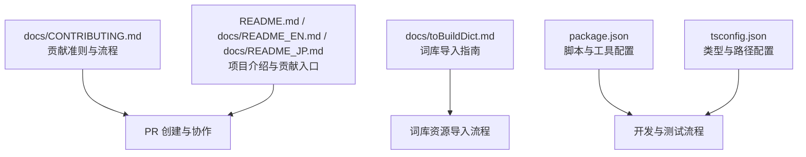
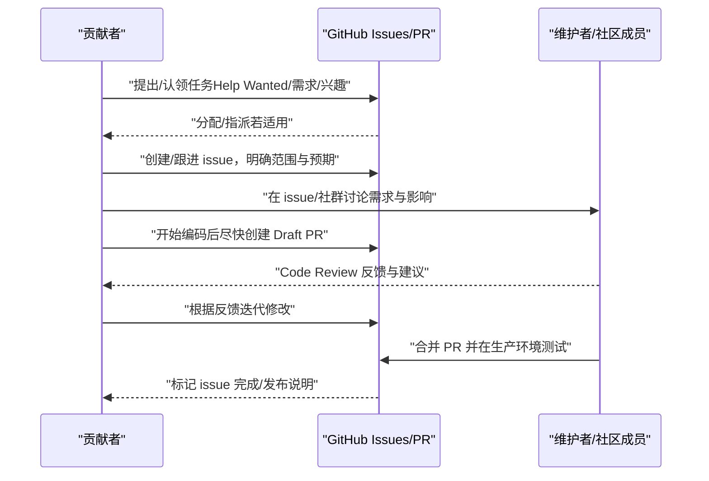
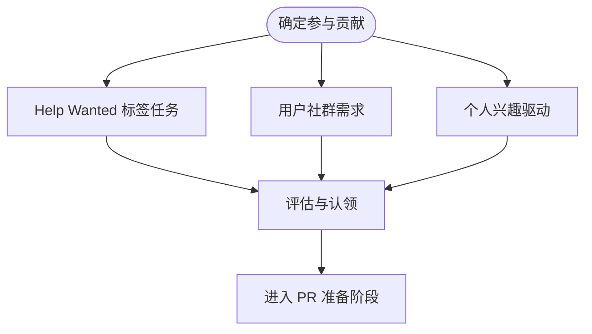
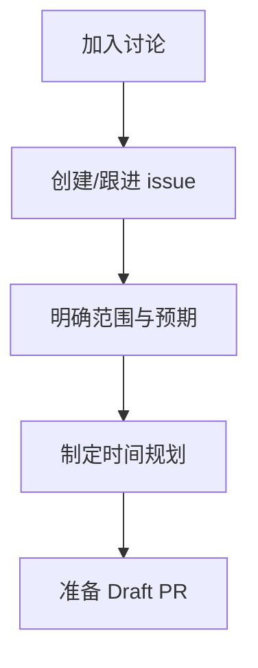
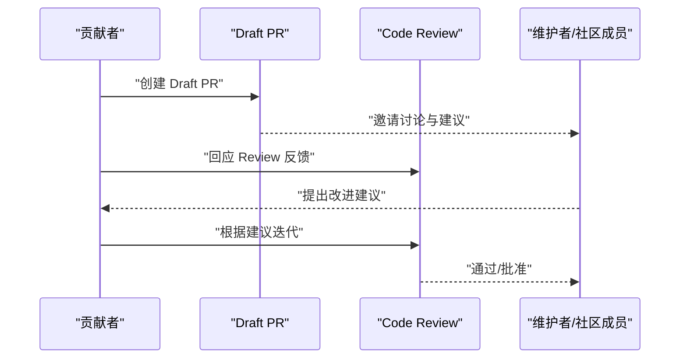
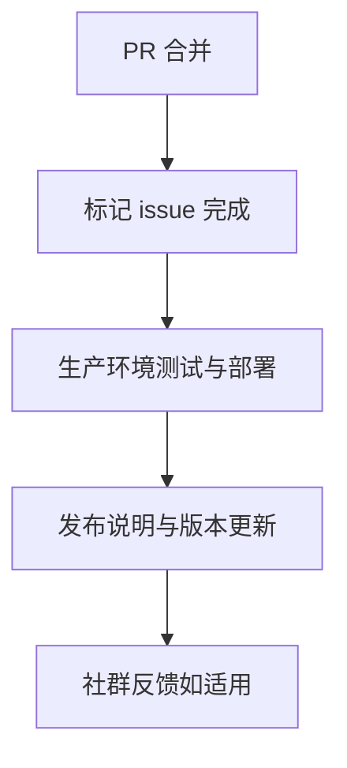
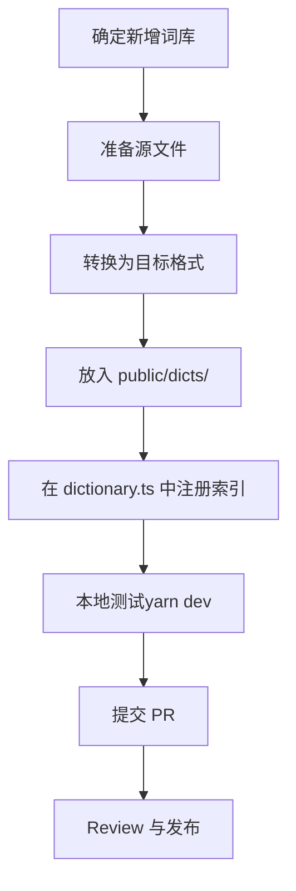
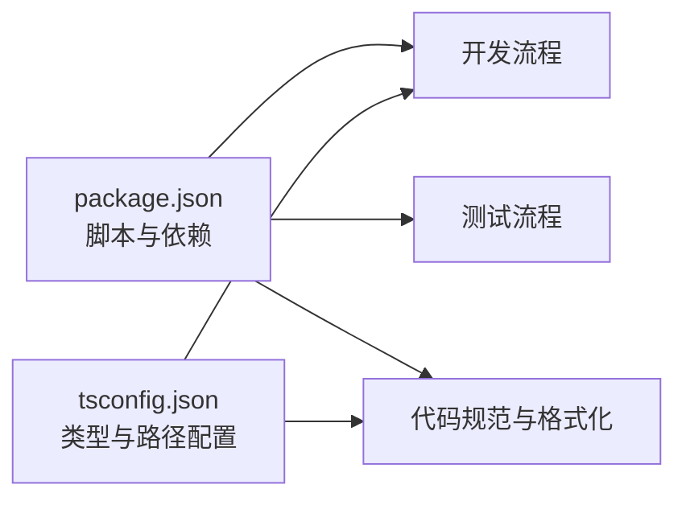

# 贡献流程规范

<cite>
**本文引用的文件**
- [docs/CONTRIBUTING.md](file://docs/CONTRIBUTING.md)
- [README.md](file://README.md)
- [docs/README_EN.md](file://docs/README_EN.md)
- [docs/README_JP.md](file://docs/README_JP.md)
- [docs/toBuildDict.md](file://docs/toBuildDict.md)
- [package.json](file://package.json)
- [tsconfig.json](file://tsconfig.json)
</cite>

## 目录

1. [简介](#简介)
2. [项目结构](#项目结构)
3. [核心组件](#核心组件)
4. [架构总览](#架构总览)
5. [详细组件分析](#详细组件分析)
6. [依赖分析](#依赖分析)
7. [性能考虑](#性能考虑)
8. [故障排查指南](#故障排查指南)
9. [结论](#结论)
10. [附录](#附录)

## 简介

本规范面向所有希望参与 Qwerty Learner 项目的贡献者，系统化梳理从 PR 来源、PR 前准备、PR 协作流程、到 PR 完成后的闭环工作流，并强调行为准则与社区礼仪，帮助贡献者高效、有序地参与项目。

## 项目结构

本项目采用前端单页应用与词库资源分离的组织方式：核心代码位于 src/，词库资源位于 public/dicts/，并通过资源索引文件进行统一管理。贡献流程相关的关键文档集中在 docs/ 下，包括贡献准则、多语言 README 与词库导入指南。

图表来源

- [docs/CONTRIBUTING.md](file://docs/CONTRIBUTING.md#L1-L48)
- [docs/toBuildDict.md](file://docs/toBuildDict.md#L1-L124)
- [README.md](file://README.md#L120-L140)
- [docs/README_EN.md](file://docs/README_EN.md#L140-L150)
- [docs/README_JP.md](file://docs/README_JP.md#L217-L228)
- [package.json](file://package.json#L60-L70)
- [tsconfig.json](file://tsconfig.json#L1-L41)

章节来源

- [docs/CONTRIBUTING.md](file://docs/CONTRIBUTING.md#L1-L48)
- [docs/toBuildDict.md](file://docs/toBuildDict.md#L1-L124)
- [README.md](file://README.md#L120-L140)
- [docs/README_EN.md](file://docs/README_EN.md#L140-L150)
- [docs/README_JP.md](file://docs/README_JP.md#L217-L228)
- [package.json](file://package.json#L60-L70)
- [tsconfig.json](file://tsconfig.json#L1-L41)

## 核心组件

- 贡献准则与流程：定义 PR 来源渠道、PR 前准备、PR 协作规范、PR 完成后的工作闭环与行为准则。
- 词库导入指南：定义词库目标文件格式、存放位置、索引建立、测试与提交 PR 的标准流程。
- 项目贡献入口：在各语言 README 中提供贡献入口链接与建议的协作方式（含 Draft PR）。
- 工具与脚本：通过 package.json 中的脚本与 husky/lint-staged 等工具保障开发与质量基线。

章节来源

- [docs/CONTRIBUTING.md](file://docs/CONTRIBUTING.md#L1-L48)
- [docs/toBuildDict.md](file://docs/toBuildDict.md#L1-L124)
- [README.md](file://README.md#L120-L140)
- [docs/README_EN.md](file://docs/README_EN.md#L140-L150)
- [docs/README_JP.md](file://docs/README_JP.md#L217-L228)
- [package.json](file://package.json#L60-L70)

## 架构总览

下图展示了贡献者从“确定任务”到“PR 完成”的端到端流程，涵盖 PR 来源、issue 讨论、Draft PR、Code Review、合并与生产测试等环节。

图表来源

- [docs/CONTRIBUTING.md](file://docs/CONTRIBUTING.md#L3-L8)
- [docs/CONTRIBUTING.md](file://docs/CONTRIBUTING.md#L9-L14)
- [docs/CONTRIBUTING.md](file://docs/CONTRIBUTING.md#L15-L23)
- [docs/CONTRIBUTING.md](file://docs/CONTRIBUTING.md#L24-L27)
- [README.md](file://README.md#L250-L259)
- [docs/README_EN.md](file://docs/README_EN.md#L140-L149)
- [docs/README_JP.md](file://docs/README_JP.md#L217-L226)

## 详细组件分析

### 组件 A：PR 来源渠道

- Help Wanted 标签：项目会在 GitHub 上将需要完成的 feature 与 bug 以标签形式对外征集。
- 用户社群需求：通过项目官方部署的 footer 二维码进入的用户社群提出的需求与 bug。
- 个人兴趣驱动：基于对项目的理解与兴趣，主动发起的 feature 与 bug 修复。

图表来源

- [docs/CONTRIBUTING.md](file://docs/CONTRIBUTING.md#L3-L8)
- [README.md](file://README.md#L250-L259)
- [docs/README_EN.md](file://docs/README_EN.md#L140-L149)
- [docs/README_JP.md](file://docs/README_JP.md#L217-L226)

章节来源

- [docs/CONTRIBUTING.md](file://docs/CONTRIBUTING.md#L3-L8)
- [README.md](file://README.md#L250-L259)
- [docs/README_EN.md](file://docs/README_EN.md#L140-L149)
- [docs/README_JP.md](file://docs/README_JP.md#L217-L226)

### 组件 B：PR 前的准备工作

- 讨论与确认：在开发者社群或 issue 区进行讨论，确认需求与对现有代码/未来计划的影响。
- 创建/跟进 issue：在 GitHub 上创建相关 issue（若无），并在描述中包含问题、方案、细节与预期工作量，便于讨论。
- 时间规划：确认开始后，尽量在一周内完成（复杂 issue 除外），避免长期停滞影响他人参与。

图表来源

- [docs/CONTRIBUTING.md](file://docs/CONTRIBUTING.md#L9-L14)
- [README.md](file://README.md#L250-L259)
- [docs/README_EN.md](file://docs/README_EN.md#L140-L149)
- [docs/README_JP.md](file://docs/README_JP.md#L217-L226)

章节来源

- [docs/CONTRIBUTING.md](file://docs/CONTRIBUTING.md#L9-L14)
- [README.md](file://README.md#L250-L259)
- [docs/README_EN.md](file://docs/README_EN.md#L140-L149)
- [docs/README_JP.md](file://docs/README_JP.md#L217-L226)

### 组件 C：PR 过程中的协作规范

- Draft PR：开始编码后尽早提出 Draft PR，便于社区讨论与建议。
- 技术讨论：遇到技术问题与实现路线问题，可在开发者社群或 issue 区讨论，确保满足开发规范与质量标准，并经过充分测试与文档支持。
- Code Review：友好协作，响应 Review，接受反馈并改进，遵守代码风格与注释规范，保证可读性与可维护性。
- 共同 Review：鼓励他人对 PR 进行 Review，帮助发现问题并提出建议。

图表来源

- [docs/CONTRIBUTING.md](file://docs/CONTRIBUTING.md#L15-L23)
- [README.md](file://README.md#L250-L259)
- [docs/README_EN.md](file://docs/README_EN.md#L140-L149)
- [docs/README_JP.md](file://docs/README_JP.md#L217-L226)

章节来源

- [docs/CONTRIBUTING.md](file://docs/CONTRIBUTING.md#L15-L23)
- [README.md](file://README.md#L250-L259)
- [docs/README_EN.md](file://docs/README_EN.md#L140-L149)
- [docs/README_JP.md](file://docs/README_JP.md#L217-L226)

### 组件 D：PR 完成后的工作流程

- 标记完成与合并：在相关 issue 上标记完成，确保代码合并到主分支。
- 生产环境测试与发布：在生产环境中进行充分测试与部署。
- 社区反馈：若是用户社群需求，可在社群内对用户进行回复。

图表来源

- [docs/CONTRIBUTING.md](file://docs/CONTRIBUTING.md#L24-L27)

章节来源

- [docs/CONTRIBUTING.md](file://docs/CONTRIBUTING.md#L24-L27)

### 组件 E：行为准则与社区礼仪

- 尊重与开放：尊重所有贡献者，保持开放心态，接受批评与建议。
- 价值贡献：提交有价值的贡献，符合项目需求并遵守开发规范与质量标准。
- 语言与内容：避免不礼貌或侮辱性语言，不发布垃圾或攻击性内容。
- 道德与法律：遵守行为准则，不进行抄袭、篡改或恶意破坏；遵守法律法规与平台规定。

章节来源

- [docs/CONTRIBUTING.md](file://docs/CONTRIBUTING.md#L29-L38)

### 组件 F：词库贡献流程（补充）

- 0. 交给我们：无编程基础者可通过社区群或以“Dictionary Request”Issue 提出需求。
- 1. 亲自动手：按目标文件格式准备 JSON，放置于 public/dicts/，并在资源索引中注册，本地测试后提交 PR。
- 2. 提交与发布：等待 Review，顺利则随版本发布。

图表来源

- [docs/toBuildDict.md](file://docs/toBuildDict.md#L1-L124)

章节来源

- [docs/toBuildDict.md](file://docs/toBuildDict.md#L1-L124)

## 依赖分析

- 脚本与工具链：通过 package.json 中的 scripts（如 dev、build、test、lint、prettier、test:e2e）与 husky/lint-staged 等工具，保障开发效率与代码质量。
- 类型与路径：tsconfig.json 提供严格类型检查与模块解析配置，配合路径别名与插件，提升开发体验与一致性。

图表来源

- [package.json](file://package.json#L60-L70)
- [package.json](file://package.json#L70-L128)
- [tsconfig.json](file://tsconfig.json#L1-L41)

章节来源

- [package.json](file://package.json#L60-L70)
- [package.json](file://package.json#L70-L128)
- [tsconfig.json](file://tsconfig.json#L1-L41)

## 性能考虑

- 词库加载与体积：词库以 JSON 资源形式提供，建议在导入时计算长度并合理拆分，避免一次性加载过大资源。
- 构建与打包：遵循 package.json 中的构建配置，确保产物适配部署环境。
- 本地开发：使用 dev 脚本进行热更新与调试，减少不必要的性能损耗。

章节来源

- [docs/toBuildDict.md](file://docs/toBuildDict.md#L104-L112)
- [package.json](file://package.json#L60-L70)

## 故障排查指南

- 环境与依赖：若本地无法运行，优先核对 Node、Git、Yarn 版本，参考 README 的环境准备与脚本验证步骤。
- 词库导入失败：检查目标文件格式、路径与索引注册是否正确，使用本地开发服务器验证可见性。
- 代码风格与规范：若 CI/Review 关注格式问题，可先运行 prettier 与 lint 命令，或使用 lint-staged 自动格式化。
- 测试与回归：若涉及功能变更，优先补充或运行 e2e 测试，确保改动不影响既有功能。

章节来源

- [README.md](file://README.md#L133-L190)
- [docs/toBuildDict.md](file://docs/toBuildDict.md#L62-L118)
- [package.json](file://package.json#L60-L70)
- [package.json](file://package.json#L110-L128)

## 结论

本规范将 PR 来源、准备、协作与完成闭环串联，辅以行为准则与工具链配置，旨在降低贡献门槛、提升协作效率与代码质量。建议贡献者在开始前先通读贡献准则与 README 的贡献入口说明，按流程推进并保持开放沟通。

## 附录

- 贡献入口与建议：各语言 README 均提供贡献入口与“建议先创建 Draft PR”的说明，便于早期协作。
- 词库贡献：若贡献方向为词库，建议先阅读词库导入指南，确保格式与索引符合规范。

章节来源

- [README.md](file://README.md#L120-L140)
- [docs/README_EN.md](file://docs/README_EN.md#L140-L149)
- [docs/README_JP.md](file://docs/README_JP.md#L217-L226)
- [docs/toBuildDict.md](file://docs/toBuildDict.md#L1-L124)
