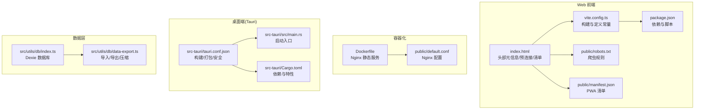
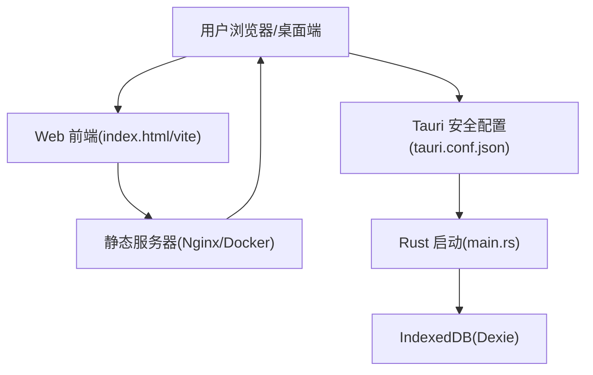
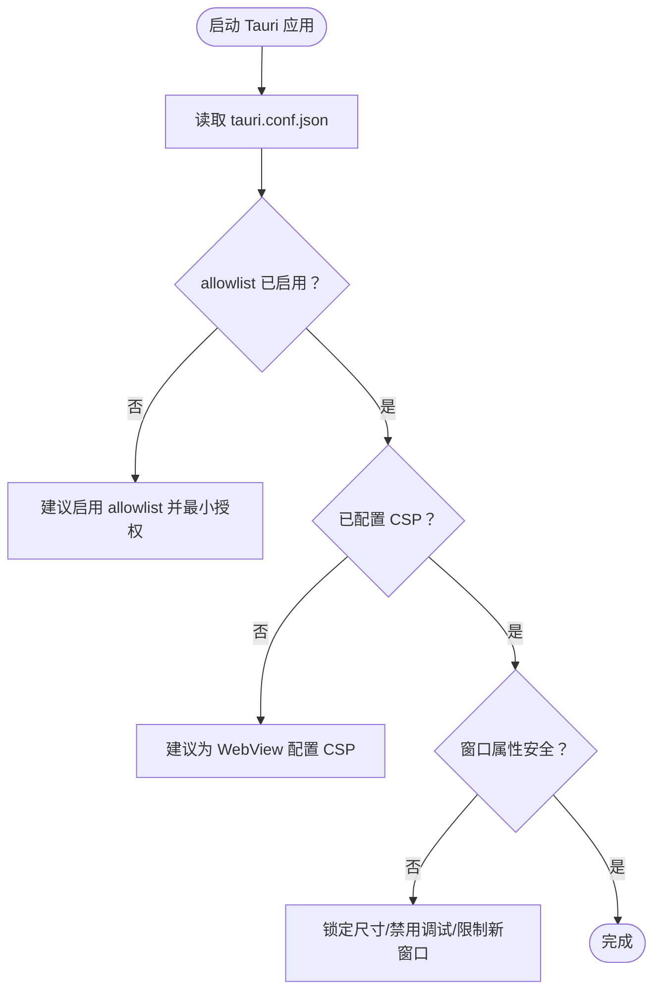
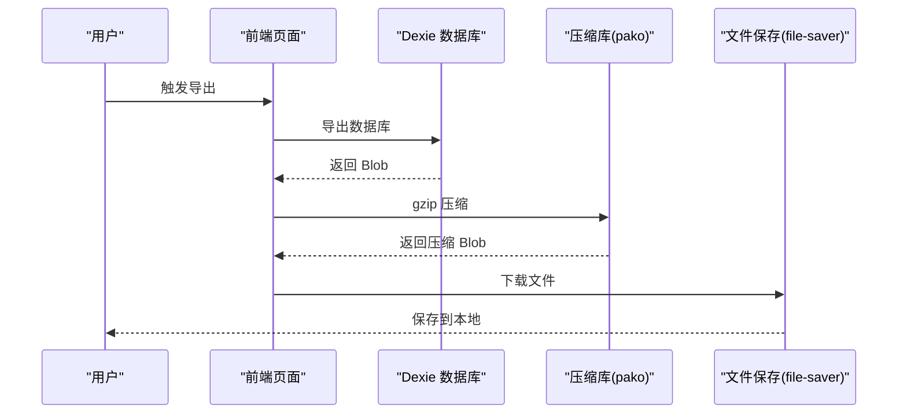
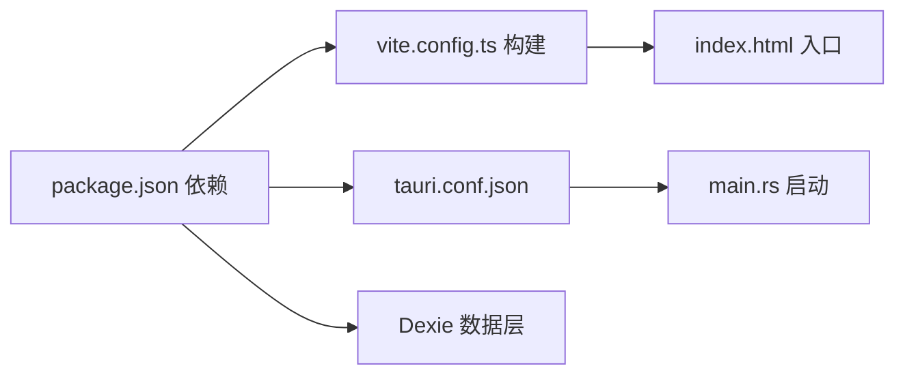

# 安全防护策略

<cite>
**本文引用的文件**
- [package.json](file://package.json)
- [vite.config.ts](file://vite.config.ts)
- [index.html](file://index.html)
- [robots.txt](file://public/robots.txt)
- [manifest.json](file://public/manifest.json)
- [Dockerfile](file://Dockerfile)
- [default.conf](file://public/default.conf)
- [src-tauri/tauri.conf.json](file://src-tauri/tauri.conf.json)
- [src-tauri/src/main.rs](file://src-tauri/src/main.rs)
- [src-tauri/Cargo.toml](file://src-tauri/Cargo.toml)
- [src/utils/db/index.ts](file://src/utils/db/index.ts)
- [src/utils/db/data-export.ts](file://src/utils/db/data-export.ts)
</cite>

## 目录

1. [引言](#引言)
2. [项目结构](#项目结构)
3. [核心组件](#核心组件)
4. [架构总览](#架构总览)
5. [详细组件分析](#详细组件分析)
6. [依赖关系分析](#依赖关系分析)
7. [性能与安全特性](#性能与安全特性)
8. [故障排查指南](#故障排查指南)
9. [结论](#结论)
10. [附录](#附录)

## 引言

本文件面向安全与合规团队，系统化梳理该仓库在 Web 应用与桌面应用（Tauri）层面的安全配置现状，并提出可落地的加固建议。重点覆盖：

- Web 应用的安全配置：CSP、HTTPS、XSS 防护与隐私保护
- 桌面应用（Tauri）的安全配置与权限最小化
- 数据安全与隐私保护：本地数据库、导入导出与用户数据处理
- 访问控制与身份认证：当前实现与改进建议
- 安全审计与漏洞扫描：实施方法与工具链
- 安全事件响应与应急处理流程

## 项目结构

该项目采用前端单页应用（SPA）+ 可选容器化部署的架构，同时通过 Tauri 提供桌面端能力。安全相关的入口与配置主要分布在以下位置：

- Web 前端：入口 HTML、构建配置、静态资源清单与容器化配置
- 桌面端：Tauri 配置与 Rust 启动入口
- 数据层：浏览器 IndexedDB（Dexie）与本地导入导出逻辑

图表来源

- [index.html](file://index.html#L1-L204)
- [vite.config.ts](file://vite.config.ts#L1-L55)
- [package.json](file://package.json#L1-L128)
- [robots.txt](file://public/robots.txt#L1-L4)
- [manifest.json](file://public/manifest.json#L1-L26)
- [Dockerfile](file://Dockerfile#L1-L15)
- [default.conf](file://public/default.conf#L1-L14)
- [src-tauri/tauri.conf.json](file://src-tauri/tauri.conf.json#L1-L60)
- [src-tauri/src/main.rs](file://src-tauri/src/main.rs#L1-L9)
- [src-tauri/Cargo.toml](file://src-tauri/Cargo.toml#L1-L26)
- [src/utils/db/index.ts](file://src/utils/db/index.ts#L1-L136)
- [src/utils/db/data-export.ts](file://src/utils/db/data-export.ts#L1-L68)

章节来源

- [index.html](file://index.html#L1-L204)
- [vite.config.ts](file://vite.config.ts#L1-L55)
- [package.json](file://package.json#L1-L128)
- [robots.txt](file://public/robots.txt#L1-L4)
- [manifest.json](file://public/manifest.json#L1-L26)
- [Dockerfile](file://Dockerfile#L1-L15)
- [default.conf](file://public/default.conf#L1-L14)
- [src-tauri/tauri.conf.json](file://src-tauri/tauri.conf.json#L1-L60)
- [src-tauri/src/main.rs](file://src-tauri/src/main.rs#L1-L9)
- [src-tauri/Cargo.toml](file://src-tauri/Cargo.toml#L1-L26)
- [src/utils/db/index.ts](file://src/utils/db/index.ts#L1-L136)
- [src/utils/db/data-export.ts](file://src/utils/db/data-export.ts#L1-L68)

## 核心组件

- Web 入口与头部安全元信息：包含预连接、DNS 预取、主题色、颜色方案等，但未设置 CSP、HTTPS 强制或 X-Frame-Options 等头
- 构建与运行时：生产构建开启压缩与移除调试符号；开发环境保留 console/debugger
- 容器化部署：基于 Nginx 提供静态文件服务，未显式启用 HTTPS
- Tauri 安全配置：默认关闭 allowlist，未配置 CSP，窗口属性默认可调整
- 数据层：使用 Dexie 进行 IndexedDB 操作，支持导入/导出与压缩，涉及用户数据的持久化与传输

章节来源

- [index.html](file://index.html#L1-L204)
- [vite.config.ts](file://vite.config.ts#L1-L55)
- [Dockerfile](file://Dockerfile#L1-L15)
- [src-tauri/tauri.conf.json](file://src-tauri/tauri.conf.json#L1-L60)
- [src/utils/db/index.ts](file://src/utils/db/index.ts#L1-L136)
- [src/utils/db/data-export.ts](file://src/utils/db/data-export.ts#L1-L68)

## 架构总览

下图展示 Web 与桌面端在安全维度的关键交互点与风险面：

图表来源

- [index.html](file://index.html#L1-L204)
- [vite.config.ts](file://vite.config.ts#L1-L55)
- [Dockerfile](file://Dockerfile#L1-L15)
- [src-tauri/tauri.conf.json](file://src-tauri/tauri.conf.json#L1-L60)
- [src-tauri/src/main.rs](file://src-tauri/src/main.rs#L1-L9)
- [src/utils/db/index.ts](file://src/utils/db/index.ts#L1-L136)

## 详细组件分析

### Web 应用安全配置现状与建议

- CSP（内容安全策略）
  - 现状：未设置 CSP，存在外链脚本与第三方分析脚本加载路径
  - 建议：在生产环境强制启用严格的 CSP，限制脚本来源、内联脚本与 eval 使用，启用 report-only 或 report-uri 以收集违规报告
- HTTPS 与 HSTS
  - 现状：容器镜像仅提供 Nginx 静态服务，未启用 TLS 终止
  - 建议：在边缘或反向代理层启用 HTTPS，配置 HSTS、OCSP Stapling 与现代密码套件
- XSS 防护
  - 现状：存在动态注入的第三方分析脚本与历史路径修复脚本
  - 建议：对所有用户输入进行严格转义与上下文适配；避免内联事件与 eval；使用 CSP 的 script-src 严格模式
- 头部安全响应头
  - 建议：添加 X-Content-Type-Options、X-Frame-Options、Referrer-Policy、Permissions-Policy 等
- 隐私与爬虫
  - 现状：robots.txt 允许爬取
  - 建议：根据实际需要收紧爬虫策略，避免泄露内部路径或敏感信息

章节来源

- [index.html](file://index.html#L1-L204)
- [robots.txt](file://public/robots.txt#L1-L4)
- [Dockerfile](file://Dockerfile#L1-L15)
- [default.conf](file://public/default.conf#L1-L14)

### Tauri 桌面应用安全配置现状与建议

- allowlist 与权限
  - 现状：未启用 allowlist，存在潜在的跨进程调用风险
  - 建议：按需启用白名单 API，最小授权原则；明确声明所需权限并定期审计
- CSP
  - 现状：未配置 CSP
  - 建议：为 WebView 注入 CSP，限制脚本来源与内联执行
- 窗口与导航
  - 建议：锁定窗口尺寸与不可调整；禁用不必要的开发者工具；对新窗口打开进行白名单校验
- 更新与签名
  - 建议：启用更新器并配置签名与完整性校验；生产构建启用自定义协议与沙箱特性

图表来源

- [src-tauri/tauri.conf.json](file://src-tauri/tauri.conf.json#L1-L60)
- [src-tauri/src/main.rs](file://src-tauri/src/main.rs#L1-L9)
- [src-tauri/Cargo.toml](file://src-tauri/Cargo.toml#L1-L26)

章节来源

- [src-tauri/tauri.conf.json](file://src-tauri/tauri.conf.json#L1-L60)
- [src-tauri/src/main.rs](file://src-tauri/src/main.rs#L1-L9)
- [src-tauri/Cargo.toml](file://src-tauri/Cargo.toml#L1-L26)

### 数据安全与隐私保护

- 本地存储与导入导出
  - Dexie 数据库用于记录用户练习数据；导入导出支持压缩与进度回调
  - 建议：对导出数据进行加密存储选项；在导入前进行格式校验与白名单检查；提供“仅本地”模式开关
- 用户数据生命周期
  - 建议：提供数据删除接口与批量清理；导出数据默认不包含敏感标识；支持匿名化与去标识化
- 第三方分析与隐私
  - 现状：页面引入第三方分析脚本
  - 建议：提供“拒绝追踪”选项；在隐私设置中允许用户选择是否启用分析；必要时使用本地埋点替代

图表来源

- [src/utils/db/data-export.ts](file://src/utils/db/data-export.ts#L1-L68)
- [src/utils/db/index.ts](file://src/utils/db/index.ts#L1-L136)

章节来源

- [src/utils/db/data-export.ts](file://src/utils/db/data-export.ts#L1-L68)
- [src/utils/db/index.ts](file://src/utils/db/index.ts#L1-L136)

### 访问控制与身份认证

- 当前实现
  - 未发现内置的身份认证或会话管理逻辑
- 建议
  - 若未来引入用户账户体系：采用短生命周期令牌与刷新令牌；服务端强制 HTTPS 与 SameSite Cookie；前端仅通过受控 API 访问
  - 对于本地数据：提供本地加密存储选项与主密钥管理

[本节为概念性建议，不直接分析具体文件]

### 安全审计与漏洞扫描

- 供应链安全
  - 建议：启用依赖锁定与定期扫描；对关键依赖设置安全告警；限制外部源与镜像源可信范围
- 运行时安全
  - 建议：对静态资源启用完整性校验；在容器层启用只读根文件系统与最小权限；对 Nginx 启用安全头与限流
- 代码扫描
  - 建议：集成 SAST（如 ESLint 插件）与 DAST（如 Playwright 测试）；对第三方脚本与字体源进行白名单管理

章节来源

- [package.json](file://package.json#L1-L128)
- [vite.config.ts](file://vite.config.ts#L1-L55)
- [Dockerfile](file://Dockerfile#L1-L15)

## 依赖关系分析

- 前端依赖与安全相关项
  - 分析与埋点：第三方分析库已内置于入口，建议在隐私设置中可关闭
  - 构建与混淆：生产构建移除 console/debugger，建议进一步启用严格 CSP 与最小化脚本加载
- 桌面端依赖与安全相关项
  - Tauri 版本与特性：建议启用自定义协议与沙箱特性；按需启用白名单 API

图表来源

- [package.json](file://package.json#L1-L128)
- [vite.config.ts](file://vite.config.ts#L1-L55)
- [index.html](file://index.html#L1-L204)
- [src-tauri/tauri.conf.json](file://src-tauri/tauri.conf.json#L1-L60)
- [src-tauri/src/main.rs](file://src-tauri/src/main.rs#L1-L9)
- [src/utils/db/index.ts](file://src/utils/db/index.ts#L1-L136)

章节来源

- [package.json](file://package.json#L1-L128)
- [vite.config.ts](file://vite.config.ts#L1-L55)
- [index.html](file://index.html#L1-L204)
- [src-tauri/tauri.conf.json](file://src-tauri/tauri.conf.json#L1-L60)
- [src-tauri/src/main.rs](file://src-tauri/src/main.rs#L1-L9)
- [src/utils/db/index.ts](file://src/utils/db/index.ts#L1-L136)

## 性能与安全特性

- 构建优化
  - 生产构建启用压缩与移除调试符号，有助于降低攻击面与减小传输体积
- 静态资源与缓存
  - 建议：启用长期缓存与 ETag/Cache-Control；对关键资源启用子资源完整性（SRI）
- CSP 与 HTTPS
  - 建议：在边缘层启用 HTTPS 与 HSTS；在应用层启用严格 CSP，减少 XSS 风险

章节来源

- [vite.config.ts](file://vite.config.ts#L1-L55)
- [Dockerfile](file://Dockerfile#L1-L15)
- [default.conf](file://public/default.conf#L1-L14)

## 故障排查指南

- Web 应用
  - 若出现第三方脚本加载失败或被拦截：检查 CSP 与网络策略；确认域名与证书有效
  - 若页面路由异常：确认入口脚本对 SPA 路由的历史修复逻辑正常
- 桌面应用
  - 若 WebView 无法加载或弹窗不受控：检查 allowlist 与窗口配置；确认 CSP 是否阻断资源
  - 若数据导入失败：检查文件格式与压缩解压流程；确认导入参数与表结构兼容
- 数据层
  - 若导出/导入进度异常：检查回调函数返回值与进度计算逻辑；确认 Blob 与 ArrayBuffer 转换正确

章节来源

- [index.html](file://index.html#L1-L204)
- [src-tauri/tauri.conf.json](file://src-tauri/tauri.conf.json#L1-L60)
- [src/utils/db/data-export.ts](file://src/utils/db/data-export.ts#L1-L68)
- [src/utils/db/index.ts](file://src/utils/db/index.ts#L1-L136)

## 结论

- 当前项目在 Web 与桌面端均未启用严格的安全策略（CSP、HTTPS、allowlist），存在明显的安全风险面
- 建议优先补齐 CSP、HTTPS 与最小权限授权；完善数据导入导出的加密与校验；建立持续的安全审计与漏洞扫描流程
- 对于未来引入用户账户体系，应同步建立完善的访问控制与身份认证机制

[本节为总结性内容，不直接分析具体文件]

## 附录

- 最佳实践清单
  - Web：启用 CSP、HTTPS/HSTS、XSS 防护头、爬虫与隐私策略
  - 桌面：启用 allowlist、WebView CSP、窗口安全属性、更新与签名
  - 数据：导出加密、导入校验、匿名化与删除接口
  - 审计：依赖扫描、SAST/DAST、日志与告警

[本节为概念性内容，不直接分析具体文件]
