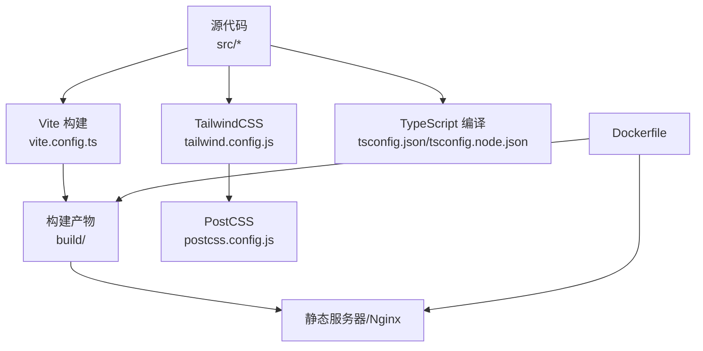
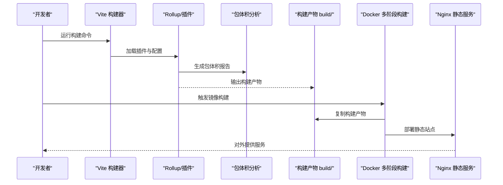
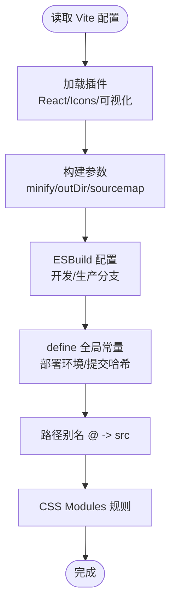
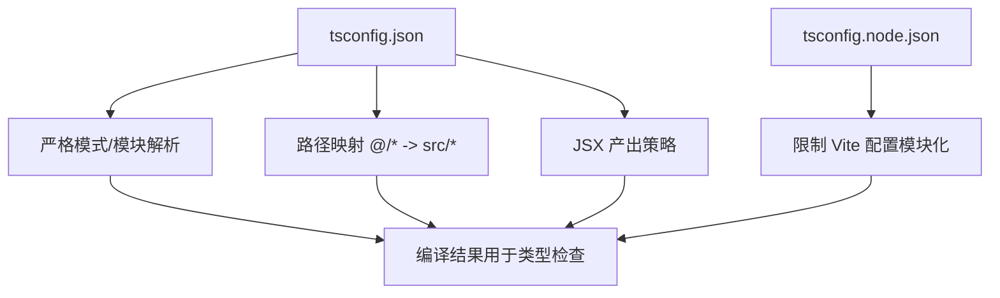
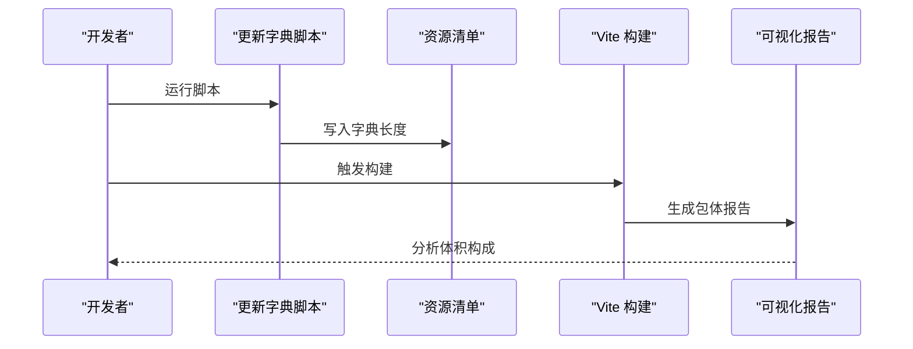
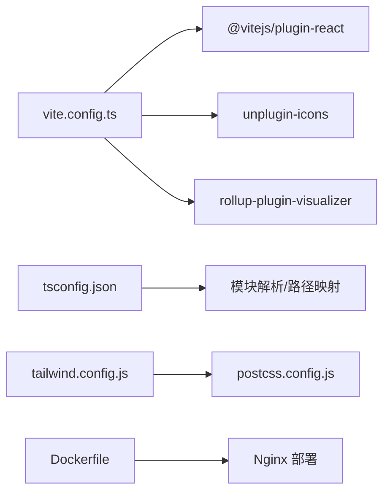

# 构建配置优化

<cite>
**本文引用的文件**
- [vite.config.ts](file://vite.config.ts)
- [package.json](file://package.json)
- [tsconfig.json](file://tsconfig.json)
- [tsconfig.node.json](file://tsconfig.node.json)
- [postcss.config.js](file://postcss.config.js)
- [tailwind.config.js](file://tailwind.config.js)
- [Dockerfile](file://Dockerfile)
- [docker-compose.yaml](file://docker-compose.yaml)
- [playwright.config.ts](file://playwright.config.ts)
- [src/index.tsx](file://src/index.tsx)
- [src/utils/db/data-export.ts](file://src/utils/db/data-export.ts)
- [scripts/update-dict-size.js](file://scripts/update-dict-size.js)
</cite>

## 目录

1. [引言](#引言)
2. [项目结构](#项目结构)
3. [核心组件](#核心组件)
4. [架构总览](#架构总览)
5. [详细组件分析](#详细组件分析)
6. [依赖关系分析](#依赖关系分析)
7. [性能考量](#性能考量)
8. [故障排查指南](#故障排查指南)
9. [结论](#结论)
10. [附录](#附录)

## 引言

本文件面向构建配置与性能优化，系统梳理 Vite 构建配置、TypeScript 编译设置、资源与包体积分析、缓存与 Tree Shaking、以及生产构建流程与质量检查标准。文档以仓库现有配置为依据，结合实际代码与脚本，给出可操作的优化建议与最佳实践。

## 项目结构

该项目采用 Vite 作为前端构建工具，配合 React 生态与 TailwindCSS 工具链。构建产物输出至 build 目录，并通过 Dockerfile 在容器中进行多阶段构建与部署。TypeScript 配置分别用于应用与 Vite 配置文件，PostCSS 与 TailwindCSS 提供样式处理。

图表来源

- [vite.config.ts](file://vite.config.ts#L1-L55)
- [tailwind.config.js](file://tailwind.config.js#L1-L78)
- [postcss.config.js](file://postcss.config.js#L1-L7)
- [tsconfig.json](file://tsconfig.json#L1-L41)
- [tsconfig.node.json](file://tsconfig.node.json#L1-L10)
- [Dockerfile](file://Dockerfile#L1-L15)

章节来源

- [vite.config.ts](file://vite.config.ts#L1-L55)
- [package.json](file://package.json#L1-L128)
- [tsconfig.json](file://tsconfig.json#L1-L41)
- [tsconfig.node.json](file://tsconfig.node.json#L1-L10)
- [postcss.config.js](file://postcss.config.js#L1-L7)
- [tailwind.config.js](file://tailwind.config.js#L1-L78)
- [Dockerfile](file://Dockerfile#L1-L15)

## 核心组件

- Vite 构建配置：插件体系（React、图标、可视化）、构建参数（最小化、输出目录、SourceMap）、ESBuild 调试符号剔除、全局常量注入、路径别名、CSS Modules 规范。
- TypeScript 编译配置：严格模式、模块系统、解析策略、JSX、类型声明、路径映射、CSS Modules 插件。
- 样式与工具链：TailwindCSS 内容扫描、PostCSS 插件链。
- 容器化与部署：多阶段 Docker 构建、Nginx 静态服务。
- 包体积分析与依赖优化：Rollup 可视化插件、按需加载与懒加载、字典大小预计算脚本。

章节来源

- [vite.config.ts](file://vite.config.ts#L1-L55)
- [tsconfig.json](file://tsconfig.json#L1-L41)
- [tsconfig.node.json](file://tsconfig.node.json#L1-L10)
- [tailwind.config.js](file://tailwind.config.js#L1-L78)
- [postcss.config.js](file://postcss.config.js#L1-L7)
- [Dockerfile](file://Dockerfile#L1-L15)

## 架构总览

下图展示从开发到生产的端到端构建与部署流程，涵盖 Vite 构建、包体积分析、容器化与静态服务。

图表来源

- [vite.config.ts](file://vite.config.ts#L1-L55)
- [Dockerfile](file://Dockerfile#L1-L15)

## 详细组件分析

### Vite 构建配置分析

- 插件与工具
  - React 插件：启用 Babel 插件以增强状态调试与刷新能力。
  - 图标插件：支持 JSX 编译与自定义 SVG 收集。
  - 包体积可视化：Rollup 插件可视化构建产物构成。
- 构建参数
  - 最小化开启、输出目录、关闭 SourceMap。
- ESBuild 优化
  - 开发环境保留 console/debugger；生产环境剔除。
- 全局常量
  - 注入部署环境标识与最近提交哈希。
- 路径别名与 CSS
  - 别名指向 src；CSS Modules 使用驼峰命名规范。

图表来源

- [vite.config.ts](file://vite.config.ts#L1-L55)

章节来源

- [vite.config.ts](file://vite.config.ts#L1-L55)

### TypeScript 编译配置最佳实践

- 严格性与模块系统
  - 启用严格模式、模块解析为 Node、JSX 使用 React JSX 产出。
- 类型与路径
  - 显式声明类型与 baseUrl/path 映射，便于跨文件引用。
- 编译时产物
  - 仅编译不输出 JS（noEmit），由 Vite/esbuild 处理打包与最小化。
- Vite 配置编译
  - tsconfig.node.json 限定 Vite 配置文件的模块与解析策略。

图表来源

- [tsconfig.json](file://tsconfig.json#L1-L41)
- [tsconfig.node.json](file://tsconfig.node.json#L1-L10)

章节来源

- [tsconfig.json](file://tsconfig.json#L1-L41)
- [tsconfig.node.json](file://tsconfig.node.json#L1-L10)

### 样式与工具链配置

- TailwindCSS
  - content 扫描范围覆盖 src 与根 HTML，确保按需生成样式。
  - 自定义主题、动画与屏幕断点，提升样式复用与一致性。
- PostCSS
  - 启用 TailwindCSS 与 Autoprefixer，自动补全与优化 CSS。

章节来源

- [tailwind.config.js](file://tailwind.config.js#L1-L78)
- [postcss.config.js](file://postcss.config.js#L1-L7)

### 容器化与部署

- 多阶段 Docker 构建
  - 第一阶段安装依赖并执行构建，第二阶段将构建产物复制到 Nginx 镜像。
- docker-compose
  - 提供本地快速启动与端口映射，便于联调与预览。

章节来源

- [Dockerfile](file://Dockerfile#L1-L15)
- [docker-compose.yaml](file://docker-compose.yaml#L1-L10)

### 包体积分析与依赖优化

- 包体积分析
  - 通过可视化插件生成包体构成报告，识别大体积模块与重复依赖。
- 依赖优化技巧
  - 按需加载与懒加载：路由级与页面级懒加载减少首屏体积。
  - 字典资源预计算：脚本扫描字典文件长度并写回资源清单，避免运行时计算开销。
  - 数据导出压缩：导入导出使用 gzip 压缩，降低传输与存储体积。

图表来源

- [scripts/update-dict-size.js](file://scripts/update-dict-size.js#L1-L23)
- [vite.config.ts](file://vite.config.ts#L1-L55)

章节来源

- [scripts/update-dict-size.js](file://scripts/update-dict-size.js#L1-L23)
- [src/utils/db/data-export.ts](file://src/utils/db/data-export.ts#L1-L68)
- [vite.config.ts](file://vite.config.ts#L1-L55)

### 构建性能监控与瓶颈分析

- 关键指标
  - 包体大小、分包体积、重复依赖、未使用模块。
- 方法
  - 使用可视化报告定位大模块与冗余依赖。
  - 结合浏览器性能面板与网络面板，验证缓存命中与资源加载时间。
  - 使用 Playwright 进行端到端回归测试，确保构建产物在真实环境可用。

章节来源

- [vite.config.ts](file://vite.config.ts#L1-L55)
- [playwright.config.ts](file://playwright.config.ts#L1-L79)

### 生产环境构建流程与质量检查

- 流程
  - 安装依赖 → 构建 → 生成包体报告 → 容器化 → 部署。
- 质量检查
  - 包体阈值告警、关键路由懒加载生效、无未使用 CSS、无 console/debugger。
  - E2E 回归测试通过，部署后进行功能与性能验收。

章节来源

- [package.json](file://package.json#L1-L128)
- [Dockerfile](file://Dockerfile#L1-L15)
- [playwright.config.ts](file://playwright.config.ts#L1-L79)

## 依赖关系分析

- 组件耦合
  - Vite 配置依赖 React 插件、图标插件与可视化插件；构建参数影响产物体积与调试成本。
  - TypeScript 配置影响类型检查与模块解析，间接影响打包阶段的 Tree Shaking 效果。
  - TailwindCSS 与 PostCSS 影响最终 CSS 体积与加载性能。
- 外部依赖
  - React 生态、Radix UI、图表库等第三方包体量较大，应结合可视化报告与懒加载策略控制体积。
- 潜在循环依赖
  - 当前结构以页面与组件为中心，未见明显循环依赖迹象。

图表来源

- [vite.config.ts](file://vite.config.ts#L1-L55)
- [tsconfig.json](file://tsconfig.json#L1-L41)
- [tailwind.config.js](file://tailwind.config.js#L1-L78)
- [postcss.config.js](file://postcss.config.js#L1-L7)
- [Dockerfile](file://Dockerfile#L1-L15)

章节来源

- [vite.config.ts](file://vite.config.ts#L1-L55)
- [tsconfig.json](file://tsconfig.json#L1-L41)
- [tailwind.config.js](file://tailwind.config.js#L1-L78)
- [postcss.config.js](file://postcss.config.js#L1-L7)
- [Dockerfile](file://Dockerfile#L1-L15)

## 性能考量

- 代码分割与懒加载
  - 页面级懒加载与路由懒加载可显著降低首屏体积与首次渲染时间。
- Tree Shaking
  - 保持模块化与 ESM 导出，避免副作用与命名冲突，提升摇树效果。
- 资源压缩与缓存
  - 生产环境开启最小化与禁用 SourceMap；静态资源交由 CDN 或 Nginx 缓存。
- 构建速度
  - 合理拆分包、减少不必要的全局样式、避免大型静态资源进入打包流程。

## 故障排查指南

- 构建失败或包体异常增大
  - 检查可视化报告，定位大模块与重复依赖；确认是否引入了未使用的第三方包。
- 路由跳转或资源路径错误
  - 确认基础路径与部署环境变量一致；检查路由懒加载与按需导入是否生效。
- 样式缺失或 Tailwind 未生效
  - 检查 Tailwind 内容扫描路径与 PostCSS 插件链；确认未被其他样式覆盖。
- 容器部署后页面空白
  - 确认构建产物已复制到 Nginx 默认站点目录；检查静态资源访问权限与 MIME 类型。

章节来源

- [vite.config.ts](file://vite.config.ts#L1-L55)
- [tailwind.config.js](file://tailwind.config.js#L1-L78)
- [postcss.config.js](file://postcss.config.js#L1-L7)
- [Dockerfile](file://Dockerfile#L1-L15)
- [src/index.tsx](file://src/index.tsx#L1-L79)

## 结论

本项目已具备完善的构建与部署基础设施：Vite 构建配置清晰、TypeScript 严格编译、TailwindCSS 工具链就绪、包体积可视化与容器化部署协同。建议持续利用可视化报告进行体积治理，结合懒加载与按需导入进一步优化首屏性能，并完善 E2E 质检流程以保障生产质量。

## 附录

- 常用命令
  - 开发：npm run dev
  - 构建：npm run build
  - 容器构建：docker-compose build
  - 容器启动：docker-compose up
  - E2E 测试：npm run test:e2e
- 关键配置要点
  - 生产环境最小化与禁用 SourceMap
  - ESBuild 在生产环境剔除 console/debugger
  - define 中注入部署环境与提交哈希
  - Tailwind 内容扫描覆盖 src 与根 HTML
  - TypeScript 严格模式与路径映射
