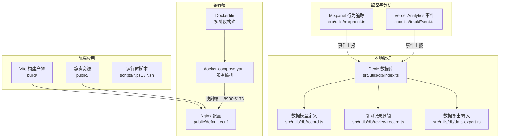
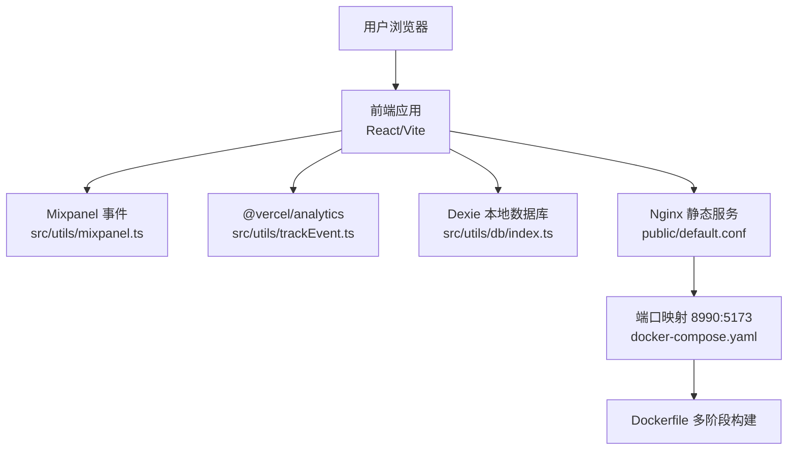
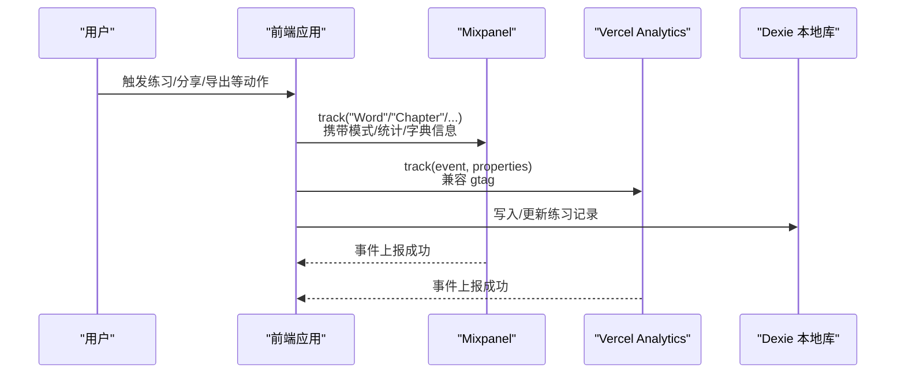
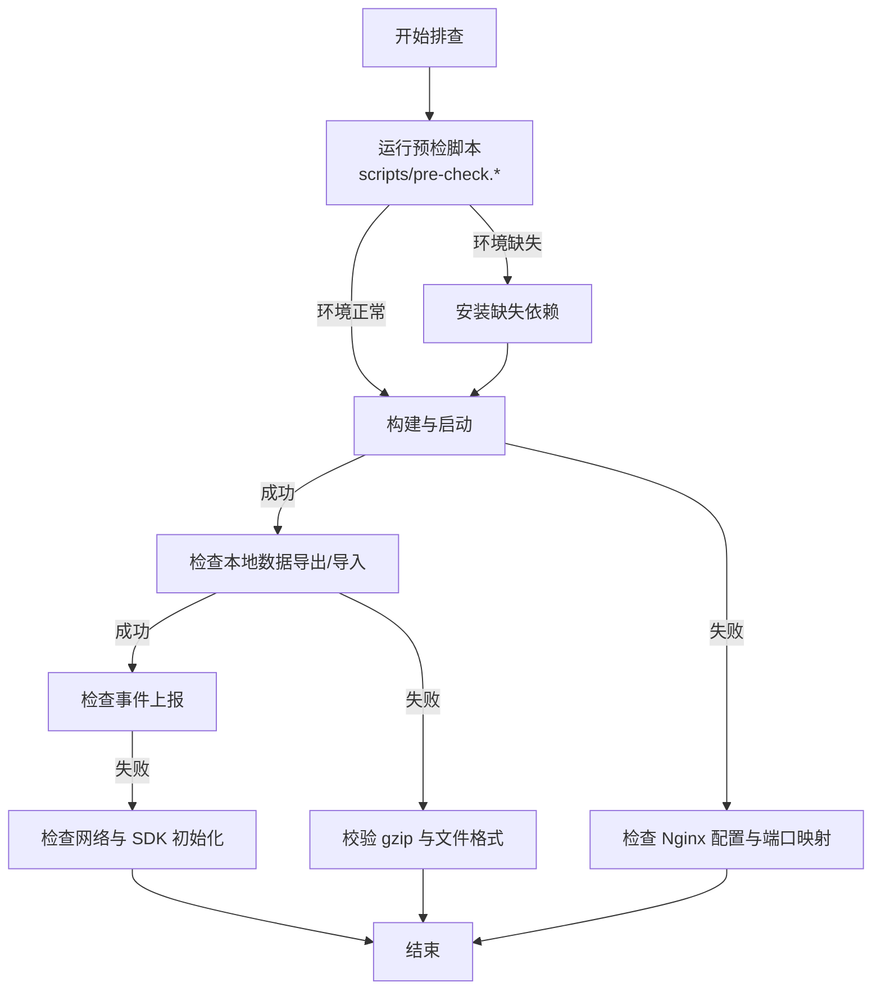
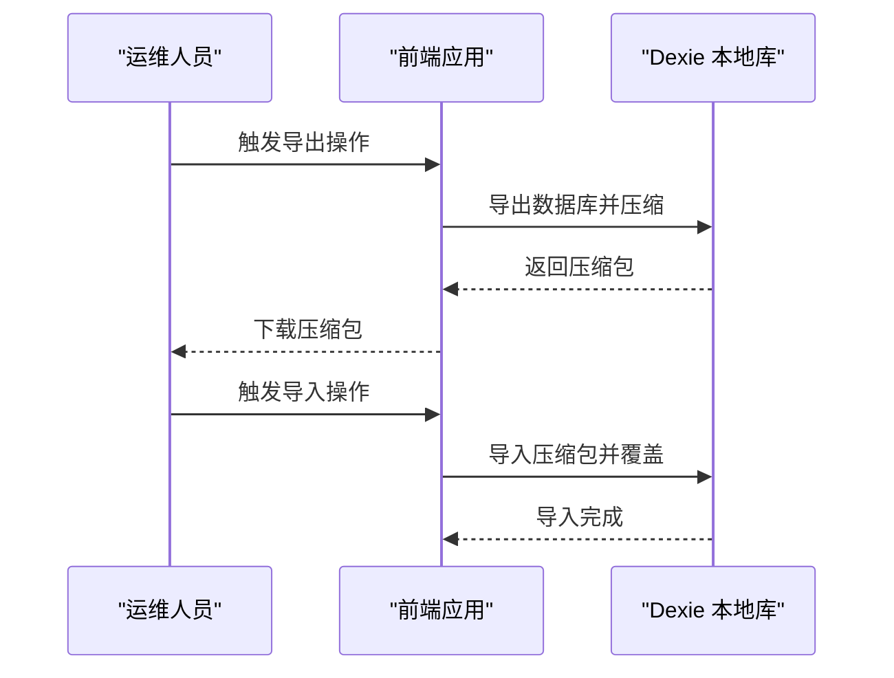
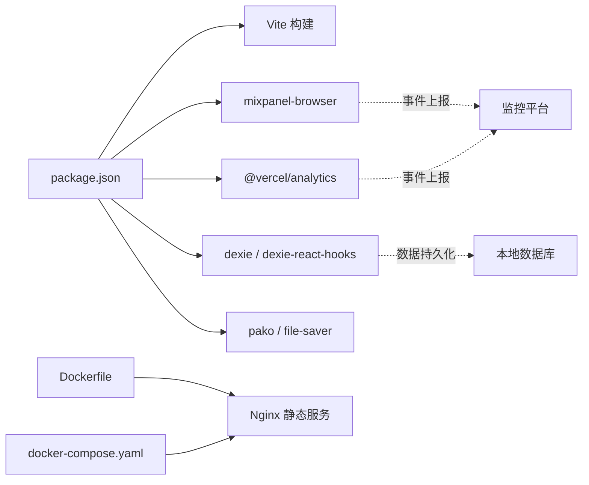

# 监控运维系统

<cite>
**本文引用的文件**
- [README.md](file://README.md)
- [package.json](file://package.json)
- [docker-compose.yaml](file://docker-compose.yaml)
- [Dockerfile](file://Dockerfile)
- [public/default.conf](file://public/default.conf)
- [scripts/install.ps1](file://scripts/install.ps1)
- [scripts/install.sh](file://scripts/install.sh)
- [scripts/pre-check.ps1](file://scripts/pre-check.ps1)
- [scripts/pre-check.sh](file://scripts/pre-check.sh)
- [scripts/update-dict-size.js](file://scripts/update-dict-size.js)
- [src/utils/mixpanel.ts](file://src/utils/mixpanel.ts)
- [src/utils/trackEvent.ts](file://src/utils/trackEvent.ts)
- [src/utils/db/index.ts](file://src/utils/db/index.ts)
- [src/utils/db/record.ts](file://src/utils/db/record.ts)
- [src/utils/db/review-record.ts](file://src/utils/db/review-record.ts)
- [src/utils/db/data-export.ts](file://src/utils/db/data-export.ts)
</cite>

## 目录

1. [简介](#简介)
2. [项目结构](#项目结构)
3. [核心组件](#核心组件)
4. [架构总览](#架构总览)
5. [详细组件分析](#详细组件分析)
6. [依赖关系分析](#依赖关系分析)
7. [性能考量](#性能考量)
8. [故障排查指南](#故障排查指南)
9. [结论](#结论)
10. [附录](#附录)

## 简介

本运维文档面向监控运维系统，围绕应用性能监控、用户行为追踪、性能指标采集、异常监控、日志管理、健康检查与告警、故障排查、数据备份与灾难恢复、运维自动化与批量操作等方面，结合本仓库现有能力进行系统化说明。当前项目具备如下与运维密切相关的基础设施：

- 前端埋点与分析：Mixpanel 行为事件上报、Vercel Analytics 事件跟踪。
- 本地数据持久化：IndexedDB/Dexie 数据库，用于记录用户练习行为、章节表现与复习进度。
- 构建与容器化：Vite 构建产物、Nginx 静态托管、Dockerfile 与 docker-compose 编排。
- 运维脚本：环境预检与一键安装脚本，便于快速部署与验证。

## 项目结构

该项目为前端应用，采用 React + Vite 构建，静态资源经 Nginx 提供服务；同时包含若干运维脚本与监控埋点工具模块。

图表来源

- [Dockerfile](file://Dockerfile#L1-L15)
- [docker-compose.yaml](file://docker-compose.yaml#L1-L10)
- [public/default.conf](file://public/default.conf#L1-L14)
- [src/utils/mixpanel.ts](file://src/utils/mixpanel.ts#L1-L227)
- [src/utils/trackEvent.ts](file://src/utils/trackEvent.ts#L1-L18)
- [src/utils/db/index.ts](file://src/utils/db/index.ts#L1-L136)
- [src/utils/db/record.ts](file://src/utils/db/record.ts#L1-L186)
- [src/utils/db/review-record.ts](file://src/utils/db/review-record.ts#L1-L69)
- [src/utils/db/data-export.ts](file://src/utils/db/data-export.ts#L1-L68)

章节来源

- [README.md](file://README.md#L133-L190)
- [package.json](file://package.json#L60-L69)
- [docker-compose.yaml](file://docker-compose.yaml#L1-L10)
- [Dockerfile](file://Dockerfile#L1-L15)
- [public/default.conf](file://public/default.conf#L1-L14)

## 核心组件

- 行为追踪与分析
  - Mixpanel 事件上报：覆盖单词与章节练习事件、分享、错误本、数据分析、数据导入导出等关键动作。
  - Vercel Analytics 事件封装：统一事件名与属性传递，兼容 gtag 环境。
- 本地数据持久化
  - Dexie 数据库：记录单词级与章节级练习数据，支持复习记录与导出导入。
  - 数据模型：定义字段与派生指标（如 WPM、准确率）。
- 容器化与静态托管
  - Dockerfile 多阶段构建，Nginx 提供静态资源服务，docker-compose 映射端口。
- 运维脚本
  - 环境预检与一键安装脚本，Windows/MacOS 分别提供 PowerShell 与 Bash 版本。
  - 字典大小更新脚本：扫描词库 JSON 文件并回填至字典清单。

章节来源

- [src/utils/mixpanel.ts](file://src/utils/mixpanel.ts#L1-L227)
- [src/utils/trackEvent.ts](file://src/utils/trackEvent.ts#L1-L18)
- [src/utils/db/index.ts](file://src/utils/db/index.ts#L1-L136)
- [src/utils/db/record.ts](file://src/utils/db/record.ts#L1-L186)
- [src/utils/db/review-record.ts](file://src/utils/db/review-record.ts#L1-L69)
- [src/utils/db/data-export.ts](file://src/utils/db/data-export.ts#L1-L68)
- [Dockerfile](file://Dockerfile#L1-L15)
- [docker-compose.yaml](file://docker-compose.yaml#L1-L10)
- [public/default.conf](file://public/default.conf#L1-L14)
- [scripts/install.ps1](file://scripts/install.ps1#L1-L39)
- [scripts/install.sh](file://scripts/install.sh#L1-L28)
- [scripts/pre-check.ps1](file://scripts/pre-check.ps1#L1-L63)
- [scripts/pre-check.sh](file://scripts/pre-check.sh#L1-L47)
- [scripts/update-dict-size.js](file://scripts/update-dict-size.js#L1-L23)

## 架构总览

下图展示了从用户交互到事件上报、数据落库、静态资源服务与容器编排的整体路径。

图表来源

- [src/utils/mixpanel.ts](file://src/utils/mixpanel.ts#L1-L227)
- [src/utils/trackEvent.ts](file://src/utils/trackEvent.ts#L1-L18)
- [src/utils/db/index.ts](file://src/utils/db/index.ts#L1-L136)
- [public/default.conf](file://public/default.conf#L1-L14)
- [docker-compose.yaml](file://docker-compose.yaml#L1-L10)
- [Dockerfile](file://Dockerfile#L1-L15)

## 详细组件分析

### 行为追踪与性能指标采集

- Mixpanel 事件
  - 单词事件：包含模式开关、章节号、词库名、输入统计、错误统计等维度。
  - 章节事件：包含时长、输入/正确/错误计数、模式开关等维度。
  - 其他事件：分享、错误本、数据分析、数据导入导出等。
- Vercel Analytics 事件
  - 统一封装 track 方法，兼容 gtag 环境，便于统一分析与对比。
- 性能指标
  - 章节记录提供 WPM 与准确率派生指标，可用于前端展示与后续分析。

图表来源

- [src/utils/mixpanel.ts](file://src/utils/mixpanel.ts#L1-L227)
- [src/utils/trackEvent.ts](file://src/utils/trackEvent.ts#L1-L18)
- [src/utils/db/index.ts](file://src/utils/db/index.ts#L1-L136)

章节来源

- [src/utils/mixpanel.ts](file://src/utils/mixpanel.ts#L1-L227)
- [src/utils/trackEvent.ts](file://src/utils/trackEvent.ts#L1-L18)
- [src/utils/db/record.ts](file://src/utils/db/record.ts#L105-L116)

### 日志管理与分析

- 本地日志
  - 前端控制台日志：事件上报失败时的错误捕获与打印，便于定位问题。
  - 数据库操作异常：写入/删除失败时的错误输出。
- 远程日志
  - 项目未内置远程日志收集组件，建议结合 Mixpanel 与 Vercel Analytics 的事件聚合进行离线分析；若需线上日志，可引入远程日志 SDK 并在事件上报失败时重试或降级记录。

章节来源

- [src/utils/db/index.ts](file://src/utils/db/index.ts#L109-L112)
- [src/utils/trackEvent.ts](file://src/utils/trackEvent.ts#L13-L16)

### 健康检查与告警

- 健康检查
  - Nginx 配置包含标准错误页映射，便于快速定位 5xx 类问题。
  - docker-compose 将容器端口映射到主机，便于外部探测。
- 告警机制
  - 项目未内置告警规则；建议在容器编排层增加健康检查探针与外部监控平台集成（如 Prometheus/Grafana/PagerDuty），并结合 Mixpanel 事件趋势设置阈值告警。

章节来源

- [public/default.conf](file://public/default.conf#L9-L13)
- [docker-compose.yaml](file://docker-compose.yaml#L1-L10)

### 故障排查流程

- 环境问题
  - 使用预检脚本检查 Node/Git/Yarn 是否安装，缺失时按脚本提示安装。
- 构建与启动
  - 若本地启动失败，检查 Vite 构建输出目录与 Nginx 配置是否一致。
  - 容器启动后确认端口映射与静态资源路径。
- 数据问题
  - 导出/导入失败时，检查 gzip 解压与文件格式；导出完成后记录大小与条目数，便于核对。
- 事件上报
  - 若事件未到达分析平台，检查网络与 SDK 初始化状态；必要时在控制台查看错误堆栈。

图表来源

- [scripts/pre-check.ps1](file://scripts/pre-check.ps1#L1-L63)
- [scripts/pre-check.sh](file://scripts/pre-check.sh#L1-L47)
- [Dockerfile](file://Dockerfile#L1-L15)
- [docker-compose.yaml](file://docker-compose.yaml#L1-L10)
- [public/default.conf](file://public/default.conf#L1-L14)
- [src/utils/db/data-export.ts](file://src/utils/db/data-export.ts#L1-L68)

章节来源

- [scripts/pre-check.ps1](file://scripts/pre-check.ps1#L1-L63)
- [scripts/pre-check.sh](file://scripts/pre-check.sh#L1-L47)
- [src/utils/db/data-export.ts](file://src/utils/db/data-export.ts#L1-L68)

### 数据备份策略与灾难恢复

- 本地备份
  - 使用数据导出接口导出压缩包，记录导出大小与条目数，便于核对与恢复。
- 恢复流程
  - 通过数据导入接口选择压缩包进行恢复，导入过程支持进度回调与覆盖策略。
- 建议
  - 定期执行导出任务，保留多份历史快照；在升级或迁移前先做备份。
  - 结合容器卷与外部存储实现异地备份。

图表来源

- [src/utils/db/data-export.ts](file://src/utils/db/data-export.ts#L1-L68)
- [src/utils/db/index.ts](file://src/utils/db/index.ts#L1-L136)

章节来源

- [src/utils/db/data-export.ts](file://src/utils/db/data-export.ts#L1-L68)

### 运维自动化与批量操作

- 环境预检与一键安装
  - Windows：PowerShell 脚本自动检测并安装 Node/Git/Yarn，随后安装依赖并启动。
  - macOS：Bash 脚本自动检测并安装 Node/Git/Yarn，随后安装依赖并启动。
- 字典大小更新
  - 自动扫描词库目录，解析 JSON 长度并回填至字典清单文件，减少手工维护成本。

章节来源

- [scripts/install.ps1](file://scripts/install.ps1#L1-L39)
- [scripts/install.sh](file://scripts/install.sh#L1-L28)
- [scripts/pre-check.ps1](file://scripts/pre-check.ps1#L1-L63)
- [scripts/pre-check.sh](file://scripts/pre-check.sh#L1-L47)
- [scripts/update-dict-size.js](file://scripts/update-dict-size.js#L1-L23)

## 依赖关系分析

- 构建与运行
  - 依赖 Node.js、Yarn、Vite；构建脚本与浏览器列表在 package.json 中定义。
- 容器化
  - Dockerfile 使用多阶段构建，先安装依赖并构建，再将构建产物拷贝至 Nginx 容器。
  - docker-compose 将容器 5173 端口映射到宿主 8990。
- 监控与分析
  - mixpanel-browser 与 @vercel/analytics 作为运行时依赖，分别用于行为追踪与事件分析。
- 本地数据
  - dexie 与 dexie-react-hooks 用于 IndexedDB 封装；pako 与 file-saver 用于导出压缩与保存。

图表来源

- [package.json](file://package.json#L1-L59)
- [Dockerfile](file://Dockerfile#L1-L15)
- [docker-compose.yaml](file://docker-compose.yaml#L1-L10)

章节来源

- [package.json](file://package.json#L1-L59)
- [Dockerfile](file://Dockerfile#L1-L15)
- [docker-compose.yaml](file://docker-compose.yaml#L1-L10)

## 性能考量

- 构建与体积
  - 使用 source-map-explorer 与 rollup-plugin-visualizer 等工具进行体积分析与可视化，有助于定位大体积模块与依赖。
- 事件上报
  - 将高频事件合并上报或限流，避免阻塞主线程；对网络异常进行重试与降级处理。
- 数据库写入
  - 批量写入时注意事务与索引优化；导出/导入过程使用进度回调，避免长时间阻塞 UI。

章节来源

- [package.json](file://package.json#L60-L69)

## 故障排查指南

- 环境缺失
  - 使用预检脚本自动安装 Node/Git/Yarn；若系统商店不可用，按脚本提示手动安装。
- 构建失败
  - 检查构建脚本与输出目录配置；确认 Nginx 配置指向正确静态目录。
- 容器访问异常
  - 核对 docker-compose 端口映射与防火墙设置；确认 Nginx 配置监听端口。
- 数据导出/导入异常
  - 校验压缩包格式与解压结果；查看导出/导入进度回调返回值。
- 事件上报失败
  - 检查网络连通性与 SDK 初始化；在控制台查看错误堆栈并记录。

章节来源

- [scripts/pre-check.ps1](file://scripts/pre-check.ps1#L1-L63)
- [scripts/pre-check.sh](file://scripts/pre-check.sh#L1-L47)
- [public/default.conf](file://public/default.conf#L1-L14)
- [docker-compose.yaml](file://docker-compose.yaml#L1-L10)
- [src/utils/db/data-export.ts](file://src/utils/db/data-export.ts#L1-L68)
- [src/utils/trackEvent.ts](file://src/utils/trackEvent.ts#L13-L16)

## 结论

本项目已具备完善的前端监控埋点、本地数据持久化与容器化部署能力。建议在此基础上补充：

- 远程日志与告警集成；
- 健康检查探针与外部监控平台对接；
- 数据备份与灾难恢复演练；
- 事件上报的重试与降级策略；
- 定期的体积分析与依赖优化。

## 附录

- 快速部署与访问
  - 在线访问与镜像仓库见项目说明；Vercel 一键部署按钮与输出目录配置见说明文档。
- 构建与运行
  - 使用 Vite dev/start/build 脚本；构建产物路径与基础路径在脚本中定义。
- 容器化
  - Dockerfile 多阶段构建；docker-compose 映射端口 8990:5173；Nginx 配置监听 5173 端口。

章节来源

- [README.md](file://README.md#L33-L63)
- [package.json](file://package.json#L60-L69)
- [docker-compose.yaml](file://docker-compose.yaml#L1-L10)
- [Dockerfile](file://Dockerfile#L1-L15)
- [public/default.conf](file://public/default.conf#L1-L14)
