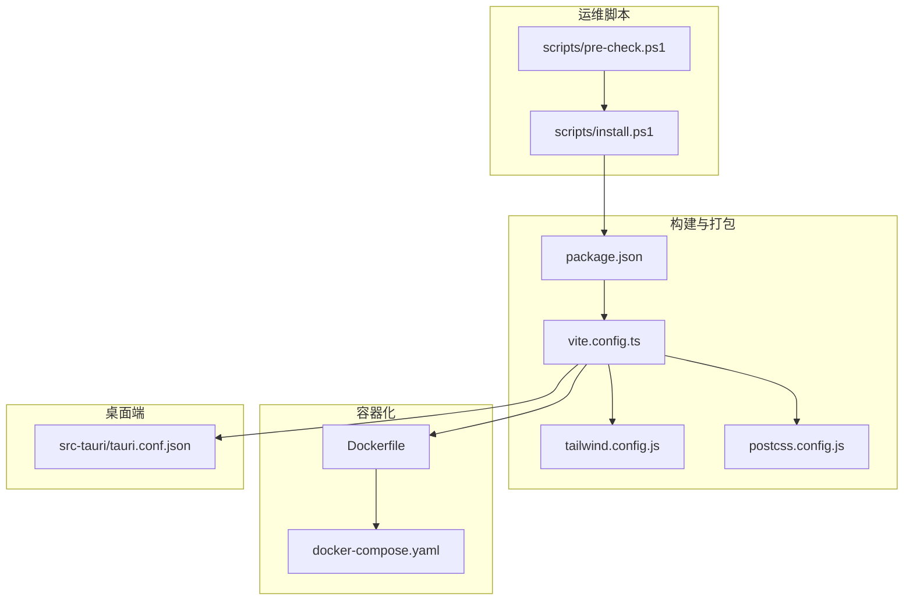
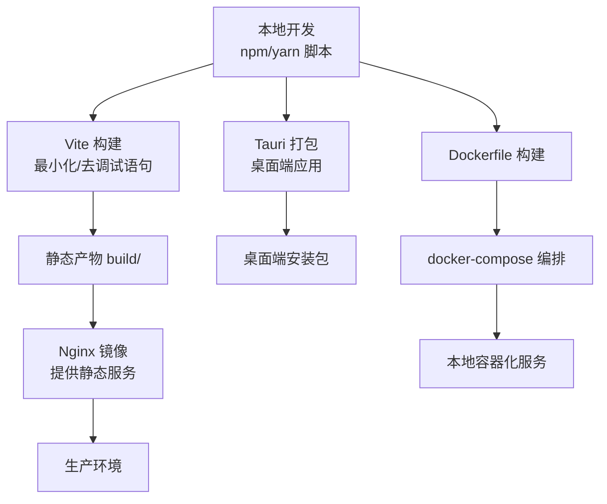
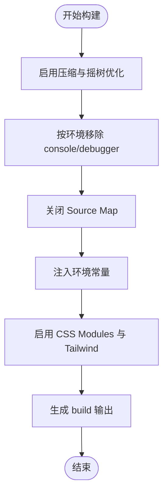
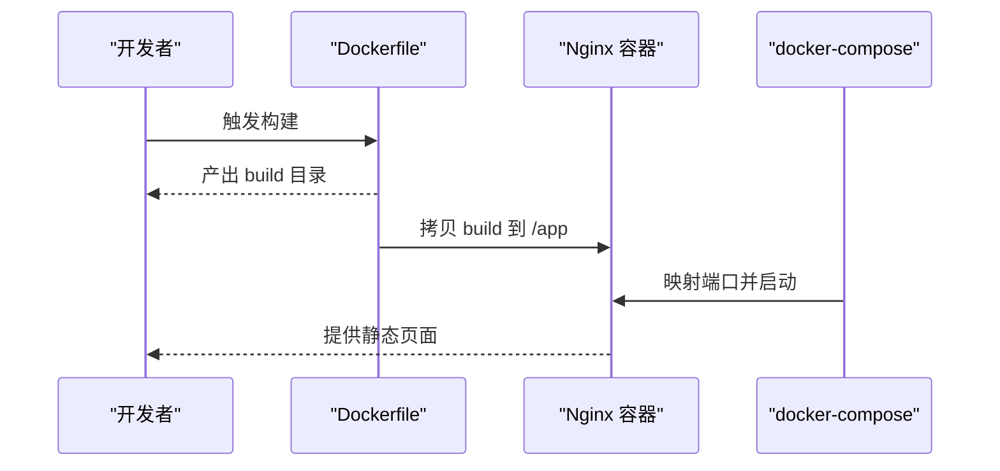
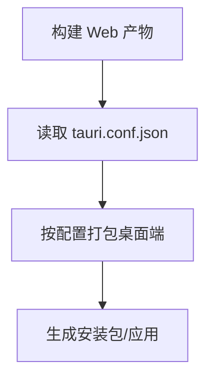
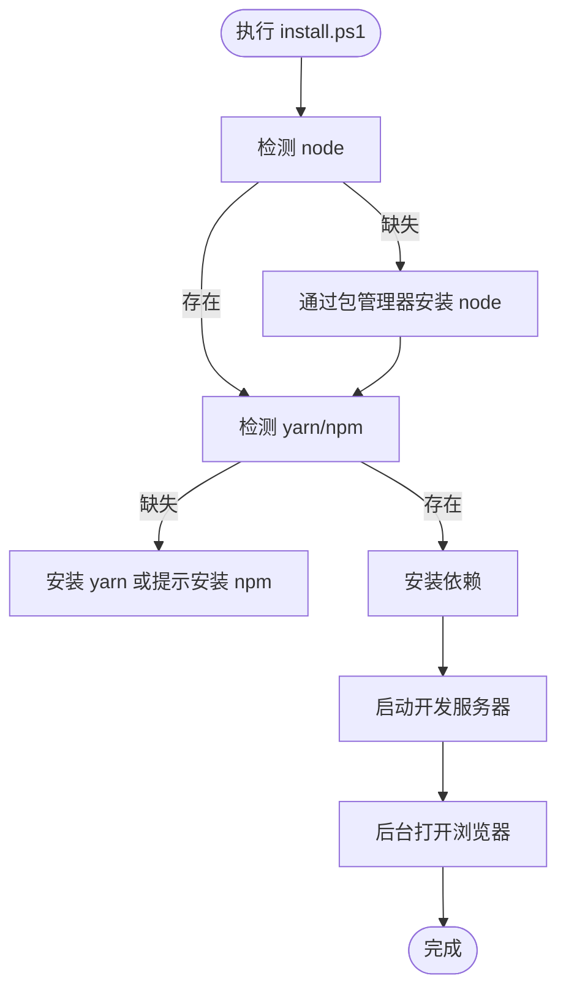
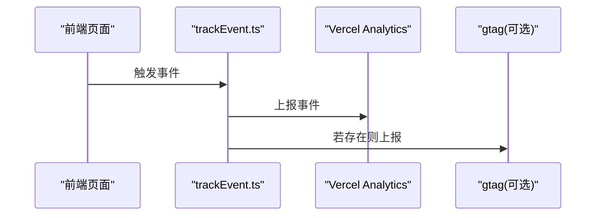
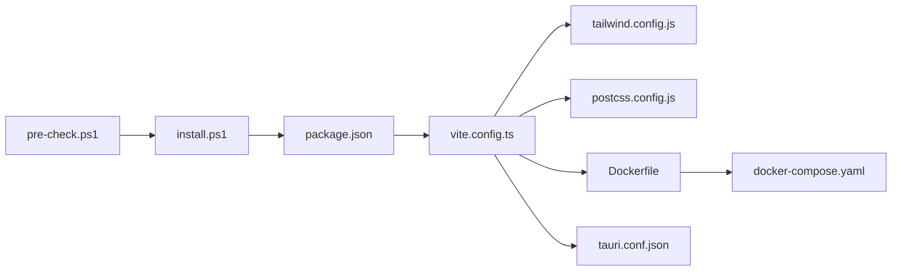

# 部署与运维

<cite>
**本文引用的文件**
- [package.json](file://package.json)
- [vite.config.ts](file://vite.config.ts)
- [Dockerfile](file://Dockerfile)
- [docker-compose.yaml](file://docker-compose.yaml)
- [tailwind.config.js](file://tailwind.config.js)
- [postcss.config.js](file://postcss.config.js)
- [src-tauri/tauri.conf.json](file://src-tauri/tauri.conf.json)
- [src/vite-env.d.ts](file://src/vite-env.d.ts)
- [src/utils/trackEvent.ts](file://src/utils/trackEvent.ts)
- [scripts/install.ps1](file://scripts/install.ps1)
- [scripts/pre-check.ps1](file://scripts/pre-check.ps1)
- [docs/README_JP.md](file://docs/README_JP.md)
</cite>

## 目录

1. [简介](#简介)
2. [项目结构](#项目结构)
3. [核心组件](#核心组件)
4. [架构总览](#架构总览)
5. [详细组件分析](#详细组件分析)
6. [依赖分析](#依赖分析)
7. [性能考虑](#性能考虑)
8. [故障排查指南](#故障排查指南)
9. [结论](#结论)
10. [附录](#附录)

## 简介

本操作文档面向部署与运维团队，围绕构建配置优化、多部署方案（Vercel、Docker 容器化、传统服务器）、CI/CD 流水线、监控与日志、性能分析、故障排查、备份恢复与安全防护等方面，提供系统化的实施步骤与最佳实践。文档同时结合仓库现有配置文件，给出可落地的执行要点与可视化图示。

## 项目结构

该项目为基于 Vite 的前端应用，采用 React 技术栈，并通过 Tauri 打包为桌面端应用；同时提供 Docker 化部署与本地开发脚本支持。关键目录与文件如下：

- 构建与打包：Vite 配置、TailwindCSS、PostCSS
- 容器化：Dockerfile、docker-compose
- 桌面端：Tauri 配置
- 运维脚本：Windows/Mac 安装与预检查脚本
- 分析与埋点：Vercel Analytics 使用

图表来源

- [vite.config.ts](file://vite.config.ts#L1-L55)
- [tailwind.config.js](file://tailwind.config.js#L1-L78)
- [postcss.config.js](file://postcss.config.js#L1-L7)
- [package.json](file://package.json#L1-L128)
- [Dockerfile](file://Dockerfile#L1-L15)
- [docker-compose.yaml](file://docker-compose.yaml#L1-L10)
- [src-tauri/tauri.conf.json](file://src-tauri/tauri.conf.json#L1-L60)
- [scripts/install.ps1](file://scripts/install.ps1#L1-L38)
- [scripts/pre-check.ps1](file://scripts/pre-check.ps1#L31-L63)

章节来源

- [package.json](file://package.json#L1-L128)
- [vite.config.ts](file://vite.config.ts#L1-L55)
- [Dockerfile](file://Dockerfile#L1-L15)
- [docker-compose.yaml](file://docker-compose.yaml#L1-L10)
- [tailwind.config.js](file://tailwind.config.js#L1-L78)
- [postcss.config.js](file://postcss.config.js#L1-L7)
- [src-tauri/tauri.conf.json](file://src-tauri/tauri.conf.json#L1-L60)
- [scripts/install.ps1](file://scripts/install.ps1#L1-L38)
- [scripts/pre-check.ps1](file://scripts/pre-check.ps1#L31-L63)

## 核心组件

- 构建与打包配置
  - Vite：启用压缩、关闭 Source Map、按需移除调试语句、注入环境常量、别名与 CSS Modules 等
  - TailwindCSS：自定义主题、动画、尺寸与断点，提升样式一致性与可维护性
  - PostCSS：集成 Tailwind 与 Autoprefixer，确保跨浏览器兼容
- 容器化
  - 多阶段构建：Node 基础镜像构建，Nginx 发布静态资源
  - docker-compose：本地快速编排与端口映射
- 桌面端
  - Tauri：配置产物名称、版本、打包目标、窗口参数与安全策略
- 运维脚本
  - Windows：自动检测并安装 Node/Yarn，一键安装依赖并启动
  - 预检查：检测 Git、Yarn/NPM 等前置条件
- 分析与埋点
  - Vercel Analytics：事件追踪与兼容 gtag

章节来源

- [vite.config.ts](file://vite.config.ts#L1-L55)
- [tailwind.config.js](file://tailwind.config.js#L1-L78)
- [postcss.config.js](file://postcss.config.js#L1-L7)
- [Dockerfile](file://Dockerfile#L1-L15)
- [docker-compose.yaml](file://docker-compose.yaml#L1-L10)
- [src-tauri/tauri.conf.json](file://src-tauri/tauri.conf.json#L1-L60)
- [scripts/install.ps1](file://scripts/install.ps1#L1-L38)
- [scripts/pre-check.ps1](file://scripts/pre-check.ps1#L31-L63)
- [src/utils/trackEvent.ts](file://src/utils/trackEvent.ts#L1-L17)

## 架构总览

下图展示从代码到运行时的整体路径：本地开发 → 构建 → 容器化发布 → 桌面端打包 → 运维脚本辅助部署。

图表来源

- [vite.config.ts](file://vite.config.ts#L1-L55)
- [Dockerfile](file://Dockerfile#L1-L15)
- [docker-compose.yaml](file://docker-compose.yaml#L1-L10)
- [src-tauri/tauri.conf.json](file://src-tauri/tauri.conf.json#L1-L60)

## 详细组件分析

### 构建配置优化（打包、压缩、缓存）

- 打包与最小化
  - 启用压缩与去除调试语句，减少体积与运行时开销
  - 关闭 Source Map，降低泄露风险与构建时间
- 资源与缓存策略
  - 使用 Vite 默认输出目录与基础路径，便于静态托管
  - 结合 Nginx 配置实现强缓存与 ETag/Last-Modified
- CSS 与模块化
  - Tailwind 主题与动画扩展，统一设计语言
  - CSS Modules camelCaseOnly，避免命名冲突
- 环境变量注入
  - 注入部署环境与最新提交哈希，便于问题定位与版本追踪

图表来源

- [vite.config.ts](file://vite.config.ts#L1-L55)
- [tailwind.config.js](file://tailwind.config.js#L1-L78)

章节来源

- [vite.config.ts](file://vite.config.ts#L1-L55)
- [tailwind.config.js](file://tailwind.config.js#L1-L78)
- [postcss.config.js](file://postcss.config.js#L1-L7)
- [src/vite-env.d.ts](file://src/vite-env.d.ts#L1-L3)

### 容器化部署（Docker）

- 多阶段构建
  - 第一阶段：Node 基础镜像安装依赖并构建
  - 第二阶段：Nginx 镜像拷贝构建产物，提供静态服务
- 本地编排
  - docker-compose 将容器内端口映射至宿主机，便于本地联调
- 生产建议
  - 在生产环境使用独立 Nginx 配置文件，开启 gzip/HTTP/HTTPS、缓存头与安全头
  - 使用只读根文件系统与最小权限运行

图表来源

- [Dockerfile](file://Dockerfile#L1-L15)
- [docker-compose.yaml](file://docker-compose.yaml#L1-L10)

章节来源

- [Dockerfile](file://Dockerfile#L1-L15)
- [docker-compose.yaml](file://docker-compose.yaml#L1-L10)

### 桌面端打包（Tauri）

- 配置要点
  - 产物名称与版本、开发路径与构建输出目录
  - 打包目标、图标、标识符、窗口尺寸与安全策略
  - 可选更新器与签名配置
- 实施流程
  - 在本地或 CI 中先执行构建，再由 Tauri 打包为多平台安装包

图表来源

- [src-tauri/tauri.conf.json](file://src-tauri/tauri.conf.json#L1-L60)

章节来源

- [src-tauri/tauri.conf.json](file://src-tauri/tauri.conf.json#L1-L60)

### 运维脚本（Windows）

- 自动化安装
  - 检测 Node/Yarn/Git，若缺失则通过包管理器安装
  - 安装依赖后启动开发服务器，并在后台打开浏览器
- 预检查
  - 对 Git 与 Yarn/NPM 进行存在性校验，提示用户处理缺失项

图表来源

- [scripts/install.ps1](file://scripts/install.ps1#L1-L38)
- [scripts/pre-check.ps1](file://scripts/pre-check.ps1#L31-L63)

章节来源

- [scripts/install.ps1](file://scripts/install.ps1#L1-L38)
- [scripts/pre-check.ps1](file://scripts/pre-check.ps1#L31-L63)
- [docs/README_JP.md](file://docs/README_JP.md#L140-L165)

### 监控与日志（分析埋点）

- 事件追踪
  - 使用 Vercel Analytics 进行前端事件上报
  - 兼容 gtag，便于接入 Google Analytics
- 日志管理
  - 生产环境关闭 Source Map，避免敏感信息泄露
  - 建议在 Nginx 层统一收集访问日志，结合 ELK/日志服务进行分析

图表来源

- [src/utils/trackEvent.ts](file://src/utils/trackEvent.ts#L1-L17)

章节来源

- [src/utils/trackEvent.ts](file://src/utils/trackEvent.ts#L1-L17)
- [vite.config.ts](file://vite.config.ts#L1-L55)

### CI/CD 流水线（通用思路）

- 触发条件
  - 推送主分支、标签或 Pull Request 合并
- 步骤建议
  - 依赖安装（使用缓存策略）
  - 单元测试与 E2E 测试
  - 构建与产物分析（Bundle 分析、体积阈值）
  - 容器镜像构建与推送
  - 部署到目标环境（Vercel/Docker/传统服务器）
  - 回滚策略（版本标记与回滚脚本）
- 安全与密钥
  - 使用受保护变量存储令牌与证书
  - 限制部署权限与网络访问

[本节为通用流程说明，不直接分析具体文件，故无“章节来源”]

### 部署方案实施流程

#### Vercel 部署（概念说明）

- 适用场景：静态站点托管、快速上线与全球分发
- 关键点：基础路径、环境变量、构建命令与输出目录
- 建议：开启缓存、压缩与 HTTPS；配置域名与重定向规则

[本节为概念说明，不直接分析具体文件，故无“章节来源”]

#### Docker 容器化部署

- 本地验证
  - 使用 docker-compose 启动，确认端口映射与页面可用
- 生产部署
  - 构建镜像并推送至私有/公有仓库
  - 在目标服务器拉取镜像并启动，配置 Nginx 反向代理与 TLS
  - 使用健康检查与日志采集

章节来源

- [Dockerfile](file://Dockerfile#L1-L15)
- [docker-compose.yaml](file://docker-compose.yaml#L1-L10)

#### 传统服务器部署

- 前置条件：Nginx/Apache、Node（可选）、防火墙放行
- 步骤
  - 上传构建产物至站点目录
  - 配置虚拟主机、缓存头、安全头与压缩
  - 配置定时任务或 systemd 管理进程（如需要）
- 建议：使用只读文件系统、非 root 用户运行、定期备份

[本节为通用流程说明，不直接分析具体文件，故无“章节来源”]

## 依赖分析

- 构建链路
  - package.json 定义脚本与依赖；vite.config.ts 控制构建行为；Tailwind/PostCSS 提升样式质量
- 容器链路
  - Dockerfile 串联安装与构建；docker-compose 提供本地编排
- 桌面端链路
  - tauri.conf.json 指定构建输出与打包参数
- 运维链路
  - install.ps1 与 pre-check.ps1 保障本地环境一致性

图表来源

- [package.json](file://package.json#L1-L128)
- [vite.config.ts](file://vite.config.ts#L1-L55)
- [tailwind.config.js](file://tailwind.config.js#L1-L78)
- [postcss.config.js](file://postcss.config.js#L1-L7)
- [Dockerfile](file://Dockerfile#L1-L15)
- [docker-compose.yaml](file://docker-compose.yaml#L1-L10)
- [src-tauri/tauri.conf.json](file://src-tauri/tauri.conf.json#L1-L60)
- [scripts/install.ps1](file://scripts/install.ps1#L1-L38)
- [scripts/pre-check.ps1](file://scripts/pre-check.ps1#L31-L63)

章节来源

- [package.json](file://package.json#L1-L128)
- [vite.config.ts](file://vite.config.ts#L1-L55)
- [tailwind.config.js](file://tailwind.config.js#L1-L78)
- [postcss.config.js](file://postcss.config.js#L1-L7)
- [Dockerfile](file://Dockerfile#L1-L15)
- [docker-compose.yaml](file://docker-compose.yaml#L1-L10)
- [src-tauri/tauri.conf.json](file://src-tauri/tauri.conf.json#L1-L60)
- [scripts/install.ps1](file://scripts/install.ps1#L1-L38)
- [scripts/pre-check.ps1](file://scripts/pre-check.ps1#L31-L63)

## 性能考虑

- 构建期优化
  - 启用压缩与移除调试语句，减小传输体积
  - 关闭 Source Map，避免泄露与额外体积
  - 使用别名与模块化，减少重复打包
- 运行期优化
  - Nginx 开启 gzip/br 与缓存头，缩短首屏时间
  - 合理拆分路由与懒加载，降低初始包体
- 监控与分析
  - 使用 Bundle 分析工具识别体积热点
  - 借助 Vercel Analytics 评估用户行为与关键指标

[本节提供通用指导，不直接分析具体文件，故无“章节来源”]

## 故障排查指南

- 构建失败
  - 检查 Node 版本与依赖安装是否成功
  - 确认 Vite 配置中别名与插件无误
- 容器启动异常
  - 查看镜像构建日志与容器启动日志
  - 核对端口占用与挂载路径
- 桌面端无法运行
  - 确认 tauri.conf.json 中 distDir 与 devPath 配置正确
  - 检查打包产物是否存在
- 本地脚本问题
  - 使用 pre-check.ps1 检测前置依赖
  - install.ps1 自动化安装后仍失败，查看包管理器日志

章节来源

- [scripts/pre-check.ps1](file://scripts/pre-check.ps1#L31-L63)
- [scripts/install.ps1](file://scripts/install.ps1#L1-L38)
- [src-tauri/tauri.conf.json](file://src-tauri/tauri.conf.json#L1-L60)
- [vite.config.ts](file://vite.config.ts#L1-L55)

## 结论

本项目具备完善的构建与容器化能力，配合 Tauri 可快速交付桌面端应用。通过合理配置 Nginx 缓存与安全头、使用分析埋点与日志采集、建立 CI/CD 流水线与回滚机制，可实现稳定高效的生产级部署与运维。

[本节为总结性内容，不直接分析具体文件，故无“章节来源”]

## 附录

### A. 关键配置清单

- 构建与打包
  - Vite：最小化、去调试语句、关闭 Source Map、注入环境常量
  - Tailwind：主题、动画、断点与插件
  - PostCSS：Tailwind 与 Autoprefixer
- 容器化
  - Dockerfile：多阶段构建与 Nginx 发布
  - docker-compose：本地端口映射
- 桌面端
  - tauri.conf.json：产物、打包与窗口配置
- 运维脚本
  - install.ps1：自动安装与启动
  - pre-check.ps1：前置依赖检测

章节来源

- [vite.config.ts](file://vite.config.ts#L1-L55)
- [tailwind.config.js](file://tailwind.config.js#L1-L78)
- [postcss.config.js](file://postcss.config.js#L1-L7)
- [Dockerfile](file://Dockerfile#L1-L15)
- [docker-compose.yaml](file://docker-compose.yaml#L1-L10)
- [src-tauri/tauri.conf.json](file://src-tauri/tauri.conf.json#L1-L60)
- [scripts/install.ps1](file://scripts/install.ps1#L1-L38)
- [scripts/pre-check.ps1](file://scripts/pre-check.ps1#L31-L63)
