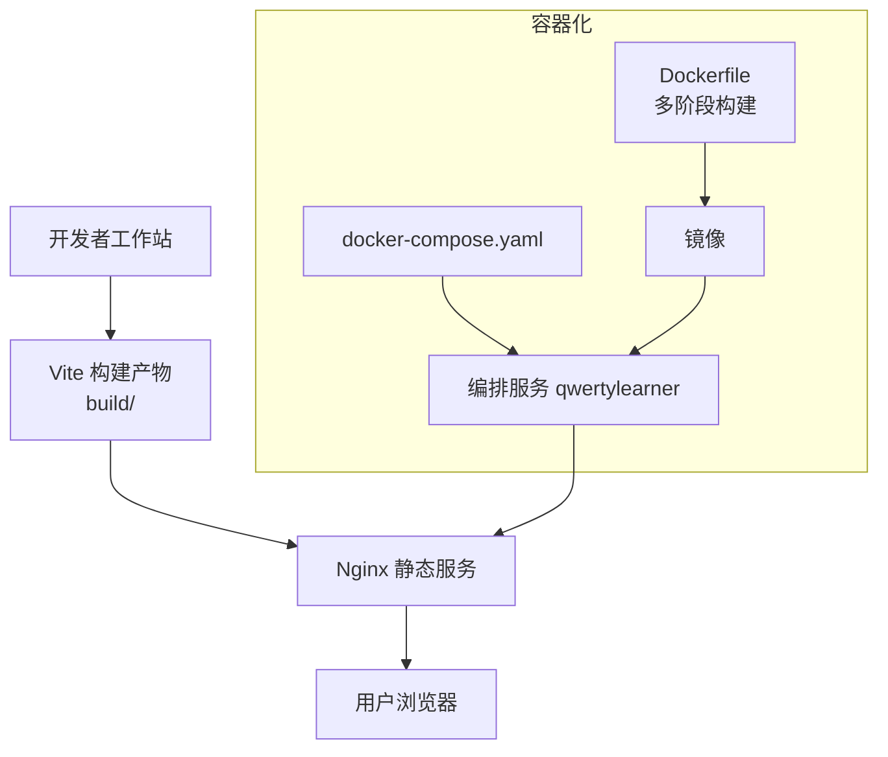
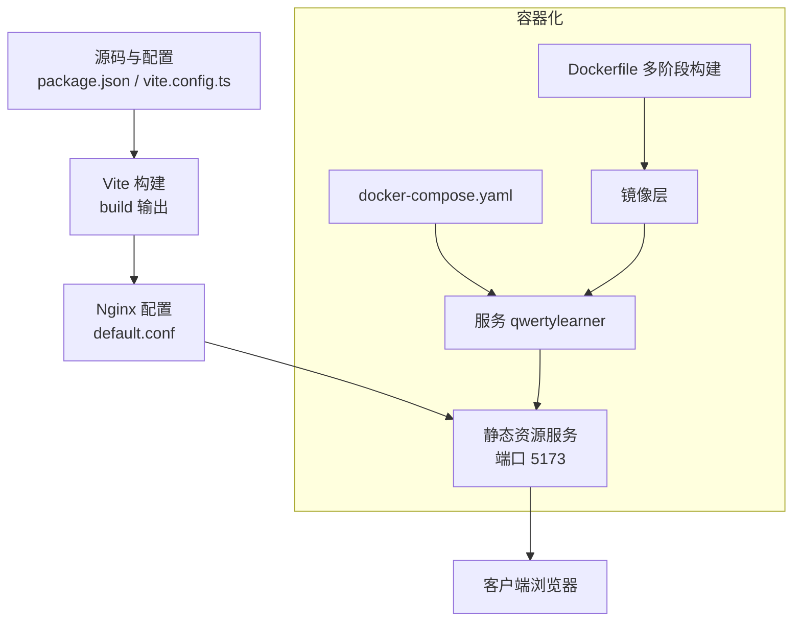
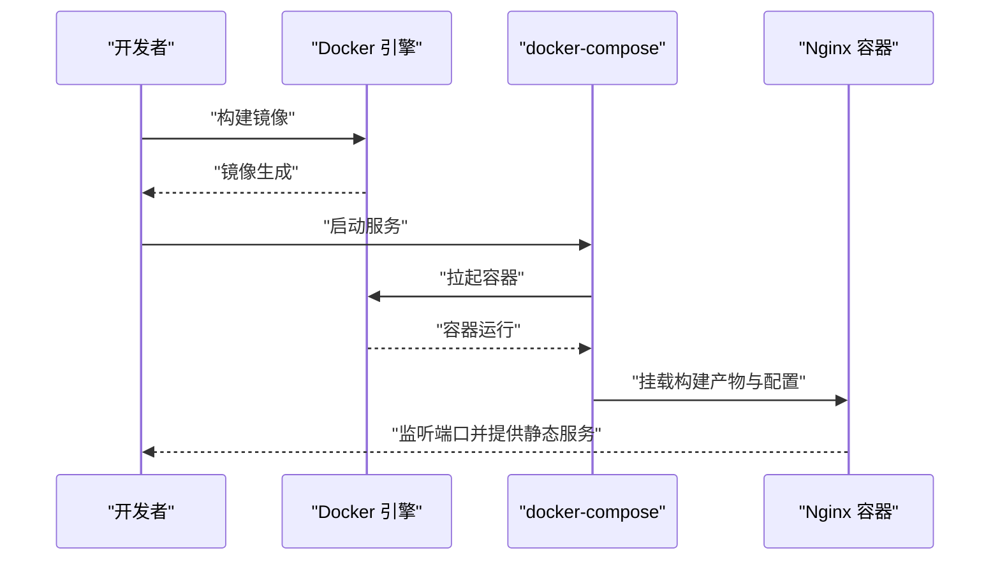
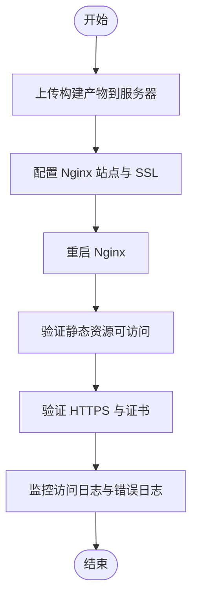
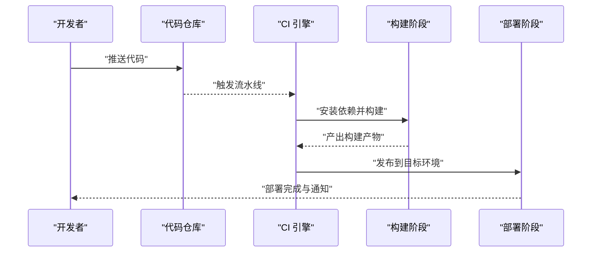
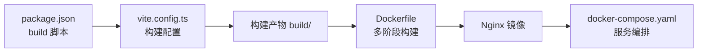

# 部署方案实施

<cite>
**本文引用的文件**
- [Dockerfile](file://Dockerfile)
- [docker-compose.yaml](file://docker-compose.yaml)
- [default.conf](file://public/default.conf)
- [package.json](file://package.json)
- [vite.config.ts](file://vite.config.ts)
- [install.sh](file://scripts/install.sh)
- [pre-check.sh](file://scripts/pre-check.sh)
- [install.ps1](file://scripts/install.ps1)
- [pre-check.ps1](file://scripts/pre-check.ps1)
</cite>

## 目录

1. [引言](#引言)
2. [项目结构](#项目结构)
3. [核心组件](#核心组件)
4. [架构总览](#架构总览)
5. [详细组件分析](#详细组件分析)
6. [依赖关系分析](#依赖关系分析)
7. [性能考虑](#性能考虑)
8. [故障排查指南](#故障排查指南)
9. [结论](#结论)
10. [附录](#附录)

## 引言

本指南面向多类部署场景，提供从开发机到容器化、云平台与传统服务器的完整实施路径，并覆盖 CI/CD 流水线与部署后验证。目标是帮助不同技术背景的读者快速、安全地交付应用。

## 项目结构

本项目采用前端单页应用（SPA）架构，使用 Vite 构建工具链，生产环境通过 Nginx 提供静态资源服务；同时提供 Dockerfile 与 docker-compose.yaml 支持容器化部署；并通过脚本辅助本地环境预检查与一键安装。

图表来源

- [Dockerfile](file://Dockerfile#L1-L15)
- [docker-compose.yaml](file://docker-compose.yaml#L1-L10)
- [default.conf](file://public/default.conf#L1-L14)
- [vite.config.ts](file://vite.config.ts#L31-L38)

章节来源

- [Dockerfile](file://Dockerfile#L1-L15)
- [docker-compose.yaml](file://docker-compose.yaml#L1-L10)
- [default.conf](file://public/default.conf#L1-L14)
- [vite.config.ts](file://vite.config.ts#L31-L38)

## 核心组件

- 构建与打包
  - 使用 Vite 进行开发与生产构建，生产构建关闭 sourcemap 并移除 console/debugger，提升安全性与体积。
  - 通过 package.json 的 build 脚本生成静态资源目录，供 Nginx 提供服务。
- 容器化
  - 多阶段 Dockerfile：第一阶段拉取 Node 基础镜像构建应用，第二阶段基于 Nginx Alpine 镜像运行，复制构建产物与 Nginx 配置。
  - docker-compose.yaml 编排服务，映射端口以便访问。
- 静态服务
  - default.conf 指定监听端口、根目录与错误页，确保 SPA 路由回退至 index.html。
- 本地部署脚本
  - install.sh/install.ps1：自动检测并安装 Node/Yarn，安装依赖后启动开发服务器并在浏览器打开。
  - pre-check.sh/pre-check.ps1：检测并提示安装 Node/Git/Yarn，便于提前发现缺失依赖。

章节来源

- [package.json](file://package.json#L60-L68)
- [vite.config.ts](file://vite.config.ts#L31-L38)
- [Dockerfile](file://Dockerfile#L1-L15)
- [docker-compose.yaml](file://docker-compose.yaml#L1-L10)
- [default.conf](file://public/default.conf#L1-L14)
- [install.sh](file://scripts/install.sh#L1-L28)
- [install.ps1](file://scripts/install.ps1#L1-L39)
- [pre-check.sh](file://scripts/pre-check.sh#L1-L47)
- [pre-check.ps1](file://scripts/pre-check.ps1#L1-L63)

## 架构总览

下图展示从源码到用户访问的关键路径，涵盖本地开发、容器化与静态服务层：

图表来源

- [package.json](file://package.json#L60-L68)
- [vite.config.ts](file://vite.config.ts#L31-L38)
- [default.conf](file://public/default.conf#L1-L14)
- [Dockerfile](file://Dockerfile#L1-L15)
- [docker-compose.yaml](file://docker-compose.yaml#L1-L10)

## 详细组件分析

### 组件 A：Docker 容器化部署

- 镜像构建
  - 多阶段构建：先在 Node 基础镜像中安装依赖并执行构建，再将构建产物复制到 Nginx Alpine 镜像中，减少最终镜像体积。
  - 构建参数与网络源：Dockerfile 中设置 npm registry 以加速依赖安装。
- 容器编排
  - docker-compose.yaml 定义服务名称、构建上下文与端口映射，便于本地或轻量级测试环境快速启动。
- 环境配置
  - default.conf 指定监听端口、根目录与错误页，确保静态资源正确返回与错误页面可用。
- 部署流程（顺序）
  1. 准备：确认 Docker 与 docker-compose 已安装。
  2. 构建镜像：在仓库根目录执行镜像构建命令。
  3. 启动服务：使用 docker-compose 启动服务，等待容器就绪。
  4. 访问：浏览器访问宿主机映射端口，验证首页加载。
  5. 日志：如遇问题，查看容器日志定位 Nginx 或静态资源问题。

图表来源

- [Dockerfile](file://Dockerfile#L1-L15)
- [docker-compose.yaml](file://docker-compose.yaml#L1-L10)
- [default.conf](file://public/default.conf#L1-L14)

章节来源

- [Dockerfile](file://Dockerfile#L1-L15)
- [docker-compose.yaml](file://docker-compose.yaml#L1-L10)
- [default.conf](file://public/default.conf#L1-L14)

### 组件 B：云平台部署（以 Vercel 为例）

- 配置要点
  - 构建命令：使用 package.json 中的 build 脚本生成静态产物。
  - 输出目录：Vite 默认输出目录为 build，需在平台配置中指向该目录。
  - 基础路径：生产构建脚本已设置相对路径基座，适配平台子路径部署。
- 自动化部署流程
  - 关联 Git 仓库，开启“自动部署”。
  - 推送分支触发构建，平台自动拉取代码、安装依赖、执行构建并发布。
  - 发布完成后，平台提供域名用于访问与预览。
- 注意事项
  - 若应用需要后端接口，请在平台侧配置环境变量与代理规则。
  - 如启用 CDN，注意静态资源缓存与版本更新策略。

章节来源

- [package.json](file://package.json#L60-L68)
- [vite.config.ts](file://vite.config.ts#L31-L38)

### 组件 C：传统服务器部署（Nginx + SSL）

- 前期准备
  - 安装 Nginx 与证书管理工具（如 certbot），申请并续期证书。
  - 将构建产物上传至服务器指定目录（例如 /var/www/html 或 /app）。
- Nginx 配置
  - 参考 default.conf 的监听端口、根目录与错误页设置，按需调整 server_name、ssl 证书路径与加密套件。
  - 为 SPA 提供正确的路由回退，确保刷新不出现 404。
- SSL 证书设置
  - 使用 acme.sh 或 certbot 获取免费证书，配置自动续期。
  - 在 Nginx 中启用 HTTPS，重定向 HTTP 至 HTTPS。
- 部署流程（顺序）
  1. 上传构建产物到服务器。
  2. 配置 Nginx 站点与 SSL。
  3. 启动/重启 Nginx，验证静态资源与路由。
  4. 验证证书有效性与 HTTPS 重定向。
  5. 监控访问日志与错误日志。

图表来源

- [default.conf](file://public/default.conf#L1-L14)
- [package.json](file://package.json#L60-L68)

章节来源

- [default.conf](file://public/default.conf#L1-L14)
- [package.json](file://package.json#L60-L68)

### 组件 D：本地开发与一键安装

- 预检查脚本
  - pre-check.sh/pre-check.ps1：检测 Node/Git/Yarn 是否存在，若缺失则提示使用包管理器安装。
- 一键安装脚本
  - install.sh/install.ps1：自动安装 Node（若缺失）、安装依赖、打开浏览器并启动开发服务器。
- 使用建议
  - 在 CI 环境中，建议使用预检查脚本先行校验环境，避免后续步骤失败。
  - 一键脚本适合本地快速启动，生产环境应使用构建产物与静态服务。

章节来源

- [pre-check.sh](file://scripts/pre-check.sh#L1-L47)
- [pre-check.ps1](file://scripts/pre-check.ps1#L1-L63)
- [install.sh](file://scripts/install.sh#L1-L28)
- [install.ps1](file://scripts/install.ps1#L1-L39)

### 组件 E：CI/CD 流水线（通用策略）

- 触发条件
  - 推送主分支、标签或合并请求时触发流水线。
- 关键阶段
  1. 环境准备：安装 Node 与包管理器，设置 npm registry（可选）。
  2. 依赖安装：执行依赖安装命令。
  3. 构建：执行构建脚本，生成静态产物。
  4. 测试：运行端到端测试或静态扫描（可选）。
  5. 部署：推送镜像至镜像仓库或发布到静态托管平台。
  6. 回滚：支持一键回滚至上一稳定版本。
- 自动化建议
  - 使用工件保存构建产物，便于后续部署与审计。
  - 在部署阶段记录最新提交哈希，便于溯源。
  - 对于容器化部署，将镜像标签与提交哈希关联，实现可追溯性。

图表来源

- [package.json](file://package.json#L60-L68)
- [vite.config.ts](file://vite.config.ts#L31-L38)

章节来源

- [package.json](file://package.json#L60-L68)
- [vite.config.ts](file://vite.config.ts#L31-L38)

## 依赖关系分析

- 构建链路
  - package.json 的 build 脚本驱动 Vite 构建，vite.config.ts 控制构建行为（最小化、sourcemap、定义常量等）。
- 容器链路
  - Dockerfile 通过多阶段构建将构建产物复制到 Nginx 镜像，并挂载 default.conf。
- 编排链路
  - docker-compose.yaml 以服务形式编排容器，映射端口以便访问。

图表来源

- [package.json](file://package.json#L60-L68)
- [vite.config.ts](file://vite.config.ts#L31-L38)
- [Dockerfile](file://Dockerfile#L1-L15)
- [docker-compose.yaml](file://docker-compose.yaml#L1-L10)

章节来源

- [package.json](file://package.json#L60-L68)
- [vite.config.ts](file://vite.config.ts#L31-L38)
- [Dockerfile](file://Dockerfile#L1-L15)
- [docker-compose.yaml](file://docker-compose.yaml#L1-L10)

## 性能考虑

- 构建优化
  - 生产构建关闭 sourcemap，移除 console/debugger，降低体积与运行时开销。
  - 启用最小化与模块别名，缩短解析路径。
- 镜像优化
  - 多阶段构建仅保留必要运行时文件，减小镜像体积。
  - 使用 Nginx Alpine 基础镜像进一步瘦身。
- 部署优化
  - 使用 CDN 加速静态资源分发。
  - 合理设置缓存头与压缩策略，平衡新鲜度与性能。
  - 对于 SPA，确保路由回退至 index.html，避免二次请求失败。

章节来源

- [vite.config.ts](file://vite.config.ts#L31-L38)
- [Dockerfile](file://Dockerfile#L1-L15)

## 故障排查指南

- 容器启动失败
  - 检查 docker-compose 端口映射是否冲突。
  - 查看容器日志，确认 Nginx 是否成功加载 default.conf。
- 静态资源 404
  - 确认构建产物已复制到 Nginx 根目录。
  - 检查 default.conf 的 root 与 index 配置。
- 本地开发无法访问
  - 使用 pre-check 脚本确认 Node/Git/Yarn 是否就绪。
  - install 脚本会自动打开浏览器并启动开发服务器，若失败检查端口占用。
- 云平台部署异常
  - 确认构建命令与输出目录一致。
  - 若启用 CDN，检查缓存与版本更新策略。

章节来源

- [docker-compose.yaml](file://docker-compose.yaml#L1-L10)
- [default.conf](file://public/default.conf#L1-L14)
- [pre-check.sh](file://scripts/pre-check.sh#L1-L47)
- [pre-check.ps1](file://scripts/pre-check.ps1#L1-L63)
- [install.sh](file://scripts/install.sh#L1-L28)
- [install.ps1](file://scripts/install.ps1#L1-L39)

## 结论

本项目提供了从本地开发到容器化与云平台部署的完整路径。通过多阶段 Dockerfile、Nginx 配置与一键脚本，能够快速搭建稳定的服务环境。结合 CI/CD 流水线，可实现自动化构建与发布，保障交付效率与质量。

## 附录

- 快速对照表
  - 本地开发：使用 pre-check 与 install 脚本，启动开发服务器。
  - 容器化：使用 Dockerfile 与 docker-compose.yaml，映射端口访问。
  - 云平台：使用 package.json 的 build 脚本与平台输出目录配置。
  - 传统服务器：上传构建产物，配置 Nginx 与 SSL，重启服务验证。
