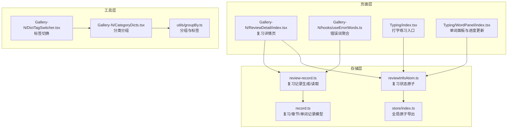
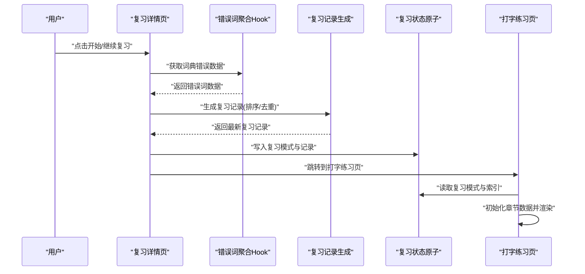
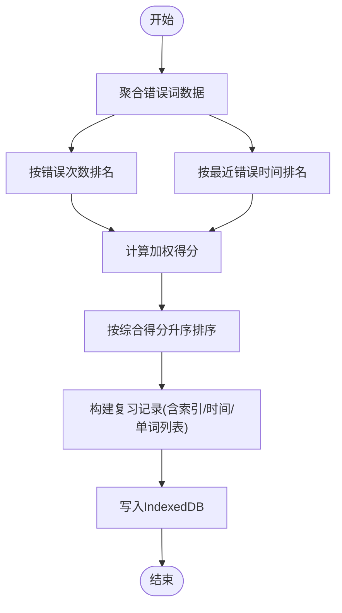
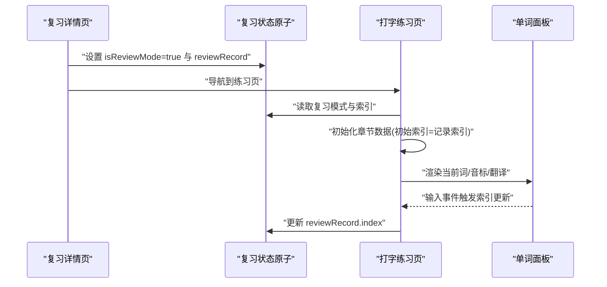
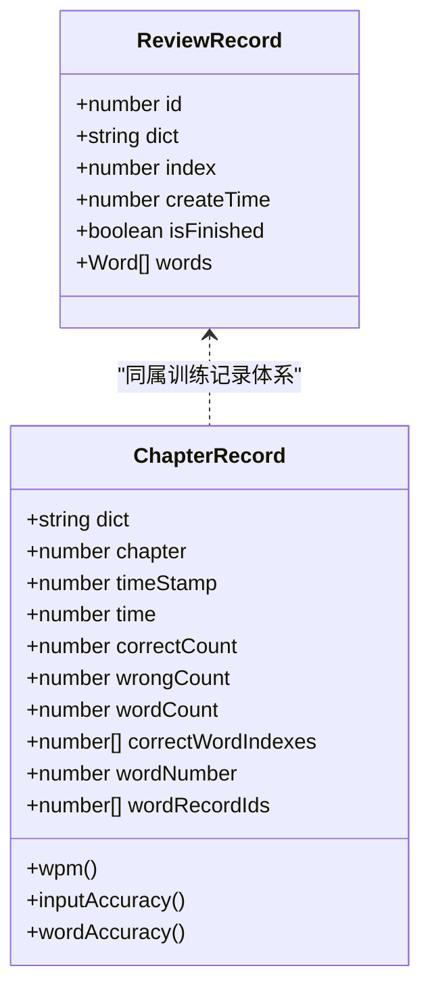
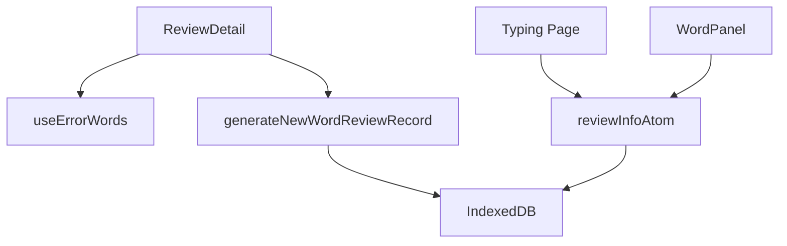

# 复习功能实现

<cite>
**本文引用的文件**
- [src/store/reviewInfoAtom.ts](file://src/store/reviewInfoAtom.ts)
- [src/store/index.ts](file://src/store/index.ts)
- [src/utils/db/record.ts](file://src/utils/db/record.ts)
- [src/utils/db/review-record.ts](file://src/utils/db/review-record.ts)
- [src/pages/Gallery-N/ReviewDetail/index.tsx](file://src/pages/Gallery-N/ReviewDetail/index.tsx)
- [src/pages/Gallery-N/hooks/useErrorWords.ts](file://src/pages/Gallery-N/hooks/useErrorWords.ts)
- [src/pages/Typing/index.tsx](file://src/pages/Typing/index.tsx)
- [src/pages/Typing/components/WordPanel/index.tsx](file://src/pages/Typing/components/WordPanel/index.tsx)
- [src/store/atomForConfig.ts](file://src/store/atomForConfig.ts)
- [src/pages/Gallery-N/CategoryDicts.tsx](file://src/pages/Gallery-N/CategoryDicts.tsx)
- [src/pages/Gallery-N/DictTagSwitcher.tsx](file://src/pages/Gallery-N/DictTagSwitcher.tsx)
- [src/utils/groupBy.ts](file://src/utils/groupBy.ts)
</cite>

## 目录

1. [简介](#简介)
2. [项目结构](#项目结构)
3. [核心组件](#核心组件)
4. [架构总览](#架构总览)
5. [详细组件分析](#详细组件分析)
6. [依赖分析](#依赖分析)
7. [性能考虑](#性能考虑)
8. [故障排查指南](#故障排查指南)
9. [结论](#结论)
10. [附录](#附录)

## 简介

本文件围绕“复习功能”的实现进行系统化技术文档整理，覆盖以下方面：

- 复习计划制定机制：基于历史练习与错误数据的排序算法，以及复习记录持久化与恢复。
- 复习界面交互：单词详情展示、练习模式切换、进度控制与继续学习。
- 复习数据组织：按词典分组、标签管理、批量操作入口与导航。
- 定制化配置：复习强度、目标与提醒等可配置项的落地方式。
- 历史记录与效果追踪：复习记录、章节记录与统计分析的集成路径。

## 项目结构

复习功能涉及多个层次的模块协同：

- 存储层：复习状态原子、配置原子、数据库模型与记录持久化。
- 页面层：词典画廊、复习详情页、打字练习页。
- 工具层：分组与标签工具、错误词聚合逻辑、复习记录生成与读取。

图表来源

- [src/store/reviewInfoAtom.ts](file://src/store/reviewInfoAtom.ts#L1-L29)
- [src/store/index.ts](file://src/store/index.ts#L1-L118)
- [src/utils/db/record.ts](file://src/utils/db/record.ts#L118-L186)
- [src/utils/db/review-record.ts](file://src/utils/db/review-record.ts#L1-L69)
- [src/pages/Gallery-N/ReviewDetail/index.tsx](file://src/pages/Gallery-N/ReviewDetail/index.tsx#L1-L86)
- [src/pages/Gallery-N/hooks/useErrorWords.ts](file://src/pages/Gallery-N/hooks/useErrorWords.ts#L1-L89)
- [src/pages/Typing/index.tsx](file://src/pages/Typing/index.tsx#L1-L104)
- [src/pages/Typing/components/WordPanel/index.tsx](file://src/pages/Typing/components/WordPanel/index.tsx#L1-L52)
- [src/utils/groupBy.ts](file://src/utils/groupBy.ts#L1-L26)
- [src/pages/Gallery-N/CategoryDicts.tsx](file://src/pages/Gallery-N/CategoryDicts.tsx#L1-L37)
- [src/pages/Gallery-N/DictTagSwitcher.tsx](file://src/pages/Gallery-N/DictTagSwitcher.tsx#L1-L37)

章节来源

- [src/store/reviewInfoAtom.ts](file://src/store/reviewInfoAtom.ts#L1-L29)
- [src/store/index.ts](file://src/store/index.ts#L1-L118)
- [src/utils/db/record.ts](file://src/utils/db/record.ts#L118-L186)
- [src/utils/db/review-record.ts](file://src/utils/db/review-record.ts#L1-L69)
- [src/pages/Gallery-N/ReviewDetail/index.tsx](file://src/pages/Gallery-N/ReviewDetail/index.tsx#L1-L86)
- [src/pages/Gallery-N/hooks/useErrorWords.ts](file://src/pages/Gallery-N/hooks/useErrorWords.ts#L1-L89)
- [src/pages/Typing/index.tsx](file://src/pages/Typing/index.tsx#L1-L104)
- [src/pages/Typing/components/WordPanel/index.tsx](file://src/pages/Typing/components/WordPanel/index.tsx#L1-L52)
- [src/utils/groupBy.ts](file://src/utils/groupBy.ts#L1-L26)
- [src/pages/Gallery-N/CategoryDicts.tsx](file://src/pages/Gallery-N/CategoryDicts.tsx#L1-L37)
- [src/pages/Gallery-N/DictTagSwitcher.tsx](file://src/pages/Gallery-N/DictTagSwitcher.tsx#L1-L37)

## 核心组件

- 复习状态原子：封装复习模式开关与当前复习记录，并在变更时持久化到 IndexedDB。
- 复习记录模型：包含词典标识、当前索引、创建时间、是否完成、单词列表等字段。
- 错误词聚合：从历史单词记录中聚合错误次数、最近错误时间、错字母分布等指标。
- 复习记录生成：基于错误指标进行加权排序，生成复习单词序列并写入数据库。
- 复习详情页：展示最新复习记录进度、创建时间、启动/继续复习按钮。
- 打字练习页：根据复习模式与记录索引初始化章节数据，实时更新进度。
- 分组与标签：按词典分类与标签分组，支持快速筛选与批量操作入口。

章节来源

- [src/store/reviewInfoAtom.ts](file://src/store/reviewInfoAtom.ts#L1-L29)
- [src/utils/db/record.ts](file://src/utils/db/record.ts#L118-L186)
- [src/utils/db/review-record.ts](file://src/utils/db/review-record.ts#L1-L69)
- [src/pages/Gallery-N/ReviewDetail/index.tsx](file://src/pages/Gallery-N/ReviewDetail/index.tsx#L1-L86)
- [src/pages/Typing/index.tsx](file://src/pages/Typing/index.tsx#L1-L104)
- [src/pages/Typing/components/WordPanel/index.tsx](file://src/pages/Typing/components/WordPanel/index.tsx#L1-L52)
- [src/pages/Gallery-N/hooks/useErrorWords.ts](file://src/pages/Gallery-N/hooks/useErrorWords.ts#L1-L89)
- [src/utils/groupBy.ts](file://src/utils/groupBy.ts#L1-L26)
- [src/pages/Gallery-N/CategoryDicts.tsx](file://src/pages/Gallery-N/CategoryDicts.tsx#L1-L37)
- [src/pages/Gallery-N/DictTagSwitcher.tsx](file://src/pages/Gallery-N/DictTagSwitcher.tsx#L1-L37)

## 架构总览

复习功能采用“状态驱动 + 数据持久化 + 页面联动”的架构：

- 状态层：通过 Jotai 原子管理复习模式与当前记录。
- 数据层：通过 IndexedDB 持久化复习记录与章节记录。
- 业务层：错误词聚合与复习序列生成，结合 UI 展示与交互。
- 界面层：复习详情页与打字练习页分别承担“计划制定”和“执行训练”。

图表来源

- [src/pages/Gallery-N/ReviewDetail/index.tsx](file://src/pages/Gallery-N/ReviewDetail/index.tsx#L1-L86)
- [src/pages/Gallery-N/hooks/useErrorWords.ts](file://src/pages/Gallery-N/hooks/useErrorWords.ts#L1-L89)
- [src/utils/db/review-record.ts](file://src/utils/db/review-record.ts#L1-L69)
- [src/store/reviewInfoAtom.ts](file://src/store/reviewInfoAtom.ts#L1-L29)
- [src/pages/Typing/index.tsx](file://src/pages/Typing/index.tsx#L1-L104)

## 详细组件分析

### 复习计划制定机制

- 基于历史数据的排序算法
  - 错误词聚合：统计每词的错误次数、最近错误时间、错字母分布。
  - 加权排序：对错误次数与最近错误时间分别进行排名，再按权重合并得到综合得分，最终排序生成复习序列。
  - 复杂度分析：排序阶段为 O(n log n)，排名与评分阶段为 O(n)，整体近似 O(n log n)。
- 复习记录生成与持久化
  - 生成新记录：构造 ReviewRecord 并写入 IndexedDB。
  - 读取最新记录：按创建时间取最新且未完成的记录。
- 复习间隔与优先级
  - 当前实现未引入传统“间隔递增”算法，而是以“错误严重度”作为优先级依据。
  - 若需引入间隔机制，可在 ReviewRecord 中扩展“下次复习时间戳”字段，并在打字页结束时更新该字段。

图表来源

- [src/pages/Gallery-N/hooks/useErrorWords.ts](file://src/pages/Gallery-N/hooks/useErrorWords.ts#L1-L89)
- [src/utils/db/review-record.ts](file://src/utils/db/review-record.ts#L1-L69)
- [src/utils/db/record.ts](file://src/utils/db/record.ts#L118-L186)

章节来源

- [src/pages/Gallery-N/hooks/useErrorWords.ts](file://src/pages/Gallery-N/hooks/useErrorWords.ts#L1-L89)
- [src/utils/db/review-record.ts](file://src/utils/db/review-record.ts#L1-L69)
- [src/utils/db/record.ts](file://src/utils/db/record.ts#L118-L186)

### 复习界面交互设计

- 复习详情页
  - 展示最新复习记录的进度条与创建时间。
  - 提供“继续当前进度”和“开始新的复习”两种入口。
  - 启动后将词典 ID、章节索引与复习记录写入状态原子并跳转练习页。
- 打字练习页
  - 根据复习模式与记录索引初始化章节数据，确保从正确位置继续。
  - 实时更新当前索引，配合单词面板展示上下文与预加载发音。
- 单词详情展示
  - 单词面板组件负责渲染当前词、音标、翻译与输入反馈。
  - 支持预取下一个单词的发音资源，优化体验。

图表来源

- [src/pages/Gallery-N/ReviewDetail/index.tsx](file://src/pages/Gallery-N/ReviewDetail/index.tsx#L1-L86)
- [src/store/reviewInfoAtom.ts](file://src/store/reviewInfoAtom.ts#L1-L29)
- [src/pages/Typing/index.tsx](file://src/pages/Typing/index.tsx#L1-L104)
- [src/pages/Typing/components/WordPanel/index.tsx](file://src/pages/Typing/components/WordPanel/index.tsx#L1-L52)

章节来源

- [src/pages/Gallery-N/ReviewDetail/index.tsx](file://src/pages/Gallery-N/ReviewDetail/index.tsx#L1-L86)
- [src/pages/Typing/index.tsx](file://src/pages/Typing/index.tsx#L1-L104)
- [src/pages/Typing/components/WordPanel/index.tsx](file://src/pages/Typing/components/WordPanel/index.tsx#L1-L52)
- [src/store/reviewInfoAtom.ts](file://src/store/reviewInfoAtom.ts#L1-L29)

### 复习数据组织与分组展示

- 词典分组与标签
  - 使用分组工具按分类与标签进行二维分组，便于在画廊中浏览与筛选。
  - 标签切换组件支持用户在不同标签间切换，快速定位目标词典。
- 错词数据组织
  - 错词聚合 Hook 将历史单词记录按词名分组，统计错误次数、最近错误时间与错字母分布，形成结构化数据用于排序。
- 批量操作入口
  - 复习详情页提供一键启动/继续复习，属于“批量操作”的一种入口形式；后续可扩展为按标签或分类批量生成复习计划。

图表来源

- [src/utils/groupBy.ts](file://src/utils/groupBy.ts#L1-L26)
- [src/pages/Gallery-N/CategoryDicts.tsx](file://src/pages/Gallery-N/CategoryDicts.tsx#L1-L37)
- [src/pages/Gallery-N/DictTagSwitcher.tsx](file://src/pages/Gallery-N/DictTagSwitcher.tsx#L1-L37)

章节来源

- [src/utils/groupBy.ts](file://src/utils/groupBy.ts#L1-L26)
- [src/pages/Gallery-N/CategoryDicts.tsx](file://src/pages/Gallery-N/CategoryDicts.tsx#L1-L37)
- [src/pages/Gallery-N/DictTagSwitcher.tsx](file://src/pages/Gallery-N/DictTagSwitcher.tsx#L1-L37)

### 定制化配置选项

- 复习强度与目标
  - 当前仓库未提供直接的“复习强度/目标”配置项。可通过调整错误词聚合的权重参数或增加新的排序因子来间接影响复习强度。
- 目标设定
  - 可在复习记录模型中新增“目标单词数”字段，并在打字页中根据完成比例进行提示。
- 提醒机制
  - 未发现专门的复习提醒实现。可结合浏览器通知 API 或定时任务在特定时刻提示用户继续复习。
- 配置存储
  - 所有配置均通过通用配置原子进行本地持久化，保证跨会话一致性。

章节来源

- [src/store/atomForConfig.ts](file://src/store/atomForConfig.ts#L1-L45)
- [src/utils/db/record.ts](file://src/utils/db/record.ts#L118-L186)

### 复习历史记录与效果追踪

- 复习记录
  - ReviewRecord 记录词典、索引、创建时间、是否完成与单词列表，支持继续学习与进度回放。
- 章节记录与统计
  - ChapterRecord 记录章节耗时、正确/错误计数、WPM、输入准确率等指标，可用于效果追踪与可视化。
- 数据持久化
  - 通过 IndexedDB 写入与读取，保证离线可用与长期留存。

图表来源

- [src/utils/db/record.ts](file://src/utils/db/record.ts#L118-L186)

章节来源

- [src/utils/db/record.ts](file://src/utils/db/record.ts#L1-L186)

## 依赖分析

- 组件耦合
  - 复习详情页依赖错误词聚合 Hook 与复习记录生成函数。
  - 打字练习页依赖复习状态原子与单词面板组件。
  - 复习状态原子依赖 IndexedDB 的复习记录写入。
- 外部依赖
  - Jotai 原子状态管理。
  - IndexedDB 数据库访问。
  - UI 组件库 Radix UI、Headless UI 等。

图表来源

- [src/pages/Gallery-N/ReviewDetail/index.tsx](file://src/pages/Gallery-N/ReviewDetail/index.tsx#L1-L86)
- [src/pages/Gallery-N/hooks/useErrorWords.ts](file://src/pages/Gallery-N/hooks/useErrorWords.ts#L1-L89)
- [src/utils/db/review-record.ts](file://src/utils/db/review-record.ts#L1-L69)
- [src/pages/Typing/components/WordPanel/index.tsx](file://src/pages/Typing/components/WordPanel/index.tsx#L1-L52)
- [src/store/reviewInfoAtom.ts](file://src/store/reviewInfoAtom.ts#L1-L29)

章节来源

- [src/pages/Gallery-N/ReviewDetail/index.tsx](file://src/pages/Gallery-N/ReviewDetail/index.tsx#L1-L86)
- [src/pages/Gallery-N/hooks/useErrorWords.ts](file://src/pages/Gallery-N/hooks/useErrorWords.ts#L1-L89)
- [src/utils/db/review-record.ts](file://src/utils/db/review-record.ts#L1-L69)
- [src/pages/Typing/components/WordPanel/index.tsx](file://src/pages/Typing/components/WordPanel/index.tsx#L1-L52)
- [src/store/reviewInfoAtom.ts](file://src/store/reviewInfoAtom.ts#L1-L29)

## 性能考虑

- 排序与聚合
  - 错误词聚合与排序在词典规模较大时可能成为瓶颈，建议对错误记录分页或缓存中间结果。
- 数据库访问
  - IndexedDB 读写应避免在渲染关键路径中同步阻塞，可采用异步队列或后台线程。
- UI 渲染
  - 单词面板与进度条更新频率较高，建议使用防抖与虚拟滚动优化长列表渲染。

## 故障排查指南

- 复习记录未生效
  - 检查复习状态原子是否成功写入 IndexedDB；确认 reviewRecord.id 是否存在。
- 进度不更新
  - 确认打字页在输入事件中调用了更新复习记录索引的回调。
- 错误词数据为空
  - 检查词典 ID 是否匹配、历史记录中是否存在错误记录、聚合逻辑是否过滤了无效数据。
- 继续学习无法定位到正确位置
  - 确认复习记录中的 index 字段与当前章节索引一致，初始化时是否从记录索引读取。

章节来源

- [src/store/reviewInfoAtom.ts](file://src/store/reviewInfoAtom.ts#L1-L29)
- [src/pages/Typing/components/WordPanel/index.tsx](file://src/pages/Typing/components/WordPanel/index.tsx#L1-L52)
- [src/pages/Gallery-N/hooks/useErrorWords.ts](file://src/pages/Gallery-N/hooks/useErrorWords.ts#L1-L89)

## 结论

复习功能以“错误数据驱动”的排序算法为核心，结合状态原子与 IndexedDB 实现了可恢复、可追踪的学习闭环。当前实现聚焦于“错误严重度”优先级，未来可扩展“间隔递增”与“目标设定”等机制，进一步提升个性化与科学性。分组与标签体系为批量操作与导航提供了良好基础。

## 附录

- 关键流程路径参考
  - 复习详情页启动流程：[src/pages/Gallery-N/ReviewDetail/index.tsx](file://src/pages/Gallery-N/ReviewDetail/index.tsx#L1-L86)
  - 错误词聚合逻辑：[src/pages/Gallery-N/hooks/useErrorWords.ts](file://src/pages/Gallery-N/hooks/useErrorWords.ts#L1-L89)
  - 复习记录生成与读取：[src/utils/db/review-record.ts](file://src/utils/db/review-record.ts#L1-L69)
  - 复习状态原子与持久化：[src/store/reviewInfoAtom.ts](file://src/store/reviewInfoAtom.ts#L1-L29)
  - 打字练习页初始化与进度更新：[src/pages/Typing/index.tsx](file://src/pages/Typing/index.tsx#L1-L104), [src/pages/Typing/components/WordPanel/index.tsx](file://src/pages/Typing/components/WordPanel/index.tsx#L1-L52)
  - 复习记录模型定义：[src/utils/db/record.ts](file://src/utils/db/record.ts#L118-L186)
  - 分组与标签工具：[src/utils/groupBy.ts](file://src/utils/groupBy.ts#L1-L26)
  - 词典分组与标签切换：[src/pages/Gallery-N/CategoryDicts.tsx](file://src/pages/Gallery-N/CategoryDicts.tsx#L1-L37), [src/pages/Gallery-N/DictTagSwitcher.tsx](file://src/pages/Gallery-N/DictTagSwitcher.tsx#L1-L37)
