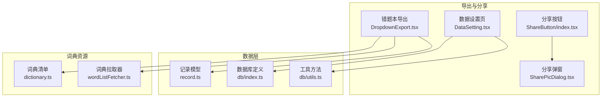
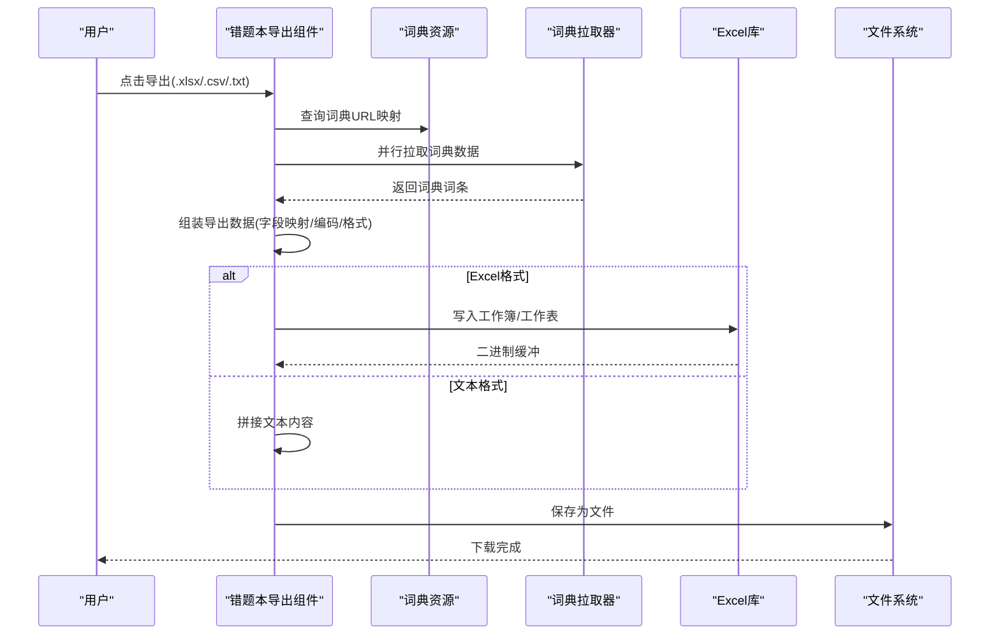
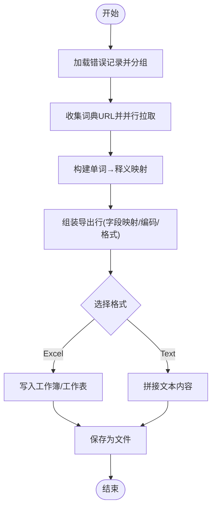
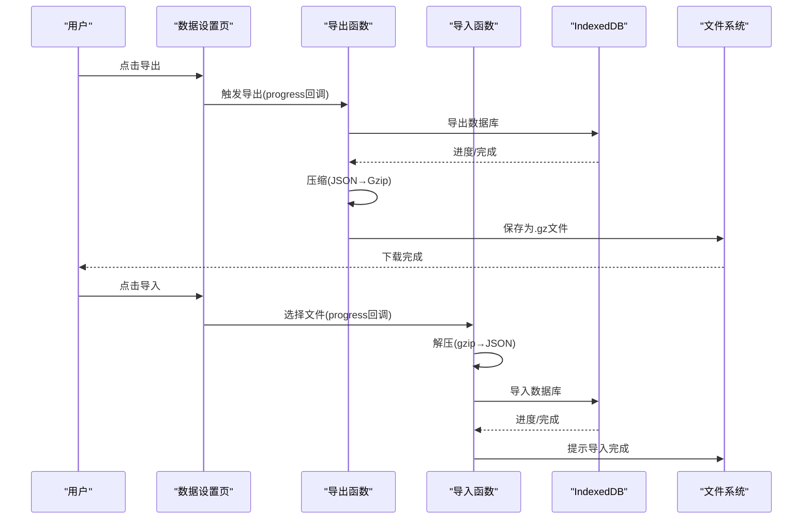
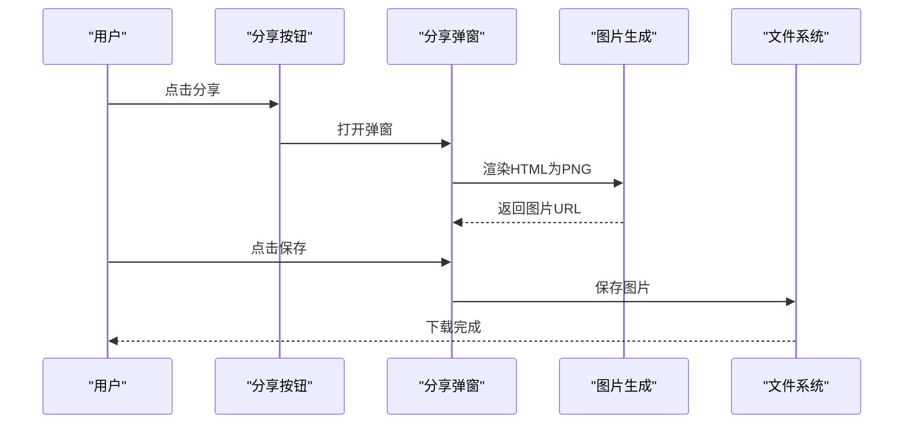
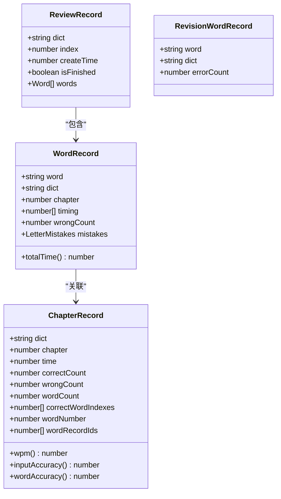
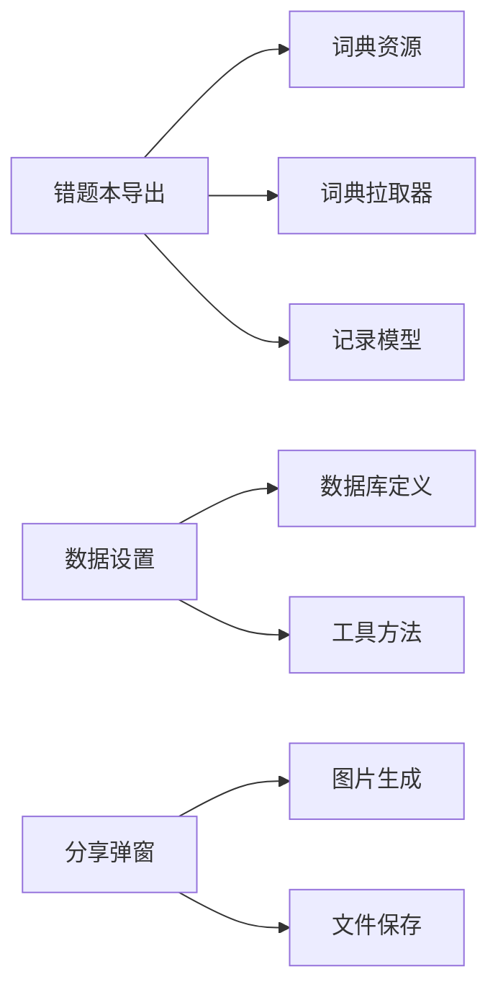

# 数据导出与分享

<cite>
**本文引用的文件**
- [src/utils/db/data-export.ts](file://src/utils/db/data-export.ts)
- [src/pages/Typing/components/Setting/DataSetting.tsx](file://src/pages/Typing/components/Setting/DataSetting.tsx)
- [src/pages/ErrorBook/DropdownExport.tsx](file://src/pages/ErrorBook/DropdownExport.tsx)
- [src/pages/ErrorBook/index.tsx](file://src/pages/ErrorBook/index.tsx)
- [src/utils/db/index.ts](file://src/utils/db/index.ts)
- [src/utils/db/record.ts](file://src/utils/db/record.ts)
- [src/utils/db/utils.ts](file://src/utils/db/utils.ts)
- [src/resources/dictionary.ts](file://src/resources/dictionary.ts)
- [src/utils/wordListFetcher.ts](file://src/utils/wordListFetcher.ts)
- [src/pages/Typing/components/ShareButton/index.tsx](file://src/pages/Typing/components/ShareButton/index.tsx)
- [src/pages/Typing/components/ShareButton/SharePicDialog.tsx](file://src/pages/Typing/components/ShareButton/SharePicDialog.tsx)
- [src/utils/index.ts](file://src/utils/index.ts)
</cite>

## 目录

1. [简介](#简介)
2. [项目结构](#项目结构)
3. [核心组件](#核心组件)
4. [架构总览](#架构总览)
5. [详细组件分析](#详细组件分析)
6. [依赖关系分析](#依赖关系分析)
7. [性能考量](#性能考量)
8. [故障排查指南](#故障排查指南)
9. [结论](#结论)
10. [附录](#附录)

## 简介

本技术文档聚焦于“数据导出与分享”能力，覆盖以下目标：

- 错题本导出：支持 TXT、CSV、XLSX 等格式，含字段映射、编码与格式标准化。
- 用户练习数据导出/导入：基于 IndexedDB 的压缩导出与解压导入，含进度回调与体积统计。
- 分享功能：生成可下载的图片分享卡片，含随机文案与图片渲染。
- 扩展能力：批量导出与增量导出的工程化思路、内存优化策略、模板定制与自动化配置。

## 项目结构

围绕导出与分享的关键模块分布如下：

- 错题本导出：页面组件负责触发导出、组织数据、调用第三方库生成文件并保存。
- 练习数据导出/导入：工具函数封装 Dexie 导出、gzip 压缩、进度回调与计数统计。
- 分享卡片：按钮触发弹窗，动态生成图片并提供下载。
- 数据模型：定义记录结构与派生指标，支撑导出字段与统计口径。

图表来源

- [src/pages/ErrorBook/DropdownExport.tsx](file://src/pages/ErrorBook/DropdownExport.tsx#L1-L131)
- [src/pages/Typing/components/Setting/DataSetting.tsx](file://src/pages/Typing/components/Setting/DataSetting.tsx#L1-L127)
- [src/pages/Typing/components/ShareButton/index.tsx](file://src/pages/Typing/components/ShareButton/index.tsx#L1-L37)
- [src/pages/Typing/components/ShareButton/SharePicDialog.tsx](file://src/pages/Typing/components/ShareButton/SharePicDialog.tsx#L1-L227)
- [src/utils/db/index.ts](file://src/utils/db/index.ts#L1-L136)
- [src/utils/db/record.ts](file://src/utils/db/record.ts#L1-L186)
- [src/utils/db/utils.ts](file://src/utils/db/utils.ts#L1-L18)
- [src/resources/dictionary.ts](file://src/resources/dictionary.ts#L1-L800)
- [src/utils/wordListFetcher.ts](file://src/utils/wordListFetcher.ts#L1-L10)

章节来源

- [src/pages/ErrorBook/DropdownExport.tsx](file://src/pages/ErrorBook/DropdownExport.tsx#L1-L131)
- [src/pages/Typing/components/Setting/DataSetting.tsx](file://src/pages/Typing/components/Setting/DataSetting.tsx#L1-L127)
- [src/pages/Typing/components/ShareButton/index.tsx](file://src/pages/Typing/components/ShareButton/index.tsx#L1-L37)
- [src/pages/Typing/components/ShareButton/SharePicDialog.tsx](file://src/pages/Typing/components/ShareButton/SharePicDialog.tsx#L1-L227)
- [src/utils/db/index.ts](file://src/utils/db/index.ts#L1-L136)
- [src/utils/db/record.ts](file://src/utils/db/record.ts#L1-L186)
- [src/utils/db/utils.ts](file://src/utils/db/utils.ts#L1-L18)
- [src/resources/dictionary.ts](file://src/resources/dictionary.ts#L1-L800)
- [src/utils/wordListFetcher.ts](file://src/utils/wordListFetcher.ts#L1-L10)

## 核心组件

- 错题本导出组件：负责收集错题记录、并行拉取词典数据、构造导出数据集、生成 Blob 并保存为文件。
- 练习数据导出/导入：封装 Dexie 导出、gzip 压缩、进度回调、计数统计与导入覆盖策略。
- 分享弹窗：根据当前练习状态生成图片，提供下载。
- 数据模型：定义单词记录、章节记录、复习记录等，提供派生指标用于导出展示。

章节来源

- [src/pages/ErrorBook/DropdownExport.tsx](file://src/pages/ErrorBook/DropdownExport.tsx#L1-L131)
- [src/utils/db/data-export.ts](file://src/utils/db/data-export.ts#L1-L68)
- [src/pages/Typing/components/ShareButton/SharePicDialog.tsx](file://src/pages/Typing/components/ShareButton/SharePicDialog.tsx#L1-L227)
- [src/utils/db/record.ts](file://src/utils/db/record.ts#L1-L186)

## 架构总览

下图展示了从用户触发到最终文件生成与保存的整体流程。

图表来源

- [src/pages/ErrorBook/DropdownExport.tsx](file://src/pages/ErrorBook/DropdownExport.tsx#L1-L131)
- [src/resources/dictionary.ts](file://src/resources/dictionary.ts#L1-L800)
- [src/utils/wordListFetcher.ts](file://src/utils/wordListFetcher.ts#L1-L10)

## 详细组件分析

### 错题本导出（TXT/CSV/XLSX）

- 数据来源与结构化处理
  - 从数据库读取错误记录，按单词与词典分组，汇总错误次数。
  - 并行拉取词典数据，构建“单词 → 释义”映射，用于补充导出字段。
  - 字段映射与格式标准化：导出列包含“单词、释义、错误次数、词典”，日期时间戳采用统一格式。
- 文件生成与保存
  - Excel：通过工作簿/工作表写入，输出为二进制缓冲后封装为 Blob。
  - 文本：按“单词: 释义”的行格式拼接，封装为纯文本 Blob。
  - 使用文件保存库触发下载，文件名包含时间戳。
- 错误处理
  - 词典拉取失败时记录错误并回退为空数组，保证导出流程继续。
  - 导出异常时提示用户重试。

图表来源

- [src/pages/ErrorBook/DropdownExport.tsx](file://src/pages/ErrorBook/DropdownExport.tsx#L1-L131)
- [src/pages/ErrorBook/index.tsx](file://src/pages/ErrorBook/index.tsx#L1-L136)
- [src/resources/dictionary.ts](file://src/resources/dictionary.ts#L1-L800)
- [src/utils/wordListFetcher.ts](file://src/utils/wordListFetcher.ts#L1-L10)

章节来源

- [src/pages/ErrorBook/DropdownExport.tsx](file://src/pages/ErrorBook/DropdownExport.tsx#L1-L131)
- [src/pages/ErrorBook/index.tsx](file://src/pages/ErrorBook/index.tsx#L1-L136)
- [src/resources/dictionary.ts](file://src/resources/dictionary.ts#L1-L800)
- [src/utils/wordListFetcher.ts](file://src/utils/wordListFetcher.ts#L1-L10)

### 练习数据导出与导入（Gzip 压缩）

- 导出流程
  - 调用数据库导出接口，接收进度回调，完成后读取记录条数。
  - 将导出 JSON 文本 gzip 压缩，封装为 Blob，使用文件保存库命名并下载。
  - 记录导出动作与大小、条数等统计信息。
- 导入流程
  - 弹出文件选择器，限制类型为 gzip。
  - 解压文件为 JSON 文本，交由数据库导入，开启进度回调。
  - 导入完成后统计记录条数，记录导入动作。
- 进度反馈
  - 导出/导入均通过进度回调更新 UI，支持百分比显示。

图表来源

- [src/pages/Typing/components/Setting/DataSetting.tsx](file://src/pages/Typing/components/Setting/DataSetting.tsx#L1-L127)
- [src/utils/db/data-export.ts](file://src/utils/db/data-export.ts#L1-L68)
- [src/utils/db/index.ts](file://src/utils/db/index.ts#L1-L136)

章节来源

- [src/pages/Typing/components/Setting/DataSetting.tsx](file://src/pages/Typing/components/Setting/DataSetting.tsx#L1-L127)
- [src/utils/db/data-export.ts](file://src/utils/db/data-export.ts#L1-L68)
- [src/utils/db/index.ts](file://src/utils/db/index.ts#L1-L136)

### 分享功能（图片卡片）

- 触发与面板
  - 分享按钮打开弹窗，弹窗内部动态生成图片，提供下载。
- 图片生成
  - 使用 HTML 渲染为图片，Canvas 缩放提升清晰度。
  - 随机选择背景图与文案，增强趣味性。
- 下载与追踪
  - 下载按钮触发保存，同时记录分享动作。

图表来源

- [src/pages/Typing/components/ShareButton/index.tsx](file://src/pages/Typing/components/ShareButton/index.tsx#L1-L37)
- [src/pages/Typing/components/ShareButton/SharePicDialog.tsx](file://src/pages/Typing/components/ShareButton/SharePicDialog.tsx#L1-L227)

章节来源

- [src/pages/Typing/components/ShareButton/index.tsx](file://src/pages/Typing/components/ShareButton/index.tsx#L1-L37)
- [src/pages/Typing/components/ShareButton/SharePicDialog.tsx](file://src/pages/Typing/components/ShareButton/SharePicDialog.tsx#L1-L227)

### 数据模型与派生指标

- 记录模型
  - 单词记录：包含单词、词典、章节、错误次数、逐字母耗时与错误映射。
  - 章节记录：包含章节用时、正确/错误计数、单词数量与派生指标（WPM、准确率等）。
  - 复习记录：复习进度、创建时间与是否完成。
- 工具方法
  - 合并字母级错误映射，便于统计与导出。

图表来源

- [src/utils/db/record.ts](file://src/utils/db/record.ts#L1-L186)
- [src/utils/db/utils.ts](file://src/utils/db/utils.ts#L1-L18)

章节来源

- [src/utils/db/record.ts](file://src/utils/db/record.ts#L1-L186)
- [src/utils/db/utils.ts](file://src/utils/db/utils.ts#L1-L18)

## 依赖关系分析

- 错题本导出依赖词典资源与拉取器，导出数据需跨表/跨资源聚合。
- 练习数据导出依赖 Dexie 导出与 gzip 压缩，导入时需兼容版本差异与表结构变化。
- 分享功能依赖图片生成与文件保存，UI 层通过上下文与原子状态传递练习状态。

图表来源

- [src/pages/ErrorBook/DropdownExport.tsx](file://src/pages/ErrorBook/DropdownExport.tsx#L1-L131)
- [src/resources/dictionary.ts](file://src/resources/dictionary.ts#L1-L800)
- [src/utils/wordListFetcher.ts](file://src/utils/wordListFetcher.ts#L1-L10)
- [src/utils/db/index.ts](file://src/utils/db/index.ts#L1-L136)
- [src/utils/db/utils.ts](file://src/utils/db/utils.ts#L1-L18)
- [src/pages/Typing/components/ShareButton/SharePicDialog.tsx](file://src/pages/Typing/components/ShareButton/SharePicDialog.tsx#L1-L227)

章节来源

- [src/pages/ErrorBook/DropdownExport.tsx](file://src/pages/ErrorBook/DropdownExport.tsx#L1-L131)
- [src/pages/Typing/components/Setting/DataSetting.tsx](file://src/pages/Typing/components/Setting/DataSetting.tsx#L1-L127)
- [src/pages/Typing/components/ShareButton/SharePicDialog.tsx](file://src/pages/Typing/components/ShareButton/SharePicDialog.tsx#L1-L227)
- [src/utils/db/index.ts](file://src/utils/db/index.ts#L1-L136)

## 性能考量

- 并行化
  - 错题本导出中对多个词典数据进行并行拉取，缩短等待时间。
  - 练习数据导出/导入使用进度回调，避免阻塞 UI。
- 内存优化
  - 错题本导出在前端组装导出数据，建议对大列表分批处理或虚拟滚动减少 DOM 压力。
  - 练习数据导出采用 gzip 压缩，显著降低文件体积与网络传输成本。
- 数据一致性
  - 导入时允许版本差异与缺失表，同时覆盖模式确保数据完整性，注意导入前的确认提示。

## 故障排查指南

- 错题本导出失败
  - 检查词典资源是否可访问，确认 URL 映射是否存在。
  - 若某词典拉取失败，组件会记录错误并回退，不影响整体导出。
- 练习数据导入覆盖风险
  - 导入会完全覆盖当前数据，导入前请确认并做好备份。
  - 如导入后发现数据异常，检查文件是否被篡改或版本不匹配。
- 分享图片生成慢
  - 图片渲染依赖 Canvas，网络较慢时可适当降低缩放倍率或延迟生成。
- 进度不更新
  - 确认进度回调返回值为真，以便继续推进进度。

章节来源

- [src/pages/ErrorBook/DropdownExport.tsx](file://src/pages/ErrorBook/DropdownExport.tsx#L1-L131)
- [src/pages/Typing/components/Setting/DataSetting.tsx](file://src/pages/Typing/components/Setting/DataSetting.tsx#L1-L127)
- [src/pages/Typing/components/ShareButton/SharePicDialog.tsx](file://src/pages/Typing/components/ShareButton/SharePicDialog.tsx#L1-L227)

## 结论

本项目在前端实现了两类导出能力与分享功能：

- 错题本导出：支持 TXT/CSV/XLSX，具备字段映射、编码与格式标准化，并行拉取词典数据提升效率。
- 练习数据导出/导入：基于 Dexie 与 gzip，提供进度反馈与体积统计，保障数据迁移的安全与可控。
- 分享功能：通过图片生成与下载，提升用户传播体验。

在扩展方面，可进一步引入模板定制、自动化定时导出、增量导出与分页策略，以满足更大规模数据与更复杂业务场景。

## 附录

- 字段映射与导出规范
  - 错题本导出字段：单词、释义、错误次数、词典名称。
  - 练习数据导出文件名：包含日期标识，扩展名为 .gz。
- 时间戳与日期格式
  - 统一使用本地日期字符串作为文件名后缀，确保唯一性与可读性。
- 权限与安全
  - 导入覆盖风险提示明确，建议在生产环境增加二次确认与签名校验（扩展建议）。

章节来源

- [src/pages/ErrorBook/DropdownExport.tsx](file://src/pages/ErrorBook/DropdownExport.tsx#L1-L131)
- [src/utils/db/data-export.ts](file://src/utils/db/data-export.ts#L1-L68)
- [src/utils/index.ts](file://src/utils/index.ts#L85-L92)
