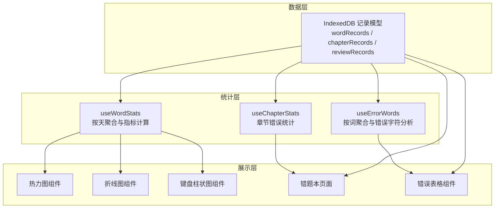
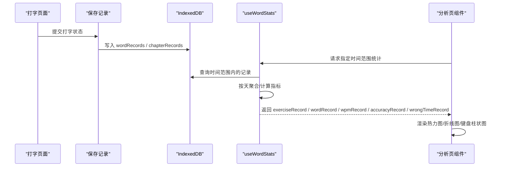
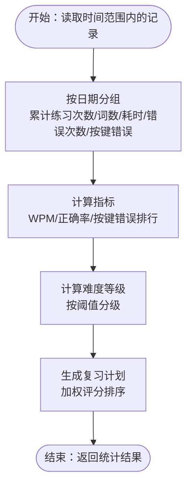
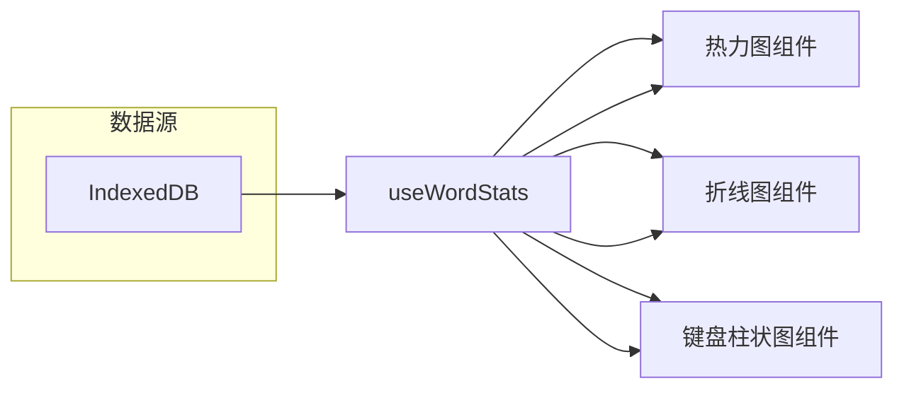
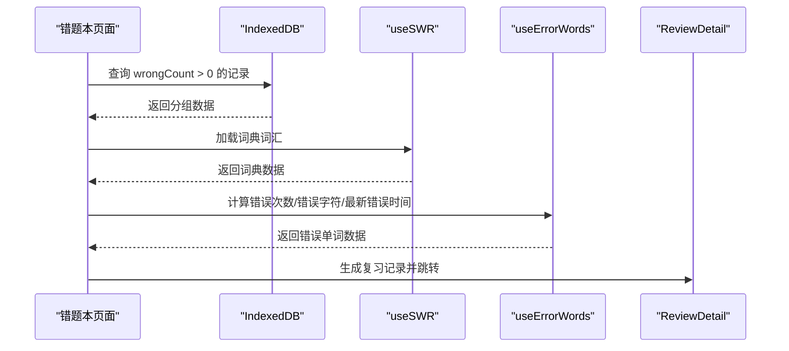
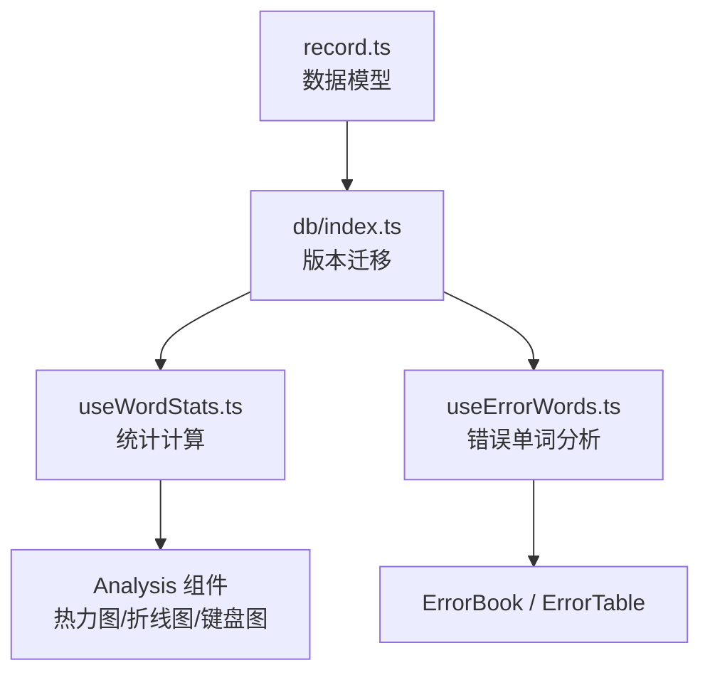

# 错误分析统计

<cite>
**本文引用的文件**
- [src/pages/Analysis/index.tsx](file://src/pages/Analysis/index.tsx)
- [src/pages/Analysis/hooks/useWordStats.ts](file://src/pages/Analysis/hooks/useWordStats.ts)
- [src/pages/Analysis/components/LineCharts.tsx](file://src/pages/Analysis/components/LineCharts.tsx)
- [src/pages/Analysis/components/HeatmapCharts.tsx](file://src/pages/Analysis/components/HeatmapCharts.tsx)
- [src/pages/Analysis/components/KeyboardWithBarCharts.tsx](file://src/pages/Analysis/components/KeyboardWithBarCharts.tsx)
- [src/pages/Analysis/components/keyboard.ts](file://src/pages/Analysis/components/keyboard.ts)
- [src/utils/db/index.ts](file://src/utils/db/index.ts)
- [src/utils/db/record.ts](file://src/utils/db/record.ts)
- [src/utils/db/review-record.ts](file://src/utils/db/review-record.ts)
- [src/pages/ErrorBook/index.tsx](file://src/pages/ErrorBook/index.tsx)
- [src/pages/ErrorBook/HeadWrongNumber.tsx](file://src/pages/ErrorBook/HeadWrongNumber.tsx)
- [src/pages/ErrorBook/ErrorRow.tsx](file://src/pages/ErrorBook/ErrorRow.tsx)
- [src/pages/ErrorBook/RowDetail/index.tsx](file://src/pages/ErrorBook/RowDetail/index.tsx)
- [src/pages/ErrorBook/DropdownExport.tsx](file://src/pages/ErrorBook/DropdownExport.tsx)
- [src/pages/Gallery-N/ErrorTable/index.tsx](file://src/pages/Gallery-N/ErrorTable/index.tsx)
- [src/pages/Gallery-N/ErrorTable/columns.tsx](file://src/pages/Gallery-N/ErrorTable/columns.tsx)
- [src/pages/Gallery-N/hooks/useErrorWords.ts](file://src/pages/Gallery-N/hooks/useErrorWords.ts)
- [src/pages/Gallery-N/ReviewDetail/index.tsx](file://src/pages/Gallery-N/ReviewDetail/index.tsx)
- [src/pages/Gallery-N/hooks/useChapterStats.ts](file://src/pages/Gallery-N/hooks/useChapterStats.ts)
- [src/utils/db/data-export.ts](file://src/utils/db/data-export.ts)
</cite>

## 目录

1. [简介](#简介)
2. [项目结构](#项目结构)
3. [核心组件](#核心组件)
4. [架构总览](#架构总览)
5. [详细组件分析](#详细组件分析)
6. [依赖关系分析](#依赖关系分析)
7. [性能考量](#性能考量)
8. [故障排查指南](#故障排查指南)
9. [结论](#结论)
10. [附录](#附录)

## 简介

本文件围绕“错误分析统计”功能，系统化梳理错误频率分析算法、统计指标设计、可视化展示、API 使用方式与自定义扩展方案，并给出导出与报告生成能力说明。目标是帮助开发者与使用者理解从原始打字记录到统计报表的全链路流程，以及如何基于现有代码扩展新的统计维度。

## 项目结构

错误分析统计涉及以下关键模块：

- 数据采集与存储：IndexedDB 记录模型与保存逻辑
- 统计计算：按天聚合、错误次数与按键错误聚合、正确率与 WPM 计算
- 可视化展示：热力图、折线图、键盘柱状图
- 错题本与错误单词分析：分组统计、排序、导出
- 复习计划与难度评估：基于错误次数与最新错误时间的加权排序

**图表来源**

- [src/utils/db/index.ts](file://src/utils/db/index.ts#L1-L35)
- [src/pages/Analysis/hooks/useWordStats.ts](file://src/pages/Analysis/hooks/useWordStats.ts#L1-L132)
- [src/pages/Analysis/components/HeatmapCharts.tsx](file://src/pages/Analysis/components/HeatmapCharts.tsx#L1-L57)
- [src/pages/Analysis/components/LineCharts.tsx](file://src/pages/Analysis/components/LineCharts.tsx#L1-L88)
- [src/pages/Analysis/components/KeyboardWithBarCharts.tsx](file://src/pages/Analysis/components/KeyboardWithBarCharts.tsx#L1-L181)
- [src/pages/ErrorBook/index.tsx](file://src/pages/ErrorBook/index.tsx#L1-L136)
- [src/pages/Gallery-N/ErrorTable/index.tsx](file://src/pages/Gallery-N/ErrorTable/index.tsx#L1-L30)
- [src/pages/Gallery-N/hooks/useErrorWords.ts](file://src/pages/Gallery-N/hooks/useErrorWords.ts#L1-L89)
- [src/pages/Gallery-N/hooks/useChapterStats.ts](file://src/pages/Gallery-N/hooks/useChapterStats.ts#L1-L45)

**章节来源**

- [src/utils/db/index.ts](file://src/utils/db/index.ts#L1-L35)
- [src/pages/Analysis/index.tsx](file://src/pages/Analysis/index.tsx#L1-L82)

## 核心组件

- 统计指标与算法
  - 错误次数聚合：按天统计练习次数、练习词数（去重）、按键错误次数（按键名聚合）
  - 正确率与 WPM：正确率基于字符级总量与错误次数计算；WPM 基于字符总数与总耗时
  - 键盘错误分布：将逐条记录中的按键错误映射为大写后聚合
- 错题本与错误单词分析
  - 分组统计：按词与词典分组，汇总错误次数、错误字符分布、最新错误时间
  - 排序规则：支持按错误次数升/降序或不排序
  - 导出：支持 TXT 与 Excel 格式导出
- 复习与难度评估
  - 基于错误次数与最新错误时间的加权排名，生成复习顺序并持久化

**章节来源**

- [src/pages/Analysis/hooks/useWordStats.ts](file://src/pages/Analysis/hooks/useWordStats.ts#L1-L132)
- [src/pages/ErrorBook/index.tsx](file://src/pages/ErrorBook/index.tsx#L1-L136)
- [src/pages/Gallery-N/hooks/useErrorWords.ts](file://src/pages/Gallery-N/hooks/useErrorWords.ts#L1-L89)
- [src/utils/db/review-record.ts](file://src/utils/db/review-record.ts#L38-L68)

## 架构总览

下图展示从打字记录到统计图表与复习计划的端到端流程：

**图表来源**

- [src/pages/Typing/store/index.ts](file://src/pages/Typing/store/index.ts#L1-L200)
- [src/utils/db/index.ts](file://src/utils/db/index.ts#L80-L122)
- [src/pages/Analysis/hooks/useWordStats.ts](file://src/pages/Analysis/hooks/useWordStats.ts#L59-L132)
- [src/pages/Analysis/index.tsx](file://src/pages/Analysis/index.tsx#L36-L71)

## 详细组件分析

### 组件 A：错误频率分析算法与统计指标

- 错误计数的聚合计算
  - 按天聚合：构造日期序列，逐条记录累加练习次数、练习词列表、总耗时、错误次数与按键错误列表
  - 键位错误聚合：将按键错误统一转为大写后，按名称计数
- 排序规则与筛选条件
  - 错题本按错误次数升/降序或不排序；可按词典过滤
  - 错误单词分析按词分组，支持按最新错误时间排序
- 统计指标设计
  - 练习次数热力图：每日练习次数
  - 练习词数热力图：每日去重后的练习词数
  - WPM 趋势图：字符总数除以总分钟数
  - 正确率趋势图：字符总量除以（字符总量+错误次数）
  - 键盘错误次数排行：按键错误频次
- 难度等级评估与学习进度跟踪
  - 难度等级：根据每日练习次数或练习词数划分等级
  - 复习计划：基于错误次数与最新错误时间的加权评分生成复习顺序

**图表来源**

- [src/pages/Analysis/hooks/useWordStats.ts](file://src/pages/Analysis/hooks/useWordStats.ts#L59-L132)
- [src/utils/db/review-record.ts](file://src/utils/db/review-record.ts#L38-L68)

**章节来源**

- [src/pages/Analysis/hooks/useWordStats.ts](file://src/pages/Analysis/hooks/useWordStats.ts#L1-L132)
- [src/utils/db/review-record.ts](file://src/utils/db/review-record.ts#L38-L68)

### 组件 B：可视化展示与实时更新机制

- 热力图（Activity Calendar）
  - 输入：按日期聚合的练习次数与练习词数
  - 展示：日历热力图，支持深色模式主题与提示信息
- 折线图（ECharts）
  - 输入：时间序列的 WPM 与正确率
  - 展示：平滑折线，支持缩放与尺寸自适应
- 键盘柱状图（ECharts + 地图）
  - 输入：按键错误次数
  - 展示：键盘布局柱状图，支持切换为地图视图
- 实时更新机制
  - 打字完成后异步写入 IndexedDB，分析页通过时间范围查询与重新渲染实现近实时更新

**图表来源**

- [src/pages/Analysis/index.tsx](file://src/pages/Analysis/index.tsx#L36-L71)
- [src/pages/Analysis/hooks/useWordStats.ts](file://src/pages/Analysis/hooks/useWordStats.ts#L1-L132)
- [src/pages/Analysis/components/HeatmapCharts.tsx](file://src/pages/Analysis/components/HeatmapCharts.tsx#L1-L57)
- [src/pages/Analysis/components/LineCharts.tsx](file://src/pages/Analysis/components/LineCharts.tsx#L1-L88)
- [src/pages/Analysis/components/KeyboardWithBarCharts.tsx](file://src/pages/Analysis/components/KeyboardWithBarCharts.tsx#L1-L181)
- [src/pages/Analysis/components/keyboard.ts](file://src/pages/Analysis/components/keyboard.ts#L1-L424)

**章节来源**

- [src/pages/Analysis/index.tsx](file://src/pages/Analysis/index.tsx#L1-L82)
- [src/pages/Analysis/components/HeatmapCharts.tsx](file://src/pages/Analysis/components/HeatmapCharts.tsx#L1-L57)
- [src/pages/Analysis/components/LineCharts.tsx](file://src/pages/Analysis/components/LineCharts.tsx#L1-L88)
- [src/pages/Analysis/components/KeyboardWithBarCharts.tsx](file://src/pages/Analysis/components/KeyboardWithBarCharts.tsx#L1-L181)

### 组件 C：错题本与错误单词分析

- 错题本
  - 分组：按词与词典分组，统计错误次数
  - 排序：支持升/降序与不排序
  - 导航：点击进入详情，显示平均用时、练习次数、正确/错误次数等
  - 删除：支持按词与词典删除记录
  - 导出：支持 TXT 与 Excel 导出，包含单词、释义、错误次数、词典
- 错误单词分析（词典维度）
  - 分组：按词分组，统计错误次数、错误字符分布（按字母索引）
  - 排序：按错误次数与最新错误时间综合排序
  - 复习：生成复习记录，支持继续复习

**图表来源**

- [src/pages/ErrorBook/index.tsx](file://src/pages/ErrorBook/index.tsx#L1-L136)
- [src/pages/ErrorBook/RowDetail/index.tsx](file://src/pages/ErrorBook/RowDetail/index.tsx#L1-L120)
- [src/pages/Gallery-N/hooks/useErrorWords.ts](file://src/pages/Gallery-N/hooks/useErrorWords.ts#L1-L89)
- [src/pages/Gallery-N/ReviewDetail/index.tsx](file://src/pages/Gallery-N/ReviewDetail/index.tsx#L1-L34)

**章节来源**

- [src/pages/ErrorBook/index.tsx](file://src/pages/ErrorBook/index.tsx#L1-L136)
- [src/pages/ErrorBook/HeadWrongNumber.tsx](file://src/pages/ErrorBook/HeadWrongNumber.tsx#L1-L46)
- [src/pages/ErrorBook/ErrorRow.tsx](file://src/pages/ErrorBook/ErrorRow.tsx#L1-L62)
- [src/pages/ErrorBook/RowDetail/index.tsx](file://src/pages/ErrorBook/RowDetail/index.tsx#L1-L120)
- [src/pages/ErrorBook/DropdownExport.tsx](file://src/pages/ErrorBook/DropdownExport.tsx#L40-L99)
- [src/pages/Gallery-N/ErrorTable/index.tsx](file://src/pages/Gallery-N/ErrorTable/index.tsx#L1-L30)
- [src/pages/Gallery-N/ErrorTable/columns.tsx](file://src/pages/Gallery-N/ErrorTable/columns.tsx#L1-L13)
- [src/pages/Gallery-N/hooks/useErrorWords.ts](file://src/pages/Gallery-N/hooks/useErrorWords.ts#L1-L89)
- [src/pages/Gallery-N/ReviewDetail/index.tsx](file://src/pages/Gallery-N/ReviewDetail/index.tsx#L1-L34)

### 组件 D：API 使用方法与自定义统计维度扩展

- 数据访问 API
  - 保存打字记录：在打字页面调用保存函数，写入 wordRecords 与 chapterRecords
  - 删除记录：按词与词典删除 wordRecords
  - 查询统计：useWordStats 提供时间范围查询与聚合
- 自定义统计维度建议
  - 新增指标：在 useWordStats 中添加新的聚合字段与计算逻辑
  - 新增图表：新增 ECharts 组件，接收时间序列数据并渲染
  - 新增维度：在 useErrorWords 中扩展按字母索引的错误分析维度
  - 新增导出格式：在导出组件中增加新格式分支与列映射

**章节来源**

- [src/utils/db/index.ts](file://src/utils/db/index.ts#L80-L122)
- [src/pages/Analysis/hooks/useWordStats.ts](file://src/pages/Analysis/hooks/useWordStats.ts#L59-L132)
- [src/pages/Gallery-N/hooks/useErrorWords.ts](file://src/pages/Gallery-N/hooks/useErrorWords.ts#L1-L89)
- [src/pages/ErrorBook/DropdownExport.tsx](file://src/pages/ErrorBook/DropdownExport.tsx#L40-L99)

## 依赖关系分析

- 数据模型依赖
  - WordRecord、ChapterRecord、ReviewRecord 定义了记录结构与派生属性
  - IndexedDB 版本迁移确保字段兼容性
- 统计依赖
  - useWordStats 依赖 IndexedDB 查询与日期工具
  - useErrorWords 依赖词典数据加载与本地分组聚合
- 可视化依赖
  - ECharts 注册组件与主题，键盘地图注册
  - 日历热力图组件依赖外部库

**图表来源**

- [src/utils/db/record.ts](file://src/utils/db/record.ts#L1-L186)
- [src/utils/db/index.ts](file://src/utils/db/index.ts#L1-L35)
- [src/pages/Analysis/hooks/useWordStats.ts](file://src/pages/Analysis/hooks/useWordStats.ts#L1-L132)
- [src/pages/Gallery-N/hooks/useErrorWords.ts](file://src/pages/Gallery-N/hooks/useErrorWords.ts#L1-L89)

**章节来源**

- [src/utils/db/record.ts](file://src/utils/db/record.ts#L1-L186)
- [src/utils/db/index.ts](file://src/utils/db/index.ts#L1-L35)

## 性能考量

- 数据量增长
  - 使用 IndexedDB 分页与范围查询，避免一次性加载全部记录
  - 统计计算在前端完成，建议限制时间范围，默认最近一年
- 图表渲染
  - ECharts 初始化与销毁需在组件卸载时处理，避免内存泄漏
  - 键盘图与热力图在窗口尺寸变化时及时 resize
- 导出性能
  - 导出数据库采用压缩传输，减少体积；导出错题本为轻量 JSON/Excel

[本节为通用指导，无需列出具体文件来源]

## 故障排查指南

- 无练习数据
  - useWordStats 在无记录时返回空集合，分析页显示提示
- 错题本为空
  - 确认是否存在 wrongCount > 0 的记录；检查词典 URL 是否可用
- 导出失败
  - 检查浏览器兼容性与权限；确认网络可访问导出库；查看控制台错误
- 复习计划异常
  - 检查错误次数与最新错误时间是否正确写入；确认加权权重配置

**章节来源**

- [src/pages/Analysis/index.tsx](file://src/pages/Analysis/index.tsx#L44-L53)
- [src/pages/ErrorBook/index.tsx](file://src/pages/ErrorBook/index.tsx#L64-L90)
- [src/pages/ErrorBook/DropdownExport.tsx](file://src/pages/ErrorBook/DropdownExport.tsx#L90-L99)
- [src/utils/db/review-record.ts](file://src/utils/db/review-record.ts#L38-L68)

## 结论

本功能以 IndexedDB 为基础，结合前端统计与可视化组件，实现了从原始打字记录到错误分析报表的完整闭环。通过可扩展的统计钩子与图表组件，用户可灵活定制新的统计维度与展示形式；通过复习计划与导出能力，进一步提升学习效率与数据复用价值。

[本节为总结性内容，无需列出具体文件来源]

## 附录

### A. 错误分析 API 一览

- 保存记录
  - 路径参考：[src/utils/db/index.ts](file://src/utils/db/index.ts#L80-L122)
- 删除记录
  - 路径参考：[src/utils/db/index.ts](file://src/utils/db/index.ts#L124-L135)
- 获取统计
  - 路径参考：[src/pages/Analysis/hooks/useWordStats.ts](file://src/pages/Analysis/hooks/useWordStats.ts#L38-L57)
- 错误单词分析
  - 路径参考：[src/pages/Gallery-N/hooks/useErrorWords.ts](file://src/pages/Gallery-N/hooks/useErrorWords.ts#L22-L89)
- 章节统计
  - 路径参考：[src/pages/Gallery-N/hooks/useChapterStats.ts](file://src/pages/Gallery-N/hooks/useChapterStats.ts#L1-L45)

### B. 数据模型与字段说明

- WordRecord
  - 字段参考：[src/utils/db/record.ts](file://src/utils/db/record.ts#L4-L23)
- ChapterRecord
  - 字段参考：[src/utils/db/record.ts](file://src/utils/db/record.ts#L48-L116)
- ReviewRecord
  - 字段参考：[src/utils/db/record.ts](file://src/utils/db/record.ts#L118-L146)

### C. 复习与难度评估细节

- 加权评分与排序
  - 路径参考：[src/utils/db/review-record.ts](file://src/utils/db/review-record.ts#L38-L68)
- 复习记录生成
  - 路径参考：[src/pages/Gallery-N/ReviewDetail/index.tsx](file://src/pages/Gallery-N/ReviewDetail/index.tsx#L19-L34)
