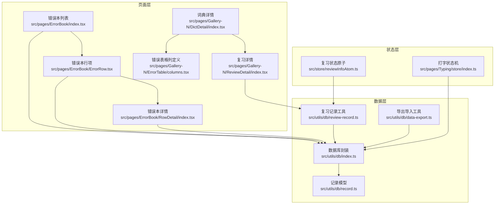
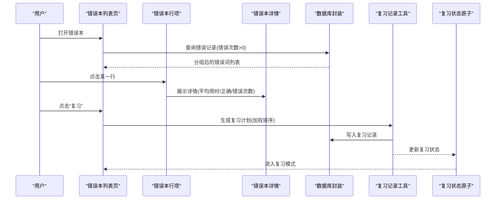
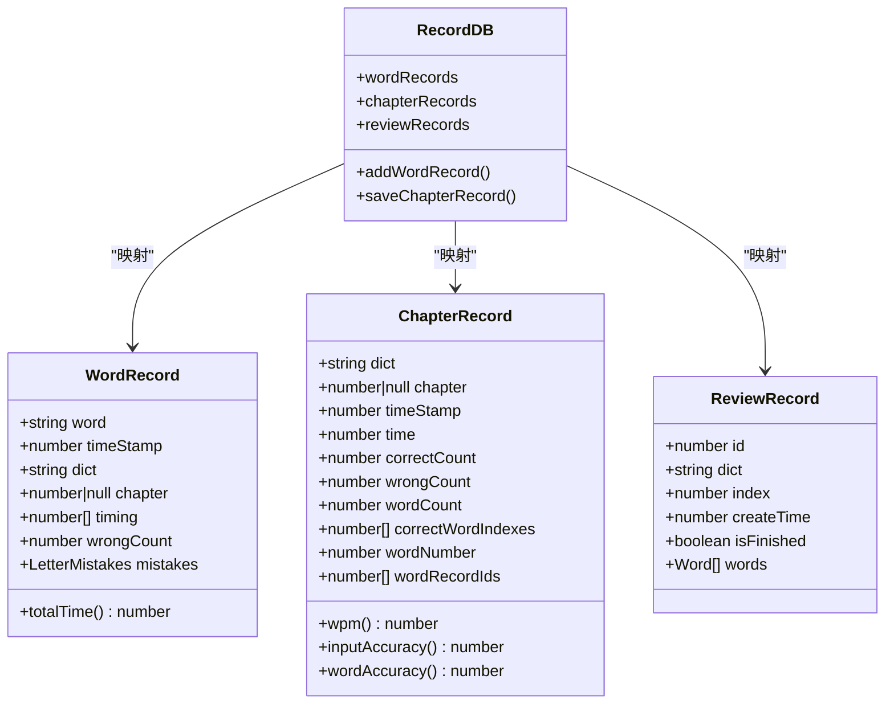
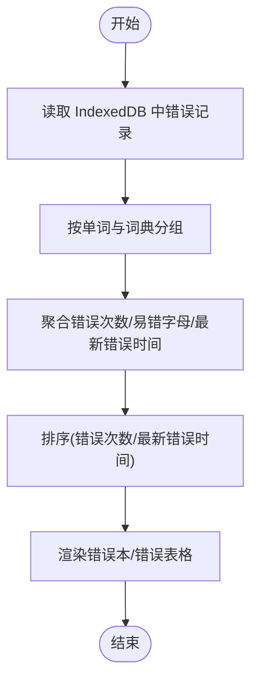
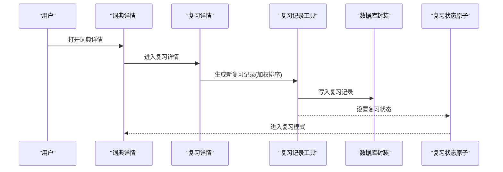
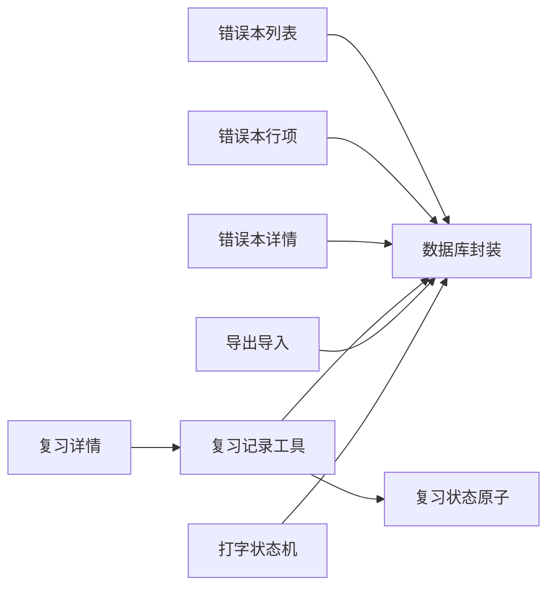

# 错误本系统

<cite>
**本文引用的文件**
- [src/pages/ErrorBook/index.tsx](file://src/pages/ErrorBook/index.tsx)
- [src/pages/ErrorBook/ErrorRow.tsx](file://src/pages/ErrorBook/ErrorRow.tsx)
- [src/pages/ErrorBook/RowDetail/index.tsx](file://src/pages/ErrorBook/RowDetail/index.tsx)
- [src/pages/ErrorBook/RowDetail/DataTag.tsx](file://src/pages/ErrorBook/RowDetail/DataTag.tsx)
- [src/pages/ErrorBook/RowDetail/RowPagination.tsx](file://src/pages/ErrorBook/RowDetail/RowPagination.tsx)
- [src/pages/ErrorBook/Pagination.tsx](file://src/pages/ErrorBook/Pagination.tsx)
- [src/pages/ErrorBook/DropdownExport.tsx](file://src/pages/ErrorBook/DropdownExport.tsx)
- [src/pages/ErrorBook/store/index.ts](file://src/pages/ErrorBook/store/index.ts)
- [src/pages/ErrorBook/type.ts](file://src/pages/ErrorBook/type.ts)
- [src/utils/db/index.ts](file://src/utils/db/index.ts)
- [src/utils/db/record.ts](file://src/utils/db/record.ts)
- [src/utils/db/review-record.ts](file://src/utils/db/review-record.ts)
- [src/utils/db/data-export.ts](file://src/utils/db/data-export.ts)
- [src/pages/Gallery-N/DictDetail/index.tsx](file://src/pages/Gallery-N/DictDetail/index.tsx)
- [src/pages/Gallery-N/ReviewDetail/index.tsx](file://src/pages/Gallery-N/ReviewDetail/index.tsx)
- [src/pages/Gallery-N/ErrorTable/columns.tsx](file://src/pages/Gallery-N/ErrorTable/columns.tsx)
- [src/pages/Gallery-N/hooks/useErrorWords.ts](file://src/pages/Gallery-N/hooks/useErrorWords.ts)
- [src/pages/Analysis/hooks/useWordStats.ts](file://src/pages/Analysis/hooks/useWordStats.ts)
- [src/store/reviewInfoAtom.ts](file://src/store/reviewInfoAtom.ts)
- [src/pages/Typing/store/index.ts](file://src/pages/Typing/store/index.ts)
</cite>

## 目录

1. [简介](#简介)
2. [项目结构](#项目结构)
3. [核心组件](#核心组件)
4. [架构总览](#架构总览)
5. [组件详解](#组件详解)
6. [依赖关系分析](#依赖关系分析)
7. [性能与可扩展性](#性能与可扩展性)
8. [故障排查指南](#故障排查指南)
9. [结论](#结论)
10. [附录](#附录)

## 简介

本文件面向“错误本系统”的功能文档，围绕错误记录机制、错误分析与统计、复习功能与记忆曲线、数据结构与查询优化、以及导出/分享/同步等能力，提供从架构到实现细节的系统化说明，并给出扩展与定制化开发建议。

## 项目结构

错误本系统主要由以下层次构成：

- 页面层：错误本列表页、错误本详情、复习详情、词典详情中的错误表格与复习入口
- 数据层：IndexedDB 封装、记录模型、复习记录模型、导出导入工具
- 状态层：复习模式状态原子、Typing 状态机与动作
- 工具与分析：错误词聚合与统计、键盘错误热力分析

图表来源

- [src/pages/ErrorBook/index.tsx](file://src/pages/ErrorBook/index.tsx#L1-L136)
- [src/pages/ErrorBook/ErrorRow.tsx](file://src/pages/ErrorBook/ErrorRow.tsx#L1-L62)
- [src/pages/ErrorBook/RowDetail/index.tsx](file://src/pages/ErrorBook/RowDetail/index.tsx#L1-L120)
- [src/pages/Gallery-N/DictDetail/index.tsx](file://src/pages/Gallery-N/DictDetail/index.tsx#L1-L24)
- [src/pages/Gallery-N/ReviewDetail/index.tsx](file://src/pages/Gallery-N/ReviewDetail/index.tsx#L1-L34)
- [src/pages/Gallery-N/ErrorTable/columns.tsx](file://src/pages/Gallery-N/ErrorTable/columns.tsx#L15-L67)
- [src/utils/db/index.ts](file://src/utils/db/index.ts#L1-L136)
- [src/utils/db/record.ts](file://src/utils/db/record.ts#L1-L186)
- [src/utils/db/review-record.ts](file://src/utils/db/review-record.ts#L1-L69)
- [src/utils/db/data-export.ts](file://src/utils/db/data-export.ts#L1-L68)
- [src/store/reviewInfoAtom.ts](file://src/store/reviewInfoAtom.ts#L1-L29)
- [src/pages/Typing/store/index.ts](file://src/pages/Typing/store/index.ts#L1-L227)

章节来源

- [src/pages/ErrorBook/index.tsx](file://src/pages/ErrorBook/index.tsx#L1-L136)
- [src/utils/db/index.ts](file://src/utils/db/index.ts#L1-L136)

## 核心组件

- 错误本列表页：展示错误单词、错误次数、词典名称，支持分页、排序、删除、导出
- 错误本行项与详情：点击行项展开详情，展示平均用时、练习次数、正确/错误次数、发音与释义
- 复习详情：从错误本生成复习计划并进入复习模式
- 错误词聚合与统计：按词与词典聚合错误记录，计算错误次数、易错字母、最新错误时间
- 复习记录与记忆曲线：基于错误次数与最近错误时间加权排序，生成复习队列
- 数据库与模型：IndexedDB 表结构、记录类、复习记录类、章节记录类
- 导出导入：支持 gzip 压缩导出与导入，记录导入导出统计

章节来源

- [src/pages/ErrorBook/index.tsx](file://src/pages/ErrorBook/index.tsx#L1-L136)
- [src/pages/ErrorBook/ErrorRow.tsx](file://src/pages/ErrorBook/ErrorRow.tsx#L1-L62)
- [src/pages/ErrorBook/RowDetail/index.tsx](file://src/pages/ErrorBook/RowDetail/index.tsx#L1-L120)
- [src/pages/Gallery-N/ReviewDetail/index.tsx](file://src/pages/Gallery-N/ReviewDetail/index.tsx#L1-L34)
- [src/pages/Gallery-N/hooks/useErrorWords.ts](file://src/pages/Gallery-N/hooks/useErrorWords.ts#L1-L89)
- [src/utils/db/review-record.ts](file://src/utils/db/review-record.ts#L1-L69)
- [src/utils/db/record.ts](file://src/utils/db/record.ts#L1-L186)
- [src/utils/db/data-export.ts](file://src/utils/db/data-export.ts#L1-L68)

## 架构总览

错误本系统采用“页面层-状态层-数据层-工具层”的分层架构：

- 页面层负责用户交互与视图渲染
- 状态层通过原子与上下文管理复习模式与打字状态
- 数据层通过 IndexedDB 存储单词记录、章节记录与复习记录
- 工具层提供统计分析、导出导入与复习计划生成

图表来源

- [src/pages/ErrorBook/index.tsx](file://src/pages/ErrorBook/index.tsx#L1-L136)
- [src/pages/ErrorBook/ErrorRow.tsx](file://src/pages/ErrorBook/ErrorRow.tsx#L1-L62)
- [src/pages/ErrorBook/RowDetail/index.tsx](file://src/pages/ErrorBook/RowDetail/index.tsx#L1-L120)
- [src/utils/db/index.ts](file://src/utils/db/index.ts#L1-L136)
- [src/utils/db/review-record.ts](file://src/utils/db/review-record.ts#L1-L69)
- [src/store/reviewInfoAtom.ts](file://src/store/reviewInfoAtom.ts#L1-L29)

## 组件详解

### 错误记录机制与数据模型

- 记录模型
  - 单词记录：包含单词、时间戳、词典标识、章节、输入耗时序列、错误次数、逐字母错误映射
  - 章节记录：包含章节维度的总时长、正确/错误计数、单词数量、正确单词索引集合、单词记录 ID 列表
  - 复习记录：包含当前复习进度索引、创建时间、是否完成、单词队列
- 数据库表结构
  - wordRecords：主键自增，索引覆盖(word, timeStamp, dict, chapter, wrongCount)，复合索引[dic+chapter]
  - chapterRecords：主键自增，索引覆盖(timeStamp, dict, chapter, time)
  - reviewRecords：主键自增，索引覆盖(dict, createTime, isFinished)
- 记录写入流程
  - 打字过程中收集逐字母输入时间差与错误映射，生成单词记录并入库
  - 章节结束时汇总正确/错误计数与单词索引，生成章节记录并入库
- 删除与清理
  - 支持按单词与词典删除对应记录

图表来源

- [src/utils/db/record.ts](file://src/utils/db/record.ts#L1-L186)
- [src/utils/db/index.ts](file://src/utils/db/index.ts#L1-L136)

章节来源

- [src/utils/db/record.ts](file://src/utils/db/record.ts#L1-L186)
- [src/utils/db/index.ts](file://src/utils/db/index.ts#L1-L136)

### 错误识别、记录与分类

- 错误识别
  - 输入阶段按字母粒度记录错误映射，形成逐字母错误列表
  - 统计层面按词聚合，累计错误次数、统计易错字母位置
- 记录落库
  - 单词记录包含错误次数与逐字母错误映射
  - 章节记录汇总正确/错误计数与单词索引，便于后续分析
- 分类与排序
  - 错误本按错误次数排序；词典详情的错误表格按错误次数与最新错误时间综合排序

章节来源

- [src/pages/Typing/store/index.ts](file://src/pages/Typing/store/index.ts#L1-L227)
- [src/pages/Gallery-N/hooks/useErrorWords.ts](file://src/pages/Gallery-N/hooks/useErrorWords.ts#L1-L89)
- [src/pages/Gallery-N/ErrorTable/columns.tsx](file://src/pages/Gallery-N/ErrorTable/columns.tsx#L15-L67)

### 错误分析与统计

- 错误本列表统计
  - 聚合同一单词在不同章节的错误记录，计算总错误次数
  - 提供升序/降序排序
- 错误详情统计
  - 计算平均用时、练习次数、正确/错误次数
- 键盘错误热力分析
  - 基于错误映射统计各按键出现频率，用于可视化与复盘

图表来源

- [src/pages/Gallery-N/hooks/useErrorWords.ts](file://src/pages/Gallery-N/hooks/useErrorWords.ts#L1-L89)
- [src/pages/ErrorBook/index.tsx](file://src/pages/ErrorBook/index.tsx#L1-L136)
- [src/pages/Analysis/hooks/useWordStats.ts](file://src/pages/Analysis/hooks/useWordStats.ts#L1-L132)

章节来源

- [src/pages/Gallery-N/hooks/useErrorWords.ts](file://src/pages/Gallery-N/hooks/useErrorWords.ts#L1-L89)
- [src/pages/ErrorBook/index.tsx](file://src/pages/ErrorBook/index.tsx#L1-L136)
- [src/pages/Analysis/hooks/useWordStats.ts](file://src/pages/Analysis/hooks/useWordStats.ts#L1-L132)

### 复习功能与记忆曲线

- 复习计划生成
  - 基于错误次数与最新错误时间进行排名，计算加权得分，生成复习队列
  - 将复习记录写入 IndexedDB，并更新复习状态原子
- 复习模式运行
  - 复习状态原子持久化存储，每次更新均写回 IndexedDB
  - 打字状态机在下一单词时可选更新复习记录
- 复习入口
  - 词典详情页提供“开始复习”和“继续复习”，将当前词典与错误词数据传入生成复习记录

图表来源

- [src/pages/Gallery-N/ReviewDetail/index.tsx](file://src/pages/Gallery-N/ReviewDetail/index.tsx#L1-L34)
- [src/utils/db/review-record.ts](file://src/utils/db/review-record.ts#L1-L69)
- [src/store/reviewInfoAtom.ts](file://src/store/reviewInfoAtom.ts#L1-L29)

章节来源

- [src/pages/Gallery-N/ReviewDetail/index.tsx](file://src/pages/Gallery-N/ReviewDetail/index.tsx#L1-L34)
- [src/utils/db/review-record.ts](file://src/utils/db/review-record.ts#L1-L69)
- [src/store/reviewInfoAtom.ts](file://src/store/reviewInfoAtom.ts#L1-L29)

### 数据结构设计、查询优化与批量操作

- 数据结构设计
  - IndexedDB 表：wordRecords、chapterRecords、reviewRecords
  - 主键与索引：wordRecords 主键自增并建立多字段索引；chapterRecords 建立时间与复合索引；reviewRecords 建立字典与时间索引
- 查询优化
  - 错误本列表：按 wrongCount > 0 过滤并分组聚合
  - 错误详情：按单词与词典过滤，计算平均用时与统计指标
  - 复习记录：按 dict 查询最新未完成记录
- 批量操作
  - 导出：全库导出并 gzip 压缩，回调进度
  - 导入：解压后导入，支持版本差异与增量策略

章节来源

- [src/utils/db/index.ts](file://src/utils/db/index.ts#L1-L136)
- [src/pages/ErrorBook/index.tsx](file://src/pages/ErrorBook/index.tsx#L1-L136)
- [src/utils/db/data-export.ts](file://src/utils/db/data-export.ts#L1-L68)

### 错误本导出、分享与同步

- 导出
  - 支持 .xlsx/.csv 导出，按当前筛选结果生成表格，补充词典释义
- 同步
  - 支持 gzip 压缩的全量导出与导入，记录导入/导出大小与条目数

章节来源

- [src/pages/ErrorBook/DropdownExport.tsx](file://src/pages/ErrorBook/DropdownExport.tsx#L1-L131)
- [src/utils/db/data-export.ts](file://src/utils/db/data-export.ts#L1-L68)

## 依赖关系分析

- 组件耦合
  - 错误本列表依赖数据库封装与分页组件
  - 错误详情依赖词典资源映射与发音组件
  - 复习详情依赖复习记录工具与复习状态原子
- 外部依赖
  - IndexedDB(Dexie)、Radix UI、xlsx、file-saver、pako、dayjs、swr
- 循环依赖
  - 无明显循环依赖；复习记录工具与状态原子通过函数调用解耦

图表来源

- [src/pages/ErrorBook/index.tsx](file://src/pages/ErrorBook/index.tsx#L1-L136)
- [src/utils/db/index.ts](file://src/utils/db/index.ts#L1-L136)
- [src/utils/db/review-record.ts](file://src/utils/db/review-record.ts#L1-L69)
- [src/store/reviewInfoAtom.ts](file://src/store/reviewInfoAtom.ts#L1-L29)
- [src/utils/db/data-export.ts](file://src/utils/db/data-export.ts#L1-L68)
- [src/pages/Typing/store/index.ts](file://src/pages/Typing/store/index.ts#L1-L227)

章节来源

- [src/pages/ErrorBook/index.tsx](file://src/pages/ErrorBook/index.tsx#L1-L136)
- [src/utils/db/index.ts](file://src/utils/db/index.ts#L1-L136)
- [src/utils/db/review-record.ts](file://src/utils/db/review-record.ts#L1-L69)
- [src/store/reviewInfoAtom.ts](file://src/store/reviewInfoAtom.ts#L1-L29)
- [src/utils/db/data-export.ts](file://src/utils/db/data-export.ts#L1-L68)
- [src/pages/Typing/store/index.ts](file://src/pages/Typing/store/index.ts#L1-L227)

## 性能与可扩展性

- 性能特性
  - IndexedDB 索引覆盖查询，减少全表扫描
  - 错误聚合在内存中进行，避免多次 IO
  - 复习计划生成与导出采用异步与进度回调，避免阻塞
- 扩展点
  - 新增统计维度：可在错误聚合与统计模块扩展新的指标
  - 自定义复习策略：可替换加权权重或引入更复杂的记忆曲线
  - 多语言/多词典：通过词典映射与资源加载扩展

[本节为通用性能讨论，不直接分析具体文件]

## 故障排查指南

- 错误本列表为空
  - 检查是否存在错误记录：确认 wrongCount > 0 的记录是否存在
  - 检查分组逻辑：确保按单词与词典分组后能正确汇总
- 复习无法继续
  - 检查最新复习记录是否已标记完成
  - 检查复习状态原子是否持久化成功
- 导出失败
  - 检查浏览器兼容性与权限设置
  - 检查导出进度回调是否被提前中断

章节来源

- [src/pages/ErrorBook/index.tsx](file://src/pages/ErrorBook/index.tsx#L1-L136)
- [src/utils/db/review-record.ts](file://src/utils/db/review-record.ts#L1-L69)
- [src/store/reviewInfoAtom.ts](file://src/store/reviewInfoAtom.ts#L1-L29)
- [src/utils/db/data-export.ts](file://src/utils/db/data-export.ts#L1-L68)

## 结论

错误本系统通过清晰的分层架构与 IndexedDB 数据模型，实现了从错误识别、记录、统计到复习计划与执行的完整闭环。系统具备良好的扩展性与可维护性，适合进一步引入更精细的记忆曲线与个性化复习策略。

[本节为总结性内容，不直接分析具体文件]

## 附录

### 开发者扩展与定制化建议

- 新增统计维度
  - 在错误聚合与统计模块增加新的指标计算与可视化
- 自定义复习策略
  - 修改复习计划生成函数中的权重或排序规则
- 多词典支持
  - 通过词典映射与资源加载扩展更多词典
- 导入导出增强
  - 支持增量导入、字段映射与校验

[本节为通用指导，不直接分析具体文件]
