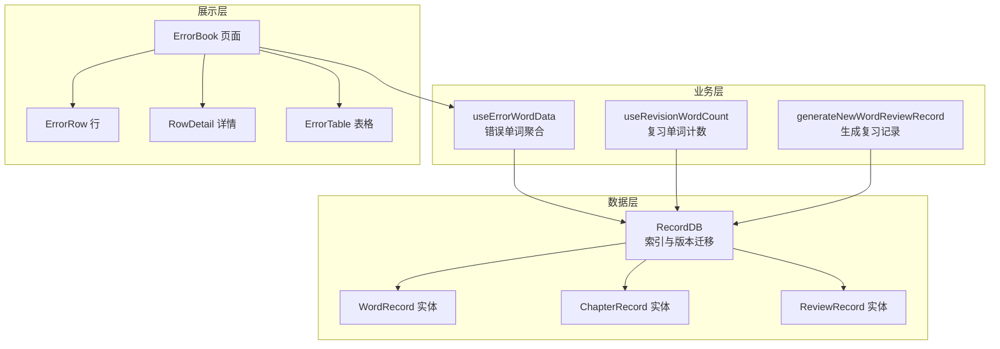
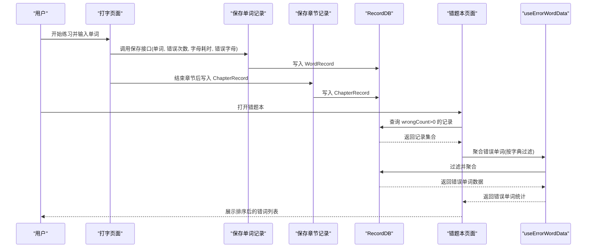
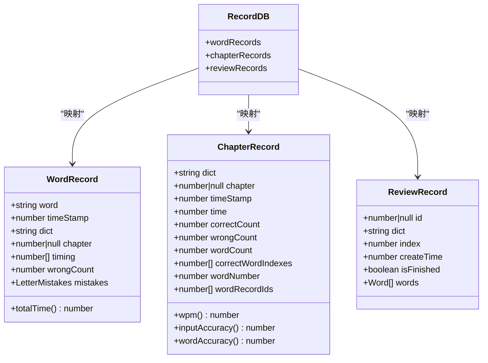
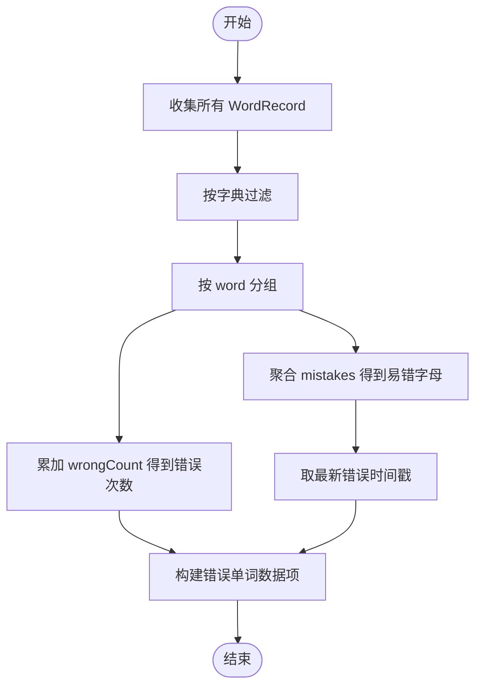
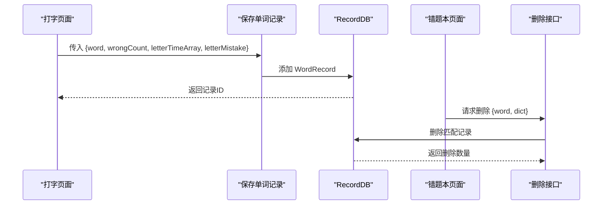
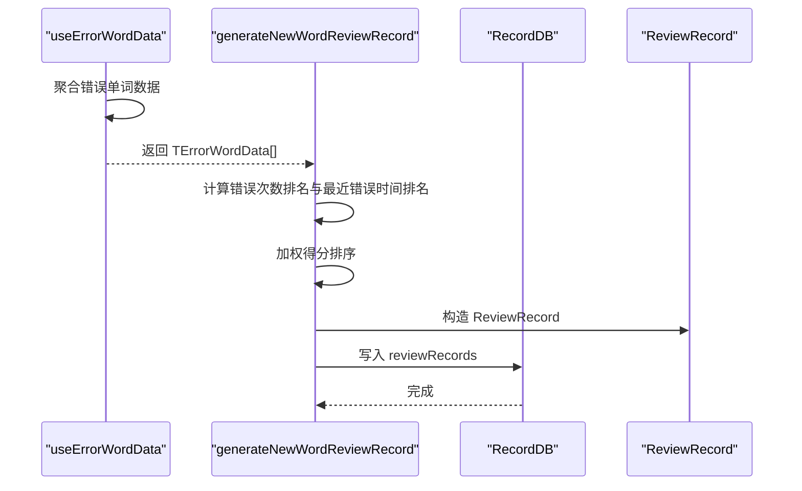

# 错误记录机制

<cite>
**本文引用的文件**
- [src/utils/db/index.ts](file://src/utils/db/index.ts)
- [src/utils/db/record.ts](file://src/utils/db/record.ts)
- [src/utils/db/review-record.ts](file://src/utils/db/review-record.ts)
- [src/utils/db/data-export.ts](file://src/utils/db/data-export.ts)
- [src/pages/ErrorBook/index.tsx](file://src/pages/ErrorBook/index.tsx)
- [src/pages/ErrorBook/type.ts](file://src/pages/ErrorBook/type.ts)
- [src/pages/ErrorBook/ErrorRow.tsx](file://src/pages/ErrorBook/ErrorRow.tsx)
- [src/pages/ErrorBook/RowDetail/index.tsx](file://src/pages/ErrorBook/RowDetail/index.tsx)
- [src/pages/ErrorBook/store/index.ts](file://src/pages/ErrorBook/store/index.ts)
- [src/pages/Gallery-N/hooks/useErrorWords.ts](file://src/pages/Gallery-N/hooks/useErrorWords.ts)
- [src/pages/Gallery-N/hooks/useRevisionWordCount.ts](file://src/pages/Gallery-N/hooks/useRevisionWordCount.ts)
- [src/pages/Gallery-N/ErrorTable/index.tsx](file://src/pages/Gallery-N/ErrorTable/index.tsx)
- [src/pages/Gallery-N/ErrorTable/columns.tsx](file://src/pages/Gallery-N/ErrorTable/columns.tsx)
- [src/pages/Typing/components/ErrorBookButton.tsx](file://src/pages/Typing/components/ErrorBookButton.tsx)
</cite>

## 目录

1. [简介](#简介)
2. [项目结构](#项目结构)
3. [核心组件](#核心组件)
4. [架构总览](#架构总览)
5. [详细组件分析](#详细组件分析)
6. [依赖关系分析](#依赖关系分析)
7. [性能考虑](#性能考虑)
8. [故障排查指南](#故障排查指南)
9. [结论](#结论)
10. [附录](#附录)

## 简介

本技术文档围绕“错误记录机制”展开，系统性阐述错误单词的识别与记录流程、错误计数器工作原理、错误状态判定标准、记录数据的存储结构与索引策略、生命周期管理（创建、更新、删除、清理）、API 使用示例与最佳实践，以及性能优化与内存管理方案。目标是帮助开发者与产品人员全面理解从用户练习到错误统计、展示与导出的完整链路。

## 项目结构

错误记录相关的核心代码分布在以下模块：

- 数据层：数据库定义、实体类、索引与版本迁移、导出导入工具
- 业务层：错题本页面、复习记录生成、错误单词聚合与排序
- 展示层：错题本表格、行详情、分页与交互按钮



图表来源

- [src/utils/db/index.ts](file://src/utils/db/index.ts#L1-L42)
- [src/utils/db/record.ts](file://src/utils/db/record.ts#L1-L186)
- [src/pages/Gallery-N/hooks/useErrorWords.ts](file://src/pages/Gallery-N/hooks/useErrorWords.ts#L1-L89)
- [src/pages/Gallery-N/hooks/useRevisionWordCount.ts](file://src/pages/Gallery-N/hooks/useRevisionWordCount.ts#L1-L34)
- [src/utils/db/review-record.ts](file://src/utils/db/review-record.ts#L1-L68)
- [src/pages/ErrorBook/index.tsx](file://src/pages/ErrorBook/index.tsx#L1-L136)
- [src/pages/ErrorBook/ErrorRow.tsx](file://src/pages/ErrorBook/ErrorRow.tsx#L1-L62)
- [src/pages/ErrorBook/RowDetail/index.tsx](file://src/pages/ErrorBook/RowDetail/index.tsx#L1-L120)
- [src/pages/Gallery-N/ErrorTable/index.tsx](file://src/pages/Gallery-N/ErrorTable/index.tsx#L1-L88)

章节来源

- [src/utils/db/index.ts](file://src/utils/db/index.ts#L1-L42)
- [src/utils/db/record.ts](file://src/utils/db/record.ts#L1-L186)

## 核心组件

- 数据库与索引
  - 数据库版本与索引在数据库初始化中定义，包含 wordRecords、chapterRecords、reviewRecords 等表及复合索引，确保按字典与章节高效过滤。
- 实体类
  - WordRecord：记录单个单词的错误次数、错误字母序列、输入耗时等。
  - ChapterRecord：记录整章练习的统计指标与关联的 wordRecordIds。
  - ReviewRecord：记录复习计划的当前进度、创建时间与是否完成。
- 业务钩子与工具
  - useErrorWordData：按字典聚合错误单词，统计错误次数、易错字母与最近错误时间。
  - useRevisionWordCount：统计某字典下存在错误的单词数量。
  - generateNewWordReviewRecord：基于错误统计生成复习记录并持久化。
- 展示组件
  - ErrorBook：错题本页面，支持排序、分页、删除与详情查看。
  - ErrorRow/RowDetail：单行展示与详情弹窗。
  - ErrorTable：用于 Gallery-N 的错误单词表格视图。

章节来源

- [src/utils/db/index.ts](file://src/utils/db/index.ts#L16-L42)
- [src/utils/db/record.ts](file://src/utils/db/record.ts#L1-L186)
- [src/pages/Gallery-N/hooks/useErrorWords.ts](file://src/pages/Gallery-N/hooks/useErrorWords.ts#L1-L89)
- [src/pages/Gallery-N/hooks/useRevisionWordCount.ts](file://src/pages/Gallery-N/hooks/useRevisionWordCount.ts#L1-L34)
- [src/utils/db/review-record.ts](file://src/utils/db/review-record.ts#L1-L68)
- [src/pages/ErrorBook/index.tsx](file://src/pages/ErrorBook/index.tsx#L1-L136)
- [src/pages/ErrorBook/ErrorRow.tsx](file://src/pages/ErrorBook/ErrorRow.tsx#L1-L62)
- [src/pages/ErrorBook/RowDetail/index.tsx](file://src/pages/ErrorBook/RowDetail/index.tsx#L1-L120)
- [src/pages/Gallery-N/ErrorTable/index.tsx](file://src/pages/Gallery-N/ErrorTable/index.tsx#L1-L88)

## 架构总览

错误记录从“打字练习”开始，经由“单词记录保存”“章节记录保存”，再到“错误聚合与展示”，最终支持“复习记录生成与导出”。整体流程如下：



图表来源

- [src/utils/db/index.ts](file://src/utils/db/index.ts#L43-L136)
- [src/pages/ErrorBook/index.tsx](file://src/pages/ErrorBook/index.tsx#L64-L90)
- [src/pages/Gallery-N/hooks/useErrorWords.ts](file://src/pages/Gallery-N/hooks/useErrorWords.ts#L22-L89)

## 详细组件分析

### 数据模型与索引设计

- WordRecord 字段
  - 关键字段：word、dict、chapter、timeStamp、timing、wrongCount、mistakes
  - 用途：记录每次练习的单词、所属字典与章节、时间戳、逐字母耗时、错误次数、错误字母映射
- ChapterRecord 字段
  - 关键字段：dict、chapter、timeStamp、time、correctCount、wrongCount、wordCount、correctWordIndexes、wordNumber、wordRecordIds
  - 用途：记录整章练习的统计与关联的单词记录 ID 列表
- ReviewRecord 字段
  - 关键字段：dict、index、createTime、isFinished、words
  - 用途：记录复习计划的进度、创建时间、完成状态与单词序列
- 复合索引
  - wordRecords: [dict+chapter]，用于按字典与章节快速过滤
  - chapterRecords: [dict+chapter]，用于章节统计与回放
- 版本迁移
  - v1/v2/v3 增量添加 wrongCount、reviewRecords 等，保证向后兼容



图表来源

- [src/utils/db/record.ts](file://src/utils/db/record.ts#L1-L186)
- [src/utils/db/index.ts](file://src/utils/db/index.ts#L16-L42)

章节来源

- [src/utils/db/record.ts](file://src/utils/db/record.ts#L1-L186)
- [src/utils/db/index.ts](file://src/utils/db/index.ts#L16-L42)

### 错误计数器与状态判定

- 错误计数器
  - WordRecord.wrongCount：累计该单词的错误次数
  - WordRecord.mistakes：按字母索引记录错误输入字符数组
- 错误状态判定
  - 页面侧通过 wrongCount > 0 判定为错误记录
  - 错题本聚合时按 word+dict 去重并累加 wrongCount
- 易错字母统计
  - useErrorWordData 将每个记录的 mistakes 按字母索引聚合，得到 errorLetters 并排序提取易错字母



图表来源

- [src/pages/Gallery-N/hooks/useErrorWords.ts](file://src/pages/Gallery-N/hooks/useErrorWords.ts#L22-L89)
- [src/pages/ErrorBook/index.tsx](file://src/pages/ErrorBook/index.tsx#L64-L90)

章节来源

- [src/pages/Gallery-N/hooks/useErrorWords.ts](file://src/pages/Gallery-N/hooks/useErrorWords.ts#L1-L89)
- [src/pages/ErrorBook/index.tsx](file://src/pages/ErrorBook/index.tsx#L64-L90)

### 错误记录生命周期管理

- 创建
  - 保存单词记录：useSaveWordRecord 将逐字母耗时转换为 timing，构造 WordRecord 并写入
  - 保存章节记录：useSaveChapterRecord 构造 ChapterRecord 并写入
- 更新
  - 错误记录本身不可直接更新；复习记录可通过 ReviewRecord 的 index 与 isFinished 字段推进
- 删除
  - 错题本支持按 word+dict 删除记录：useDeleteWordRecord
- 清理
  - 导出/导入：data-export 提供数据库导出与压缩、导入能力，便于备份与迁移



图表来源

- [src/utils/db/index.ts](file://src/utils/db/index.ts#L80-L136)
- [src/pages/ErrorBook/index.tsx](file://src/pages/ErrorBook/index.tsx#L92-L96)
- [src/utils/db/data-export.ts](file://src/utils/db/data-export.ts#L1-L42)

章节来源

- [src/utils/db/index.ts](file://src/utils/db/index.ts#L80-L136)
- [src/pages/ErrorBook/index.tsx](file://src/pages/ErrorBook/index.tsx#L92-L96)
- [src/utils/db/data-export.ts](file://src/utils/db/data-export.ts#L1-L42)

### 复习记录生成与排序

- 排序策略
  - 基于错误次数与最近错误时间进行排名，加权求和后排序
  - 权重：错误次数权重 0.6，最近错误时间权重 0.4
- 生成流程
  - useErrorWordData 聚合错误单词数据
  - generateNewWordReviewRecord 计算排名与得分，生成 ReviewRecord 并持久化



图表来源

- [src/pages/Gallery-N/hooks/useErrorWords.ts](file://src/pages/Gallery-N/hooks/useErrorWords.ts#L22-L89)
- [src/utils/db/review-record.ts](file://src/utils/db/review-record.ts#L1-L68)

章节来源

- [src/utils/db/review-record.ts](file://src/utils/db/review-record.ts#L1-L68)
- [src/pages/Gallery-N/hooks/useErrorWords.ts](file://src/pages/Gallery-N/hooks/useErrorWords.ts#L1-L89)

### 错误记录 API 使用示例与最佳实践

- 保存单词记录
  - 调用 useSaveWordRecord，传入单词、错误次数、逐字母耗时数组、错误字母映射
  - 保存成功后可获取记录 ID，用于章节记录的 wordRecordIds 关联
- 保存章节记录
  - 调用 useSaveChapterRecord，传入打字状态中的统计信息
- 错题本查看与删除
  - 打开 /error-book，页面自动查询 wrongCount>0 的记录并聚合
  - 支持按单词删除对应记录，删除后刷新列表
- 复习记录生成
  - 在字典页面调用 generateNewWordReviewRecord，传入字典 ID 与错误数据，生成复习计划
- 最佳实践
  - 使用复合索引 [dict+chapter] 过滤数据，避免全表扫描
  - 聚合阶段先按字典过滤，再按单词分组，减少不必要的计算
  - 删除操作建议批量或按需触发，避免频繁 I/O

章节来源

- [src/utils/db/index.ts](file://src/utils/db/index.ts#L80-L136)
- [src/pages/ErrorBook/index.tsx](file://src/pages/ErrorBook/index.tsx#L64-L96)
- [src/utils/db/review-record.ts](file://src/utils/db/review-record.ts#L21-L68)

## 依赖关系分析

- 组件耦合
  - 错题本页面依赖数据库读取与删除接口
  - 错误单词聚合依赖字典词表与数据库记录
  - 复习记录生成依赖错误单词聚合结果
- 外部依赖
  - Dexie 作为 IndexedDB 封装，提供版本迁移、索引与事务能力
  - dexie-export-import 用于数据库导出与导入
  - react-table 用于表格渲染与排序

```mermaid
graph LR
DB["RecordDB"] <- --> WR["WordRecord"]
DB <- --> CR["ChapterRecord"]
DB <- --> RR["ReviewRecord"]
EW["useErrorWordData"] --> DB
RW["useRevisionWordCount"] --> DB
GR["generateNewWordReviewRecord"] --> DB
EB["ErrorBook"] --> EW
EB --> DB
ER["ErrorRow"] --> EB
RD["RowDetail"] --> EB
ET["ErrorTable"] --> EW
```

图表来源

- [src/utils/db/index.ts](file://src/utils/db/index.ts#L16-L42)
- [src/pages/Gallery-N/hooks/useErrorWords.ts](file://src/pages/Gallery-N/hooks/useErrorWords.ts#L1-L89)
- [src/pages/Gallery-N/hooks/useRevisionWordCount.ts](file://src/pages/Gallery-N/hooks/useRevisionWordCount.ts#L1-L34)
- [src/utils/db/review-record.ts](file://src/utils/db/review-record.ts#L1-L68)
- [src/pages/ErrorBook/index.tsx](file://src/pages/ErrorBook/index.tsx#L1-L136)

章节来源

- [src/utils/db/index.ts](file://src/utils/db/index.ts#L16-L42)
- [src/pages/Gallery-N/hooks/useErrorWords.ts](file://src/pages/Gallery-N/hooks/useErrorWords.ts#L1-L89)
- [src/pages/Gallery-N/hooks/useRevisionWordCount.ts](file://src/pages/Gallery-N/hooks/useRevisionWordCount.ts#L1-L34)
- [src/utils/db/review-record.ts](file://src/utils/db/review-record.ts#L1-L68)
- [src/pages/ErrorBook/index.tsx](file://src/pages/ErrorBook/index.tsx#L1-L136)

## 性能考虑

- 索引与查询优化
  - 使用 [dict+chapter] 复合索引过滤，避免全表扫描
  - 聚合阶段先按字典过滤，再按单词分组，减少内存占用
- 数据结构与复杂度
  - 错误聚合使用 Map 去重与 reduce 累加，时间复杂度 O(n)
  - 排序采用稳定排序，时间复杂度 O(k log k)，k 为错误单词数量
- 内存管理
  - 错题本分页渲染，避免一次性加载全部记录
  - 表格组件使用虚拟滚动与懒加载，降低 DOM 与 JS 内存压力
- I/O 优化
  - 批量删除与导出采用异步处理，避免阻塞主线程
  - 导出前先统计行数，导出完成后统一记录大小与条目数

章节来源

- [src/pages/ErrorBook/index.tsx](file://src/pages/ErrorBook/index.tsx#L58-L90)
- [src/pages/Gallery-N/ErrorTable/index.tsx](file://src/pages/Gallery-N/ErrorTable/index.tsx#L1-L88)
- [src/utils/db/data-export.ts](file://src/utils/db/data-export.ts#L1-L42)

## 故障排查指南

- 无法显示错误记录
  - 检查数据库版本与索引是否正确初始化
  - 确认查询条件 wrongCount>0 是否生效
- 删除无效
  - 确认传入的 word 与 dict 是否与记录一致
  - 查看返回的删除数量是否为 0
- 复习记录未生成
  - 检查错误单词数据是否为空
  - 确认 generateNewWordReviewRecord 的字典 ID 与错误数据匹配
- 导出失败
  - 检查浏览器对 file-saver 与 dexie-export-import 的支持
  - 确认导出回调返回值未中断导出流程

章节来源

- [src/utils/db/index.ts](file://src/utils/db/index.ts#L16-L42)
- [src/pages/ErrorBook/index.tsx](file://src/pages/ErrorBook/index.tsx#L92-L96)
- [src/utils/db/review-record.ts](file://src/utils/db/review-record.ts#L21-L68)
- [src/utils/db/data-export.ts](file://src/utils/db/data-export.ts#L1-L42)

## 结论

本机制以 Dexie 为核心，围绕 WordRecord/ChapterRecord/ReviewRecord 三类实体构建了完整的错误记录与复习体系。通过合理的索引设计、聚合策略与分页展示，实现了高可用的错题本与复习功能。配合导出导入与删除清理，满足长期使用的数据治理需求。建议在大规模数据场景下进一步引入缓存与增量聚合策略，持续优化性能与用户体验。

## 附录

- 相关入口与导航
  - 错题本入口：Typing 页面的“查看错题本”按钮跳转至 /error-book
  - 错题本页面：支持排序、分页、删除与详情查看
  - 复习记录：在字典页面生成并保存至 reviewRecords

章节来源

- [src/pages/Typing/components/ErrorBookButton.tsx](file://src/pages/Typing/components/ErrorBookButton.tsx#L1-L26)
- [src/pages/ErrorBook/index.tsx](file://src/pages/ErrorBook/index.tsx#L1-L136)
- [src/utils/db/review-record.ts](file://src/utils/db/review-record.ts#L21-L68)
