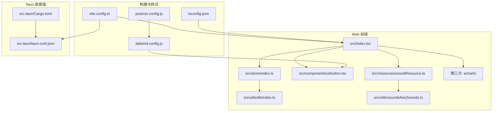
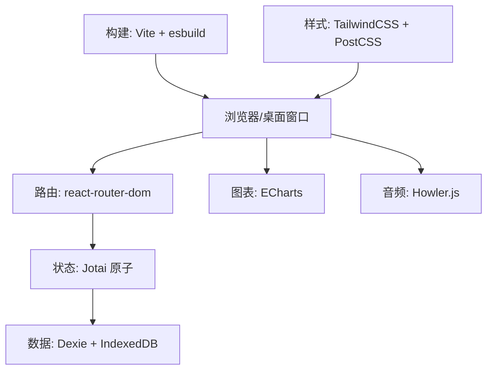
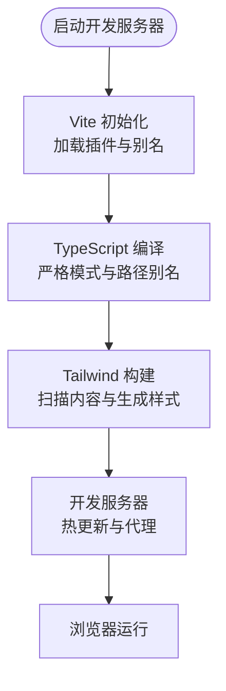
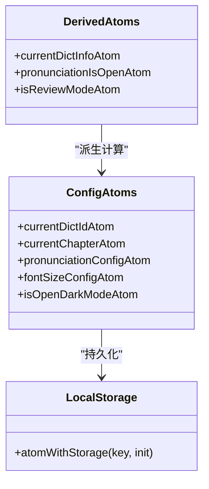
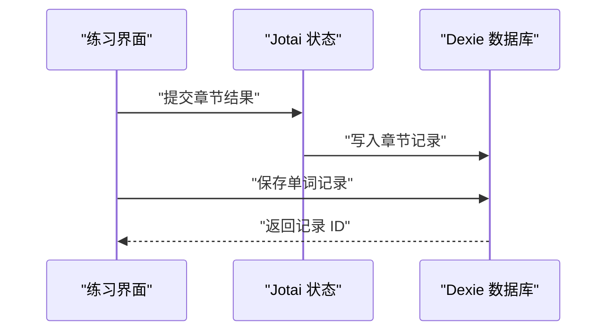
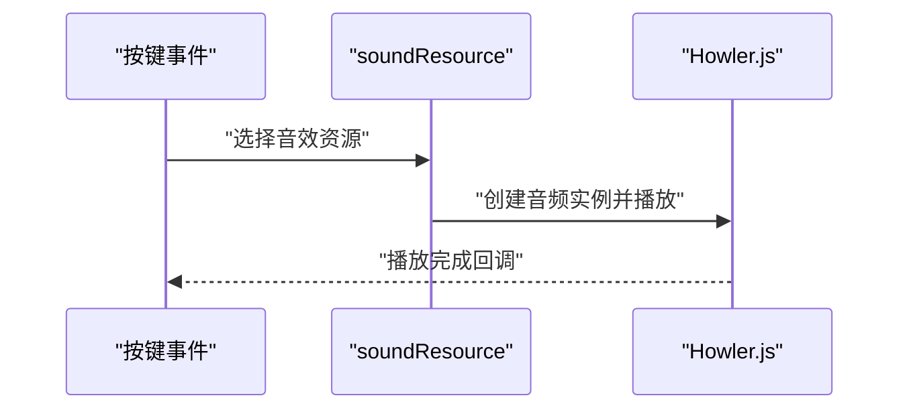
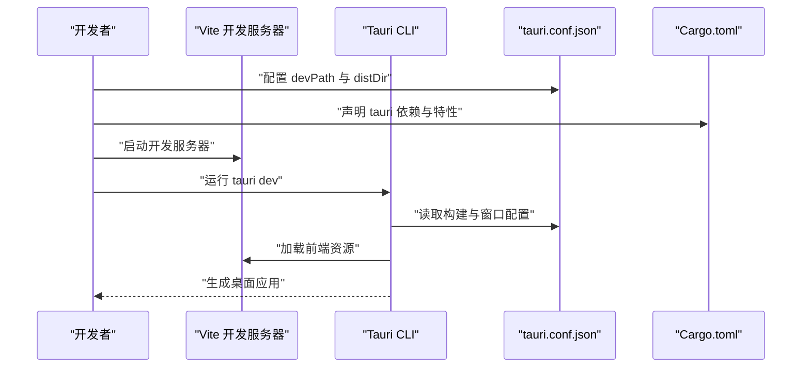
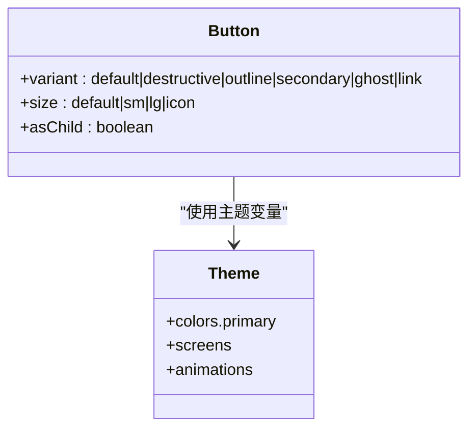
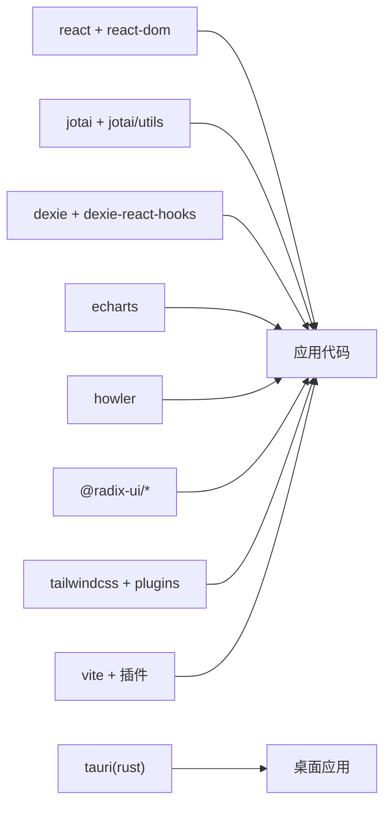

# 技术栈概览

<cite>
**本文引用的文件**
- [package.json](file://package.json)
- [vite.config.ts](file://vite.config.ts)
- [tsconfig.json](file://tsconfig.json)
- [tailwind.config.js](file://tailwind.config.js)
- [postcss.config.js](file://postcss.config.js)
- [src/index.tsx](file://src/index.tsx)
- [src/store/index.ts](file://src/store/index.ts)
- [src/utils/db/index.ts](file://src/utils/db/index.ts)
- [src/pages/Typing/store/index.ts](file://src/pages/Typing/store/index.ts)
- [src/components/ui/button.tsx](file://src/components/ui/button.tsx)
- [src/resources/soundResource.ts](file://src/resources/soundResource.ts)
- [src/utils/sounds/keySounds.ts](file://src/utils/sounds/keySounds.ts)
- [src-tauri/Cargo.toml](file://src-tauri/Cargo.toml)
- [src-tauri/tauri.conf.json](file://src-tauri/tauri.conf.json)
- [README.md](file://README.md)
</cite>

## 目录

1. [引言](#引言)
2. [项目结构](#项目结构)
3. [核心组件](#核心组件)
4. [架构总览](#架构总览)
5. [详细组件分析](#详细组件分析)
6. [依赖关系分析](#依赖关系分析)
7. [性能考量](#性能考量)
8. [故障排查指南](#故障排查指南)
9. [结论](#结论)
10. [附录](#附录)

## 引言

本文件面向 Qwerty Learner 项目的技术选型与实现，系统梳理现代前端技术栈（React 18 + TypeScript + Vite + TailwindCSS）的组合优势与落地方式；解释状态管理方案 Jotai 的原子状态模型；数据库层 Dexie + IndexedDB 的数据持久化；图表库 ECharts、音频处理 Howler.js 的应用；以及 Tauri 桌面端集成与跨平台兼容策略。同时给出构建工具链、开发环境配置与部署策略，帮助开发者理解技术决策依据与最佳实践。

## 项目结构

项目采用“前端单页应用 + Tauri 桌面端”双入口架构：

- Web 前端：React 18 + TypeScript，Vite 构建，TailwindCSS 样式体系，Jotai 状态管理，Dexie + IndexedDB 数据持久化，ECharts 图表与 Howler.js 音频处理。
- Tauri 桌面端：Rust 后端桥接，通过 tauri.conf.json 配置打包与窗口参数，构建产物由 Vite 生成的 build 目录提供。

图示来源

- [src/index.tsx](file://src/index.tsx#L1-L79)
- [src/store/index.ts](file://src/store/index.ts#L1-L118)
- [src/utils/db/index.ts](file://src/utils/db/index.ts#L1-L136)
- [src/components/ui/button.tsx](file://src/components/ui/button.tsx#L1-L44)
- [src/resources/soundResource.ts](file://src/resources/soundResource.ts#L1-L131)
- [src/utils/sounds/keySounds.ts](file://src/utils/sounds/keySounds.ts#L1-L14)
- [vite.config.ts](file://vite.config.ts#L1-L55)
- [tsconfig.json](file://tsconfig.json#L1-L41)
- [tailwind.config.js](file://tailwind.config.js#L1-L78)
- [postcss.config.js](file://postcss.config.js#L1-L7)
- [src-tauri/Cargo.toml](file://src-tauri/Cargo.toml#L1-L27)
- [src-tauri/tauri.conf.json](file://src-tauri/tauri.conf.json#L1-L60)

章节来源

- [README.md](file://README.md#L133-L190)
- [package.json](file://package.json#L1-L128)
- [vite.config.ts](file://vite.config.ts#L1-L55)
- [tailwind.config.js](file://tailwind.config.js#L1-L78)
- [postcss.config.js](file://postcss.config.js#L1-L7)
- [src/index.tsx](file://src/index.tsx#L1-L79)
- [src-tauri/tauri.conf.json](file://src-tauri/tauri.conf.json#L1-L60)

## 核心组件

- 前端框架与类型系统：React 18 + TypeScript，严格类型约束提升可维护性与开发效率。
- 构建与开发体验：Vite 提供快速冷启动与热更新，配合 esbuild 压缩与 Rollup 可视化分析。
- 样式体系：TailwindCSS 实用优先，结合 PostCSS 自动前缀与插件扩展。
- 状态管理：Jotai 原子化状态，支持本地存储与调试标签，便于细粒度状态控制。
- 数据持久化：Dexie 封装 IndexedDB，提供 ORM 风格 API，简化离线记录与复习数据管理。
- 图表与媒体：ECharts 用于学习分析可视化；Howler.js 提供键盘音效与发音播放。
- 桌面端集成：Tauri 将 Web 构建产物打包为原生应用，窗口与打包参数在 tauri.conf.json 中定义。

章节来源

- [package.json](file://package.json#L1-L128)
- [vite.config.ts](file://vite.config.ts#L1-L55)
- [tsconfig.json](file://tsconfig.json#L1-L41)
- [tailwind.config.js](file://tailwind.config.js#L1-L78)
- [src/store/index.ts](file://src/store/index.ts#L1-L118)
- [src/utils/db/index.ts](file://src/utils/db/index.ts#L1-L136)
- [src/resources/soundResource.ts](file://src/resources/soundResource.ts#L1-L131)
- [src/utils/sounds/keySounds.ts](file://src/utils/sounds/keySounds.ts#L1-L14)
- [src-tauri/Cargo.toml](file://src-tauri/Cargo.toml#L1-L27)
- [src-tauri/tauri.conf.json](file://src-tauri/tauri.conf.json#L1-L60)

## 架构总览

整体架构围绕“Web 前端 + Tauri 桌面端”展开，前端通过 Jotai 管理全局配置与用户态，Dexie 负责本地数据持久化，ECharts 与 Howler.js 分别服务于可视化与音频体验，Vite 负责开发与生产构建，TailwindCSS 提供一致的 UI 基础。

图示来源

- [src/index.tsx](file://src/index.tsx#L1-L79)
- [src/store/index.ts](file://src/store/index.ts#L1-L118)
- [src/utils/db/index.ts](file://src/utils/db/index.ts#L1-L136)
- [src/resources/soundResource.ts](file://src/resources/soundResource.ts#L1-L131)
- [vite.config.ts](file://vite.config.ts#L1-L55)
- [tailwind.config.js](file://tailwind.config.js#L1-L78)

## 详细组件分析

### React 18 + TypeScript + Vite + TailwindCSS 技术组合

- React 18：提供并发特性与更好的渲染模型，结合 Suspense 支持按需加载页面。
- TypeScript：严格类型检查减少运行期错误，路径别名与 CSS Modules 插件增强模块化与样式隔离。
- Vite：快速开发体验、按需编译与插件生态（Jotai 调试标签、图标插件、Rollup 可视化）。
- TailwindCSS：实用类驱动 UI，主题扩展与暗色模式支持，PostCSS 自动前缀与插件增强。

图示来源

- [vite.config.ts](file://vite.config.ts#L1-L55)
- [tsconfig.json](file://tsconfig.json#L1-L41)
- [tailwind.config.js](file://tailwind.config.js#L1-L78)
- [postcss.config.js](file://postcss.config.js#L1-L7)

章节来源

- [package.json](file://package.json#L1-L128)
- [vite.config.ts](file://vite.config.ts#L1-L55)
- [tsconfig.json](file://tsconfig.json#L1-L41)
- [tailwind.config.js](file://tailwind.config.js#L1-L78)
- [postcss.config.js](file://postcss.config.js#L1-L7)

### Jotai 原子状态管理

- 设计理念：以“原子”为最小单位，组合派生状态与持久化，降低状态耦合与心智负担。
- 实践要点：使用 atomWithStorage 实现本地持久化；通过派生原子组合配置与 UI 状态；在 Vite 中启用 Jotai 调试标签与 React Refresh 插件，提升开发可观测性。

图示来源

- [src/store/index.ts](file://src/store/index.ts#L1-L118)
- [vite.config.ts](file://vite.config.ts#L1-L55)

章节来源

- [src/store/index.ts](file://src/store/index.ts#L1-L118)
- [vite.config.ts](file://vite.config.ts#L1-L55)

### Dexie + IndexedDB 数据持久化

- 数据模型：记录单词与章节练习数据，支持版本迁移与复合索引。
- 使用方式：封装 RecordDB 类，暴露保存/删除等 Hook，结合 Jotai 状态驱动数据写入。
- 复习与导出：提供复习记录与导出工具，便于数据分析与备份。

图示来源

- [src/utils/db/index.ts](file://src/utils/db/index.ts#L1-L136)
- [src/store/index.ts](file://src/store/index.ts#L1-L118)

章节来源

- [src/utils/db/index.ts](file://src/utils/db/index.ts#L1-L136)
- [src/store/index.ts](file://src/store/index.ts#L1-L118)

### 图表库 ECharts 应用

- 场景：学习分析页面的热力图、折线图与键盘可视化，辅助用户了解练习分布与进步趋势。
- 集成：作为第三方依赖引入，与 React 组件结合使用，按需渲染与更新。

章节来源

- [package.json](file://package.json#L1-L128)
- [src/index.tsx](file://src/index.tsx#L1-L79)

### 音频处理 Howler.js 应用

- 场景：键盘按键音效与单词发音播放，提升沉浸式练习体验。
- 集成：通过资源枚举与 Howler 实例播放，统一音量与格式控制。

图示来源

- [src/resources/soundResource.ts](file://src/resources/soundResource.ts#L1-L131)
- [src/utils/sounds/keySounds.ts](file://src/utils/sounds/keySounds.ts#L1-L14)

章节来源

- [src/resources/soundResource.ts](file://src/resources/soundResource.ts#L1-L131)
- [src/utils/sounds/keySounds.ts](file://src/utils/sounds/keySounds.ts#L1-L14)

### Tauri 桌面端集成与跨平台

- 配置：tauri.conf.json 定义构建产物、窗口尺寸与打包参数；Cargo.toml 指定 Rust 依赖与特性。
- 流程：开发时由 Vite 提供 devPath，构建时将 dist 指向 Vite 输出目录；打包目标为 all，适配多平台。

图示来源

- [src-tauri/tauri.conf.json](file://src-tauri/tauri.conf.json#L1-L60)
- [src-tauri/Cargo.toml](file://src-tauri/Cargo.toml#L1-L27)
- [vite.config.ts](file://vite.config.ts#L1-L55)

章节来源

- [src-tauri/tauri.conf.json](file://src-tauri/tauri.conf.json#L1-L60)
- [src-tauri/Cargo.toml](file://src-tauri/Cargo.toml#L1-L27)

### UI 组件与样式体系

- 组件：Button 等 UI 组件通过 class-variance-authority 与 cn 工具实现变体与组合，Radix UI 提供无障碍与可组合的基础控件。
- 样式：Tailwind 主题扩展与暗色模式，PostCSS 自动前缀，保证跨浏览器一致性。

图示来源

- [src/components/ui/button.tsx](file://src/components/ui/button.tsx#L1-L44)
- [tailwind.config.js](file://tailwind.config.js#L1-L78)

章节来源

- [src/components/ui/button.tsx](file://src/components/ui/button.tsx#L1-L44)
- [tailwind.config.js](file://tailwind.config.js#L1-L78)
- [postcss.config.js](file://postcss.config.js#L1-L7)

### 路由与页面组织

- 路由：BrowserRouter + Suspense 实现按需加载与移动端适配，动态切换页面。
- 页面：Typing、Gallery、Analysis、ErrorBook 等页面模块化组织，状态通过 Jotai 与本地存储协同。

章节来源

- [src/index.tsx](file://src/index.tsx#L1-L79)
- [src/pages/Typing/store/index.ts](file://src/pages/Typing/store/index.ts#L1-L227)

## 依赖关系分析

- 前端依赖：React 生态、Jotai、Dexie、ECharts、Howler.js、Radix UI、TailwindCSS 等。
- 构建依赖：Vite、TypeScript、TailwindCSS、PostCSS、Autoprefixer、Rollup 插件等。
- 桌面端依赖：Tauri（Rust）、serde、serde_json。

图示来源

- [package.json](file://package.json#L1-L128)
- [vite.config.ts](file://vite.config.ts#L1-L55)
- [src-tauri/Cargo.toml](file://src-tauri/Cargo.toml#L1-L27)

章节来源

- [package.json](file://package.json#L1-L128)
- [vite.config.ts](file://vite.config.ts#L1-L55)
- [src-tauri/Cargo.toml](file://src-tauri/Cargo.toml#L1-L27)

## 性能考量

- 构建优化：Vite 默认 esbuild 压缩，生产环境移除 console 与 debugger；Rollup 可视化分析帮助定位体积热点。
- 样式优化：Tailwind 按需扫描内容，避免未使用样式进入产物；PostCSS 自动前缀减少冗余。
- 数据访问：IndexedDB 适合频繁小数据写入；Dexie 版本迁移与索引设计提升查询效率。
- 音频与图表：按需加载 ECharts 与音效资源，避免首屏阻塞。

章节来源

- [vite.config.ts](file://vite.config.ts#L1-L55)
- [tailwind.config.js](file://tailwind.config.js#L1-L78)
- [src/utils/db/index.ts](file://src/utils/db/index.ts#L1-L136)

## 故障排查指南

- 构建失败或样式异常：检查 Tailwind 内容扫描路径与 PostCSS 插件顺序；确认 tsconfig 路径别名与插件配置。
- 开发服务器无法热更新：确认 Vite 插件注册顺序与别名解析；检查 define 常量注入。
- 数据持久化异常：核对 Dexie 版本迁移与索引定义；检查写入时机与事务边界。
- 音频播放问题：确认资源路径与格式；检查 Howler 全局音量设置。
- 桌面端窗口与打包：核对 tauri.conf.json 的 devPath、distDir 与窗口尺寸；确认 Cargo.toml 依赖与特性。

章节来源

- [vite.config.ts](file://vite.config.ts#L1-L55)
- [tailwind.config.js](file://tailwind.config.js#L1-L78)
- [postcss.config.js](file://postcss.config.js#L1-L7)
- [tsconfig.json](file://tsconfig.json#L1-L41)
- [src/utils/db/index.ts](file://src/utils/db/index.ts#L1-L136)
- [src/resources/soundResource.ts](file://src/resources/soundResource.ts#L1-L131)
- [src-tauri/tauri.conf.json](file://src-tauri/tauri.conf.json#L1-L60)
- [src-tauri/Cargo.toml](file://src-tauri/Cargo.toml#L1-L27)

## 结论

本项目以 React 18 + TypeScript + Vite + TailwindCSS 为核心技术栈，结合 Jotai 原子化状态、Dexie + IndexedDB 数据持久化、ECharts 图表与 Howler.js 音频处理，形成高效、可维护且具备良好用户体验的前端架构。通过 Tauri 集成，进一步拓展到桌面端场景，实现跨平台兼容。建议在后续迭代中持续关注构建体积与运行时性能，完善测试与监控体系，以保障长期演进质量。

## 附录

- 开发与部署：README 提供 Vercel 一键部署指引与本地运行步骤；Vite 输出目录为 build，适合静态托管。
- 环境准备：Node.js、Git、Yarn；Windows/MacOS 提供自动化脚本辅助安装与启动。

章节来源

- [README.md](file://README.md#L133-L190)
- [vite.config.ts](file://vite.config.ts#L1-L55)
