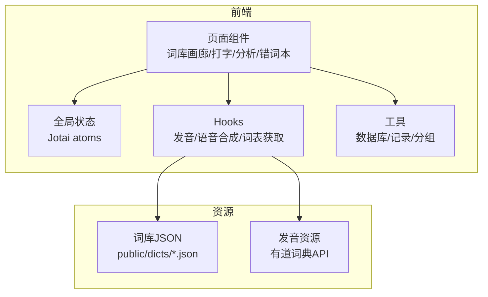
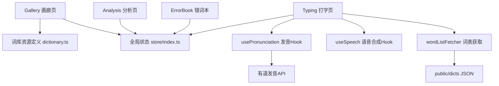
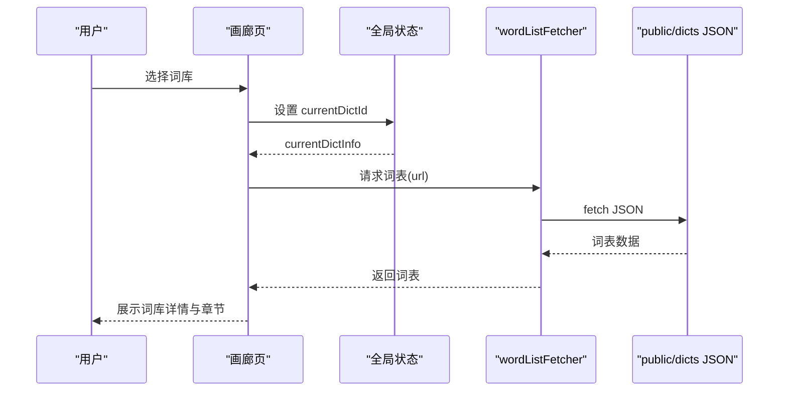
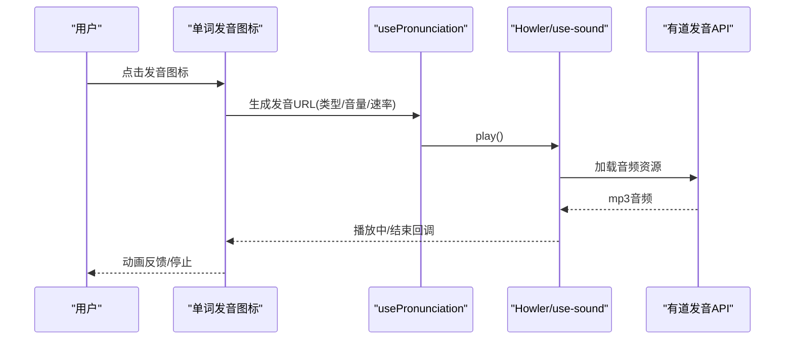
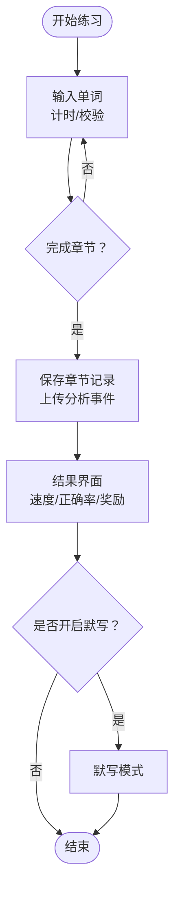
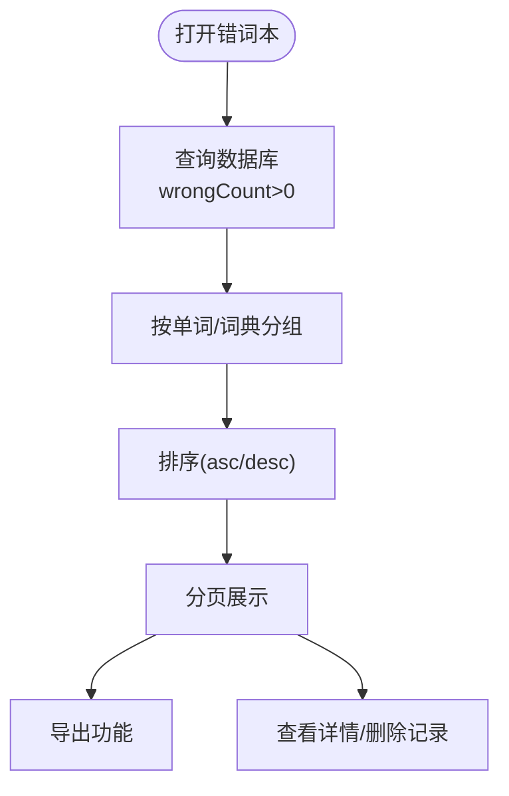
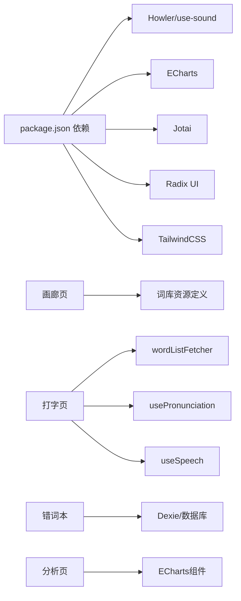

# 核心功能特性

<cite>
**本文引用的文件**
- [README.md](file://README.md)
- [dictionary.ts](file://src/resources/dictionary.ts)
- [index.tsx（词库画廊）](file://src/pages/Gallery-N/index.tsx)
- [index.tsx（打字页面）](file://src/pages/Typing/index.tsx)
- [index.tsx（分析页）](file://src/pages/Analysis/index.tsx)
- [index.tsx（错词本）](file://src/pages/ErrorBook/index.tsx)
- [usePronunciation.ts](file://src/hooks/usePronunciation.ts)
- [useSpeech.ts](file://src/hooks/useSpeech.ts)
- [index.tsx（单词发音图标）](file://src/components/WordPronunciationIcon/index.tsx)
- [SoundIcon.tsx](file://src/components/WordPronunciationIcon/SoundIcon.tsx)
- [index.ts（全局状态）](file://src/store/index.ts)
- [wordListFetcher.ts](file://src/utils/wordListFetcher.ts)
- [go_builtin.json](file://public/dicts/go_builtin.json)
- [java-string.json](file://public/dicts/java-string.json)
- [package.json](file://package.json)
</cite>

## 目录

1. [简介](#简介)
2. [项目结构](#项目结构)
3. [核心组件](#核心组件)
4. [架构总览](#架构总览)
5. [详细组件分析](#详细组件分析)
6. [依赖关系分析](#依赖关系分析)
7. [性能考量](#性能考量)
8. [故障排查指南](#故障排查指南)
9. [结论](#结论)
10. [附录](#附录)

## 简介

本项目面向键盘工作者，将“单词记忆”与“键盘肌肉记忆”结合，通过持续的英文输入练习巩固记忆，避免形成错误的肌肉记忆。项目内置多种权威词库（如 CET-4、CET-6、GMAT、GRE、IELTS、SAT、TOEFL、考研英语等），并提供程序员常用词库与多语言 API 练习词库，支持音标显示与发音、默写模式、速度与正确率统计等功能，帮助用户量化技能提升。

## 项目结构

- 词库资源位于 public/dicts 下，包含大量 JSON 词典文件，涵盖考试类、专业类、语言学习类及程序员 API 类词库。
- 前端采用 React + Vite，状态管理使用 Jotai，图表使用 ECharts，音效播放使用 Howler 与 use-sound。
- 关键页面：
  - 词库画廊：浏览与筛选词库
  - 打字练习：输入练习、速度与正确率统计
  - 错词本：记录与导出错词
  - 分析页：可视化展示练习趋势与按键错误分布

**图表来源**

- [index.tsx（词库画廊）](file://src/pages/Gallery-N/index.tsx#L1-L104)
- [index.tsx（打字页面）](file://src/pages/Typing/index.tsx#L1-L174)
- [index.tsx（分析页）](file://src/pages/Analysis/index.tsx#L1-L82)
- [index.tsx（错词本）](file://src/pages/ErrorBook/index.tsx#L1-L136)
- [usePronunciation.ts](file://src/hooks/usePronunciation.ts#L1-L104)
- [useSpeech.ts](file://src/hooks/useSpeech.ts#L1-L87)
- [wordListFetcher.ts](file://src/utils/wordListFetcher.ts#L1-L10)

**章节来源**

- [package.json](file://package.json#L1-L128)

## 核心组件

- 词库管理
  - 词库清单与分类：通过资源定义文件集中管理词库元数据（名称、分类、语言、URL、长度等），并在画廊页按分类与标签分组展示。
  - 词库加载：通过统一的词表获取工具按需请求 JSON 词库，支持部署路径前缀处理。
- 发音与音标
  - 发音：基于有道词典 API，支持英式/美式/日语罗马音/中文/德语/印尼语等发音类型，可循环播放与变速。
  - 音标：通过配置开关与类型选择控制音标的显示样式。
- 练习与反馈
  - 打字练习：计时、逐词输入、跳过、随机打乱、章节完成后的结果展示与奖励动画。
  - 速度与正确率：实时统计 WPM 与正确率，章节完成后持久化记录并上传分析事件。
  - 默写模式：章节结束后可选择开启默写，强化记忆。
- 错词管理
  - 错词本：按单词聚合记录错误次数与词典来源，支持排序、分页与导出。
- 分析与可视化
  - 热力图与趋势图：展示过去一年的练习次数、练习词数、WPM 与正确率趋势，按键错误排行。

**章节来源**

- [dictionary.ts](file://src/resources/dictionary.ts#L1-L800)
- [index.tsx（词库画廊）](file://src/pages/Gallery-N/index.tsx#L1-L104)
- [index.tsx（打字页面）](file://src/pages/Typing/index.tsx#L1-L174)
- [index.tsx（分析页）](file://src/pages/Analysis/index.tsx#L1-L82)
- [index.tsx（错词本）](file://src/pages/ErrorBook/index.tsx#L1-L136)
- [usePronunciation.ts](file://src/hooks/usePronunciation.ts#L1-L104)
- [useSpeech.ts](file://src/hooks/useSpeech.ts#L1-L87)
- [index.ts（全局状态）](file://src/store/index.ts#L1-L118)
- [wordListFetcher.ts](file://src/utils/wordListFetcher.ts#L1-L10)

## 架构总览

系统采用“页面组件 + 全局状态 + Hooks 工具 + 资源词库”的分层架构。页面组件负责交互与渲染，全局状态统一管理词典、章节、发音与显示偏好，Hooks 封装发音与语音合成逻辑，资源词库通过 fetch 按需加载。

**图表来源**

- [dictionary.ts](file://src/resources/dictionary.ts#L1-L800)
- [index.ts（全局状态）](file://src/store/index.ts#L1-L118)
- [usePronunciation.ts](file://src/hooks/usePronunciation.ts#L1-L104)
- [useSpeech.ts](file://src/hooks/useSpeech.ts#L1-L87)
- [wordListFetcher.ts](file://src/utils/wordListFetcher.ts#L1-L10)
- [index.tsx（词库画廊）](file://src/pages/Gallery-N/index.tsx#L1-L104)
- [index.tsx（打字页面）](file://src/pages/Typing/index.tsx#L1-L174)
- [index.tsx（分析页）](file://src/pages/Analysis/index.tsx#L1-L82)
- [index.tsx（错词本）](file://src/pages/ErrorBook/index.tsx#L1-L136)

## 详细组件分析

### 词库管理与 API 练习

- 词库类型覆盖
  - 中国考试：CET-4、CET-6、考研、专四/专八、PETS、自考英语、COCA 高频、Top2000 等
  - 国际考试：GMAT、GRE、IELTS、TOEFL、BEC、PET 等
  - 英语学习：牛津 5000、长难句高频、词根词缀、场景词汇等
  - 专业与教材：建筑/计算机专业英语、人教版 3-9 年级
  - 程序员常用词与 API：Go 内置关键字、Java 字符串方法、Node.js、Linux 命令、C#、SQL、Rust、Python、JavaScript 等
- 词库加载流程
  - 画廊页按语言分类与标签分组展示词库
  - 打字页根据当前词典 ID 加载对应 JSON，统一前缀处理部署路径
  - API 练习以方法名为词，释义为说明，便于在打字练习中反复输入

**图表来源**

- [index.tsx（词库画廊）](file://src/pages/Gallery-N/index.tsx#L1-L104)
- [index.ts（全局状态）](file://src/store/index.ts#L1-L118)
- [wordListFetcher.ts](file://src/utils/wordListFetcher.ts#L1-L10)
- [dictionary.ts](file://src/resources/dictionary.ts#L1-L800)

**章节来源**

- [dictionary.ts](file://src/resources/dictionary.ts#L1-L800)
- [index.tsx（词库画廊）](file://src/pages/Gallery-N/index.tsx#L1-L104)
- [wordListFetcher.ts](file://src/utils/wordListFetcher.ts#L1-L10)
- [go_builtin.json](file://public/dicts/go_builtin.json#L1-L279)
- [java-string.json](file://public/dicts/java-string.json#L1-L290)

### 音标显示与发音功能

- 配置项
  - 发音开关、音量、循环、语速、类型（英式/美式/日语/中文/德语/印尼语等）
  - 音标开关与类型（美式/英式）
- 实现机制
  - 通过发音 Hook 生成有道发音 URL，使用 use-sound 与 Howler 播放，支持预加载与循环
  - 单词发音图标组件提供点击播放与播放动画反馈
  - 语音合成 Hook 封装浏览器 SpeechSynthesis API，支持取消与中断

**图表来源**

- [index.tsx（单词发音图标）](file://src/components/WordPronunciationIcon/index.tsx#L1-L58)
- [SoundIcon.tsx](file://src/components/WordPronunciationIcon/SoundIcon.tsx#L1-L39)
- [usePronunciation.ts](file://src/hooks/usePronunciation.ts#L1-L104)
- [index.ts（全局状态）](file://src/store/index.ts#L1-L118)

**章节来源**

- [usePronunciation.ts](file://src/hooks/usePronunciation.ts#L1-L104)
- [useSpeech.ts](file://src/hooks/useSpeech.ts#L1-L87)
- [index.ts（全局状态）](file://src/store/index.ts#L1-L118)
- [index.tsx（单词发音图标）](file://src/components/WordPronunciationIcon/index.tsx#L1-L58)
- [SoundIcon.tsx](file://src/components/WordPronunciationIcon/SoundIcon.tsx#L1-L39)

### 默写模式与速度/正确率统计

- 默写模式
  - 章节完成后弹窗提示是否开启默写，用于强化记忆
- 速度与正确率
  - 打字页计时器与输入校验，计算 WPM 与正确率
  - 章节完成后持久化记录并上传分析事件
  - 分析页以热力图与折线图展示过去一年的趋势

**图表来源**

- [index.tsx（打字页面）](file://src/pages/Typing/index.tsx#L1-L174)
- [index.tsx（分析页）](file://src/pages/Analysis/index.tsx#L1-L82)

**章节来源**

- [index.tsx（打字页面）](file://src/pages/Typing/index.tsx#L1-L174)
- [index.tsx（分析页）](file://src/pages/Analysis/index.tsx#L1-L82)

### 错词本与导出

- 错词聚合：按单词与词典聚合错误记录，统计错误次数
- 排序与分页：支持升/降序排列，每页固定条目
- 导出：提供导出选项，便于离线复习

**图表来源**

- [index.tsx（错词本）](file://src/pages/ErrorBook/index.tsx#L1-L136)

**章节来源**

- [index.tsx（错词本）](file://src/pages/ErrorBook/index.tsx#L1-L136)

### VSCode 插件版

- 一键启动：提供 VSCode 插件版本，便于在编辑器内直接开始练习
- 优势：无需浏览器环境，随开随练，适合编程场景下的碎片化学习

**章节来源**

- [README.md](file://README.md#L1-L332)

## 依赖关系分析

- 外部依赖
  - 音频播放：Howler、use-sound
  - 图表：ECharts
  - 状态管理：Jotai
  - UI 组件：Radix UI、TailwindCSS
  - 语音合成：浏览器 SpeechSynthesis API
- 内部依赖
  - 画廊页依赖词库资源定义与全局状态
  - 打字页依赖词表获取、发音 Hook、分析事件与记录持久化
  - 错词本依赖数据库与分页排序逻辑
  - 分析页依赖统计数据与图表组件

**图表来源**

- [package.json](file://package.json#L1-L128)
- [index.tsx（词库画廊）](file://src/pages/Gallery-N/index.tsx#L1-L104)
- [index.tsx（打字页面）](file://src/pages/Typing/index.tsx#L1-L174)
- [index.tsx（错词本）](file://src/pages/ErrorBook/index.tsx#L1-L136)
- [index.tsx（分析页）](file://src/pages/Analysis/index.tsx#L1-L82)
- [usePronunciation.ts](file://src/hooks/usePronunciation.ts#L1-L104)
- [useSpeech.ts](file://src/hooks/useSpeech.ts#L1-L87)
- [wordListFetcher.ts](file://src/utils/wordListFetcher.ts#L1-L10)

**章节来源**

- [package.json](file://package.json#L1-L128)

## 性能考量

- 词表加载
  - 使用按需 fetch 与 URL 前缀处理，避免静态资源体积过大
  - 预加载发音资源，减少首次播放卡顿
- 渲染与状态
  - 使用 Jotai 原子与 immer 优化状态更新，降低重渲染成本
  - 分页与分组策略减少一次性渲染的数据量
- 媒体播放
  - Howler 与 use-sound 支持音频卸载与循环控制，避免资源泄漏
  - 语音合成 API 在不支持环境下进行降级提示

[本节为通用性能建议，不直接分析具体文件]

## 故障排查指南

- 无法加载词库
  - 检查部署路径前缀与资源 URL 是否正确
  - 确认网络可访问有道发音 API（若启用发音）
- 发音无声或异常
  - 检查浏览器权限与跨域设置
  - 确认音量与循环设置合理
- 移动端无法使用
  - 打字页检测非桌面设备并提示使用外接键盘
- 错词本无数据
  - 确认已产生错误记录且数据库可用
  - 检查排序与分页参数

**章节来源**

- [wordListFetcher.ts](file://src/utils/wordListFetcher.ts#L1-L10)
- [usePronunciation.ts](file://src/hooks/usePronunciation.ts#L1-L104)
- [index.tsx（打字页面）](file://src/pages/Typing/index.tsx#L1-L174)
- [index.tsx（错词本）](file://src/pages/ErrorBook/index.tsx#L1-L136)

## 结论

Qwerty Learner 通过词库管理、发音与音标、默写模式、速度与正确率统计、错词本与分析可视化等核心能力，为键盘工作者提供高效、可量化的英语输入与记忆训练方案。项目结构清晰、模块职责明确，支持多语言 API 与广泛考试类词库，兼顾学习效果与使用体验。

[本节为总结性内容，不直接分析具体文件]

## 附录

- 支持的词库类型（示例）
  - 中国考试：CET-4、CET-6、考研、专四/专八、PETS、自考英语、COCA 高频、Top2000 等
  - 国际考试：GMAT、GRE、IELTS、TOEFL、BEC、PET 等
  - 英语学习：牛津 5000、长难句高频、词根词缀、场景词汇等
  - 专业与教材：建筑/计算机专业英语、人教版 3-9 年级
  - 程序员常用词与 API：Go、Java、Node.js、Linux 命令、C#、SQL、Rust、Python、JavaScript 等
- VSCode 插件版
  - 一键启动，随时开始练习，适合编程场景下的碎片化学习

**章节来源**

- [README.md](file://README.md#L1-L332)
- [dictionary.ts](file://src/resources/dictionary.ts#L1-L800)
- [go_builtin.json](file://public/dicts/go_builtin.json#L1-L279)
- [java-string.json](file://public/dicts/java-string.json#L1-L290)
