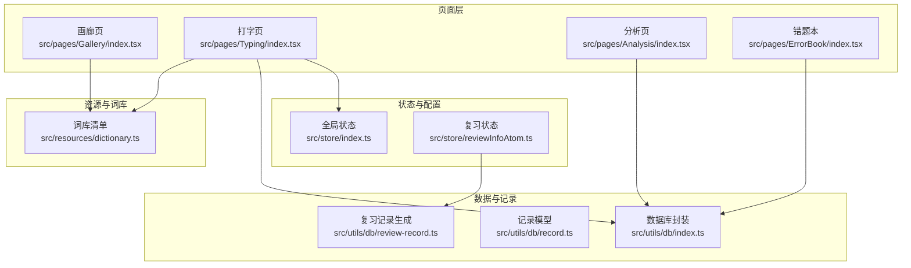
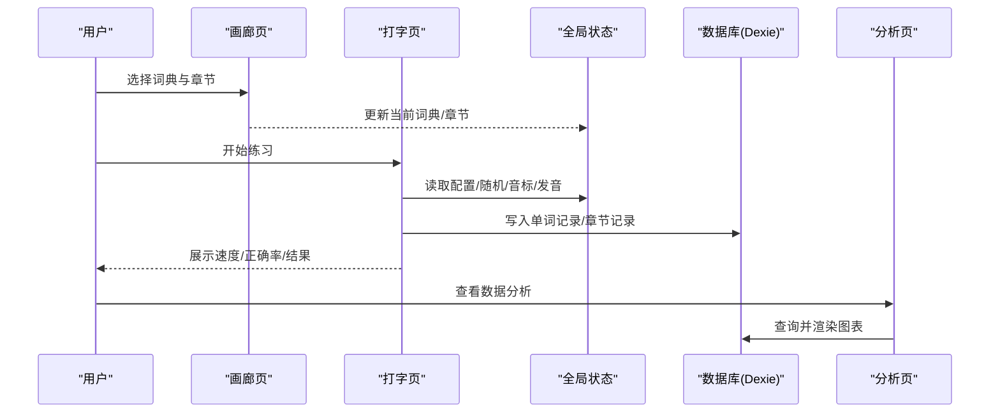
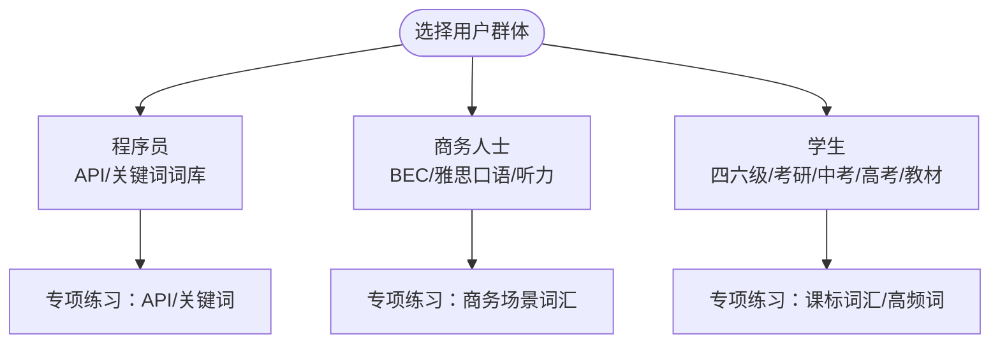
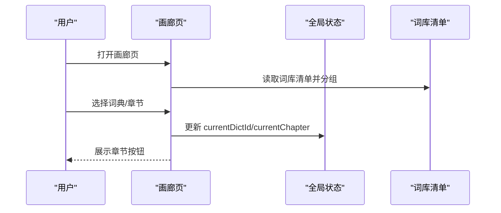
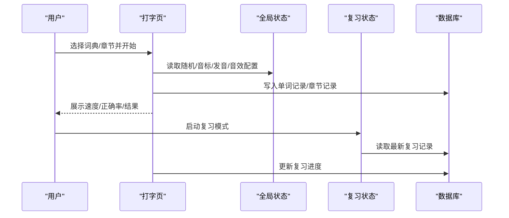
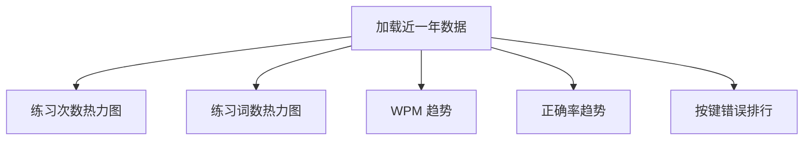
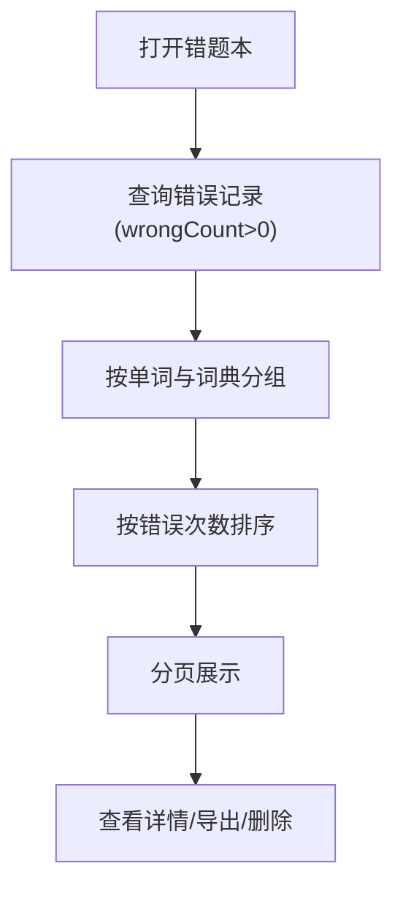
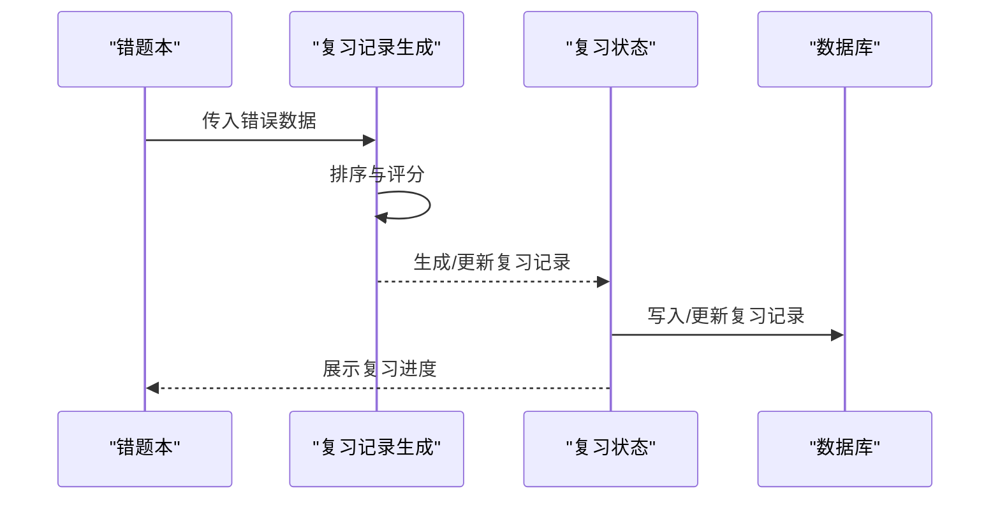
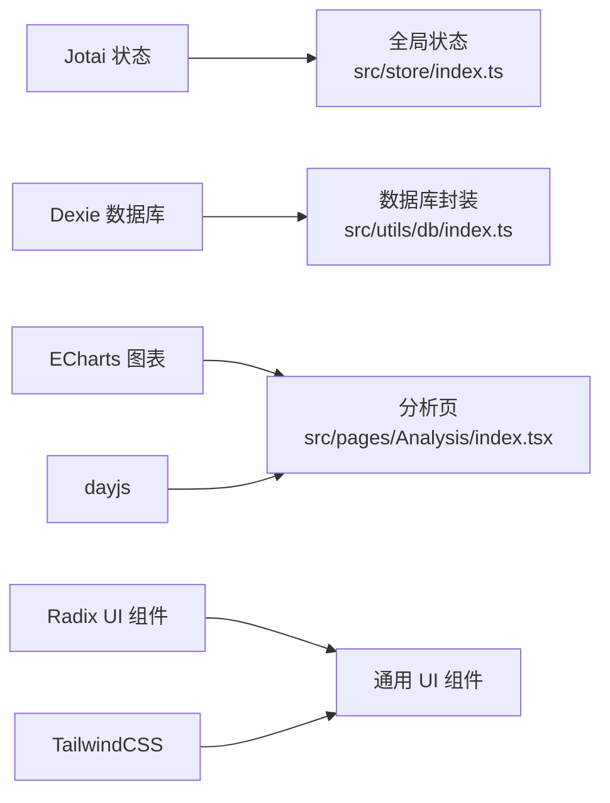
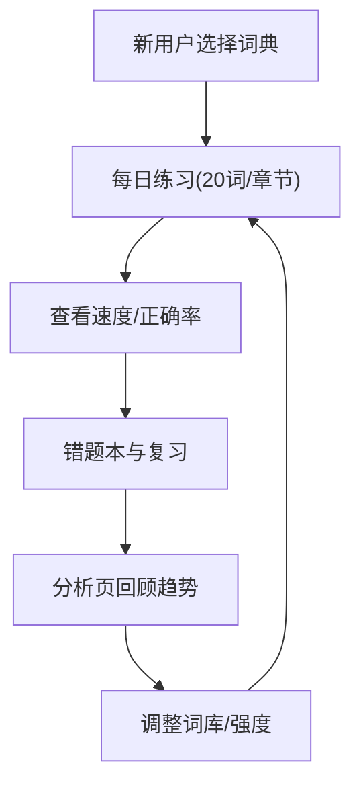

# 用户群体分析

<cite>
**本文引用的文件**
- [README.md](file://README.md)
- [package.json](file://package.json)
- [src/resources/dictionary.ts](file://src/resources/dictionary.ts)
- [src/pages/Gallery/index.tsx](file://src/pages/Gallery/index.tsx)
- [src/pages/Typing/index.tsx](file://src/pages/Typing/index.tsx)
- [src/pages/Analysis/index.tsx](file://src/pages/Analysis/index.tsx)
- [src/pages/ErrorBook/index.tsx](file://src/pages/ErrorBook/index.tsx)
- [src/utils/db/index.ts](file://src/utils/db/index.ts)
- [src/utils/db/record.ts](file://src/utils/db/record.ts)
- [src/store/index.ts](file://src/store/index.ts)
- [src/constants/index.ts](file://src/constants/index.ts)
- [src/pages/Typing/components/AnalysisButton/index.tsx](file://src/pages/Typing/components/AnalysisButton/index.tsx)
- [src/store/reviewInfoAtom.ts](file://src/store/reviewInfoAtom.ts)
- [src/utils/db/review-record.ts](file://src/utils/db/review-record.ts)
- [src/pages/Mobile/index.tsx](file://src/pages/Mobile/index.tsx)
</cite>

## 目录

1. 引言
2. 项目结构
3. 核心组件
4. 架构总览
5. 详细组件分析
6. 依赖分析
7. 性能考虑
8. 故障排查指南
9. 结论
10. 附录

## 引言

本文件面向 Qwerty Learner 项目，聚焦“以英语为主要工作语言的键盘工作者”这一核心用户群体，覆盖程序员、商务人士、学生等不同职业背景。我们将从用户需求与使用场景出发，梳理项目如何通过词库多样性、练习模式灵活性与统计分析针对性，为不同用户群体提供差异化体验；并总结用户使用流程与学习路径，最后结合现有数据能力与用户反馈，给出产品优化与功能扩展的用户洞察。

## 项目结构

Qwerty Learner 是一个基于 React/Vite 的前端应用，采用原子化状态管理（Jotai）、IndexedDB（Dexie）持久化、图表可视化（ECharts）与响应式 UI（Tailwind）。核心页面包括“词典画廊（Gallery）”“打字练习（Typing）”“数据分析（Analysis）”“错题本（ErrorBook）”，并通过 store 与 utils 层支撑配置、记录与统计。

**图表来源**

- [src/pages/Gallery/index.tsx](file://src/pages/Gallery/index.tsx#L1-L62)
- [src/pages/Typing/index.tsx](file://src/pages/Typing/index.tsx#L1-L174)
- [src/pages/Analysis/index.tsx](file://src/pages/Analysis/index.tsx#L1-L82)
- [src/pages/ErrorBook/index.tsx](file://src/pages/ErrorBook/index.tsx#L1-L136)
- [src/store/index.ts](file://src/store/index.ts#L1-L118)
- [src/store/reviewInfoAtom.ts](file://src/store/reviewInfoAtom.ts#L1-L28)
- [src/utils/db/index.ts](file://src/utils/db/index.ts#L1-L136)
- [src/utils/db/record.ts](file://src/utils/db/record.ts#L1-L186)
- [src/utils/db/review-record.ts](file://src/utils/db/review-record.ts#L1-L36)
- [src/resources/dictionary.ts](file://src/resources/dictionary.ts#L1-L800)

**章节来源**

- [README.md](file://README.md#L63-L119)
- [package.json](file://package.json#L1-L128)

## 核心组件

- 词库与分类：项目内置涵盖中国考试、国际考试、专业词汇、英语词典等多类别词库，覆盖程序员常用 API、编程语言关键词、高频学术词汇等，满足不同用户群体的专项需求。
- 画廊页（Gallery）：提供词典与章节选择，支持按类别分组浏览与快捷键导航，便于用户快速定位目标词库。
- 打字页（Typing）：核心练习界面，支持随机打乱、音标/发音开关、默写模式入口、速度与正确率实时展示、章节完成后的结果屏与奖励动画。
- 数据分析（Analysis）：提供过去一年的练习次数热力图、练习词数热力图、WPM 趋势、正确率趋势与按键错误排行，帮助用户量化进步。
- 错题本（ErrorBook）：按单词聚合错误记录，支持排序、分页、导出与逐条详情查看，辅助用户针对性复习。
- 复习机制：通过复习记录模型与生成逻辑，支持基于错误频率与最近错误时间的复习队列，形成“错误复习”的闭环。

**章节来源**

- [src/resources/dictionary.ts](file://src/resources/dictionary.ts#L1-L800)
- [src/pages/Gallery/index.tsx](file://src/pages/Gallery/index.tsx#L1-L62)
- [src/pages/Typing/index.tsx](file://src/pages/Typing/index.tsx#L1-L174)
- [src/pages/Analysis/index.tsx](file://src/pages/Analysis/index.tsx#L1-L82)
- [src/pages/ErrorBook/index.tsx](file://src/pages/ErrorBook/index.tsx#L1-L136)
- [src/utils/db/record.ts](file://src/utils/db/record.ts#L1-L186)
- [src/utils/db/review-record.ts](file://src/utils/db/review-record.ts#L1-L36)

## 架构总览

系统围绕“词库—练习—记录—分析—复习”的闭环展开，状态通过 Jotai 管理，练习数据通过 Dexie 写入 IndexedDB，分析页读取并可视化，错题本提供交互式复习入口。

**图表来源**

- [src/pages/Gallery/index.tsx](file://src/pages/Gallery/index.tsx#L1-L62)
- [src/pages/Typing/index.tsx](file://src/pages/Typing/index.tsx#L1-L174)
- [src/store/index.ts](file://src/store/index.ts#L1-L118)
- [src/utils/db/index.ts](file://src/utils/db/index.ts#L1-L136)
- [src/pages/Analysis/index.tsx](file://src/pages/Analysis/index.tsx#L1-L82)

## 详细组件分析

### 词库与用户群体匹配

- 程序员：提供大量编程语言 API 与关键词词库（如 JavaScript、Node.js、Java、Linux 命令、C#、Go、Python、Rust 等），满足日常编码场景下的专业术语与命令输入练习。
- 商务人士：内置 BEC、雅思口语/听力等与商务沟通密切相关的词汇与场景，帮助提升商务英语输入速度与表达准确性。
- 学生：覆盖四六级、考研、中考、高考、人教版教材等主流教学体系词库，满足校内课程词汇巩固与应试需求。

**章节来源**

- [README.md](file://README.md#L73-L119)
- [src/resources/dictionary.ts](file://src/resources/dictionary.ts#L1-L800)

### 画廊页：词库选择与章节导航

- 分类浏览：按类别分组展示词库，便于用户快速筛选目标领域。
- 章节选择：根据当前词典长度动态计算章节数量，支持跳转至指定章节。
- 快捷键：Enter/Esc 返回首页，提升操作效率。

**图表来源**

- [src/pages/Gallery/index.tsx](file://src/pages/Gallery/index.tsx#L1-L62)
- [src/resources/dictionary.ts](file://src/resources/dictionary.ts#L1-L800)
- [src/store/index.ts](file://src/store/index.ts#L1-L118)

**章节来源**

- [src/pages/Gallery/index.tsx](file://src/pages/Gallery/index.tsx#L1-L62)

### 打字页：练习模式与差异化功能

- 配置灵活：支持随机打乱、音标/发音开关、大小写忽略、音效开关、字体大小等，满足不同用户偏好。
- 速度与正确率：实时统计 WPM 与正确率，帮助用户感知进步。
- 结果与激励：章节完成后展示结论与奖励动画，增强成就感。
- 复习模式：基于 IndexedDB 的复习记录，支持断点续练与进度追踪。

**图表来源**

- [src/pages/Typing/index.tsx](file://src/pages/Typing/index.tsx#L1-L174)
- [src/store/index.ts](file://src/store/index.ts#L1-L118)
- [src/store/reviewInfoAtom.ts](file://src/store/reviewInfoAtom.ts#L1-L28)
- [src/utils/db/index.ts](file://src/utils/db/index.ts#L1-L136)
- [src/utils/db/record.ts](file://src/utils/db/record.ts#L1-L186)

**章节来源**

- [src/pages/Typing/index.tsx](file://src/pages/Typing/index.tsx#L1-L174)
- [src/store/index.ts](file://src/store/index.ts#L1-L118)

### 数据分析：量化进步与行为洞察

- 时间维度：过去一年的练习次数与词数热力图，帮助用户发现练习习惯与波动。
- 能力指标：WPM 趋势与正确率趋势，直观反映输入速度与准确性的提升。
- 行为细节：按键错误次数排行，定位薄弱字母或组合键。

**图表来源**

- [src/pages/Analysis/index.tsx](file://src/pages/Analysis/index.tsx#L1-L82)
- [src/utils/db/index.ts](file://src/utils/db/index.ts#L1-L136)
- [src/utils/db/record.ts](file://src/utils/db/record.ts#L1-L186)

**章节来源**

- [src/pages/Analysis/index.tsx](file://src/pages/Analysis/index.tsx#L1-L82)

### 错题本：针对性复习与导出

- 聚合与排序：按单词聚合错误记录，支持按错误次数升/降序排列。
- 详情与导出：点击可查看详细输入日志与错误分布，支持导出当前页数据。
- 删除与清理：提供删除错误记录的能力，便于维护干净的复习数据。

**图表来源**

- [src/pages/ErrorBook/index.tsx](file://src/pages/ErrorBook/index.tsx#L1-L136)
- [src/utils/db/index.ts](file://src/utils/db/index.ts#L1-L136)
- [src/utils/db/record.ts](file://src/utils/db/record.ts#L1-L186)

**章节来源**

- [src/pages/ErrorBook/index.tsx](file://src/pages/ErrorBook/index.tsx#L1-L136)

### 复习机制：基于错误的智能复习

- 复习记录：记录当前词典的复习进度与完成状态，支持断点续练。
- 生成策略：基于错误次数与最近错误时间进行排序，生成复习队列。
- 状态持久化：通过 Jotai 与 IndexedDB 的组合，保证跨会话一致性。

**图表来源**

- [src/pages/ErrorBook/index.tsx](file://src/pages/ErrorBook/index.tsx#L1-L136)
- [src/utils/db/review-record.ts](file://src/utils/db/review-record.ts#L1-L36)
- [src/store/reviewInfoAtom.ts](file://src/store/reviewInfoAtom.ts#L1-L28)
- [src/utils/db/index.ts](file://src/utils/db/index.ts#L1-L136)

**章节来源**

- [src/utils/db/review-record.ts](file://src/utils/db/review-record.ts#L1-L36)
- [src/store/reviewInfoAtom.ts](file://src/store/reviewInfoAtom.ts#L1-L28)

## 依赖分析

- 状态管理：Jotai 提供轻量级原子化状态，配合本地存储实现配置与模式持久化。
- 数据持久化：Dexie 封装 IndexedDB，统一管理单词记录、章节记录与复习记录。
- 可视化：ECharts 用于绘制热力图、趋势线与柱状图。
- UI 组件：Radix UI、TailwindCSS 提供一致的交互与视觉风格。
- 工具函数：日期处理（dayjs）、数组分组、随机化等工具贯穿各模块。

**图表来源**

- [package.json](file://package.json#L1-L128)
- [src/store/index.ts](file://src/store/index.ts#L1-L118)
- [src/utils/db/index.ts](file://src/utils/db/index.ts#L1-L136)
- [src/pages/Analysis/index.tsx](file://src/pages/Analysis/index.tsx#L1-L82)

**章节来源**

- [package.json](file://package.json#L1-L128)

## 性能考虑

- 词库加载：词库清单集中管理，按需加载 JSON 文件，避免一次性加载过多数据。
- 练习性能：打字页通过防抖与事件节流控制输入监听，减少不必要的重渲染。
- 数据库写入：单词记录与章节记录采用批量写入策略，降低频繁 IO 带来的卡顿。
- 可视化优化：分析页图表按需渲染，时间范围默认近一年，避免大数据量导致的渲染压力。
- 移动端适配：检测非桌面设备时提示使用外接键盘，避免在触屏设备上产生不理想的输入体验。

[本节为通用指导，无需列出具体文件来源]

## 故障排查指南

- 无法进入练习：确认当前词典 ID 是否有效，若无效将自动回退到默认词典并重置章节。
- 练习记录缺失：检查浏览器是否允许本地存储与 IndexedDB，必要时清理缓存后重试。
- 分析数据为空：确认已有至少一次练习记录，分析页会在无数据时提示“暂无练习数据”。
- 错题本无数据：确保存在错误记录（wrongCount>0），否则不会显示任何条目。
- 复习记录异常：检查复习状态是否已完成或是否与当前词典匹配，必要时重新生成复习队列。

**章节来源**

- [src/pages/Typing/index.tsx](file://src/pages/Typing/index.tsx#L51-L60)
- [src/pages/Analysis/index.tsx](file://src/pages/Analysis/index.tsx#L49-L53)
- [src/pages/ErrorBook/index.tsx](file://src/pages/ErrorBook/index.tsx#L64-L90)
- [src/utils/db/index.ts](file://src/utils/db/index.ts#L43-L73)

## 结论

Qwerty Learner 以“键盘工作者”为核心，通过多样化的词库与灵活的练习模式，覆盖程序员、商务人士与学生三大群体的关键需求。依托本地数据库与可视化分析，系统实现了从“练习—记录—分析—复习”的闭环，帮助用户建立稳定的英语输入肌肉记忆。未来可在词库生态、复习算法与移动端体验方面进一步优化，以扩大用户覆盖面并提升学习效率。

[本节为总结性内容，无需列出具体文件来源]

## 附录

### 用户使用流程与典型学习路径

- 新用户引导：通过画廊页选择适合的词典与章节，初次练习建议开启音标/发音与随机打乱，以强化音形结合与字母敏感度。
- 日常练习：每日固定时段进行 20 词/章节的练习，关注速度与正确率趋势，逐步提升 WPM 与稳定输入。
- 错误复习：定期打开错题本，按错误次数排序进行针对性复习，结合复习模式实现断点续练。
- 数据分析：每月回顾一次分析页，观察热力图与趋势变化，调整练习强度与词库方向。

**章节来源**

- [src/pages/Gallery/index.tsx](file://src/pages/Gallery/index.tsx#L1-L62)
- [src/pages/Typing/index.tsx](file://src/pages/Typing/index.tsx#L1-L174)
- [src/pages/ErrorBook/index.tsx](file://src/pages/ErrorBook/index.tsx#L1-L136)
- [src/pages/Analysis/index.tsx](file://src/pages/Analysis/index.tsx#L1-L82)

### 用户反馈与产品优化建议

- 程序员反馈：建议增加更多语言 API 与框架关键词，完善 VSCode 插件联动体验。
- 商务人士反馈：建议扩充 BEC、雅思口语与商务场景词汇，提供主题化练习包。
- 学生反馈：建议细化教材版本与年级标签，提供阶段性复习计划与错题导出打印功能。
- 通用建议：优化移动端输入体验（如外接键盘模式）、增加学习提醒与成就徽章、引入社交分享与排行榜。

**章节来源**

- [README.md](file://README.md#L240-L332)
- [src/pages/Mobile/index.tsx](file://src/pages/Mobile/index.tsx#L237-L311)
