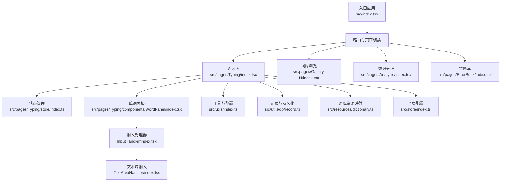
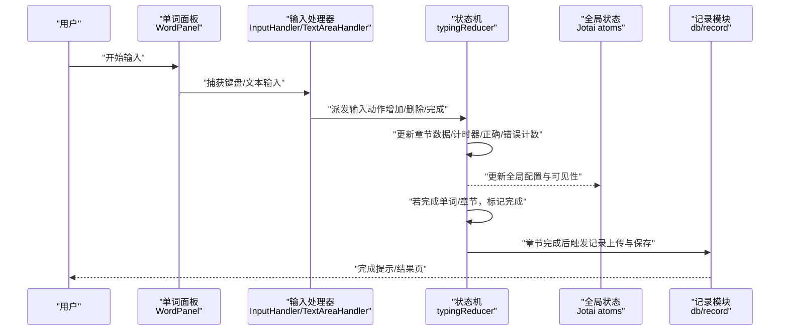
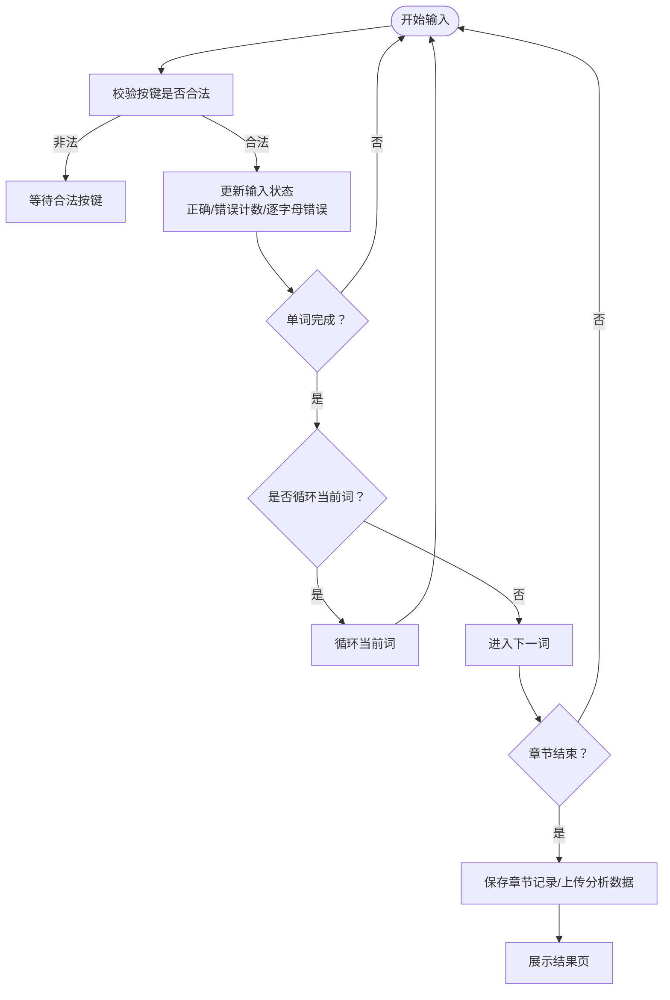
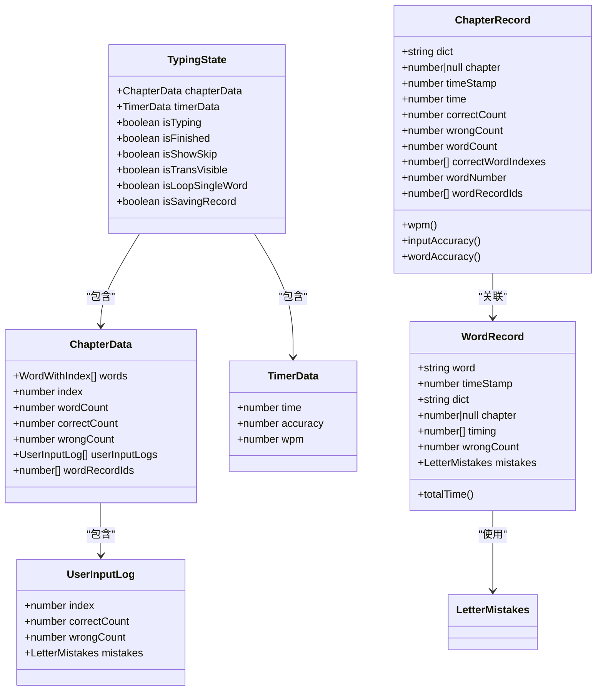
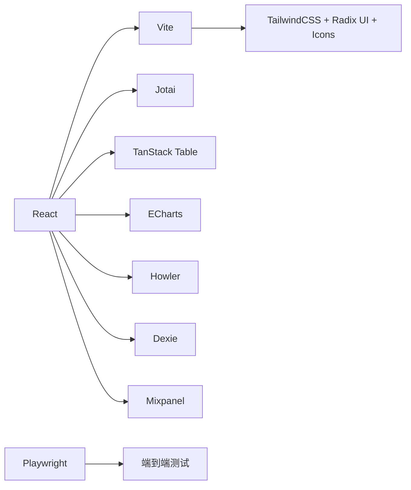

# 项目介绍与设计理念

<cite>
**本文引用的文件**
- [README.md](file://README.md)
- [README_EN.md](file://docs/README_EN.md)
- [package.json](file://package.json)
- [src/index.tsx](file://src/index.tsx)
- [src/pages/Typing/index.tsx](file://src/pages/Typing/index.tsx)
- [src/pages/Typing/store/index.ts](file://src/pages/Typing/store/index.ts)
- [src/pages/Typing/store/type.ts](file://src/pages/Typing/store/type.ts)
- [src/constants/index.ts](file://src/constants/index.ts)
- [src/utils/index.ts](file://src/utils/index.ts)
- [src/utils/db/record.ts](file://src/utils/db/record.ts)
- [src/resources/dictionary.ts](file://src/resources/dictionary.ts)
- [src/pages/Typing/components/WordPanel/index.tsx](file://src/pages/Typing/components/WordPanel/index.tsx)
- [src/pages/Typing/components/WordPanel/components/InputHandler/index.tsx](file://src/pages/Typing/components/WordPanel/components/InputHandler/index.tsx)
- [src/pages/Typing/components/WordPanel/components/TextAreaHandler/index.tsx](file://src/pages/Typing/components/WordPanel/components/TextAreaHandler/index.tsx)
- [src/store/index.ts](file://src/store/index.ts)
</cite>

## 目录

1. [引言](#引言)
2. [项目结构](#项目结构)
3. [核心组件](#核心组件)
4. [架构总览](#架构总览)
5. [详细组件分析](#详细组件分析)
6. [依赖关系分析](#依赖关系分析)
7. [性能考量](#性能考量)
8. [故障排查指南](#故障排查指南)
9. [结论](#结论)
10. [附录](#附录)

## 引言

Qwerty Learner 是一款面向“以英语为主要工作语言的键盘工作者”的单词记忆与英语键盘输入肌肉记忆训练软件。项目旨在解决键盘工作者在英语输入中常见的“提笔忘字”现象：由于母语输入长期形成的强健肌肉记忆，英语输入的肌肉记忆相对薄弱，导致打字时容易“想不起单词”。本项目将“单词记忆”与“键盘输入肌肉记忆”结合，既巩固词汇，又强化输入动作的自动化程度。

为避免形成错误的肌肉记忆，系统采用“错误即重来”的设计原则：当用户在输入过程中出现任何错误，必须重新完整输入该单词，从而确保正确的按键序列与手型路径被反复强化，维持正确的肌肉记忆。

项目同时服务多类键盘工作者：

- 程序员：内置大量编程语言关键词与 API 词库，帮助快速熟悉常用 API，提升编码时的英文输入效率。
- 商务人士：覆盖商务英语、雅思、托福、GRE、GMAT 等词库，满足职场与考试需求。
- 学生与机考人群：提供从初中到研究生、从四六级到雅思托福的丰富词库，辅助日常学习与应试。

教育价值与实用性体现在：

- 提升输入效率：通过高频单词与 API 的反复练习，缩短思考与输入之间的链路。
- 巩固英语技能：在输入过程中同步记忆音标、发音与释义，强化拼写与语音联系。
- 可量化进步：实时统计速度、准确率与章节表现，帮助用户感知提升。

## 项目结构

项目采用前端单页应用（React + Vite）架构，路由按页面划分，核心练习页面位于 Typing 页面，配套分析、词库浏览、错题本等功能页面。状态管理采用原子化状态（Jotai），数据持久化与章节记录通过本地数据库与工具模块实现。

图表来源

- [src/index.tsx](file://src/index.tsx#L1-L79)
- [src/pages/Typing/index.tsx](file://src/pages/Typing/index.tsx#L1-L174)
- [src/pages/Typing/store/index.ts](file://src/pages/Typing/store/index.ts#L1-L227)
- [src/pages/Typing/components/WordPanel/index.tsx](file://src/pages/Typing/components/WordPanel/index.tsx#L1-L190)
- [src/pages/Typing/components/WordPanel/components/InputHandler/index.tsx](file://src/pages/Typing/components/WordPanel/components/InputHandler/index.tsx#L1-L46)
- [src/pages/Typing/components/WordPanel/components/TextAreaHandler/index.tsx](file://src/pages/Typing/components/WordPanel/components/TextAreaHandler/index.tsx#L1-L54)
- [src/utils/index.ts](file://src/utils/index.ts#L1-L130)
- [src/utils/db/record.ts](file://src/utils/db/record.ts#L1-L186)
- [src/resources/dictionary.ts](file://src/resources/dictionary.ts#L1-L800)
- [src/store/index.ts](file://src/store/index.ts#L1-L118)

章节来源

- [src/index.tsx](file://src/index.tsx#L1-L79)
- [package.json](file://package.json#L1-L128)

## 核心组件

- 练习主流程（TypingPage）
  - 负责加载词库、初始化章节、驱动计时与统计、处理输入事件、控制下一词/循环/完成等状态流转。
  - 关键点：键盘事件监听、输入合法性判断、章节完成后的记录上传与保存。
- 单词面板（WordPanel）
  - 展示当前单词、音标、释义，支持“上一个/下一个”提示、Tab 显示释义、循环练习等。
  - 关键点：热键跳词、循环次数控制、复习模式进度更新。
- 输入处理（InputHandler / TextAreaHandler）
  - 根据词库语言类型选择键盘事件处理器或文本域输入处理器，屏蔽组合输入法干扰，确保纯键盘输入体验。
- 状态与计时（typingReducer / TypingState）
  - 统一管理章节数据、计时器、正确/错误计数、逐字母错误记录、是否完成等。
- 数据记录（WordRecord / ChapterRecord / ReviewRecord）
  - 记录每章耗时、正确率、WPM、逐词输入日志与逐字母错误，支撑分析与复习。
- 全局配置（Jotai atoms）
  - 字典选择、章节、随机打乱、音标/发音、字号、深色模式、复习模式等配置持久化。

章节来源

- [src/pages/Typing/index.tsx](file://src/pages/Typing/index.tsx#L1-L174)
- [src/pages/Typing/store/index.ts](file://src/pages/Typing/store/index.ts#L1-L227)
- [src/pages/Typing/store/type.ts](file://src/pages/Typing/store/type.ts#L1-L55)
- [src/pages/Typing/components/WordPanel/index.tsx](file://src/pages/Typing/components/WordPanel/index.tsx#L1-L190)
- [src/pages/Typing/components/WordPanel/components/InputHandler/index.tsx](file://src/pages/Typing/components/WordPanel/components/InputHandler/index.tsx#L1-L46)
- [src/pages/Typing/components/WordPanel/components/TextAreaHandler/index.tsx](file://src/pages/Typing/components/WordPanel/components/TextAreaHandler/index.tsx#L1-L54)
- [src/utils/db/record.ts](file://src/utils/db/record.ts#L1-L186)
- [src/store/index.ts](file://src/store/index.ts#L1-L118)

## 架构总览

下面的时序图展示了“用户输入单词 → 状态更新 → 计算指标 → 章节完成与记录保存”的核心流程。

图表来源

- [src/pages/Typing/components/WordPanel/index.tsx](file://src/pages/Typing/components/WordPanel/index.tsx#L1-L190)
- [src/pages/Typing/components/WordPanel/components/InputHandler/index.tsx](file://src/pages/Typing/components/WordPanel/components/InputHandler/index.tsx#L1-L46)
- [src/pages/Typing/components/WordPanel/components/TextAreaHandler/index.tsx](file://src/pages/Typing/components/WordPanel/components/TextAreaHandler/index.tsx#L1-L54)
- [src/pages/Typing/store/index.ts](file://src/pages/Typing/store/index.ts#L1-L227)
- [src/utils/db/record.ts](file://src/utils/db/record.ts#L1-L186)

## 详细组件分析

### 设计理念与“错误即重来”原则

- 目标用户：以英语为工作语言的键盘工作者，尤其是非母语者。
- 核心矛盾：母语输入的肌肉记忆强于英语输入，导致“提笔忘字”。
- 解决方案：将“单词记忆”与“键盘输入肌肉记忆”结合，边记单词边练输入。
- 错误处理策略：一旦出现任何错误，必须重新完整输入该单词，避免错误按键路径固化，确保正确肌肉记忆得以强化。

章节来源

- [README.md](file://README.md#L63-L72)
- [README_EN.md](file://docs/README_EN.md#L44-L53)

### 练习主流程与输入处理

- 键盘事件与输入合法性
  - 屏蔽特殊键（方向键、功能键、音量键等），仅接受字母与空格等合法字符。
  - 文本域输入模式下，禁用输入法组合输入，防止拼音/假名等非纯键盘输入。
- 状态流转
  - 完成单词：进入下一词或循环当前词；章节结束：停止计时、保存记录、展示结果。
- 复习模式
  - 支持从上次进度继续，动态更新复习记录索引，保证连续性。

图表来源

- [src/utils/index.ts](file://src/utils/index.ts#L1-L130)
- [src/pages/Typing/components/WordPanel/index.tsx](file://src/pages/Typing/components/WordPanel/index.tsx#L1-L190)
- [src/pages/Typing/store/index.ts](file://src/pages/Typing/store/index.ts#L1-L227)

章节来源

- [src/utils/index.ts](file://src/utils/index.ts#L1-L130)
- [src/pages/Typing/index.tsx](file://src/pages/Typing/index.tsx#L1-L174)
- [src/pages/Typing/components/WordPanel/index.tsx](file://src/pages/Typing/components/WordPanel/index.tsx#L1-L190)
- [src/pages/Typing/components/WordPanel/components/TextAreaHandler/index.tsx](file://src/pages/Typing/components/WordPanel/components/TextAreaHandler/index.tsx#L1-L54)

### 状态模型与数据结构

- TypingState
  - 章节数据（words、index、wordCount、correctCount、wrongCount、userInputLogs、wordRecordIds）
  - 计时器数据（time、accuracy、wpm）
  - 控制标志（isTyping、isFinished、isShowSkip、isTransVisible、isLoopSingleWord、isSavingRecord）
- ChapterData / UserInputLog
  - 记录每词的输入日志，含逐字母错误映射，便于后续分析与错题本。
- 记录类（WordRecord / ChapterRecord / ReviewRecord）
  - 提供 WPM、准确率、逐词正确索引、章节总耗时等指标，支撑数据分析与复习策略。

图表来源

- [src/pages/Typing/store/type.ts](file://src/pages/Typing/store/type.ts#L1-L55)
- [src/pages/Typing/store/index.ts](file://src/pages/Typing/store/index.ts#L1-L227)
- [src/utils/db/record.ts](file://src/utils/db/record.ts#L1-L186)

章节来源

- [src/pages/Typing/store/type.ts](file://src/pages/Typing/store/type.ts#L1-L55)
- [src/pages/Typing/store/index.ts](file://src/pages/Typing/store/index.ts#L1-L227)
- [src/utils/db/record.ts](file://src/utils/db/record.ts#L1-L186)

### 词库与字典资源

- 词库资源映射
  - 项目内置大量词库（四六级、雅思、托福、GRE、考研、专业英语、计算机词汇、API 词库等），通过资源映射统一管理，支持章节长度计算与章节编号。
- 字典加载与章节组织
  - 根据词库长度与固定章节长度常量，计算章节数量，按章节进行练习与记录。

章节来源

- [src/resources/dictionary.ts](file://src/resources/dictionary.ts#L1-L800)
- [src/constants/index.ts](file://src/constants/index.ts#L1-L19)

### 配置与主题

- 全局配置
  - 字典选择、章节、随机打乱、音标/发音、字号、深色模式、复习模式、跳词显示、大小写忽略、悬停显示释义等。
- 主题与可见性
  - 通过 Jotai 原子持久化用户偏好，支持深色模式与字体大小调整。

章节来源

- [src/store/index.ts](file://src/store/index.ts#L1-L118)

## 依赖关系分析

- 前端框架与构建
  - React、Vite、TailwindCSS、Radix UI、Lucide Icons 等，提供现代化 UI 与交互组件生态。
- 状态与分析
  - Jotai（原子化状态）、Mixpanel（埋点分析）、React Table（表格）、ECharts（图表）等。
- 数据与媒体
  - Dexie（IndexedDB 封装）、Howler（音频播放）、Canvas Confetti（庆祝动画）等。
- 工具与测试
  - SWR（数据请求）、Playwright（端到端测试）、ESLint/Prettier（代码质量）等。

图表来源

- [package.json](file://package.json#L1-L128)

章节来源

- [package.json](file://package.json#L1-L128)

## 性能考量

- 渲染与状态更新
  - 使用 use-immer 与 useImmerReducer 降低不必要的对象拷贝，减少渲染抖动。
  - 使用 Suspense 与懒加载页面，优化首屏加载。
- 输入处理
  - 文本域聚焦/失焦与输入事件绑定在面板层级，避免全局监听带来的性能损耗。
- 计时与统计
  - 计时器按秒增量，准确率与 WPM 基于累计计数计算，避免频繁重算。
- 数据持久化
  - IndexedDB 与 JSON 导出/导入，减少内存占用；章节记录批量上传，避免阻塞主线程。

## 故障排查指南

- 移动端访问提示
  - 非桌面设备会弹出提示，建议使用外接键盘的平板设备练习。
- 输入法干扰
  - 文本域输入模式下会阻止输入法组合输入；如遇异常，可切换为键盘事件模式或关闭输入法。
- 键盘快捷键
  - Tab 用于临时显示释义；Ctrl/Cmd + Shift + 方向键用于跳过前后单词。
- 章节完成与记录
  - 章节结束后会自动保存记录并上传分析数据；如未保存，检查网络与浏览器存储权限。

章节来源

- [src/pages/Typing/index.tsx](file://src/pages/Typing/index.tsx#L1-L174)
- [src/pages/Typing/components/WordPanel/index.tsx](file://src/pages/Typing/components/WordPanel/index.tsx#L1-L190)
- [src/pages/Typing/components/WordPanel/components/TextAreaHandler/index.tsx](file://src/pages/Typing/components/WordPanel/components/TextAreaHandler/index.tsx#L1-L54)
- [src/utils/index.ts](file://src/utils/index.ts#L1-L130)

## 结论

Qwerty Learner 通过“单词记忆 + 英语键盘输入肌肉记忆”的双轮驱动，有效缓解键盘工作者的“提笔忘字”问题。其“错误即重来”的设计原则，确保了正确的输入路径被反复强化，避免错误肌肉记忆固化。项目覆盖程序员、商务人士、学生与机考人群，兼具教育价值与实用价值，适合在日常工作中持续使用以提升输入效率与英语能力。

## 附录

- 在线访问与部署
  - 提供多平台部署链接与 VS Code 插件入口，便于随时开始练习。
- 词库与 API 词库
  - 内置大量通用与专业词库，涵盖四六级、雅思、托福、GRE、GMAT、考研、计算机词汇与多语言 API 词库，满足不同用户群体需求。

章节来源

- [README.md](file://README.md#L33-L120)
- [README_EN.md](file://docs/README_EN.md#L31-L90)
