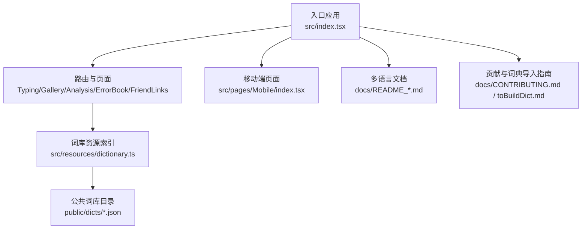
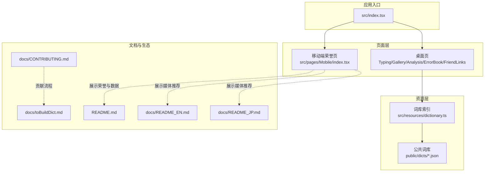
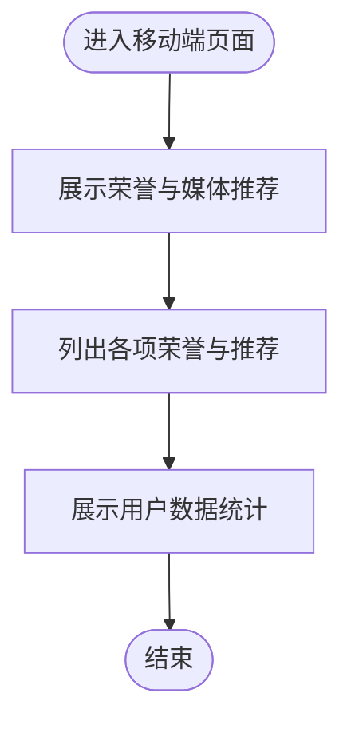
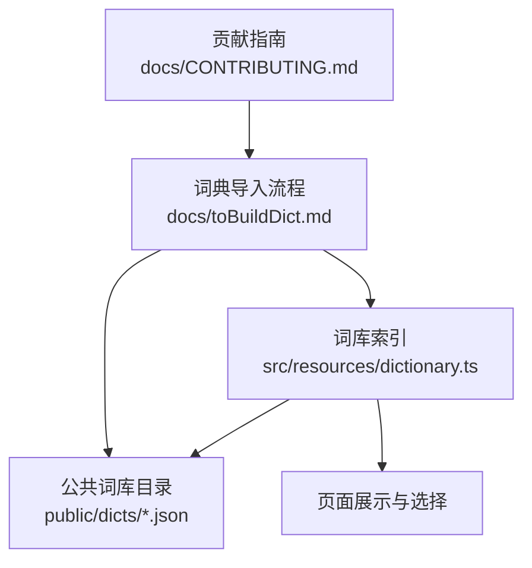
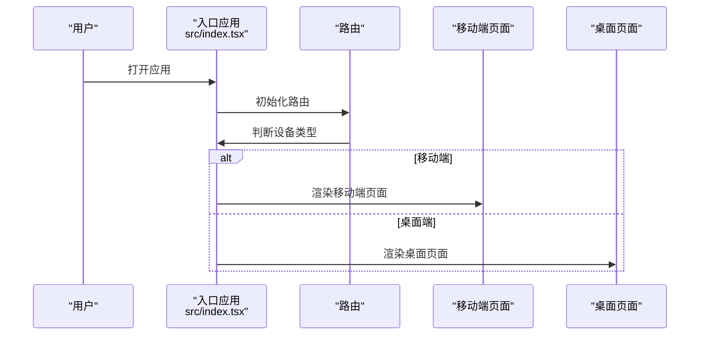
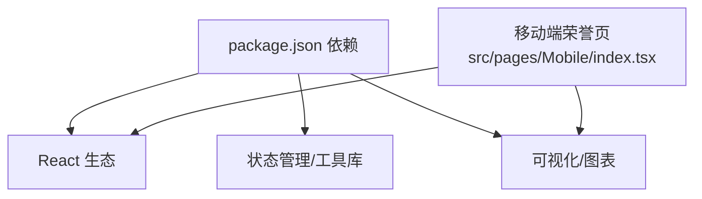

# 项目发展历程与荣誉

<cite>
**本文引用的文件**
- [README.md](file://README.md)
- [README_EN.md](file://docs/README_EN.md)
- [README_JP.md](file://docs/README_JP.md)
- [CONTRIBUTING.md](file://docs/CONTRIBUTING.md)
- [toBuildDict.md](file://docs/toBuildDict.md)
- [index.tsx](file://src/index.tsx)
- [dictionary.ts](file://src/resources/dictionary.ts)
- [package.json](file://package.json)
- [Mobile/index.tsx](file://src/pages/Mobile/index.tsx)
</cite>

## 目录

1. [简介](#简介)
2. [项目结构](#项目结构)
3. [核心组件](#核心组件)
4. [架构总览](#架构总览)
5. [详细组件分析](#详细组件分析)
6. [依赖分析](#依赖分析)
7. [性能考量](#性能考量)
8. [故障排查指南](#故障排查指南)
9. [结论](#结论)
10. [附录](#附录)

## 简介

本文件系统梳理 Qwerty Learner 项目的发展历程与所获荣誉，结合仓库内的官方说明、移动端页面与贡献指南，呈现项目从灵感来源到正式发布的关键节点、社区影响力与用户规模增长、开源生态建设与未来愿景。文中所有事实均来自仓库内公开资料与页面展示内容。

## 项目结构

- 项目采用前端单页应用架构，路由在入口处统一管理，移动端与桌面端通过窗口宽度判断进行分流。
- 词库资源集中管理，词库索引在资源文件中声明，便于按类别与语言组织。
- 文档多语言版本（中文、英文、日文）与贡献指南、词典导入指南并列，体现国际化与社区协作导向。

图表来源

- [index.tsx](file://src/index.tsx#L1-L79)
- [dictionary.ts](file://src/resources/dictionary.ts#L1-L120)
- [Mobile/index.tsx](file://src/pages/Mobile/index.tsx#L870-L1140)
- [README.md](file://README.md#L191-L200)

章节来源

- [index.tsx](file://src/index.tsx#L1-L79)
- [README.md](file://README.md#L191-L200)

## 核心组件

- 入口与路由：负责根据设备类型切换至桌面或移动端页面，统一加载各功能页面与懒加载分析页。
- 移动端荣誉与数据展示：集中展示项目荣誉、媒体推荐与用户数据统计，直观呈现社区认可与用户规模。
- 词库资源与索引：集中管理词库元数据，支持按类别、语言、长度等维度组织词库。
- 贡献与生态：提供贡献准则、词典导入流程，鼓励社区共建。

章节来源

- [index.tsx](file://src/index.tsx#L1-L79)
- [Mobile/index.tsx](file://src/pages/Mobile/index.tsx#L870-L1140)
- [dictionary.ts](file://src/resources/dictionary.ts#L1-L120)
- [CONTRIBUTING.md](file://docs/CONTRIBUTING.md#L1-L48)
- [toBuildDict.md](file://docs/toBuildDict.md#L1-L124)

## 架构总览

下图展示项目从入口到页面、资源与文档的整体关系，突出移动端荣誉页与词库索引在整体架构中的作用。

图表来源

- [index.tsx](file://src/index.tsx#L1-L79)
- [Mobile/index.tsx](file://src/pages/Mobile/index.tsx#L870-L1140)
- [dictionary.ts](file://src/resources/dictionary.ts#L1-L120)
- [README.md](file://README.md#L191-L200)
- [README_EN.md](file://docs/README_EN.md#L92-L101)
- [README_JP.md](file://docs/README_JP.md#L159-L166)
- [CONTRIBUTING.md](file://docs/CONTRIBUTING.md#L1-L48)
- [toBuildDict.md](file://docs/toBuildDict.md#L1-L124)

## 详细组件分析

### 荣誉与媒体推荐展示（移动端）

移动端页面集中展示了项目获得的多项荣誉与媒体推荐，包括 GitHub 全球趋势榜、V2EX 全站热搜、Gitee GVP、GitCode G-Star 计划毕业项目、少数派首页推荐等，并提供用户数据统计（GitHub Stars、月活跃用户、社区贡献者数量）。

图表来源

- [Mobile/index.tsx](file://src/pages/Mobile/index.tsx#L870-L1140)

章节来源

- [Mobile/index.tsx](file://src/pages/Mobile/index.tsx#L870-L1140)

### 词库索引与生态建设

词库索引集中定义了词库的元信息（类别、语言、长度等），并通过公共目录存放实际词库文件，便于社区贡献与扩展。贡献指南与词典导入指南明确了贡献流程与格式要求，推动社区生态建设。

图表来源

- [dictionary.ts](file://src/resources/dictionary.ts#L1-L120)
- [toBuildDict.md](file://docs/toBuildDict.md#L1-L124)
- [CONTRIBUTING.md](file://docs/CONTRIBUTING.md#L1-L48)

章节来源

- [dictionary.ts](file://src/resources/dictionary.ts#L1-L120)
- [toBuildDict.md](file://docs/toBuildDict.md#L1-L124)
- [CONTRIBUTING.md](file://docs/CONTRIBUTING.md#L1-L48)

### 路由与页面组织

入口文件统一管理路由，桌面端与移动端页面分流，分析页采用懒加载策略，降低首屏负载。

图表来源

- [index.tsx](file://src/index.tsx#L1-L79)

章节来源

- [index.tsx](file://src/index.tsx#L1-L79)

## 依赖分析

- 项目依赖 React 生态与现代前端工具链，包含状态管理、UI 组件库、图表与分析工具等，支撑桌面与移动端的交互与可视化。
- 移动端荣誉页通过图标与排版强调荣誉与媒体推荐，增强用户对项目认可度的认知。

图表来源

- [package.json](file://package.json#L1-L128)
- [Mobile/index.tsx](file://src/pages/Mobile/index.tsx#L870-L1140)

章节来源

- [package.json](file://package.json#L1-L128)
- [Mobile/index.tsx](file://src/pages/Mobile/index.tsx#L870-L1140)

## 性能考量

- 桌面端分析页采用懒加载策略，减少初始包体与首屏渲染压力。
- 移动端页面集中展示荣誉与数据，避免重复加载，提升移动端体验。
- 词库索引与资源分离，便于按需加载与缓存优化。

章节来源

- [index.tsx](file://src/index.tsx#L1-L79)
- [dictionary.ts](file://src/resources/dictionary.ts#L1-L120)

## 故障排查指南

- 贡献流程：遵循贡献指南，先在议题区讨论，再提交草稿 PR，确保与项目计划一致并及时沟通。
- 词典导入：按导入指南准备目标文件格式与索引条目，完成后本地测试并提交 PR。
- 环境与运行：参考 README 中的运行说明与脚本，确保 Node、Git、Yarn 环境满足要求。

章节来源

- [CONTRIBUTING.md](file://docs/CONTRIBUTING.md#L1-L48)
- [toBuildDict.md](file://docs/toBuildDict.md#L1-L124)
- [README.md](file://README.md#L133-L190)

## 结论

Qwerty Learner 以“键盘工作者的单词记忆与英语肌肉记忆训练”为核心理念，通过词库与练习模式的结合，持续吸引用户并获得社区广泛认可。项目在 GitHub 全球趋势榜、V2EX、Gitee 等平台多次上榜，同时获得少数派首页推荐与 GitCode G-Star 计划毕业项目、Gitee GVP 等权威认证。移动端页面直观展示荣誉与用户数据，体现社区影响力与用户规模增长。贡献指南与词典导入流程推动开源生态建设，社区贡献者数量稳步增长。未来项目将持续扩展词库与功能，深化社区协作，为更多用户提供高效、有趣的英语学习体验。

## 附录

### 发展历程与关键节点（依据仓库公开信息整理）

- 项目发布与多平台部署：提供 Vercel、GitHub Pages、Gitee Pages 等部署方式，便于全球用户访问。
- VSCode 插件上线：提供一键启动的 VSCode 插件版本，扩大使用场景与便利性。
- 多语言文档：提供中文、英文、日文 README，覆盖不同地区用户。
- 荣誉与媒体推荐：在 GitHub 全球趋势榜、V2EX 全站热搜、Gitee 全站推荐、GitCode G-Star 计划毕业项目、Gitee GVP、少数派首页推荐等平台获得认可。
- 用户数据统计：移动端页面展示 GitHub Stars、月活跃用户、社区贡献者数量等指标，体现社区规模与活跃度。

章节来源

- [README.md](file://README.md#L33-L60)
- [README_EN.md](file://docs/README_EN.md#L31-L43)
- [README_JP.md](file://docs/README_JP.md#L29-L41)
- [README.md](file://README.md#L191-L200)
- [README_EN.md](file://docs/README_EN.md#L92-L101)
- [README_JP.md](file://docs/README_JP.md#L159-L166)
- [Mobile/index.tsx](file://src/pages/Mobile/index.tsx#L1054-L1073)

### 荣誉清单（依据仓库公开信息）

- GitHub 全球趋势榜上榜项目
- V2EX 全站热搜项目
- Gitee 全站推荐项目
- GitCode 开源摘星计划-毕业项目（G-Star 计划）
- Gitee 最有价值开源项目（GVP）
- 少数派首页推荐

章节来源

- [README.md](file://README.md#L191-L200)
- [README_EN.md](file://docs/README_EN.md#L92-L101)
- [README_JP.md](file://docs/README_JP.md#L159-L166)
- [Mobile/index.tsx](file://src/pages/Mobile/index.tsx#L957-L1051)

### 社区影响力与用户规模（依据移动端页面展示）

- GitHub Stars：20000+
- 月活跃用户：100000+
- 社区贡献者：100+

章节来源

- [Mobile/index.tsx](file://src/pages/Mobile/index.tsx#L1054-L1073)

### 开源生态建设

- 贡献准则：明确 PR 来源、讨论机制、Draft PR 流程与行为准则。
- 词典导入指南：提供词典格式、索引建立、测试与提交 PR 的完整流程。
- 词库索引：集中管理词库元信息，支持社区贡献与扩展。

章节来源

- [CONTRIBUTING.md](file://docs/CONTRIBUTING.md#L1-L48)
- [toBuildDict.md](file://docs/toBuildDict.md#L1-L124)
- [dictionary.ts](file://src/resources/dictionary.ts#L1-L120)
