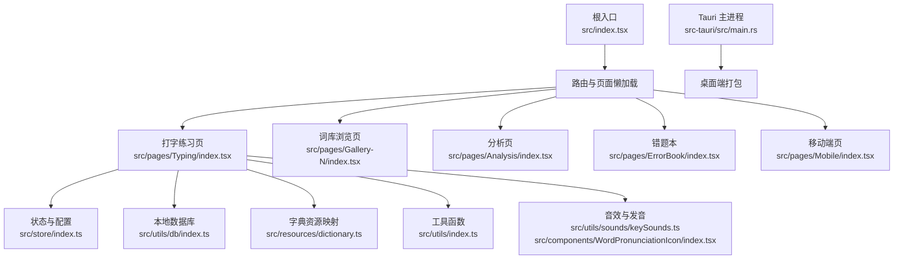
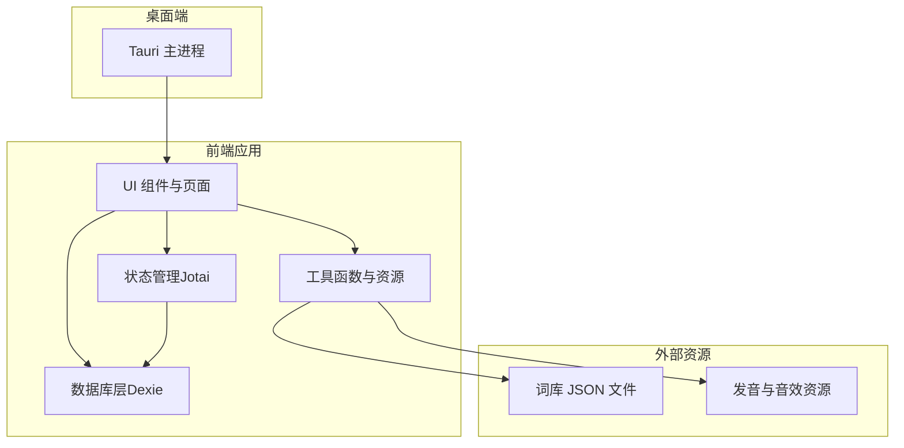
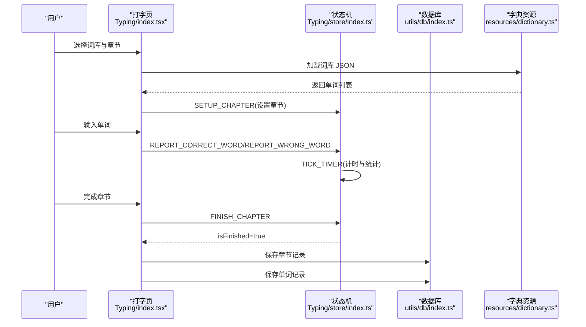
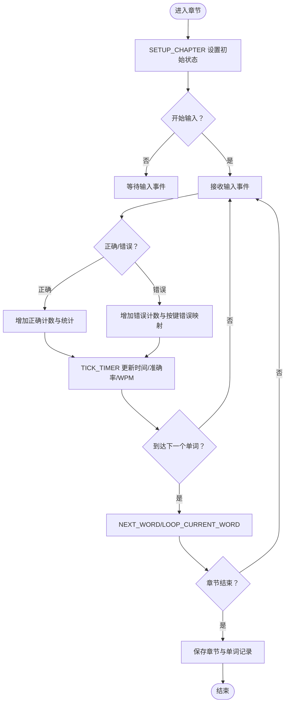
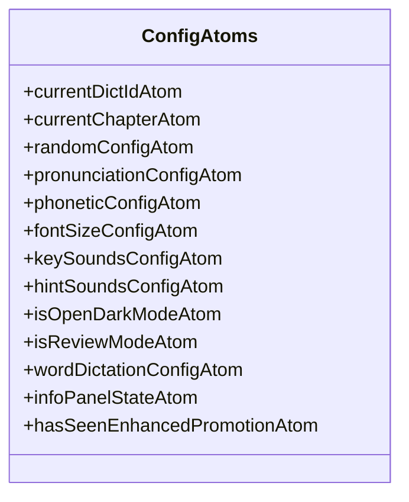
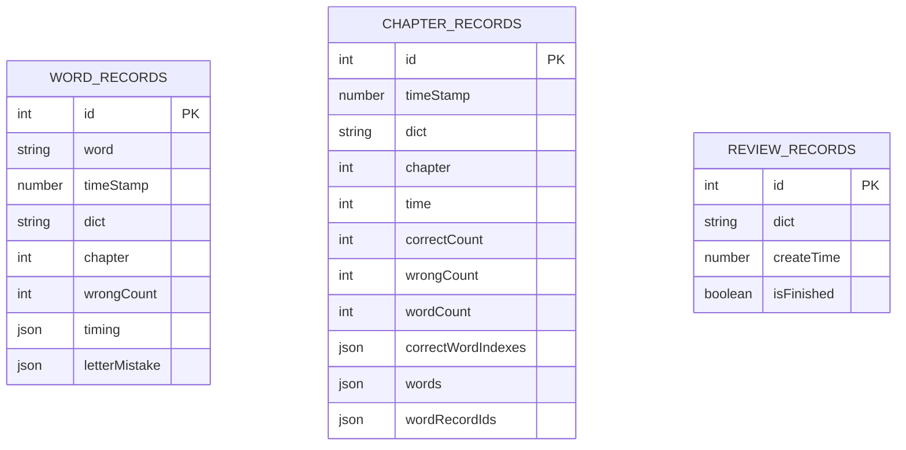
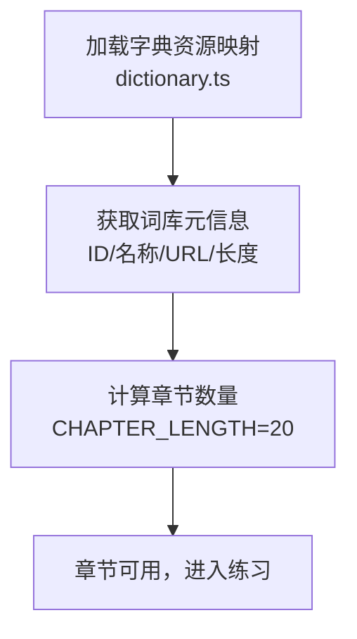
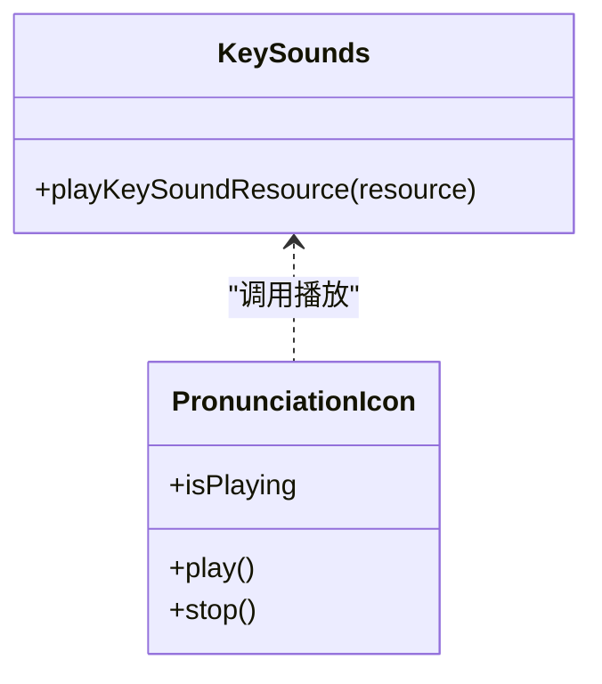
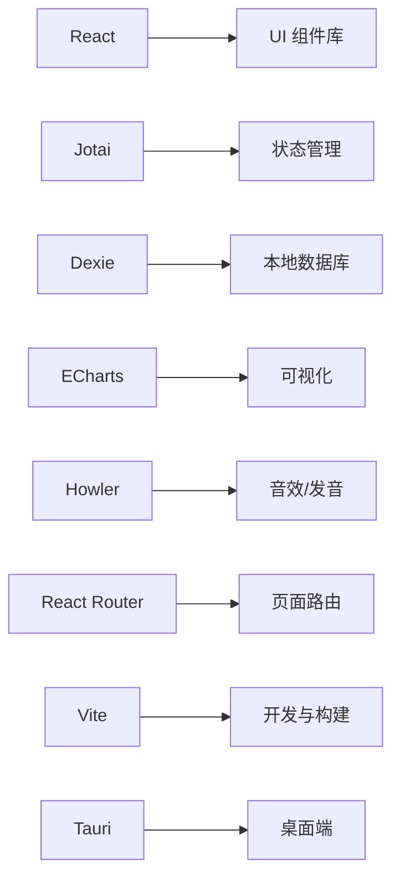

# 项目概述

<cite>
**本文引用的文件**
- [README.md](file://README.md)
- [package.json](file://package.json)
- [src/index.tsx](file://src/index.tsx)
- [src-tauri/src/main.rs](file://src-tauri/src/main.rs)
- [docs/CONTRIBUTING.md](file://docs/CONTRIBUTING.md)
- [src/pages/Typing/index.tsx](file://src/pages/Typing/index.tsx)
- [src/store/index.ts](file://src/store/index.ts)
- [src/resources/dictionary.ts](file://src/resources/dictionary.ts)
- [src/utils/db/index.ts](file://src/utils/db/index.ts)
- [src/constants/index.ts](file://src/constants/index.ts)
- [src/pages/Typing/store/index.ts](file://src/pages/Typing/store/index.ts)
- [src/utils/wordListFetcher.ts](file://src/utils/wordListFetcher.ts)
- [src/utils/index.ts](file://src/utils/index.ts)
- [src/components/WordPronunciationIcon/index.tsx](file://src/components/WordPronunciationIcon/index.tsx)
- [src/utils/sounds/keySounds.ts](file://src/utils/sounds/keySounds.ts)
</cite>

## 目录

1. [引言](#引言)
2. [项目结构](#项目结构)
3. [核心组件](#核心组件)
4. [架构总览](#架构总览)
5. [详细组件分析](#详细组件分析)
6. [依赖关系分析](#依赖关系分析)
7. [性能考量](#性能考量)
8. [故障排查指南](#故障排查指南)
9. [结论](#结论)
10. [附录](#附录)

## 引言

Qwerty Learner 是一款面向键盘工作者的单词记忆与英语键盘输入肌肉记忆训练应用。其设计理念在于：通过“边背单词边打字”的方式，将词汇学习与键盘输入动作结合，从而在强化英语词汇掌握的同时，巩固正确的英语键盘输入习惯，避免因错误的肌肉记忆导致的“提笔忘字”。项目同时提供音标与发音、默写模式、速度与正确率统计等实用功能，兼顾学习效果与体验。

项目的主要目标用户包括程序员、商务人士、学生等以键盘为主要输入工具的人群。通过内置大量词库（如四六级、雅思、托福、GRE、考研、专业词汇、IT 专业词汇等），以及多种编程语言 API 词库，满足不同职业与学习阶段的需求。

此外，项目积极拥抱开源生态，提供 VSCode 插件版本与桌面端（Tauri）部署能力，并在社区贡献、词库共建、功能迭代等方面保持活跃。

**章节来源**

- file://README.md#L1-L120

## 项目结构

项目采用前端单页应用（React + Vite）为主，配合 Tauri 构建桌面端应用；数据层使用 IndexedDB（Dexie）进行本地记录存储；词库资源以 JSON 文件形式分发，按需加载；配置与状态管理采用原子化方案（Jotai）与本地存储持久化。

- 根入口与路由
  - 应用根入口负责路由与主题切换、移动端检测与页面跳转、懒加载各页面模块。
- 页面与功能模块
  - 打字练习页：包含词库选择、章节按钮、音标/发音开关、速度统计、结果屏、单词面板、单词列表等。
  - 词库浏览页：分类展示词库、章节导航、词典详情、复习统计等。
  - 分析页：提供热力图、折线图、按键分布等可视化分析。
  - 错题本：记录错误单词与错误按键分布，支持导出。
  - 移动端：在移动端环境下自动跳转至移动端页面。
- 存储与配置
  - Jotai 原子：词典 ID、章节、随机打乱、音标/发音、字号、深色模式、复习模式等。
  - Dexie 数据库：记录单词与章节的输入时序、错误统计、复习记录等。
- 资源与工具
  - 字典资源映射：统一管理词库元信息与加载路径。
  - 工具函数：键盘事件过滤、章节长度计算、日期格式化、Howler 音效封装等。
- 桌面端
  - Tauri 主进程入口，用于打包构建桌面应用。

**图表来源**

- [src/index.tsx](file://src/index.tsx#L1-L79)
- [src/pages/Typing/index.tsx](file://src/pages/Typing/index.tsx#L1-L174)
- [src/store/index.ts](file://src/store/index.ts#L1-L118)
- [src/utils/db/index.ts](file://src/utils/db/index.ts#L1-L136)
- [src/resources/dictionary.ts](file://src/resources/dictionary.ts#L1-L120)
- [src/utils/index.ts](file://src/utils/index.ts#L1-L130)
- [src/utils/sounds/keySounds.ts](file://src/utils/sounds/keySounds.ts#L1-L14)
- [src/components/WordPronunciationIcon/index.tsx](file://src/components/WordPronunciationIcon/index.tsx#L1-L58)
- [src-tauri/src/main.rs](file://src-tauri/src/main.rs#L1-L9)

**章节来源**

- file://src/index.tsx#L1-L79
- file://package.json#L1-L128

## 核心组件

- 根入口与路由
  - 负责初始化 Mixpanel、主题切换、移动端检测与页面跳转、路由注册与懒加载。
- 打字练习页
  - 状态机驱动：章节设置、打字状态、计时与统计、跳过/循环单词、完成章节后的记录上传与保存。
  - 交互控制：键盘事件监听、输入合法性判断、音标/发音开关、速度统计、结果屏与彩带庆祝。
- 状态与配置（Jotai）
  - 词典与章节、随机打乱、音标/发音、字号、深色模式、复习模式、文本可选、跳过按钮可见等。
- 本地数据库（Dexie）
  - 单词记录、章节记录、复习记录、复习词记录；提供保存、删除、查询与导出能力。
- 字典资源映射
  - 统一管理词库元信息（ID、名称、描述、分类、标签、URL、长度、语言等），并提供章节数量计算。
- 工具函数
  - 键盘事件过滤、章节长度计算、Howler 音效封装、类名拼接、时间戳转换等。
- 音效与发音
  - 键盘点击音效播放、单词发音图标与播放控制、音量与循环控制。

**章节来源**

- file://src/pages/Typing/index.tsx#L1-L174
- file://src/store/index.ts#L1-L118
- file://src/utils/db/index.ts#L1-L136
- file://src/resources/dictionary.ts#L1-L120
- file://src/utils/index.ts#L1-L130
- file://src/utils/sounds/keySounds.ts#L1-L14
- file://src/components/WordPronunciationIcon/index.tsx#L1-L58

## 架构总览

整体采用“前端单页应用 + 本地数据库 + 外部词库资源”的轻量架构。前端负责 UI、交互与状态管理；数据库负责记录持久化；词库通过静态 JSON 文件按需加载；桌面端通过 Tauri 打包，便于离线使用与跨平台部署。

**图表来源**

- [src/index.tsx](file://src/index.tsx#L1-L79)
- [src/store/index.ts](file://src/store/index.ts#L1-L118)
- [src/utils/db/index.ts](file://src/utils/db/index.ts#L1-L136)
- [src/resources/dictionary.ts](file://src/resources/dictionary.ts#L1-L120)
- [src-tauri/src/main.rs](file://src-tauri/src/main.rs#L1-L9)

## 详细组件分析

### 打字练习流程（序列图）

该流程展示了从章节设置到完成章节并保存记录的全过程，包括计时、统计、音效与数据库写入。

**图表来源**

- [src/pages/Typing/index.tsx](file://src/pages/Typing/index.tsx#L1-L174)
- [src/pages/Typing/store/index.ts](file://src/pages/Typing/store/index.ts#L1-L227)
- [src/utils/db/index.ts](file://src/utils/db/index.ts#L1-L136)
- [src/resources/dictionary.ts](file://src/resources/dictionary.ts#L1-L120)

**章节来源**

- file://src/pages/Typing/index.tsx#L1-L174
- file://src/pages/Typing/store/index.ts#L1-L227

### 状态机与计时逻辑（流程图）

该流程图聚焦于打字状态机的关键分支：章节设置、输入统计、计时更新、完成章节与保存记录。

**图表来源**

- [src/pages/Typing/store/index.ts](file://src/pages/Typing/store/index.ts#L1-L227)
- [src/utils/db/index.ts](file://src/utils/db/index.ts#L1-L136)

**章节来源**

- file://src/pages/Typing/store/index.ts#L1-L227

### 配置与状态（类图）

Jotai 原子定义了词库、章节、随机打乱、音标/发音、字号、深色模式、复习模式等配置项，以及信息面板状态、增强推广弹窗状态等。

**图表来源**

- [src/store/index.ts](file://src/store/index.ts#L1-L118)

**章节来源**

- file://src/store/index.ts#L1-L118

### 数据模型（ER 图）

数据库模型围绕“单词记录”“章节记录”“复习记录”展开，支持按词典与章节聚合查询与统计。

**图表来源**

- [src/utils/db/index.ts](file://src/utils/db/index.ts#L1-L136)

**章节来源**

- file://src/utils/db/index.ts#L1-L136

### 词库资源与章节划分

字典资源映射统一管理词库元信息与加载路径，并通过章节长度常量计算章节数量，便于用户按章节进行练习。

**图表来源**

- [src/resources/dictionary.ts](file://src/resources/dictionary.ts#L1-L120)
- [src/constants/index.ts](file://src/constants/index.ts#L1-L19)

**章节来源**

- file://src/resources/dictionary.ts#L1-L120
- file://src/constants/index.ts#L1-L19

### 音效与发音（类图）

音效与发音模块通过 Howler 封装音源播放，单词发音图标组件提供播放控制与动画反馈。

**图表来源**

- [src/utils/sounds/keySounds.ts](file://src/utils/sounds/keySounds.ts#L1-L14)
- [src/components/WordPronunciationIcon/index.tsx](file://src/components/WordPronunciationIcon/index.tsx#L1-L58)

**章节来源**

- file://src/utils/sounds/keySounds.ts#L1-L14
- file://src/components/WordPronunciationIcon/index.tsx#L1-L58

## 依赖关系分析

- 运行时依赖
  - React 生态与 UI 组件库：Radix UI、Headless UI、Lucide Icons、TailwindCSS 等。
  - 状态管理：Jotai、immer。
  - 数据库：Dexie、dexie-react-hooks。
  - 可视化：ECharts。
  - 音效：Howler。
  - 路由：React Router。
  - 工具：dayjs、xlsx、pako、use-sound、mixpanel-browser、@vercel/analytics。
- 开发依赖
  - Vite、ESLint、Prettier、TailwindCSS、Playwright、husky 等。
- 桌面端
  - Tauri 用于构建跨平台桌面应用。

**图表来源**

- [package.json](file://package.json#L1-L128)
- [src-tauri/src/main.rs](file://src-tauri/src/main.rs#L1-L9)

**章节来源**

- file://package.json#L1-L128

## 性能考量

- 路由懒加载与按需渲染：根入口对分析、画廊等页面采用动态导入，减少首屏体积。
- 状态与存储分离：Jotai 原子与 Dexie 分离职责，避免不必要的重渲染与 IO。
- 本地化策略：词库按需加载，章节长度固定，降低内存占用与网络压力。
- 音效与动画：音效按需播放，彩带动画仅在完成章节时触发，避免长期占用资源。
- 构建优化：Vite 构建与基础路径配置，适配多部署环境（Vercel、GitHub Pages）。

[本节为通用性能建议，无需具体文件分析]

## 故障排查指南

- 移动端访问提示
  - 若在移动端或平板设备访问，系统会提示使用桌面端浏览器或外接键盘，以获得最佳练习体验。
- 词库加载失败
  - 检查部署环境变量与静态资源路径前缀，确保在不同部署环境下能正确拼接资源 URL。
- 键盘事件异常
  - 确认输入键合法过滤规则生效，排除功能键与方向键等干扰。
- 数据记录未保存
  - 确认章节完成后已触发保存流程，检查数据库版本与表结构是否匹配。
- 音效/发音无法播放
  - 检查音效资源路径与格式，确认 Howler 初始化与音量设置。

**章节来源**

- file://src/pages/Typing/index.tsx#L1-L174
- file://src/utils/wordListFetcher.ts#L1-L10
- file://src/utils/index.ts#L1-L130
- file://src/utils/db/index.ts#L1-L136
- file://src/utils/sounds/keySounds.ts#L1-L14

## 结论

Qwerty Learner 将“单词记忆”与“键盘输入肌肉记忆”有机结合，通过科学的章节划分、实时统计与本地记录，帮助键盘工作者在日常工作中稳步提升英语输入效率与词汇掌握度。项目在开源生态、社区贡献、词库建设与多端部署方面均表现活跃，适合不同背景的用户长期使用与参与共建。

[本节为总结性内容，无需具体文件分析]

## 附录

- 开发与运行
  - 环境要求：Node.js、Git、Yarn。
  - 启动方式：手动安装依赖后运行开发服务器，或使用提供的安装脚本一键启动。
- 贡献指南
  - 通过 Issue 与 PR 参与功能开发与词库贡献，遵循行为准则与协作流程。
- 荣誉与社区
  - 项目在 GitHub 全球趋势榜、V2EX、Gitee 等平台获得认可，并持续在社区中推广与共建。

**章节来源**

- file://README.md#L120-L332
- file://docs/CONTRIBUTING.md#L1-L48
